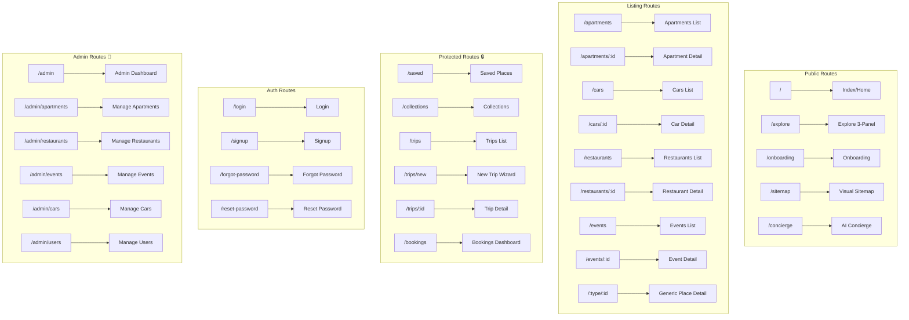
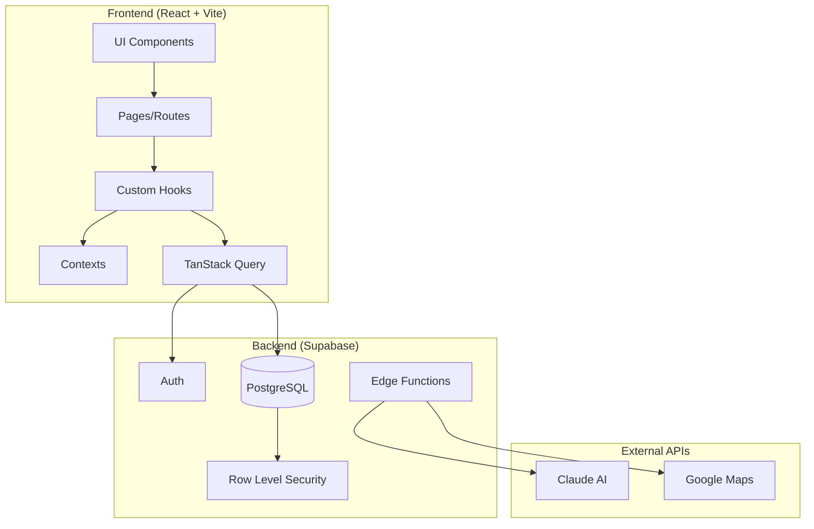
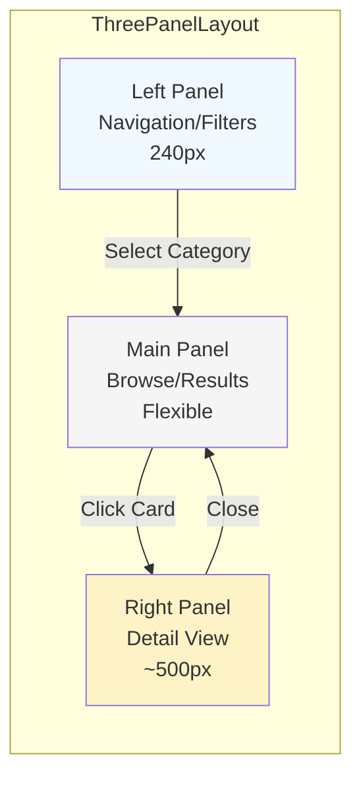
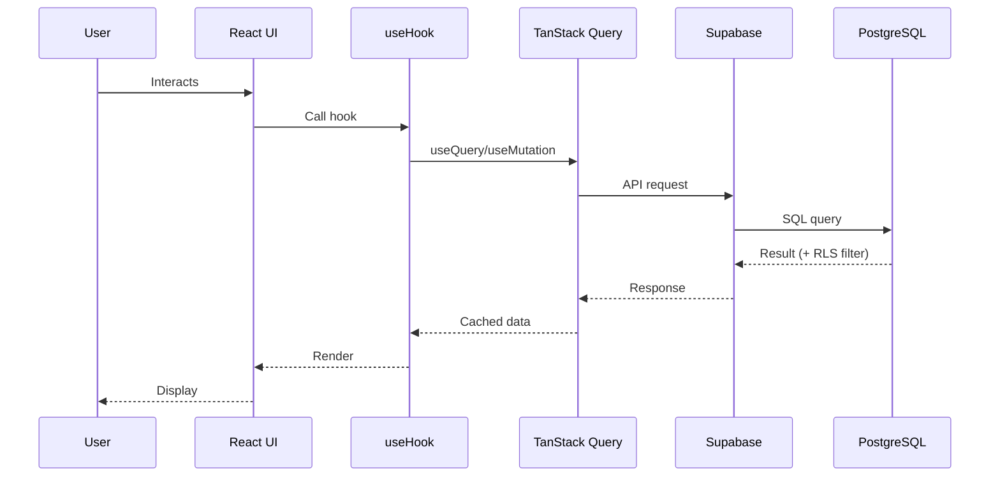
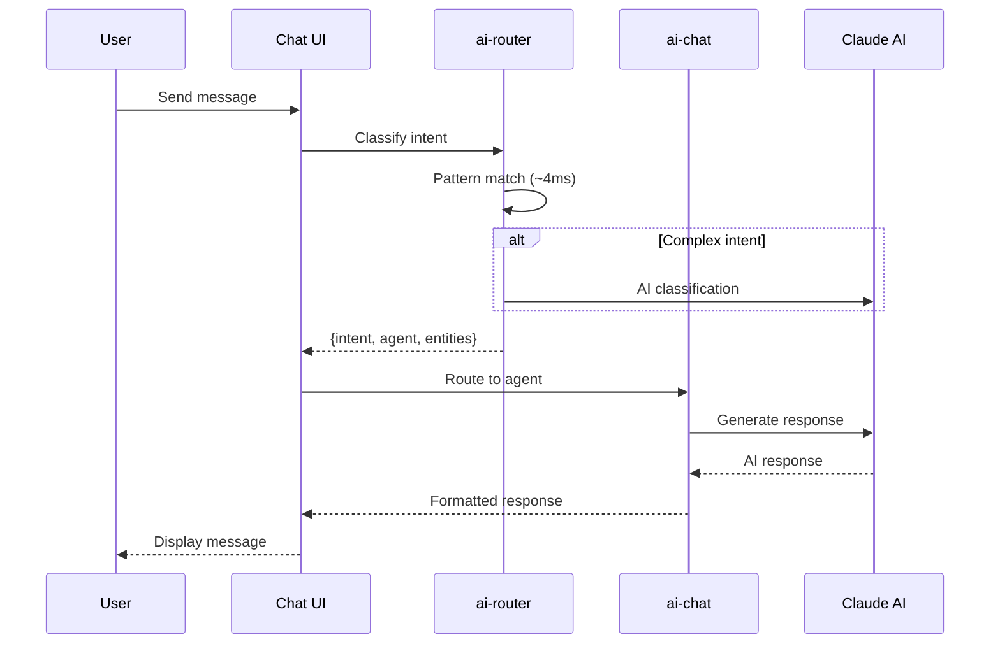
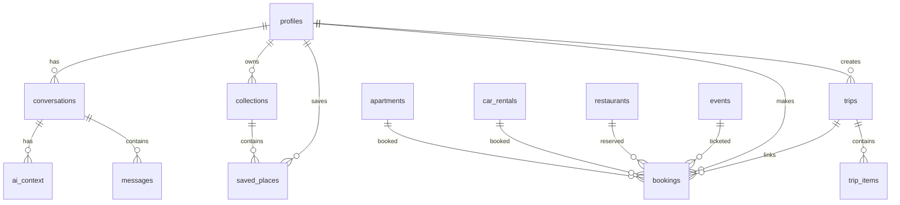

# I Love Medellín — Project Overview

> **Last Updated:** 2026-01-23  
> **Version:** 0.3.0  
> **Status:** 88% Complete (Production-Ready MVP)

---

## Table of Contents

1. [Executive Summary](#executive-summary)
2. [Tech Stack](#tech-stack)
3. [Directory Structure](#directory-structure)
4. [Routing & Sitemap](#routing--sitemap)
5. [Import Paths](#import-paths)
6. [Architecture Diagrams](#architecture-diagrams)
7. [Screens & Features](#screens--features)
8. [Best Practices Assessment](#best-practices-assessment)
9. [Improvement Recommendations](#improvement-recommendations)

---

## Executive Summary

**I Love Medellín** is a premium travel companion platform for visitors to Medellín, Colombia. It features:

- 🏠 **Listings**: Apartments, Cars, Restaurants, Events
- 🗺️ **Explore**: Discovery with 3-panel layout
- 📋 **Trip Planning**: Itinerary builder with route optimization
- 🤖 **AI Concierge**: Claude-powered chat with intent routing
- 📅 **Bookings**: Multi-step premium booking wizards
- ❤️ **Collections**: Save and organize favorite places

---

## Tech Stack

### Core Framework

| Technology | Version | Purpose |
|------------|---------|---------|
| **Vite** | 5.4.19 | Build tool & dev server |
| **React** | 18.3.1 | UI library |
| **TypeScript** | 5.8.3 | Type safety |
| **React Router DOM** | 6.30.1 | Client-side routing |

### UI & Styling

| Technology | Version | Purpose |
|------------|---------|---------|
| **Tailwind CSS** | 3.4.17 | Utility-first CSS |
| **shadcn/ui** | Latest | Component library (49 components) |
| **Radix UI** | Various | Accessible primitives |
| **Lucide React** | 0.462.0 | Icon library |
| **class-variance-authority** | 0.7.1 | Component variants |
| **tailwind-merge** | 2.6.0 | Class merging |
| **tailwindcss-animate** | 1.0.7 | Animation utilities |

### State & Data

| Technology | Version | Purpose |
|------------|---------|---------|
| **TanStack Query** | 5.83.0 | Server state management |
| **React Hook Form** | 7.61.1 | Form handling |
| **Zod** | 3.25.76 | Schema validation |
| **Supabase JS** | 2.90.1 | Backend client |

### Specialized Libraries

| Technology | Version | Purpose |
|------------|---------|---------|
| **@dnd-kit/core** | 6.3.1 | Drag & drop |
| **@dnd-kit/sortable** | 10.0.0 | Sortable lists |
| **date-fns** | 3.6.0 | Date manipulation |
| **recharts** | 2.15.4 | Charts & analytics |
| **embla-carousel-react** | 8.6.0 | Carousels |
| **react-resizable-panels** | 2.1.9 | Panel layouts |
| **react-day-picker** | 8.10.1 | Date pickers |
| **sonner** | 1.7.4 | Toast notifications |
| **vaul** | 0.9.9 | Drawer component |
| **cmdk** | 1.1.1 | Command palette |

### Testing & Quality

| Technology | Version | Purpose |
|------------|---------|---------|
| **Vitest** | 3.2.4 | Unit testing |
| **Playwright** | 1.57.0 | E2E testing |
| **ESLint** | 9.32.0 | Linting |
| **Testing Library** | 16.0.0 | React testing |

### Backend (Supabase)

| Service | Purpose |
|---------|---------|
| **PostgreSQL** | Primary database (24 tables) |
| **Edge Functions** | 5 serverless functions |
| **Row Level Security** | Authorization |
| **PostGIS** | Geospatial queries |

### AI Services

| Provider | Model | Purpose |
|----------|-------|---------|
| **Anthropic** | Claude 3.5 Sonnet | Chat & intent routing |
| **Google** | Directions API | Route optimization |

---

## Directory Structure

```
medellin/
├── docs/                          # Documentation
│   ├── audits/                    # Security & code audits
│   ├── progress-tracker/          # Implementation progress
│   ├── prompts/                   # Feature specifications
│   ├── 01-overview.md             # This file
│   ├── CHANGELOG.md               # Version history
│   └── NEXT-STEPS.md              # Roadmap
│
├── public/                        # Static assets
│   ├── favicon.ico
│   ├── placeholder.svg
│   └── robots.txt
│
├── rules/                         # Development guidelines
│   ├── backend.md
│   ├── edge-functions.md
│   ├── frontend.md
│   └── supabase.md
│
├── src/                           # Application source
│   ├── assets/                    # Images & media
│   │   ├── hero/                  # Hero images (8 files)
│   │   └── inspired/              # Inspiration images (7 files)
│   │
│   ├── components/                # React components
│   │   ├── admin/                 # Admin dashboard (10 files)
│   │   ├── apartments/            # Apartment UI (2 files)
│   │   ├── auth/                  # Authentication (1 file)
│   │   ├── bookings/              # Booking wizards (10 files)
│   │   ├── cars/                  # Car UI (2 files)
│   │   ├── chat/                  # Chat system (7 files)
│   │   ├── collections/           # Collections (1 file)
│   │   ├── events/                # Event UI (4 files)
│   │   ├── explore/               # 3-panel system (5 files)
│   │   ├── home/                  # Homepage (3 files)
│   │   ├── itinerary/             # Trip builder (6 files)
│   │   ├── layout/                # App layouts (6 files)
│   │   ├── listings/              # Shared listing UI (3 files)
│   │   ├── panels/                # Detail panels (4 files)
│   │   ├── places/                # Places UI (5 files)
│   │   ├── restaurants/           # Restaurant UI (2 files)
│   │   ├── saved/                 # Saved places (6 files)
│   │   ├── trips/                 # Trip management (8 files)
│   │   ├── ui/                    # shadcn components (49 files)
│   │   └── NavLink.tsx
│   │
│   ├── context/                   # React contexts
│   │   ├── ThreePanelContext.tsx
│   │   └── TripContext.tsx
│   │
│   ├── hooks/                     # Custom hooks (25 files)
│   │   ├── useAdminAuth.ts
│   │   ├── useApartments.ts
│   │   ├── useAuth.tsx
│   │   ├── useBookings.ts
│   │   ├── useCars.ts
│   │   ├── useChat.ts
│   │   ├── useCollections.ts
│   │   ├── useEvents.ts
│   │   ├── useExplorePlaces.ts
│   │   ├── useGoogleDirections.ts
│   │   ├── useIntentRouter.ts
│   │   ├── useRestaurants.ts
│   │   ├── useSavedPlaces.ts
│   │   ├── useTripItems.ts
│   │   ├── useTrips.ts
│   │   └── ... (10 more)
│   │
│   ├── integrations/              # External integrations
│   │   └── supabase/
│   │       ├── client.ts
│   │       └── types.ts           # Auto-generated types
│   │
│   ├── lib/                       # Utilities
│   │   ├── mockData.ts
│   │   └── utils.ts
│   │
│   ├── pages/                     # Route pages (26 files)
│   │   ├── admin/                 # Admin pages (6 files)
│   │   └── ... (20 public pages)
│   │
│   ├── test/                      # Test setup
│   │   ├── example.test.ts
│   │   └── setup.ts
│   │
│   ├── types/                     # TypeScript types (8 files)
│   │   ├── booking.ts
│   │   ├── chat.ts
│   │   ├── event.ts
│   │   ├── explore.ts
│   │   ├── listings.ts
│   │   ├── restaurant.ts
│   │   ├── saved.ts
│   │   └── trip.ts
│   │
│   ├── App.tsx                    # Root component
│   ├── App.css                    # Global styles
│   ├── index.css                  # Tailwind + tokens
│   ├── main.tsx                   # Entry point
│   └── vite-env.d.ts
│
├── supabase/                      # Backend
│   ├── functions/                 # Edge functions (5)
│   │   ├── ai-chat/
│   │   ├── ai-optimize-route/
│   │   ├── ai-router/
│   │   ├── ai-suggest-collections/
│   │   └── google-directions/
│   └── config.toml
│
├── index.html                     # HTML entry
├── package.json                   # Dependencies
├── tailwind.config.ts             # Tailwind config
├── vite.config.ts                 # Vite config
├── tsconfig.json                  # TypeScript config
├── vitest.config.ts               # Vitest config
├── playwright.config.ts           # Playwright config
└── eslint.config.js               # ESLint config
```

---

## Routing & Sitemap

### Router Setup

```typescript
// src/App.tsx - React Router v6 setup
import { BrowserRouter, Routes, Route } from "react-router-dom";

<BrowserRouter>
  <AuthProvider>
    <TripProvider>
      <Routes>
        {/* Public routes */}
        <Route path="/" element={<Index />} />
        <Route path="/explore" element={<Explore />} />
        
        {/* Protected routes */}
        <Route path="/saved" element={
          <ProtectedRoute><Saved /></ProtectedRoute>
        } />
        
        {/* Dynamic routes */}
        <Route path="/apartments/:id" element={<ApartmentDetail />} />
        <Route path="/:type/:id" element={<PlaceDetail />} />
        
        {/* 404 catch-all */}
        <Route path="*" element={<NotFound />} />
      </Routes>
    </TripProvider>
  </AuthProvider>
</BrowserRouter>
```

### Complete Route Map



### Route Table

| Route | Page | Access | Category |
|-------|------|--------|----------|
| `/` | Index | Public | Discovery |
| `/explore` | Explore | Public | Discovery |
| `/onboarding` | Onboarding | Public | Discovery |
| `/sitemap` | Sitemap | Public | Discovery |
| `/concierge` | AI Concierge | Public | AI |
| `/apartments` | Apartments List | Public | Listings |
| `/apartments/:id` | Apartment Detail | Public | Listings |
| `/cars` | Cars List | Public | Listings |
| `/cars/:id` | Car Detail | Public | Listings |
| `/restaurants` | Restaurants List | Public | Listings |
| `/restaurants/:id` | Restaurant Detail | Public | Listings |
| `/events` | Events List | Public | Listings |
| `/events/:id` | Event Detail | Public | Listings |
| `/:type/:id` | Generic Place Detail | Public | Listings |
| `/saved` | Saved Places | 🔒 Auth | User |
| `/collections` | Collections | 🔒 Auth | User |
| `/trips` | Trips List | 🔒 Auth | User |
| `/trips/new` | New Trip Wizard | 🔒 Auth | User |
| `/trips/:id` | Trip Detail | 🔒 Auth | User |
| `/bookings` | Bookings Dashboard | 🔒 Auth | User |
| `/login` | Login | Public | Auth |
| `/signup` | Signup | Public | Auth |
| `/forgot-password` | Forgot Password | Public | Auth |
| `/reset-password` | Reset Password | Public | Auth |
| `/admin` | Admin Dashboard | 🔐 Admin | Admin |
| `/admin/apartments` | Manage Apartments | 🔐 Admin | Admin |
| `/admin/restaurants` | Manage Restaurants | 🔐 Admin | Admin |
| `/admin/events` | Manage Events | 🔐 Admin | Admin |
| `/admin/cars` | Manage Cars | 🔐 Admin | Admin |
| `/admin/users` | Manage Users | 🔐 Admin | Admin |

**Totals:** 27 pages (14 Public, 6 Protected, 4 Auth, 6 Admin)

---

## Import Paths

### Alias Configuration

```typescript
// vite.config.ts
resolve: {
  alias: {
    "@": path.resolve(__dirname, "./src"),
  },
},
```

### Import Patterns

```typescript
// ✅ Correct - Use @ alias
import { Button } from "@/components/ui/button";
import { useAuth } from "@/hooks/useAuth";
import { supabase } from "@/integrations/supabase/client";
import type { Trip } from "@/types/trip";

// ❌ Avoid - Relative paths from deep nesting
import { Button } from "../../../components/ui/button";
```

### Import Categories

| Path | Contents |
|------|----------|
| `@/components/ui/*` | shadcn/ui primitives |
| `@/components/{feature}/*` | Feature components |
| `@/hooks/*` | Custom React hooks |
| `@/context/*` | React contexts |
| `@/pages/*` | Route pages |
| `@/types/*` | TypeScript types |
| `@/lib/*` | Utilities |
| `@/integrations/supabase/*` | Supabase client & types |
| `@/assets/*` | Static assets (import as modules) |

---

## Architecture Diagrams

### Application Architecture



### 3-Panel Layout System



### Data Flow



### AI Chat Flow



### Database Schema (Simplified)



---

## Screens & Features

### Website Pages

| Category | Page | Features |
|----------|------|----------|
| **Home** | Index | Hero carousel, featured listings, AI section, inspiration slider |
| **Discovery** | Explore | 3-panel layout, filters, map view, category tabs |
| **Discovery** | Sitemap | Visual route map, statistics, category grouping |

### Listing Pages

| Type | List View | Detail View | Booking Wizard |
|------|-----------|-------------|----------------|
| **Apartments** | Grid + filters | 3-panel, hero, amenities | 5-step premium |
| **Cars** | Grid + filters | 3-panel, specs, pricing | 4-step premium |
| **Restaurants** | Grid + filters | 3-panel, hours, cuisine | 3-step premium |
| **Events** | Grid + calendar | 3-panel, tickets, venue | 4-step premium |

### Wizard Screens

| Wizard | Steps | Features |
|--------|-------|----------|
| **Apartment Booking** | Dates → Guests → Extras → Review → Confirm | Weekly discounts, deposits |
| **Car Booking** | Dates → Location → Insurance → Review | Multi-tier insurance, delivery |
| **Restaurant Booking** | Date/Time → Party Size → Preferences | Occasion selection, requests |
| **Event Booking** | Tickets → Quantity → Review → Confirm | Ticket types, VIP options |
| **Trip Wizard** | Dates → Destination → Budget → Title | New trip creation |
| **Onboarding** | Welcome → Type → Dates → Preferences | User profiling |

### Dashboard Screens

| Dashboard | User Type | Features |
|-----------|-----------|----------|
| **Bookings** | User | Filter by status, booking cards, cancel |
| **Saved** | User | Favorites, collections, notes |
| **Trips** | User | Trip list, status filters, timeline |
| **Trip Detail** | User | Itinerary builder, map, route optimization |
| **Admin** | Admin | Stats, CRUD tables, user management |

### Feature Matrix

| Feature | Status | Implementation |
|---------|--------|----------------|
| 3-Panel Layout | ✅ Complete | `ThreePanelContext` + `ThreePanelLayout` |
| Authentication | ✅ Complete | Supabase Auth + `useAuth` |
| Listings CRUD | ✅ Complete | 4 listing types with hooks |
| Booking Wizards | ✅ Complete | Premium multi-step wizards |
| Saved Places | ✅ Complete | `useSavedPlaces` + UI |
| Collections | ✅ Complete | `useCollections` + CRUD |
| Trips | ✅ Complete | Trip management + items |
| AI Concierge | 🔄 Partial | Chat UI + routing |
| Route Optimization | ✅ Complete | Google Directions API |
| Admin Panel | ✅ Complete | Full CRUD for all listings |

---

## Best Practices Assessment

### Scoring Rubric

| Category | Score | Max | Notes |
|----------|-------|-----|-------|
| **Project Structure** | 18 | 20 | Clean separation, good naming |
| **TypeScript Usage** | 16 | 20 | Types defined, some `any` |
| **Component Architecture** | 17 | 20 | Good composition, some large files |
| **State Management** | 18 | 20 | TanStack Query well-used |
| **Routing** | 19 | 20 | Clean route structure |
| **Styling** | 18 | 20 | Design tokens, semantic classes |
| **Testing** | 8 | 15 | Setup exists, low coverage |
| **Security** | 13 | 20 | RLS on most tables |
| **Documentation** | 16 | 20 | Good docs, some gaps |
| **Performance** | 14 | 15 | Code splitting, lazy loading |
| **Accessibility** | 11 | 15 | Radix helps, needs audit |
| **Error Handling** | 10 | 15 | Basic toast notifications |

### **Overall Score: 78/100**

### Grade Breakdown

```
A  (90-100): Production excellence
B+ (85-89):  Production ready
B  (80-84):  Near production ready
B- (78-79):  ← CURRENT: Good foundation, minor gaps
C  (70-77):  Needs improvement
```

---

## Improvement Recommendations

### 🔴 Critical (Security)

1. **Enable RLS on all tables**
   - `user_preferences`, `budget_tracking`, `conflict_resolutions`, `proactive_suggestions`
   - Run migration to add policies

2. **Add rate limiting to edge functions**
   - Implement per-user limits on `ai-chat`
   - Add abuse prevention

### 🟠 High Priority

3. **Increase test coverage**
   - Add unit tests for hooks
   - Add integration tests for wizards
   - Target: 60% coverage

4. **Error boundaries**
   - Add React Error Boundaries
   - Implement fallback UI
   - Log errors to monitoring

5. **Accessibility audit**
   - Add skip links
   - Verify keyboard navigation
   - Add ARIA labels where missing

### 🟡 Medium Priority

6. **Code splitting improvements**
   - Lazy load admin routes
   - Split booking wizards
   - Reduce initial bundle

7. **Component refactoring**
   - Split large page components
   - Extract reusable patterns
   - Max 300 lines per file

8. **API error handling**
   - Standardize error responses
   - Add retry logic
   - Show user-friendly messages

### 🟢 Nice to Have

9. **Performance monitoring**
   - Add Web Vitals tracking
   - Monitor API latency
   - Track user sessions

10. **Storybook documentation**
    - Document UI components
    - Create component catalog
    - Enable visual testing

---

## Quick Reference

### Commands

```bash
# Development
npm run dev          # Start dev server (port 8080)
npm run build        # Production build
npm run preview      # Preview production build
npm run lint         # Run ESLint
npm run test         # Run Vitest

# Supabase
supabase functions deploy  # Deploy edge functions
supabase db push          # Apply migrations
```

### Key Files

| File | Purpose |
|------|---------|
| `src/App.tsx` | Root component, route definitions |
| `src/index.css` | Design tokens, global styles |
| `tailwind.config.ts` | Tailwind configuration |
| `src/hooks/useAuth.tsx` | Authentication provider |
| `src/context/ThreePanelContext.tsx` | 3-panel state |
| `src/integrations/supabase/client.ts` | Supabase client |

### Design Tokens

```css
/* Primary: Deep Emerald */
--primary: 160 60% 22%;

/* Background: Warm Cream */
--background: 40 25% 97%;

/* Text: Rich Charcoal */
--foreground: 220 20% 20%;

/* Accent: Gold */
--gold: 42 80% 48%;
```

---

## Related Documentation

- [Progress Tracker](./progress-tracker/progress.md) — Implementation status
- [Changelog](./CHANGELOG.md) — Version history
- [Next Steps](./NEXT-STEPS.md) — Roadmap
- [Prompts Index](./prompts/00-index.md) — Feature specifications
- [Frontend Rules](../rules/frontend.md) — Coding standards
- [Backend Rules](../rules/backend.md) — API patterns

---

*Generated: 2026-01-23 | I Love Medellín v0.3.0*
