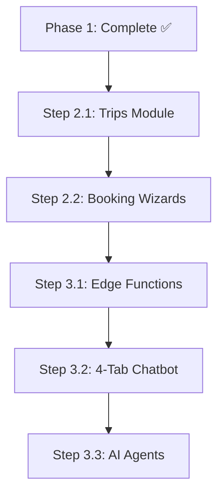

# Next Steps — Implementation Roadmap

> Sequential implementation order following best practices.

---

## Current Status: Phase 1 Complete ✅

### Completed Features
- ✅ **3-Panel Layout System** (rebuilt from scratch Jan 2026)
  - `ThreePanelContext` - Global state for selectedItem, rightPanelOpen, URL sync
  - `ThreePanelLayout` - Responsive shell (Desktop/Tablet/Mobile)
  - `RightDetailPanel` - Slide-in detail view with hero, AI pitch, actions
  - Desktop: 280px Left | Flex Center | 500px slide-in Right
  - Tablet: Collapsible Left | Right overlay
  - Mobile: Full-screen Right overlay with bottom nav
- ✅ **Apartments module** (list + detail + filters)
- ✅ **Cars module** (list + detail + filters)
- ✅ **Restaurants module** (list + detail + filters)
- ✅ **Events module** (list + detail + filters)
- ✅ **Saved/Favorites** with collections CRUD
- ✅ **Explore** unified view with category tabs
- ✅ **Authentication** (email, Google OAuth, protected routes)
- ✅ **Card selection** highlighting across all types

---

## Phase 2: Trips & Bookings (NEXT)

### Step 2.1 — Trips Module
**Prompt:** [09-trips-planning.md](./prompts/09-trips-planning.md)

| Task | Description | Priority | Status |
|------|-------------|----------|--------|
| 2.1.1 | Create `/trips` list page | High | ⏳ Todo |
| 2.1.2 | Create `/trips/:id` detail with day-by-day | High | ⏳ Todo |
| 2.1.3 | Create `/trips/new` wizard | High | ⏳ Todo |
| 2.1.4 | Trip cards with status badges | Medium | ⏳ Todo |
| 2.1.5 | "Add to Trip" from detail panels | High | ⏳ Todo |

**Files to Create:**
```
src/pages/Trips.tsx
src/pages/TripDetail.tsx
src/pages/TripNew.tsx
src/components/trips/TripCard.tsx
src/components/trips/TripWizard.tsx
src/components/trips/DayTimeline.tsx
src/hooks/useTrips.ts
src/hooks/useTripItems.ts
```

### Step 2.2 — Booking Wizards
**Prompt:** [10-bookings-module.md](./prompts/10-bookings-module.md)

| Task | Description | Priority | Status |
|------|-------------|----------|--------|
| 2.2.1 | Create `/bookings` dashboard | High | ⏳ Todo |
| 2.2.2 | Apartment booking wizard | High | ⏳ Todo |
| 2.2.3 | Car booking wizard | High | ⏳ Todo |
| 2.2.4 | Restaurant reservation wizard | High | ⏳ Todo |
| 2.2.5 | Event ticket wizard | High | ⏳ Todo |
| 2.2.6 | Confirmation flow | High | ⏳ Todo |

**Files to Create:**
```
src/pages/Bookings.tsx
src/pages/BookingDetail.tsx
src/components/bookings/BookingCard.tsx
src/components/bookings/ApartmentBookingWizard.tsx
src/components/bookings/CarBookingWizard.tsx
src/components/bookings/RestaurantBookingWizard.tsx
src/components/bookings/EventTicketWizard.tsx
src/hooks/useBookings.ts
```

---

## Phase 3: AI Integration

### Step 3.1 — Edge Functions
**Prompt:** [13-edge-functions.md](./prompts/13-edge-functions.md)

| Task | Description | Priority | Status |
|------|-------------|----------|--------|
| 3.1.1 | Enable Lovable AI Gateway | High | ⏳ Todo |
| 3.1.2 | Create `ai-chat` edge function | High | ⏳ Todo |
| 3.1.3 | Create `ai-router` for intent | High | ⏳ Todo |
| 3.1.4 | Create `ai-trip-planner` | Medium | ⏳ Todo |

### Step 3.2 — 4-Tab Chatbot
**Prompt:** [11-chatbot-system.md](./prompts/11-chatbot-system.md)

| Task | Description | Priority | Status |
|------|-------------|----------|--------|
| 3.2.1 | Create `/chat` page with 4 tabs | High | ⏳ Todo |
| 3.2.2 | Concierge tab (general Q&A) | High | ⏳ Todo |
| 3.2.3 | Trips tab (planning chat) | Medium | ⏳ Todo |
| 3.2.4 | Explore tab (discovery) | Medium | ⏳ Todo |
| 3.2.5 | Bookings tab (reservations) | Medium | ⏳ Todo |
| 3.2.6 | Floating AI widget | Low | ⏳ Todo |

**Files to Create:**
```
src/pages/Chat.tsx
src/components/chat/ChatTabs.tsx
src/components/chat/ChatMessages.tsx
src/components/chat/ChatInput.tsx
src/components/chat/AIWidget.tsx
src/hooks/useConversations.ts
src/hooks/useMessages.ts
supabase/functions/ai-chat/index.ts
supabase/functions/ai-router/index.ts
```

### Step 3.3 — AI Agents
**Prompt:** [14-ai-agents.md](./prompts/14-ai-agents.md)

| Agent | Model | Purpose | Status |
|-------|-------|---------|--------|
| Router Agent | claude-sonnet | Intent classification | ⏳ Todo |
| Concierge Agent | claude-sonnet | General Q&A | ⏳ Todo |
| Trip Planner Agent | claude-opus | Itinerary generation | ⏳ Todo |
| Booking Agent | claude-opus | Reservation handling | ⏳ Todo |
| Explore Agent | gemini-pro | Discovery with search | ⏳ Todo |

---

## Implementation Flow



---

## Best Practices Checklist

### Before Each Step
- [ ] Read the relevant prompt in `docs/prompts/`
- [ ] Check existing types in `src/integrations/supabase/types.ts`
- [ ] Review related hooks and components
- [ ] Plan file structure before coding

### During Implementation
- [ ] Use `ThreePanelLayout` for all new pages
- [ ] Follow existing patterns (hooks, components)
- [ ] Use semantic design tokens from `index.css`
- [ ] Add loading states and error handling
- [ ] Test responsive behavior (desktop/tablet/mobile)

### After Each Step
- [ ] Verify all acceptance criteria from prompt
- [ ] Update `docs/CHANGELOG.md`
- [ ] Update this progress document
- [ ] Test full user flow

---

## Quick Reference

| Phase | Focus | Prompts | Status |
|-------|-------|---------|--------|
| 1 | Foundation & Listings | 01-08, 15-16 | ✅ Complete |
| 2 | Trips & Bookings | 09, 10, 18 | ⏳ Next |
| 3 | AI Integration | 11, 13, 14 | ⏳ Future |

---

## Related Docs

- [3-Panel Checklist](./3-panel-checklist.md) — Layout verification
- [Prompts](./prompts/README.md) — Feature specifications
- [Rules](../rules/README.md) — Build constraints
- [Changelog](./CHANGELOG.md) — Change history

---

**Next Action:** Start with **Step 2.1 — Trips Module**
