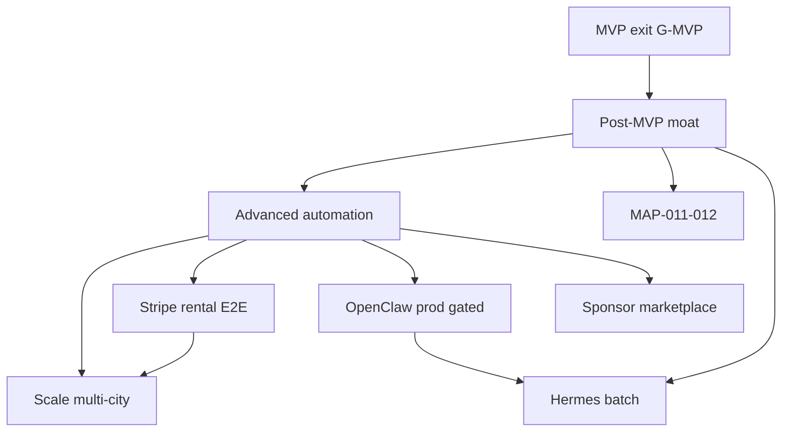

# mdeai.co — Advanced & Future Systems

> **What this answers:** *What do we build after MVP — in what order, under what gates, and what stays forbidden?*
>
> **What this is not:** Phase 1 exit work. If a task mentions OpenClaw prod, Hermes hot-path, contests, sponsor marketplace, or “12 agents” for MVP — it is **mis-scoped**. Move it here or to [`tasks/advanced/`](./tasks/advanced/) when specced.

**Execution order (task IDs):** [`plan.md`](./plan.md) Tiers 3–10 · [`tasks/INDEX.md`](./tasks/INDEX.md) · ADV table in [`tasks/MVP-REQUIRED.md`](./tasks/MVP-REQUIRED.md)

**Read first:** [`mvp.md`](./mvp.md) · [`roadmap.md`](./roadmap.md) · [`plan/unified-execution-review.md`](./plan/unified-execution-review.md)

---

## Rule of contamination

Advanced capabilities need a **stable MVP** (paid ticket, published event, rental pins + lead, `/chat` + MAP-001 green). Until then:

- No OpenClaw production outbound  
- No Hermes ranking on live chat latency path  
- No native rental Stripe booking  
- No contests, sponsor marketplace, or multi-agent fan-out  
- No CopilotKit v2 migration unless Mastra ships an official v2 bridge  

**Allowed during MVP freeze:** `places-proxy` read infrastructure, Mastra shadow logging, manual Postiz posts (human publishes).

---

## Phase map (how this doc relates to the roadmap)

| Horizon | Weeks (realistic) | Theme | This doc section |
|---------|-------------------|-------|------------------|
| **Post-MVP** | 11–18 | Moat, ops, bilingual, batch intelligence | §2 |
| **Advanced** | 19–28 | Money automation, growth, supervised ops | §3–§6 |
| **Scale** | 29+ | Multi-city, platform operator mode | §7 |

Post-MVP still requires **human approval** on every external effect. Advanced adds **higher automation surface** — never “AI executes money or publish alone.”

---

## 1. North-star (24-month intent)

Medellín’s **structured AI concierge** — one chat, one map, one approval gate — with:

| Pillar | Advanced end-state |
|--------|------------------|
| **Rentals** | Verified supply, nomad scoring, lease clarity (propose-only), optional Stripe Connect booking at 12% |
| **Events** | Host ROI dashboard, sponsor matching, dynamic pricing (opt-in), check-in at scale |
| **Concierge** | Full vertical routing (rentals, events, food, attractions) + trip memory + scam-filter moat |
| **Ops** | Patricia approves outreach; OpenClaw runs batch jobs; Hermes improves rank offline |

### Anti-vision (permanent rejects)

| Reject | Why |
|--------|-----|
| AI as executor (auto-charge, auto-publish, auto-lease) | Propose → human approve → deterministic commit |
| Second orchestrator (LangGraph, CrewAI, ADK in prod) | Mastra + CK only |
| Maps as decision layer | Mastra tools + Supabase; map renders |
| Scraping Google Maps / Facebook as supply v1 | Legal + quality; landlord-direct + partners later |
| Crypto tickets, global travel app, in-house payments | Stripe + Medellín depth |
| 15+ nominal agents per vertical | Router + workflows |

---

## 2. Post-MVP (weeks 11–18) — “moat without blast radius”

**Unfreeze gate:** MVP exit checklist in [`roadmap.md`](./roadmap.md) all green on staging.

### 2.1 Maps & geo ([`plan/maps/maps-prd.md`](./plan/maps/maps-prd.md))

| Initiative | Outcome | Persona | Proof |
|------------|---------|---------|-------|
| **MAP-011** route previews | Commute minutes on cards; parse `"180s"` duration | Camila | Unit + card screenshot |
| **MAP-012** neighborhood intelligence | Laureles vs Poblado cards (offline Gemini `ai_summary`, not US Places summaries) | Camila | No empty `generativeSummary` in CO |
| Place Photos on open | Thumbnails via Place Photos (New); server fetch | All | Photo only on user open |
| **ECL** mobile sheet | `<gmpx-overlay-layout>` behind flag; **one** Maps loader | Camila mobile | 390×844 Playwright |
| `places_request_log` + quota alerts | Patricia sees spend | Patricia | SQL + alert |

**Defer past Post-MVP:** Contextual View widget, Maps Imagery Grounding, 3D/deck.gl, fleet tracking.

### 2.2 Real estate ([`plan/real-estate/draft/prd-real-estateV2.md`](./plan/real-estate/draft/prd-real-estateV2.md))

| Initiative | Outcome | Proof |
|------------|---------|-------|
| Hermes **batch** rerank | NDCG@5 on golden set when labeled data exists | Eval harness green |
| Landlord dashboard MVP | Inbox, response KPIs, showing rate | 1 landlord weekly active |
| Scam filter ingest | `considered_but_rejected` in `ToolResponse` | Trust table in UI |
| Application + showing depth | 4-step apply; calendar sync | 1 E2E showing |
| **Lingui es-CO** | Spanish UI (Phase 2 language) | Catalog + `/chat` |

**Still frozen:** production WhatsApp outbound, MLS/scrape ingest, LLM-triggered booking writes.

### 2.3 Events ([`plan/events/events-prd.md`](./plan/events/events-prd.md))

| Initiative | Outcome | Proof |
|------------|---------|-------|
| Staff scanner PWA | `/staff/scan/:eventId/:token` | 1 check-in at live event |
| Refunds (manual policy) | Ops playbook + Stripe dashboard | Doc only |
| Event discovery polish | `event-discovery-workflow` + map pins | Tourist query → pins |
| Admin Patricia | `/admin/events`, moderation queue | RLS negative test |

**Cut from Post-MVP:** Vendor agent, Budget agent, Marketing agent, Activations agent — use **workflows + cron**, not new Mastra agent names.

### 2.4 Platform & AI

| Initiative | Outcome | Proof |
|------------|---------|-------|
| Path A completion | F14–F20 agent port if not in MVP | Parity smoke |
| `packages/contracts` extract | Shared Zod for edge + app | Single import path |
| CopilotKit **v2 evaluation** | Only after official Mastra bridge docs | Spike doc, no mixed imports |
| Vercel Queues spike | OpenClaw job transport | 1 job processed |
| Affiliate links (Airbnb/Booking) | Referral only — not native booking | Disclosure UI |

---

## 3. Advanced — automation & money (weeks 19–28)

**Unfreeze gate:** Post-MVP green + **30 days** production soak with 0 P0 Sentry + Places quota stable.

### 3.1 Rentals — revenue automation

| Initiative | Outcome | Risks |
|------------|---------|-------|
| **Stripe rental booking** | 12% service fee E2E; Connect if needed | PCI — hosted checkout only |
| Lease review workflow | PDF → structured propose-only summary + disclaimer | Not legal advice — UI disclaimer |
| Predictive lead scoring | Hermes labels → hot/warm/cold on dashboard | No auto-spam landlords |
| Landlord SaaS tier | Featured listings subscription | Sales ops required |

### 3.2 Events — growth

| Initiative | Outcome | Risks |
|------------|---------|-------|
| Dynamic pricing (opt-in) | Tier price rules vs inventory/time | Host trust — default OFF |
| Sponsor marketplace v1 | Sponsor profiles, brand-fit score, **HITL** outreach | AGPL Hi.Events patterns only |
| Group buy / split pay | Multi-payer checkout | Stripe complexity |
| Friends-going social proof | Requires friend graph + privacy | PII — default private |

### 3.3 Concierge — depth

| Initiative | Outcome | Risks |
|------------|---------|-------|
| **Map itinerary** (`trips` / `trip_items`) | Multi-day pin plan | Scope creep |
| Deep research mode | `research-canvas` pattern; citations | Cost + latency |
| Multi-source listing ingest | Scam filter at scale | Legal review required |
| MCP Apps venue picker | iframe interactive picker | Security review |

### 3.4 OpenClaw — supervised ops ([`plan/prd/09-openclaw.md`](./plan/prd/09-openclaw.md))

OpenClaw is **background execution**, not chat.

| Job type | Example | Gate |
|----------|---------|------|
| Enrichment | Nightly listing quality scan | Read-only + logs |
| Follow-up drafts | Stale lead WhatsApp **draft** | Paperclip approve |
| Content drafts | Postiz caption generation | Human publishes |
| Reconciliation | Stripe vs `event_orders` mismatch | Alerts only |

**Architecture (drop-in after Phase 1 seams):**

```text
Vercel Cron / Queue → OpenClaw worker → Mastra workflow
  → approval_requests (if external) → outbox_events → WhatsApp/Postiz/edge
```

**Never:** auto-send WhatsApp, auto-charge, auto-publish event, autonomous multi-agent campaigns without per-step approval.

### 3.5 Hermes — intelligence layer

| Capability | When | Hot path? |
|------------|------|-----------|
| Listing/apartment rerank | ≥100 labeled interactions | **No** — batch |
| Lead scoring | CRM labels exist | Batch → dashboard |
| Neighborhood market reports | Weekly cron | Batch |
| Sponsor/influencer fit | Sponsor module live | Batch |

Hermes **never** replaces Mastra router on user chat p95.

### 3.6 Paperclip — governance

Approvals for: landlord forward, sponsor pitch, bulk outreach, budget thresholds. Same `decide_approval()` RPC as Roberto publish — Patricia UI at `/admin/approvals`.

---

## 4. Advanced — contests & sponsors (Phase 3 module)

**Unfreeze gate:** ≥10 paid events, sponsor legal template, anti-fraud design review.

| System | What | Why advanced |
|--------|------|--------------|
| **Contest engine** | Miss Elegance–style voting + judges + fans | Identity, fraud, payments adjacent |
| **Sponsor marketplace** | Two-sided fees, placement tiers | No sponsor supply in MVP |
| **Influencer discovery** | Geo + engagement scoring | OpenClaw user stories — HITL only |

Canon: [`plan/events/events-prd.md`](./plan/events/events-prd.md) § Advanced — do not copy Hi.Events AGPL code.

---

## 5. Advanced — AI & Mastra platform

| Initiative | Purpose | Constraint |
|------------|---------|------------|
| Supervisor concierge | Replace router-only when eval proves need | Still one Mastra instance |
| `@mastra/evals` live scorers | NDCG, tool appropriateness | CI gate |
| GraphRAG on listings | >100 listings | Batch index |
| AgentBrowser verification | Admin moderation scale | Sandboxed |
| Voice concierge (es-CO) | Mobile WA handoff | Phase 3+ |
| A2A landlord partners | Multi-city | Scale phase |

**CopilotKit v2 migration:** only when CopilotKit documents Mastra + v2 path; **never** mix v1/v2 imports.

---

## 6. Advanced — maps & geo (beyond MAP-012)

| Initiative | Notes |
|------------|-------|
| Gemini Maps grounding panel | Optional; Lite MCP remains default live path |
| Weather (`lookup_weather`) | Event outdoor copy; `unitsSystem` camelCase |
| Offline map tiles / 3D | Not planned Phase 1–3 |
| Heatmaps / fleet | Reject |

---

## 7. Scale (weeks 29+) — multi-city & operator mode

| Initiative | Outcome |
|------------|---------|
| Multi-city scaffold | Export Medellín playbook (config, hood profiles, legal) |
| Operator dashboards | Cross-city KPIs |
| OpenClaw operational AI | Full job catalog with SLOs |
| Native mobile apps | Only if mobile web insufficient |
| Stripe Connect marketplace rules | If rental volume justifies |

---

## 8. Gates checklist (when to unfreeze)

| Gate ID | Requirement | Unlocks |
|---------|-------------|---------|
| G-MVP | [`mvp.md`](./mvp.md) four outcomes + `npm run floor` | Post-MVP §2 |
| G-SOAK | 30d prod, 0 P0, attribution on all grounded UI | Advanced §3 |
| G-EVENTS | ≥10 paid events | Dynamic pricing, sponsors |
| G-RENTALS | ≥1 paid booking + 25 listings | Stripe rental scale, scrape ingest |
| G-OPS | Paperclip + WA templates approved | OpenClaw prod send |
| G-LEGAL | Contest + sponsor counsel sign-off | §4 |

---

## 9. Dependency diagram (advanced layer)



---

## 10. Value vs effort (prioritization hint)

Use **RICE** when reprioritizing ([`mde-roadmap`](./.claude/skills/mde-roadmap/update-reprioritize.md)). Default order after MVP:

1. MAP-011–012 + scam filter (trust + Camila retention)  
2. Landlord dashboard + Hermes batch (supply side)  
3. Stripe rental booking (revenue)  
4. OpenClaw sandbox → prod (distribution)  
5. Sponsor marketplace (new revenue line)  
6. Contests (brand, high legal cost)  

---

## 11. Risks specific to advanced work

| Risk | Mitigation |
|------|------------|
| OpenClaw spam / Ley 1581 | Templates + approval + suppression list |
| Hermes wrong rank on thin data | Stay batch until NDCG baseline |
| Sponsor AGPL contamination | Patterns only from Hi.Events |
| Contest fraud | Identity + rate limits + manual review |
| CK v2 half-migration | Spike branch; never production mix |
| Multi-city dilutes moat | Config-driven; one city playbook export first |

---

## 12. Task & doc index

| Need | Where |
|------|-------|
| **Execution order now** | [`roadmap.md`](./roadmap.md) |
| **MVP scope** | [`mvp.md`](./mvp.md) |
| **Maps advanced** | [`plan/maps/maps-prd.md`](./plan/maps/maps-prd.md) §5, §7.3–7.4 |
| **RE advanced** | [`plan/real-estate/draft/roadmap.md`](./plan/real-estate/draft/roadmap.md) P4–P5 |
| **Events advanced** | [`plan/events/events-prd.md`](./plan/events/events-prd.md) §2 Post-MVP / Advanced |
| **OpenClaw** | [`plan/prd/09-openclaw.md`](./plan/prd/09-openclaw.md) |
| **Legacy long-form archive** (pre-mdeapp) | [`docs/advanced.md`](./docs/advanced.md) — historical detail; verify against v2 stack before trusting paths |
| **Advanced task specs** | `tasks/advanced/` (when created) |

---

## 13. Summary for stakeholders

> After MVP proves **ticket revenue**, **host publish**, and **map-backed rental discovery**, Post-MVP deepens **trust and lifestyle intelligence** (routes, neighborhoods, scam filter, Spanish). Advanced adds **automated money and distribution** only behind the same **approval gate** Roberto uses today — OpenClaw runs jobs, Hermes scores offline, and the map still only shows what Mastra validated.

**Engineering mantra:** *Automate coordination, not trust.*

---

*Update this file when a Post-MVP or Advanced initiative ships — or when [`roadmap.md`](./roadmap.md) is reprioritized.*
