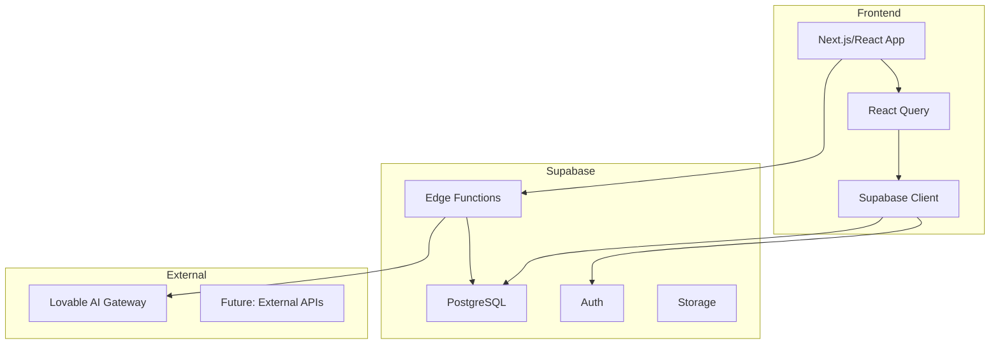
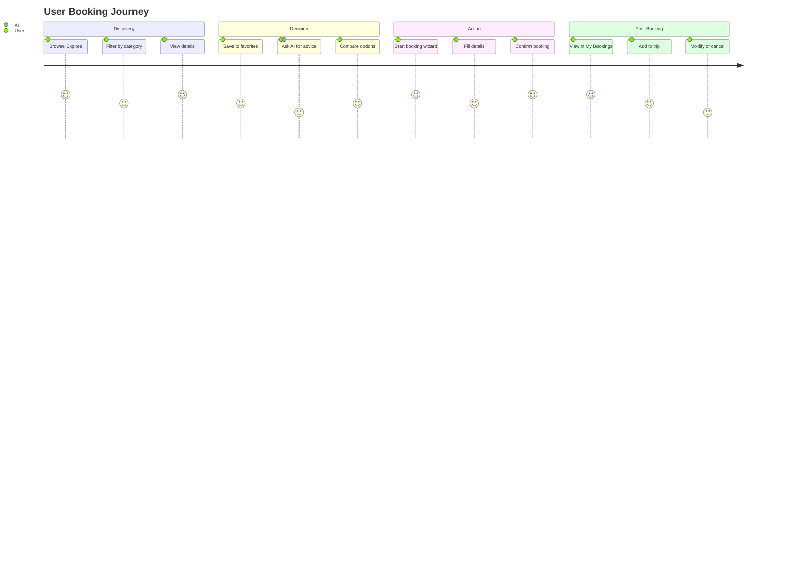
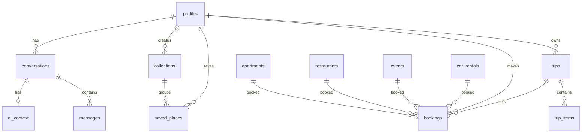

# Full-Stack Forensic Audit — I Love Medellín

**Audit Date:** 2026-01-21  
**Auditor Role:** Principal Product Architect + Forensic Software Auditor  
**Scope:** Frontend, Dashboards, Chatbots, Supabase Backend

---

## 1️⃣ Audit Summary

### Overall System Health: **72%**

| Category | Status | Score |
|----------|--------|-------|
| Frontend Architecture | 🟡 Good | 75% |
| Backend Schema | 🟢 Strong | 85% |
| CRUD Coverage | 🟡 Partial | 65% |
| Security (RLS) | 🟡 Needs Work | 70% |
| AI/Chat System | 🟡 Functional | 70% |
| Data Integrity | 🔴 Mixed | 60% |

### Critical Blockers
1. **RLS Disabled on some tables** — Security vulnerability detected by linter
2. **Mock data still used on homepage** — `Index.tsx` uses `mockPlaces` instead of Supabase
3. **No admin dashboard** — Content management requires direct DB access
4. **AI not connected to tools** — Chat cannot execute real actions (booking, searching)

### High-Risk Issues
1. Extensions installed in `public` schema (security warning)
2. Function search_path not set (SQL injection potential)
3. `user_preferences` and `tourist_destinations` have no Create UI
4. Hardcoded Supabase URL in `useChat.ts`

### Medium Issues
1. Inconsistent 3-panel usage (Saved page uses AppLayout, others use ThreePanelLayout)
2. No realtime subscriptions for bookings/trips updates
3. Missing pagination on several list views
4. No image upload functionality for user content

### Low Issues
1. Console warnings about refs on PlaceCard/Badge components
2. Some type casting with `as any` in booking/trip selection handlers
3. Duplicate icon imports in some component files

---

## 2️⃣ Frontend Audit Report

### Marketing Site (Index.tsx)

| Area | Status | Issues | Recommendation |
|------|--------|--------|----------------|
| Hero Section | ✅ Good | None | - |
| Navigation | ✅ Good | None | - |
| Categories | ✅ Good | None | - |
| Featured Places | 🔴 Critical | Uses `mockPlaces` from mockData.ts | Replace with `useFeaturedApartments`, `useFeaturedRestaurants` etc. |
| AI Teaser | 🟡 Placeholder | "Coming Soon" static text | Connect to real chat widget |
| Footer | ✅ Good | None | - |
| Mobile Nav | ✅ Good | Responsive | - |

### Explore Page

| Area | Status | Issues | Recommendation |
|------|--------|--------|----------------|
| 3-Panel Layout | ✅ Excellent | Proper implementation | - |
| Search | ✅ Good | Works with Supabase | - |
| Filters | ✅ Good | Category tabs with counts | - |
| Cards | ✅ Good | Click opens detail panel | - |
| Loading States | ✅ Good | Skeleton loaders | - |
| Empty States | ✅ Good | Proper messaging | - |

### Listings Pages (Apartments, Cars, Restaurants, Events)

| Page | Status | CRUD | Issues |
|------|--------|------|--------|
| Apartments | ✅ Good | Read only | No Create/Update UI |
| Cars | ✅ Good | Read only | No Create/Update UI |
| Restaurants | ✅ Good | Read only | No Create/Update UI |
| Events | ✅ Good | Read only | No Create/Update UI |

### User Dashboard Pages

| Page | Status | Issues | Recommendation |
|------|--------|--------|----------------|
| Saved | 🟡 Partial | Uses AppLayout (inconsistent) | Migrate to ThreePanelLayout |
| Trips | ✅ Good | Full CRUD | - |
| Bookings | ✅ Good | Read + Cancel | Add reschedule functionality |
| Collections | ✅ Good | Full CRUD via dialogs | - |

### Detail Pages

| Page | Status | Issues |
|------|--------|--------|
| ApartmentDetail | ✅ Good | Has booking wizard |
| CarDetail | ✅ Good | Has booking wizard |
| RestaurantDetail | ✅ Good | Has booking wizard |
| EventDetail | ✅ Good | Has booking wizard |
| TripDetail | ✅ Good | Shows items, timeline |
| PlaceDetail | ✅ Good | Generic handler |

### Wizards

| Wizard | Status | Connected to DB |
|--------|--------|-----------------|
| ApartmentBookingWizard | ✅ | Yes |
| CarBookingWizard | ✅ | Yes |
| EventBookingWizard | ✅ | Yes |
| RestaurantBookingWizard | ✅ | Yes |
| TripWizard | ✅ | Yes |

---

## 3️⃣ Chatbot & AI Audit

### What Exists
- ✅ Floating chat widget (bottom-right)
- ✅ 4-tab interface (Concierge, Trips, Explore, Bookings)
- ✅ Streaming responses from Lovable AI Gateway
- ✅ Conversation persistence in Supabase
- ✅ Message history per conversation
- ✅ Tab-specific system prompts
- ✅ Rate limit and payment error handling

### What Works
- Text-based Q&A for each tab context
- Conversation switching
- Message streaming with cancel support
- Quick action chips
- Welcome messages per tab

### Violations of Best Practices

| Issue | Severity | Description |
|-------|----------|-------------|
| No tool calling | 🔴 High | AI cannot search DB, create bookings, or modify data |
| No preview→apply flow | 🔴 High | AI would commit directly if tools existed |
| Context not enriched | 🟡 Medium | User preferences, current trip not passed to AI |
| No function execution | 🟡 Medium | Edge function doesn't define tools for structured output |
| Hardcoded URL | 🟡 Medium | `SUPABASE_URL` hardcoded in useChat.ts |

### Missing Safety Layers
1. No preview/confirmation before AI actions
2. No undo capability for AI-initiated changes
3. No action logging/audit trail
4. No rate limiting per user (only global)

### Recommended AI Architecture

```
┌─────────────┐     ┌──────────────┐     ┌─────────────┐
│   Chat UI   │────▶│  Edge Func   │────▶│  AI Gateway │
│  (Widget)   │     │  (ai-chat)   │     │  (Gemini)   │
└─────────────┘     └──────────────┘     └─────────────┘
                           │
                           ▼
              ┌────────────────────────┐
              │   Tool Definitions     │
              │  - search_restaurants  │
              │  - search_apartments   │
              │  - create_booking      │
              │  - get_user_trips      │
              └────────────────────────┘
                           │
                           ▼
              ┌────────────────────────┐
              │   Preview Response     │
              │  (proposed actions)    │
              └────────────────────────┘
                           │
                           ▼
              ┌────────────────────────┐
              │   User Confirmation    │
              │   Apply / Reject       │
              └────────────────────────┘
```

---

## 4️⃣ Supabase Audit Report

### Schema Health

| Table | RLS | Indexes | FK | Status |
|-------|-----|---------|-----|--------|
| profiles | ✅ | ✅ | - | Good |
| apartments | ✅ | 🟡 | - | Missing geo index |
| car_rentals | ✅ | 🟡 | - | Missing geo index |
| restaurants | ✅ | 🟡 | - | Missing geo index |
| events | ✅ | 🟡 | - | Missing geo index |
| tourist_destinations | ✅ | 🟡 | - | Underutilized |
| rentals | ✅ | 🟡 | - | Redundant with car_rentals? |
| bookings | ✅ | ✅ | ✅ | Good |
| trips | ✅ | ✅ | ✅ | Good |
| trip_items | ✅ | ✅ | ✅ | Good |
| saved_places | ✅ | ✅ | ✅ | Good |
| collections | ✅ | ✅ | ✅ | Good |
| conversations | ✅ | ✅ | ✅ | Good |
| messages | ✅ | ✅ | ✅ | Good |
| ai_runs | ✅ | ✅ | ✅ | Good |
| ai_context | ✅ | ✅ | ✅ | Good |
| user_preferences | ✅ | ✅ | ✅ | No UI to set |
| proactive_suggestions | ✅ | ✅ | ✅ | No UI |
| budget_tracking | ✅ | ✅ | ✅ | No UI |
| conflict_resolutions | ✅ | ✅ | ✅ | No UI |

### RLS Policy Review

| Table | SELECT | INSERT | UPDATE | DELETE | Notes |
|-------|--------|--------|--------|--------|-------|
| profiles | Own | Own | Own | ❌ | No delete policy |
| apartments | Public | ❌ | ❌ | ❌ | Read-only public |
| bookings | Own | Own | Own | ❌ | Soft delete via status |
| trips | Own | Own | Own | ❌ | Soft delete via deleted_at |
| conversations | Own | Own | Own | Own | Full access |
| messages | Own conv | Own conv | Own conv | Own conv | Scoped to conversation |

### Security Issues from Linter

1. **RLS Disabled** — At least one table has RLS disabled (needs investigation)
2. **Function Search Path** — `update_updated_at_column` and others need `SET search_path`
3. **Extensions in Public** — PostGIS extensions should be in separate schema

### Edge Functions Review

| Function | Purpose | Status | Issues |
|----------|---------|--------|--------|
| ai-chat | AI Gateway proxy | ✅ Works | No tool definitions, no context enrichment |

### Missing Edge Functions

| Function Needed | Purpose |
|-----------------|---------|
| ai-search | Search DB with AI understanding |
| ai-booking | Create bookings with AI assistance |
| ai-suggestions | Generate proactive suggestions |
| data-sync | External API integrations |

---

## 5️⃣ Frontend CRUD Plan

### Restaurants

| Page | Create | Read | Update | Delete | Notes |
|------|--------|------|--------|--------|-------|
| /restaurants | ❌ | ✅ List | ❌ | ❌ | Public read-only |
| /restaurants/:id | ❌ | ✅ Detail | ❌ | ❌ | Has booking wizard |
| Admin (needed) | ✅ | ✅ | ✅ | ✅ | Moderator/Admin only |

### Apartments

| Page | Create | Read | Update | Delete | Notes |
|------|--------|------|--------|--------|-------|
| /apartments | ❌ | ✅ List | ❌ | ❌ | Public read-only |
| /apartments/:id | ❌ | ✅ Detail | ❌ | ❌ | Has booking wizard |
| Admin (needed) | ✅ | ✅ | ✅ | ✅ | Moderator/Admin only |

### Events

| Page | Create | Read | Update | Delete | Notes |
|------|--------|------|--------|--------|-------|
| /events | ❌ | ✅ List | ❌ | ❌ | Public read-only |
| /events/:id | ❌ | ✅ Detail | ❌ | ❌ | Has booking wizard |
| Admin (needed) | ✅ | ✅ | ✅ | ✅ | Moderator/Admin only |

### Cars

| Page | Create | Read | Update | Delete | Notes |
|------|--------|------|--------|--------|-------|
| /cars | ❌ | ✅ List | ❌ | ❌ | Public read-only |
| /cars/:id | ❌ | ✅ Detail | ❌ | ❌ | Has booking wizard |
| Admin (needed) | ✅ | ✅ | ✅ | ✅ | Moderator/Admin only |

### Trips

| Page | Create | Read | Update | Delete | Notes |
|------|--------|------|--------|--------|-------|
| /trips | ❌ | ✅ List | ❌ | ✅ Soft | User's trips |
| /trips/new | ✅ Wizard | ❌ | ❌ | ❌ | Create trip |
| /trips/:id | ❌ | ✅ Detail | ✅ | ✅ Soft | Full CRUD |

### Bookings

| Page | Create | Read | Update | Delete | Notes |
|------|--------|------|--------|--------|-------|
| /bookings | ❌ | ✅ List | ❌ | ✅ Cancel | User's bookings |
| Wizards | ✅ | ❌ | ❌ | ❌ | Creates from detail pages |

### Saved Places

| Page | Create | Read | Update | Delete | Notes |
|------|--------|------|--------|--------|-------|
| /saved | ✅ Toggle | ✅ List | ✅ Notes/Collection | ✅ | Full CRUD |

### Collections

| Page | Create | Read | Update | Delete | Notes |
|------|--------|------|--------|--------|-------|
| /saved (sidebar) | ✅ Dialog | ✅ List | ✅ | ✅ | Full CRUD |

### User Preferences

| Page | Create | Read | Update | Delete | Notes |
|------|--------|------|--------|--------|-------|
| Settings (needed) | ✅ Auto | ✅ | ✅ | ❌ | Needs UI |

---

## 6️⃣ Backend CRUD Plan

| Table | Create API | Read API | Update API | Delete API | RLS |
|-------|-----------|---------|-----------|------------|-----|
| profiles | Auto (trigger) | ✅ Hook | ✅ Hook | ❌ | Own |
| apartments | ❌ Admin only | ✅ Hook | ❌ Admin | ❌ Admin | Public read |
| car_rentals | ❌ Admin only | ✅ Hook | ❌ Admin | ❌ Admin | Public read |
| restaurants | ❌ Admin only | ✅ Hook | ❌ Admin | ❌ Admin | Public read |
| events | ❌ Admin only | ✅ Hook | ❌ Admin | ❌ Admin | Public read |
| bookings | ✅ Hook | ✅ Hook | ✅ Hook | Soft (cancel) | Own |
| trips | ✅ Hook | ✅ Hook | ✅ Hook | Soft | Own |
| trip_items | ✅ Hook | ✅ Hook | ✅ Hook | ✅ Hook | Via trip |
| saved_places | ✅ Hook | ✅ Hook | ✅ Hook | ✅ Hook | Own |
| collections | ✅ Hook | ✅ Hook | ✅ Hook | ✅ Hook | Own |
| conversations | ✅ Hook | ✅ Hook | ✅ Hook | Soft | Own |
| messages | ✅ Hook | ✅ Hook | ❌ | ❌ | Via conv |
| user_preferences | ✅ Needed | ✅ Needed | ✅ Needed | ❌ | Own |

---

## 7️⃣ Data Flow Diagram

```
┌─────────────────────────────────────────────────────────────────┐
│                         FRONTEND                                 │
├─────────────────────────────────────────────────────────────────┤
│                                                                  │
│  ┌──────────┐   ┌──────────┐   ┌──────────┐   ┌──────────┐     │
│  │  Index   │   │ Explore  │   │ Bookings │   │  Trips   │     │
│  │ (Home)   │   │  Page    │   │  Page    │   │  Page    │     │
│  └────┬─────┘   └────┬─────┘   └────┬─────┘   └────┬─────┘     │
│       │              │              │              │            │
│       ▼              ▼              ▼              ▼            │
│  ┌─────────────────────────────────────────────────────────┐   │
│  │               React Query Hooks                          │   │
│  │  useApartments, useRestaurants, useBookings, useTrips   │   │
│  └────────────────────────┬────────────────────────────────┘   │
│                           │                                     │
└───────────────────────────┼─────────────────────────────────────┘
                            │
                            ▼
┌───────────────────────────────────────────────────────────────────┐
│                      SUPABASE CLIENT                               │
│                   (supabase.from().select())                       │
└───────────────────────────┬───────────────────────────────────────┘
                            │
                            ▼
┌───────────────────────────────────────────────────────────────────┐
│                      SUPABASE BACKEND                              │
├───────────────────────────────────────────────────────────────────┤
│                                                                    │
│  ┌────────────┐    ┌────────────┐    ┌────────────────────┐      │
│  │   Tables   │    │    RLS     │    │  Edge Functions    │      │
│  │            │◄───│  Policies  │    │                    │      │
│  │ apartments │    │            │    │  ai-chat           │      │
│  │ restaurants│    │ User owns  │    │  (AI Gateway)      │      │
│  │ bookings   │    │ or public  │    │                    │      │
│  │ trips      │    │            │    └─────────┬──────────┘      │
│  └────────────┘    └────────────┘              │                 │
│                                                 │                 │
└─────────────────────────────────────────────────┼─────────────────┘
                                                  │
                                                  ▼
                                    ┌─────────────────────────┐
                                    │   Lovable AI Gateway    │
                                    │  (Gemini 3 Flash)       │
                                    └─────────────────────────┘
```

### AI Flow (Current)

```
User Message ──▶ useChat.sendMessage()
                      │
                      ▼
              Save user message to DB
                      │
                      ▼
              POST /functions/v1/ai-chat
                      │
                      ▼
              ai-chat adds system prompt
                      │
                      ▼
              Lovable AI Gateway (streaming)
                      │
                      ▼
              Stream tokens to UI
                      │
                      ▼
              Save assistant message to DB
```

### AI Flow (Recommended)

```
User Message ──▶ useChat.sendMessage()
                      │
                      ▼
              POST /functions/v1/ai-chat
                      │
                      ▼
              ai-chat enriches with:
              - User preferences
              - Current trip context
              - Recent bookings
                      │
                      ▼
              AI Gateway with TOOLS:
              - search_restaurants
              - search_apartments  
              - create_booking_preview
              - get_trip_details
                      │
                      ▼
              If tool called:
              ├── Execute tool
              ├── Return PREVIEW (not committed)
              └── User confirms/rejects
                      │
                      ▼
              If confirmed:
              └── Execute real mutation
```

---

## 8️⃣ Recommended Clean Architecture

### Frontend Structure

```
src/
├── components/
│   ├── ui/              # shadcn primitives
│   ├── layout/          # LeftPanel, RightPanel, ThreePanelLayout
│   ├── chat/            # Chat widget, messages, input
│   ├── listings/        # Shared listing components
│   ├── bookings/        # Booking wizards, cards
│   ├── trips/           # Trip components
│   ├── saved/           # Saved/collections
│   └── admin/           # 🆕 Admin CRUD components
├── hooks/
│   ├── use[Entity].ts   # Supabase query hooks
│   ├── useChat.ts       # Chat state management
│   └── useAuth.ts       # Auth context
├── pages/
│   ├── public/          # 🆕 Marketing pages
│   ├── app/             # 🆕 Authenticated app pages
│   └── admin/           # 🆕 Admin pages
├── types/               # TypeScript interfaces
├── lib/                 # Utilities
└── context/             # React contexts
```

### API Layer (Edge Functions)

```
supabase/functions/
├── ai-chat/             # Conversational AI
│   └── index.ts
├── ai-search/           # 🆕 AI-powered search
│   └── index.ts
├── ai-booking/          # 🆕 AI booking assistance
│   └── index.ts
├── ai-suggestions/      # 🆕 Proactive suggestions
│   └── index.ts
└── _shared/             # 🆕 Shared utilities
    ├── tools.ts         # Tool definitions
    ├── context.ts       # Context enrichment
    └── cors.ts          # CORS headers
```

### Separation of Concerns

| Layer | Responsibility |
|-------|----------------|
| UI Components | Render, user interaction, form handling |
| Hooks | Data fetching, caching, mutations |
| Edge Functions | AI orchestration, tool execution, business logic |
| Database | Data storage, RLS enforcement, triggers |
| AI Gateway | LLM inference, streaming |

---

## 9️⃣ Phased Execution Plan

### Phase 1: Fix Blockers (1-2 days)

**What to build:**
1. Fix RLS disabled tables
2. Set function search_path
3. Replace mockData in Index.tsx with real Supabase queries
4. Remove hardcoded Supabase URL in useChat.ts

**Why:**
- Security vulnerabilities
- Data integrity issues
- Production readiness

**Success criteria:**
- Supabase linter shows 0 errors
- Homepage shows real data
- No hardcoded secrets

---

### Phase 2: Normalize CRUD (3-5 days)

**What to build:**
1. User Preferences settings page
2. Admin dashboard skeleton
3. Admin CRUD for listings (apartments, restaurants, events, cars)
4. Consistent ThreePanelLayout on Saved page

**Why:**
- Content management needed
- User customization
- Architecture consistency

**Success criteria:**
- Admin can create/edit/delete listings
- Users can set preferences
- All pages use consistent layout

---

### Phase 3: AI Wiring (5-7 days)

**What to build:**
1. Tool definitions for ai-chat
2. Context enrichment (user prefs, current trip)
3. Search tool (restaurants, apartments, events, cars)
4. Booking preview tool
5. Preview → Apply → Undo flow in UI
6. AI action logging

**Why:**
- AI currently text-only
- No real actions possible
- Safety layers missing

**Success criteria:**
- AI can search and show results
- AI can propose bookings (preview only)
- User must confirm before commit
- All AI actions logged

---

### Phase 4: Polish & Scale (Ongoing)

**What to build:**
1. Realtime subscriptions for bookings/trips
2. Image upload for user content
3. Proactive suggestions UI
4. Budget tracking UI
5. Conflict resolution UI
6. Performance optimization
7. Mobile PWA features

**Why:**
- Enhanced UX
- Feature completeness
- Production scale

**Success criteria:**
- Live updates without refresh
- All planned features functional
- Mobile-first experience

---

## Appendix: Mermaid Diagrams

### System Architecture



### User Journey



### Database ERD (Core Tables)



---

**End of Audit**

*This document should be used as the single source of truth for system state and execution planning.*
