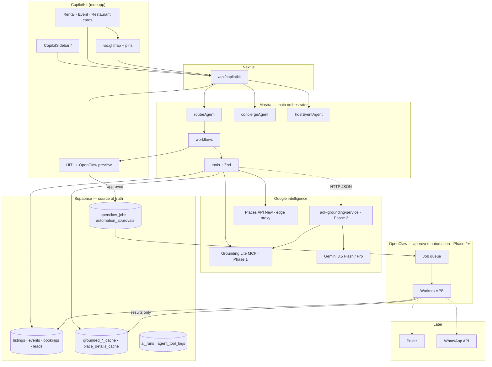

# OpenClaw + Google ADK + Gemini — Master Plan

> **One sentence:** **Camila** and **Roberto** get grounded answers and map proof in CopilotKit; **Mastra** decides what to run; **Google** (Gemini + Search + Maps + Places) supplies live geo facts; **Supabase** stores truth and cache; **OpenClaw** only executes **Patricia-approved** automation.

**Personas:** Camila (rentals/`/`), Roberto (`/host/event/new`), Tourist (food/attractions), Patricia (approvals/audit), MDE Community partners (promotion — Phase 2+).

---

## Document map

| § | Topic |
|---|--------|
| 1 | Executive summary |
| 2 | Architecture diagram |
| 3 | Technology responsibility table |
| 4 | Google ADK plan (`adk-grounding-service`) |
| 5 | Gemini tools plan |
| 6 | Maps / Places / spatial intelligence |
| 7 | OpenClaw plan |
| 8 | Mastra integration |
| 9 | CopilotKit UI |
| 10 | Supabase data plan |
| 11 | Real estate |
| 12 | Events |
| 13 | Restaurants / local business |
| 14 | MDE Community |
| 15 | Testing |
| 16 | Implementation roadmap |
| 17 | Final recommendation |

---

## 1. Executive summary

### Why Mastra **and** ADK?

| Layer | Why it exists | Business value |
|-------|---------------|----------------|
| **Mastra** | Product orchestration: routing, Supabase reads/writes, booking intents, HITL gates, one runtime with CopilotKit | Ship Medellín workflows without Python in `mdeapp` |
| **ADK** | Google-native **multi-tool** grounding recipes (Search + Maps + structured JSON) with official evals | Fewer glue bugs when one user turn needs Search **and** Maps |
| **Together** | Mastra calls ADK like any other tool; ADK never sees Stripe, users table, or CopilotKit | Best of both: **app brain** + **Google specialist** |

**ADK must not replace Mastra** — two orchestrators cause duplicate routing, split memory, and agents that write past RLS. ADK returns **JSON only**.

### Where OpenClaw fits

OpenClaw is the **approved execution layer** for slow, side-effectful work:

- scrape/enrich listings and menus
- draft outbound WhatsApp/Postiz payloads
- sponsor prospect lists
- external publish **after** human approval

OpenClaw runs on the **Hostinger VPS** (existing ops skill); jobs are enqueued from Mastra via `openclaw_jobs` + `automation_approvals`. **Never** customer-facing payments or booking commits.

### How Google pieces fit

| Piece | Role |
|-------|------|
| **Gemini** (`gemini-3.5-flash` default) | Reasoning, ranking, `why_recommended`, structured JSON — **not** lat/lng invention |
| **Search grounding** | Live events, news, sponsor pages, “this weekend” facts |
| **Maps grounding** | Real places, proximity, neighborhoods, itineraries |
| **Places API (New)** | `place_id`, hours, photos, autocomplete — server + field masks |
| **Grounding Lite MCP** | Fast `search_places`, `compute_routes` from Mastra (Phase 1) |
| **Spatial intelligence** | Merge SQL listings + grounded POIs + route context on the map |

### What creates revenue (not demo fluff)

1. **Camila** books apartment viewings → `leads` + commission.
2. **Roberto** sells tickets → Stripe + `events`.
3. **Restaurants** buy promotion → sponsored cards + Postiz (Phase 2).
4. **MDE Community** rev-share on promoted events.
5. **Automation** reduces Patricia’s manual enrichment cost — **after** approval.

### Phased honesty (repo state 2026-05-22)

| Phase | Delivers |
|-------|----------|
| **MVP** | CopilotKit `/` + Mastra + **Grounding Lite MCP** + Places + map pins + Supabase cache (MAP-001–007). ADK service **optional parallel**; same JSON contract. |
| **Phase 2** | ADK service production + OpenClaw enrichment + MDE pilot |
| **Phase 3** | WhatsApp, Stripe commissions, sponsor marketplace |
| **Advanced** | Voice, Interactions API, multi-region |

---

## 2. Architecture diagram



**Request path (Camila asks for cafés near a rental):**

```text
/ → conciergeAgent → nearby-lifestyle-workflow
  → read apartments (Supabase SQL)
  → search_grounded_places (MCP or ADK) → grounded_places_cache
  → mergePinsByCategory → CopilotKit cards + map pins
```

**OpenClaw path (listing enrichment):**

```text
host requests enrich → automation-approval-workflow → Patricia approves
  → openclaw_jobs queued → worker scrapes → openclaw_job_results
  → Mastra tool applies draft to listing (human publish still required)
```

---

## 3. Technology responsibility table

| System | Role | Best use cases | Risks | Score |
|--------|------|----------------|-------|------:|
| **Mastra** | Orchestrator, workflows, Supabase writes, HITL | Rental search, event wizard, routing, booking intents | Agent sprawl, name mismatch with CK | **96** |
| **CopilotKit** | Chat, generative UI, map state, approvals | `/`, host wizard, admin approval queue | v2 import mix, dual orchestrator | **95** |
| **Supabase** | SoT, RLS, cache, audit | Listings, tickets, leads, job logs | Missing RLS on new tables | **97** |
| **Google ADK** | Google grounding specialist service | Combined Search+Maps turns, eval harness | Python ops, latency, cost | **88** |
| **Gemini** | Reasoning + structured output | Rank, explain, compare neighborhoods | Hallucinated geo if no tool | **94** |
| **Search grounding** | Live/current facts | Events tonight, sponsor news | Stale without cache TTL | **90** |
| **Maps grounding** | Place truth, proximity | Restaurants, venues, nearby lifestyle | Quota 100 QPM Lite | **95** |
| **Places API (New)** | Structured place records | Details, autocomplete, nearby types | Field mask bill shock | **93** |
| **Grounding Lite MCP** | Fast agent→Maps tools | Phase 1 `search_places` | Not full Places feature set | **92** |
| **OpenClaw** | Approved automation executor | Enrichment, drafts, research | Unapproved send, token burn | **82** (P2+) |
| **Postiz** | Social scheduling | Restaurant/event posts | Brand risk without approval | **75** (P3) |
| **WhatsApp API** | Notifications, concierge channel | Reminders, community bot | Compliance, spam | **78** (P3) |

---

## 4. Google ADK plan — `adk-grounding-service`

**Location:** `services/adk-grounding/` (Python 3.12+, FastAPI, Cloud Run or VPS sidecar).  
**Contract:** Mastra `POST /v1/{tool}` → JSON → Zod in `mdeapp/src/mastra/lib/adk-grounding-client.ts`.  
**ADK never writes Supabase.**

### Shared types

```typescript
// Mastra validates all ADK responses
interface GroundedPlace {
  place_id: string;
  name: string;
  lat: number;
  lng: number;
  maps_url: string; // googleMapsLinks.placeUri only
  category: string;
  rating?: number;
  hours_summary?: string;
  why_recommended: string;
  sources: { type: "maps" | "search"; url?: string }[];
  provenance: "grounding_lite" | "places_new" | "adk_maps" | "adk_search";
  fetched_at: string;
}
```

### Tool catalog

| Tool | Purpose | Input (summary) | Output | Gemini / Google | Cache | Fail mode | Tests | Score |
|------|---------|-----------------|--------|-----------------|-------|-----------|-------|------:|
| `search_grounded_places` | NL → real places | `query`, `locationBias`, `pageSize≤5` | `GroundedPlace[]` | Flash + Maps tool / Lite MCP | `grounded_places_cache` 48h | quota → `[]` + reason | 10 Laureles golden queries | **96** |
| `search_grounded_events` | Live events + venues | `query`, `dateRange`, `area` | `GroundedEvent[]` | Flash + Search + SQL merge hint | `grounded_events_cache` 12h | Search fail → Supabase-only flag | eval weekend queries | **88** |
| `find_event_venues` | Capacity-aware venues | `capacity`, `area`, `vibe`, `budget` | `VenueCandidate[]` | Pro optional + Maps | `venue_intelligence` 7d | no place_id → drop | Roberto wizard fixtures | **92** |
| `explain_neighborhood` | Area brief | `slug`, `persona` | `NeighborhoodBrief` | Flash + Search + cache | `neighborhood_intelligence` 14d | no generativeSummary Places | compare Laureles/Poblado | **90** |
| `compare_neighborhoods` | Side-by-side | `slugs[]`, `criteria[]` | `ComparisonTable` | Flash over cached intel | read cache first | missing slug → partial | Vitest schema | **89** |
| `nearby_lifestyle_context` | POI bundle | `lat`, `lng`, `categories[]` | `NearbyPOI[]` | Lite nearby + Places | `rental_nearby_context` 72h | bad coords → `[]` | MAP-006 parity | **94** |
| `rental_nearby_enrichment` | Per-listing enrich | `rental_id` or coords | `NearbyPOI[]` | Same as nearby | per `rental_id` | listing missing → error object | Playwright CTA | **93** |
| `restaurant_discovery` | Food discovery | `cuisine`, `area`, `openNow?` | `GroundedPlace[]` | Maps grounding | shared places cache | attribution required | Tourist prompts | **95** |
| `build_grounded_itinerary` | Multi-stop day plan | `days`, `interests`, `origin` | `ItineraryDay[]` | Maps + routes | itinerary cache 24h | route parse `"180s"` | defer heavy MVP | **82** |
| `search_sponsor_opportunities` | B2B leads research | `vertical`, `area` | `SponsorLead[]` | Search grounding | `leads` draft rows **via Mastra only** | no auto-contact | OpenClaw handoff | **75** |

### Per-tool detail (representative: `search_grounded_places`)

**Input schema:**

```json
{
  "query": "quiet cafés with wifi near Parque Lleras",
  "location_bias": { "lat": 6.2088, "lng": -75.5671 },
  "page_size": 5,
  "persona": "camila",
  "session_id": "uuid"
}
```

**Output schema:** `{ "items": GroundedPlace[], "metadata": { "reason"?: string, "cache_hit": boolean } }`

**Dependencies:** Grounding Lite MCP `search_places` primary; Places Text Search fallback via MAP-005 proxy.

**Failure modes:** 429 → empty + `reason: "quota"`; missing `place_id` → drop row; timeout 8s → Mastra uses cache-only.

**Tests:** `agents-cli eval`; Mastra Vitest mock HTTP; assert no pin without `provenance`.

**ADK implementation sketch:** `LlmAgent` + `GoogleMapsGroundingTool` + optional `AgentTool` sub-agent — mirror `github/copilotkit/ag-ui-adk-grounding-app/agent/agent.py`.

---

## 5. Gemini tools plan

### Models (locked for mdeai)

| Tier | Model | Use |
|------|-------|-----|
| Default | `gemini-3.5-flash` | All product agents + ADK service |
| Complex | `gemini-3.1-pro-preview` | Host venue parse if Flash fails |
| Env | `GOOGLE_GENERATIVE_AI_API_KEY` in `mdeapp` | Not `GEMINI_API_KEY` in app code |

### Capabilities matrix

| Capability | How | Safety rule |
|------------|-----|-------------|
| Structured JSON | `responseSchema` / Zod post-parse | Reject on schema fail — no UI render |
| Tool calling | Mastra tools + ADK tools | Geo fields **only** from tool results |
| Search grounding | ADK `GoogleSearchTool` | Citations in card; `translate="no"` on names |
| Maps grounding | ADK Maps tool / Lite MCP | `maps_url` from API only |
| Reasoning | System: “explain using tool facts only” | `why_recommended` ≠ coordinate source |
| Summarization | Neighborhood briefs over **cache** | Label “curated summary” vs live Places |
| Neighborhood compare | `compare_neighborhoods` workflow | Scores from SQL+cache, not LLM invention |
| Rental lifestyle score | Weighted rubric in workflow | Output `scores: { remote_work: 0-100 }` + evidence[] |
| Event venue analysis | `find_event_venues` | Capacity from host input + Places types |
| Restaurant rec | `restaurant_discovery` | Max 5 results; attribution component |
| Itinerary | Phase 2+ `build_grounded_itinerary` | Routes duration parse `"180s"` |

### Prompt skeleton (concierge)

```text
You are the Medellín AI concierge for mdeai. Phase 1: English only.
- Never output latitude, longitude, place_id, or Maps URLs unless copied from a tool result.
- For place questions, call search_grounded_places or nearby tools first.
- For time-sensitive events, call search_grounded_events.
- Prefer Supabase listings for apartments and ticketed events we host.
- When uncertain, say what you could not verify.
```

### Hallucination prevention checklist

1. Zod on every tool exit (Mastra + ADK client).
2. `ToolResponse.considered_but_rejected` for filtered candidates.
3. Map pins require `data-testid="map-pin"` + valid coords from tool.
4. CI grep: no `google.com/maps/search` hand-built URLs in `mdeapp/src/mastra`.
5. Eval set: 50 Medellín queries with expected `place_id` prefixes optional.

---

## 6. Google Maps / Places / spatial intelligence plan

### Stack split (Phase 1 → 2)

| Need | Phase 1 | Phase 2 |
|------|---------|---------|
| Chat place discovery | Grounding Lite MCP via Mastra | + ADK multi-step |
| Host venue autocomplete | Places New + MAP-010 | Same |
| Nearby coworking/cafés | Places Nearby + MAP-006 | + ADK ranking |
| Commute minutes | `compute_routes` Lite / Routes API | MAP-011 |
| Neighborhood scores | Offline Gemini → `neighborhood_intelligence` | MAP-012 |

### Use case → API mapping

| Use case | APIs | Persona |
|----------|------|---------|
| Apartments near coworking | SQL geosearch + `nearby_lifestyle_context` | Camila |
| Cafés near rental | Nearby Search + map merge | Camila |
| Event venue near nightlife | `find_event_venues` + nearby restaurants | Roberto |
| Restaurants near event | `rental_nearby_context` pattern on event coords | Tourist |
| Tourist itinerary | `build_grounded_itinerary` + routes | Tourist |
| Neighborhood fit | `compare_neighborhoods` + intel table | Camila |

### Non-negotiables

- Every `<Map mapId={...}>` + `<AdvancedMarker>`.
- Every Places call: `X-Goog-FieldMask`.
- `place_id` + `googleMapsLinks.placeUri` only — no synthesized URLs.
- Default map center: `{ lat: 6.2442, lng: -75.5812 }`.

---

## 7. OpenClaw plan

**Principle:** OpenClaw = **worker**, not **brain**. Enqueue only after `automation_approvals.status = 'approved'`.

### Safety envelope

| Rule | Enforcement |
|------|-------------|
| No payments | Stripe only in Supabase edge functions |
| No booking commit | `booking_intents` stay `pending` until human/Stripe |
| No outbound WhatsApp without approval | `automation_approvals` + Patricia queue |
| All runs logged | `openclaw_jobs`, `openclaw_job_results`, `agent_tool_logs` |
| Kill switch | Env `OPENCLAW_DISABLED=1` + VPS compose stop |

### Real estate

| Use case | Workflow | Risk | Approval | Supabase | Score |
|----------|----------|------|----------|----------|------:|
| Listing enrichment | Scrape public listing → draft description/amenities | Medium | Host + Patricia | `openclaw_job_results` → listing draft | **85** |
| Airbnb/Fincaraíz research | Comp pricing snapshot | Low | Internal | `research_snapshots` jsonb | **78** |
| Competitor pricing | Periodic crawl | Low | Patricia cron | cache table | **75** |
| Host lead enrichment | Find owner contact **public** sources | High | Patricia | `leads` only | **70** |
| Neighborhood intel gather | Aggregate blogs/reddit into chunks | Medium | Patricia | `research_chunks` pgvector P2 | **80** |

### Events

| Use case | Workflow | Risk | Approval | Supabase | Score |
|----------|----------|------|----------|----------|------:|
| Venue research | Enrich `venue_intelligence` | Low | Roberto review | `venue_intelligence` | **88** |
| Event page research | External event metadata | Low | Auto-read | `grounded_events_cache` | **82** |
| Sponsor prospecting | Search → lead list | High | Patricia | `leads` | **76** |
| External publish | Post to MDE Community / social | High | Roberto + Patricia | `outbox_events` | **72** |
| Ticket link collection | Aggregate third-party links | Low | Internal | jsonb on event | **74** |

### Restaurants / businesses

| Use case | Workflow | Risk | Approval | Supabase | Score |
|----------|----------|------|----------|----------|------:|
| Social content research | Trend drafts | Medium | Restaurant owner | job results | **80** |
| Competitor monitoring | Weekly diff | Low | Internal | logs | **72** |
| Event night promotion | Bundle copy | Medium | Patricia | `restaurant_profiles` | **83** |
| Lead collection | Form scrape **allowed sites** | High | Patricia | `leads` | **68** |
| Menu/event extraction | PDF/HTML → structured menu | Medium | Owner approve | `restaurant_profiles.payload` | **81** |

### MDE Community

| Use case | Workflow | Risk | Approval | Supabase | Score |
|----------|----------|------|----------|----------|------:|
| Event discovery | Import community feed | Low | Scheduled | `events` | **86** |
| WhatsApp campaign support | Draft broadcasts | High | Patricia | `automation_approvals` | **70** |
| Sponsor lead lists | ADK/OC research | High | Patricia | `leads` | **74** |
| Community resource enrich | Links + descriptions | Low | Internal | cache | **78** |

---

## 8. Mastra integration plan

### Agents (runtime registry)

| Agent | Key | Surface | Calls ADK? | Calls OpenClaw? |
|-------|-----|---------|------------|-----------------|
| ping | `pingAgent` | smoke | No | No |
| router | `routerAgent` | `/` classify | Via workflows | No |
| concierge | `conciergeAgent` | `/` | Yes | No (queues only) |
| host event | `hostEventAgent` | `/host/event/new` | `find_event_venues` | Enrich optional P2 |
| **grounding** | — | **Not a separate Agent** | Tools on workflows | — |
| **automation approval** | — | **Workflow + admin**, not LLM agent | — | Enqueue after approve |

> **Align with [`03-runtime-orchestration.md`](../prd/03-runtime-orchestration.md):** do not register `rentalAgent`, `eventAgent`, `restaurantAgent` as separate agents in MVP — use workflows.

### Workflows

| Workflow | Steps | ADK | OpenClaw |
|----------|-------|-----|----------|
| `rental-search-workflow` | classify → SQL search → optional nearby enrich → pins | optional `rental_nearby_enrichment` | listing enrich job (P2) |
| `event-discovery-workflow` | Search + SQL events → cards | `search_grounded_events` | event import job |
| `restaurant-discovery-workflow` | `restaurant_discovery` → pins | Yes | menu extract (P2) |
| `nearby-lifestyle-workflow` | coords → nearby categories → merge pins | `nearby_lifestyle_context` | No |
| `venue-discovery-workflow` | host constraints → venues → draft state | `find_event_venues` | venue research job |
| `openclaw-approval-workflow` | preview → `automation_approvals` → enqueue | No | Yes on approve |
| `booking-intent-workflow` | capture intent → `booking_intents` pending | No | No |

### Call sites

```typescript
// ADK — sync HTTP from Mastra tool
await adkGroundingClient.searchGroundedPlaces({ query, locationBias });

// OpenClaw — async after approval only
await supabase.from("openclaw_jobs").insert({
  job_type: "listing_enrichment",
  payload: { listing_id, approval_id },
  status: "queued",
});
```

---

## 9. CopilotKit UI plan

| Component | Tool mirror | Hooks |
|-----------|-------------|-------|
| Chat sidebar | — | `<CopilotSidebar>`, `useCoAgent({ name: "conciergeAgent" })` |
| Rental cards | `search_rentals` | `useCopilotAction({ render })` |
| Restaurant cards | `restaurant_discovery` | + `GroundingAttribution` |
| Event cards | `search_events` | map `data-pin-id` |
| Venue cards | `find_event_venues` | host wizard |
| Neighborhood comparison | `compare_neighborhoods` | table card |
| Map pins | `mergePinsByCategory` | `MapContext`, `useCoAgentState<MapState>` read-only |
| Approval panels | publish / automation | `renderAndWaitForResponse` |
| OpenClaw preview | `openclaw-approval-workflow` | diff JSON before approve |
| Booking intent form | `booking-intent-workflow` | HITL — no auto-charge |
| Host dashboard | — | `/admin/*` Patricia |

**Map interaction:** card click → `selectedPinId`; pin click → scroll card (F50 + MAP-007).

---

## 10. Supabase data plan

All tables: `ENABLE ROW LEVEL SECURITY` + ≥1 policy. Migrations: `mdeapp/supabase/migrations/`.

### `grounded_places_cache`

| Field | Type | Notes |
|-------|------|-------|
| `id` | uuid PK | |
| `query_hash` | text | |
| `location_key` | text | geohash or neighborhood |
| `payload` | jsonb | `GroundedPlace[]` |
| `provenance` | text | |
| `expires_at` | timestamptz | TTL **48–72h** |

**Indexes:** `(query_hash, location_key)`, `(expires_at)`  
**RLS:** authenticated SELECT where policy allows; INSERT/UPDATE **service role / edge only**

### `grounded_events_cache`

TTL **6–24h**; fields: `query_hash`, `date_bucket`, `payload`, `expires_at`.

### `place_details_cache`

| Field | Type |
|-------|------|
| `place_id` | text PK |
| `payload` | jsonb |
| `expires_at` | timestamptz |

TTL **7–14d** (MAP-005).

### `neighborhood_intelligence`

`slug` PK, `scores` jsonb, `summary` text, `sources` jsonb, `refreshed_at`. TTL logical **14d** refresh job.

### `rental_nearby_context`

`rental_id` FK, `category`, `payload`, `expires_at` — TTL **72h**.

### `venue_intelligence`

`place_id` PK, `capacity_band`, `event_fit_tags`, `payload`, `expires_at`.

### `restaurant_profiles`

`place_id`, `mdeai_score`, `partnership_tier`, `payload`.

### `openclaw_jobs`

| Field | Type |
|-------|------|
| `id` | uuid PK |
| `job_type` | text |
| `payload` | jsonb |
| `status` | enum: queued/running/done/failed/cancelled |
| `approval_id` | uuid FK → `automation_approvals` |
| `created_by` | uuid |
| `started_at`, `finished_at` | timestamptz |

**RLS:** admins + service role write; users read own jobs only if exposed.

### `openclaw_job_results`

`job_id` FK, `result` jsonb, `error` text, `created_at`.

### `automation_approvals`

| Field | Type |
|-------|------|
| `id` | uuid PK |
| `action_type` | text |
| `preview` | jsonb |
| `status` | pending/approved/rejected |
| `decided_by` | uuid |
| `decided_at` | timestamptz |

### `agent_tool_logs` / `ai_runs`

Tool name, latency, status, redacted metadata — Patricia observability.

### `booking_intents` / `leads`

Standard commerce funnel; AI creates **pending** only.

### Audit

- Every OpenClaw job links to `approval_id`.
- Edge functions log field masks (Places).

---

## 11. Real estate plan

Better than Airbnb/Nomad Barrio = **verified nearby proof + human booking**, not instant opaque checkout.

| Feature | User value | Business value | AI tools | Workflow | Score |
|---------|------------|----------------|----------|----------|------:|
| AI apartment search | Fast shortlist | Lead volume | SQL + rental-search | router → workflow | **95** |
| Nearby lifestyle | “Walk to coworking” | Conversion | nearby + Maps | pins on map | **93** |
| Remote-work fit score | Pick neighborhood | Differentiation | compare + intel | scored card | **90** |
| Neighborhood comparison | Laureles vs Poblado | SEO + trust | ADK compare | cards | **91** |
| Host tools | List unit | Supply | host forms | Supabase CRUD | **80** |
| Listing enrichment | Richer listings | SEO | OpenClaw P2 | approval → job | **85** |
| Booking intent | Schedule viewing | Commission | booking-intent | HITL | **92** |
| Stripe booking later | Paid reservation | Revenue | edge only | Phase 3 | **88** |
| WhatsApp assistant later | Reminders | Retention | OpenClaw P3 | approved sends | **75** |

---

## 12. Events plan

| Feature | Revenue | Workflow | ADK | OpenClaw | Mastra | Score |
|---------|---------|----------|-----|----------|--------|------:|
| Live discovery | Ads/affiliate | event-discovery | `search_grounded_events` | import feed | SQL merge | **90** |
| Venue intelligence | Host sub | venue-discovery | `find_event_venues` | venue research | host agent | **92** |
| Ticketing | Fees | Stripe webhook | — | — | deterministic | **94** |
| After-party recs | Sponsor | nearby restaurants | Maps nearby | — | concierge | **85** |
| MDE promotion | Rev-share | admin + API | — | publish job | events table | **88** |
| Sponsor discovery | B2B | leads | `search_sponsor_opportunities` | prospect job | approval | **76** |
| Event automation | Ops time | outbox | — | external publish | approval workflow | **72** |

---

## 13. Restaurants / local business plan

| Service | Example | ADK/OpenClaw | Score |
|---------|---------|--------------|------:|
| AI booking assistant | “Table for 4 Friday” → `lead_capture` | Mastra only | **86** |
| WhatsApp reservations | Approved template message | OpenClaw P3 | **78** |
| Event night promo | “Before the concert” bundle | Maps + Postiz P2 | **84** |
| Sponsored recommendations | Badge on card | `restaurant_profiles.tier` | **87** |
| Menu extraction | PDF menu → structured | OpenClaw P2 | **81** |
| Customer campaigns | IG trends → draft posts | OpenClaw + Postiz | **79** |
| Booking commission | Stripe Connect | Supabase | **90** |

---

## 14. MDE Community partnership plan

| Capability | mdeai piece | Phase | Revenue |
|------------|-------------|-------|---------|
| AI WhatsApp concierge | Mastra router + OpenClaw send | 3 | Service fee |
| Event promotion engine | `events` + sponsored slots | 2 | **10–20%** promo fee (TBD) |
| Ticketing | Stripe + mdeai checkout | 2 | Ticket fee |
| Restaurant bookings | `leads` → partners | 2 | Commission |
| Relocation concierge | Camila rental path | 1–2 | Lead gen |
| Sponsored recommendations | disclosed UI | 2 | CPM/CPC |
| Business dashboard | Patricia `/admin` | 2 | SaaS optional |
| Community analytics | SQL + `ai_runs` | 2 | Retention |

**Integration:** Community events ingest → `events` table → map pins + chat cards; ADK enriches geo only.

---

## 15. Testing plan

| Area | Tests |
|------|-------|
| ADK correctness | `agents-cli eval` + 50-query JSON fixtures |
| No hallucinated places | CI: no render without `place_id` |
| Maps attribution | `GroundingAttribution` on grounded cards |
| Structured JSON | Zod fail → tool error path |
| Supabase cache | TTL hit/miss unit tests |
| Mastra tools | Vitest mock ADK + MCP |
| CopilotKit | Component + Playwright X1–X5 ([`tasks/maps/VERIFICATION-CHECKLIST.md`](../../tasks/maps/VERIFICATION-CHECKLIST.md)) |
| OpenClaw safety | E2E: reject without approval; kill switch |
| Rate limits | Circuit breaker at 100 QPM Lite |
| Fallbacks | ADK down → MCP-only → cache-only |
| Eval datasets | `services/adk-grounding/tests/evals/`, `mdeapp/src/mastra/**/__tests__` |

---

## 16. Implementation roadmap

### MVP (Phase 1)

| Task | Files | Acceptance | Tests | Risk | Δ score |
|------|-------|------------|-------|------|---------|
| MAP-001 pins + contracts | `mdeapp/src/platform/` | 1 pin on `/` | Vitest + curl | — | +15 |
| MAP-002 Grounding Lite tool | `mastra/tools/search-grounded-places.ts` | 3 grounded + attribution | MCP probe | quota | +12 |
| F48–F50 CK canvas | `app/page.tsx` | X1–X3 Playwright | e2e spec | agent name | +10 |
| Places proxy MAP-005 | `supabase/functions/places-proxy` | cache hit | RLS test | masks | +8 |
| Cache migrations | `*_grounded_places_cache.sql` | RLS on | SQL smoke | — | +5 |
| ADK spike (optional) | `services/adk-grounding/` | eval 10/10 pass | agents-cli | Python ops | +3 |

**MVP does not include:** OpenClaw production, WhatsApp, Postiz, Stripe marketplace.

### Phase 2

| Task | Acceptance | Tests |
|------|------------|-------|
| ADK service prod + Mastra client | Latency p95 < 8s | eval CI |
| `openclaw-approval-workflow` + jobs tables | No job without approval | integration |
| Listing + menu enrichment | Draft visible in admin | job result schema |
| MDE Community pilot import | Events on map | manual |
| Postiz integration | Scheduled post after approve | dry-run |

### Phase 3

| Task | Acceptance |
|------|------------|
| WhatsApp templates | Approved sends only |
| Stripe Connect commissions | Webhook idempotent |
| Sponsor marketplace | `leads` pipeline |

### Advanced

| Task | Notes |
|------|-------|
| Gemini Interactions API | Evaluate vs current SDK |
| Voice concierge | Live API |
| Multi ADK services | Only if traffic warrants |

---

## 17. Final recommendation

```text
Use Mastra as the main orchestrator.
Use Google ADK as the Google grounding specialist.
Use Gemini for reasoning and structured outputs.
Use Maps/Search/Places/Grounding Lite for real-world intelligence.
Use Supabase as source of truth and cache.
Use CopilotKit for UX.
Use OpenClaw only for approved automation.
Use Postiz and WhatsApp after core booking flows are stable.
```

### Architecture decision scores

| Decision | Score |
|----------|------:|
| Mastra + CopilotKit + Supabase core | **96** |
| ADK as HTTP grounding service (Phase 2 prod) | **90** |
| Grounding Lite MCP in Phase 1 (no ADK required for pins) | **95** |
| OpenClaw behind approvals (Phase 2+) | **88** |
| Full dual-orchestrator ADK in browser | **12** — reject |

### Immediate actions

1. Ship [`tasks/maps/INDEX.md`](../../tasks/maps/INDEX.md) MVP track (MAP-001 → F49 → MAP-002).
2. Add Supabase migrations for cache tables when MAP-002 starts.
3. Scaffold `services/adk-grounding/` on a branch; run `agents-cli eval` before wiring prod.
4. Design `automation_approvals` + `openclaw_jobs` migrations in Phase 2 — **do not** enqueue OpenClaw in MVP.
5. Cross-read [`plan/ADK/prd-adk.md`](../ADK/prd-adk.md) for ADK-only depth; this doc owns **OpenClaw + full-stack** seam.

---

*End of master plan — v1.0*
