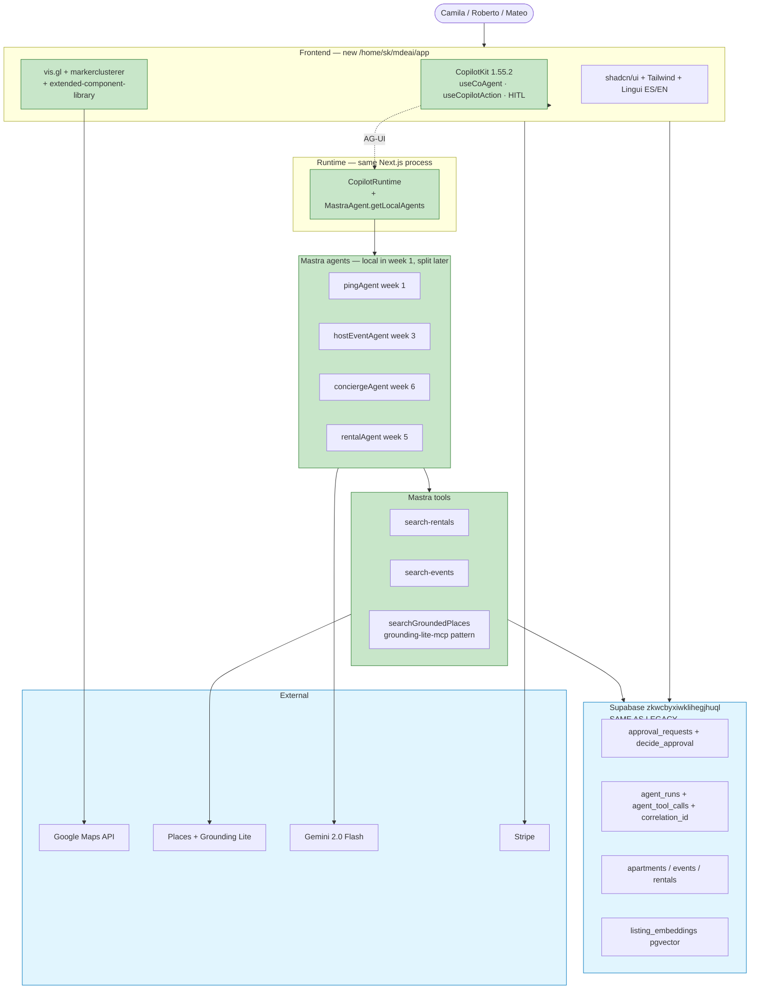

# 02 — Repo + sample strategy for new mdeai

> **Final answer:** Use **`CopilotKit/examples/integrations/mastra/`** as the **only** runtime foundation. Use **`@vis.gl/react-google-maps`** + **`@googlemaps/js-markerclusterer`** as the Maps foundation (already mdeai deps). Everything else is a **pattern reference**, not a foundation. ~85% of the new mdeai app is composition of these foundations + Mastra agents + shadcn/Tailwind shells. The custom code reduces to Spanish copy, brand tokens, and ~700 LoC of mdeai-specific routes and prompts.

---

## 1. Executive summary

Reviewed 47 CopilotKit examples (47 local, 7 deep-inspected this session), 13 Google Maps repos, 3 community CopilotKit repos, 3 events repos, plus 3 user-supplied repos (1 verifiable, 2 unverified).

| Finding | Detail |
|---|---|
| Only Mastra-shaped example | `examples/integrations/mastra/` — the **single** runtime base candidate |
| `canvas/gemini` is misleading | It's LangGraph + Python + FastAPI, NOT a Gemini-on-Mastra example. Demote from earlier scoring. |
| `canvas/pydantic-ai` is reference only | PydanticAI + Python — wrong agent framework |
| `v1/form-filling` is highest-value pattern | Closest analogue to Roberto's host event flow. shadcn/ui + Next.js 15. |
| `v1/chat-with-your-data` is second-highest | Closest analogue to Camila's data-query chat. shadcn/ui + Next.js 15. |
| Hi.Events is the only events platform worth referencing | AGPL-v3 — patterns only, no source copy |
| `clawg-ui` and `clawpilot` (user-supplied) | **Unverified — not in local repos.** Score deferred until inspection. |

**The single most important rule:** **one runtime foundation, many pattern references.** Mixing two runtimes (Mastra + LangGraph, or Mastra + PydanticAI) creates two orchestrators and doubles the operational cost.

---

## 2. Best starting repo

[**`CopilotKit/examples/integrations/mastra/`**](https://github.com/CopilotKit/CopilotKit/tree/main/examples/integrations/mastra)

**Why this one and only this one:**

1. **Only Mastra-shaped example** in the entire CopilotKit monorepo. Every other example uses LangGraph, CrewAI, PydanticAI, ADK, Agno, Strands, LlamaIndex, or Microsoft Agent Framework. mdeai already has 7 working Mastra agents.
2. **Pinned to `1.55.2`** — same version family the user has validated.
3. **Maintained by CopilotKit maintainers** — tested on every release. Risk of breakage on upgrade is low.
4. **Small and copyable** — 5 source files, ~1,000 LoC, MIT-licensed.
5. **Exercises every primitive mdeai needs in 10 weeks**: `<CopilotSidebar>`, `useCoAgent`, `useCopilotAction({ parameters })`, `useCopilotAction({ render })`, `renderAndWaitForResponse` (HITL), `Memory.workingMemory.schema` (agent-side state).

Day-1 reads (8 files total, listed in `01-copilotkit-plan.md` §5).

---

## 3. Top 20 repos + examples — graded

Scoring rubric:
- **90–100** core foundation or major building block
- **80–89** strong reference / component source
- **70–79** useful but not core
- **<70** avoid or defer

### Tier 1 — Core foundation (use as base)

| # | URL | Category | Score | Features | mdeai use | Action |
|---|---|---|---:|---|---|---|
| 1 | [CopilotKit/CopilotKit/examples/integrations/mastra](https://github.com/CopilotKit/CopilotKit/tree/main/examples/integrations/mastra) | Runtime foundation | **99** | CopilotKit 1.55.2 + Mastra + AG-UI bridge; sidebar; actions; HITL; shared state | Main AI runtime for new mdeai | **FOUNDATION — copy 5 files** |
| 2 | [visgl/react-google-maps](https://github.com/visgl/react-google-maps) | Maps foundation | **96** | React Map + AdvancedMarker + InfoWindow + 3D map; idiomatic React | Map renders, marker UI | **FOUNDATION — npm install** (already mdeai dep) |
| 3 | [googlemaps/js-markerclusterer](https://github.com/googlemaps/js-markerclusterer) | Clustering | **94** | Official clustering for AdvancedMarker | Pin dense apartments/events | **FOUNDATION — npm install** (already mdeai dep) |

### Tier 2 — Strong reference / component source (copy patterns)

| # | URL | Category | Score | Features | mdeai use | Action |
|---|---|---|---:|---|---|---|
| 4 | [CopilotKit/CopilotKit/examples/canvas/mastra](https://github.com/CopilotKit/CopilotKit/tree/main/examples/canvas/mastra) | Working-memory pattern | **96** | Zod schema on `Memory.workingMemory`; `useCoAgent<AgentState>`; card grid | Pattern for `hostEventAgent` + `useCoAgent` typed hooks | **PATTERN — read week 3** |
| 5 | [CopilotKit/CopilotKit/examples/canvas/mastra-pm](https://github.com/CopilotKit/CopilotKit/tree/main/examples/canvas/mastra-pm) | Multi-state workflow | **93** | Project + tasks + users state; AppChatHeader; ProjectContainer | Roberto's multi-field host event flow | **PATTERN — read week 3** |
| 6 | [CopilotKit/CopilotKit/examples/showcases/banking](https://github.com/CopilotKit/CopilotKit/tree/main/examples/showcases/banking) | Roles + approvals + GenUI | **91** | `copilot-context.tsx` role-based `useCopilotReadable`; multi-op approvals | Approval flow + admin role guard | **PATTERN — read week 4** |
| 7 | [CopilotKit/CopilotKit/examples/v1/form-filling](https://github.com/CopilotKit/CopilotKit/tree/main/examples/v1/form-filling) | Form-fill pattern | **90** | Next.js 15 + shadcn/ui; "AI fills incident-report form via conversation" | **Direct analogue** for `/host/event/new` Roberto flow | **PATTERN — read week 3** |
| 8 | [CopilotKit/CopilotKit/examples/showcases/generative-ui](https://github.com/CopilotKit/CopilotKit/tree/main/examples/showcases/generative-ui) | Card render shell | **90** | `useCopilotAction({ render })`; weather/stock cards | RentalCard/VenueCard/EventDraftCard shape | **PATTERN — read week 4** |
| 9 | [CopilotKit/CopilotKit/examples/v1/chat-with-your-data](https://github.com/CopilotKit/CopilotKit/tree/main/examples/v1/chat-with-your-data) | Data Q&A chat | **88** | Next.js 15 + shadcn/ui; dashboard with natural-language Q&A | **Direct analogue** for Camila's "apartments under $800" chat | **PATTERN — read week 6** |
| 10 | [googlemaps/extended-component-library](https://github.com/googlemaps/extended-component-library) | Maps UI components | **88** | Web components: `<gmp-place-overview>`, photo gallery, store locator | Replace ~150 LoC custom card chrome | **INSTALL — npm i week 4** |
| 11 | [googlemaps-samples/grounding-lite-mcp-sample-app](https://github.com/googlemaps-samples/grounding-lite-mcp-sample-app) | Grounded search MCP | **88** | Grounded place search via MCP; AG-UI flow | `searchGroundedPlaces` Mastra tool | **PATTERN — port week 6** |
| 12 | [googlemaps/js-api-samples](https://github.com/googlemaps/js-api-samples) | Official patterns | **86** | Vanilla JS Maps samples (canonical) | Marker click, viewport, geocoding edge cases | **REFERENCE — search when stuck** |
| 13 | [googlemaps/google-maps-services-js](https://github.com/googlemaps/google-maps-services-js) | Node SDK | **84** | Typed Node SDK for Places, Directions, Geocoding | Replace ad-hoc fetch in edge fns | **INSTALL — npm i week 5** |
| 14 | [google-gemini/cookbook](https://github.com/google-gemini/cookbook) | Gemini prompt patterns | **82** | Official Gemini API examples; tool calling; structured output; safety | Reference for Mastra agent prompt design (Gemini 2.0 Flash) | **REFERENCE — read week 3** |
| 15 | [HiEventsDev/hi.events](https://github.com/HiEventsDev/hi.events) | Event ticketing patterns | **80** ⚠️ | Vite + Mantine + Lingui i18n + Laravel; multi-tier tickets; QR; embed widgets; 13 locales | Reference for ticket-tier schema + QR check-in + organizer dashboard layout | **PATTERN ONLY — AGPL-v3 (do not copy code)** |

### Tier 3 — Useful but not core (defer or learn-only)

| # | URL | Category | Score | Features | mdeai use | Action |
|---|---|---|---:|---|---|---|
| 16 | [CopilotKit/CopilotKit/examples/integrations/mcp-apps](https://github.com/CopilotKit/CopilotKit/tree/main/examples/integrations/mcp-apps) | MCP Apps + Three.js | **78** | Interactive 3D apps via MCP servers in iframes | Phase 2 — interactive venue picker | **DEFER to phase 2** |
| 17 | [CopilotKit/CopilotKit/examples/showcases/generative-ui-playground](https://github.com/CopilotKit/CopilotKit/tree/main/examples/showcases/generative-ui-playground) | GenUI exploration | **78** | Static GenUI + MCP Apps + A2UI in one playground | Reference card layouts | **REFERENCE — week 5** |
| 18 | [googlemaps/platform-ai](https://github.com/googlemaps/platform-ai) | Maps Code Assist MCP | **76** | MCP server for Maps Platform docs; install as Gemini CLI extension | Dev-time code assistance ONLY (not runtime) | **DEV TOOL — week 2** |
| 19 | [CopilotKit/CopilotKit/examples/v1/state-machine](https://github.com/CopilotKit/CopilotKit/tree/main/examples/v1/state-machine) | State-machine pattern | **74** | Multi-step agent state coordination | Reference for complex multi-step workflows | **REFERENCE — phase 2** |
| 20 | [CopilotKit/CopilotKit/examples/showcases/research-canvas](https://github.com/CopilotKit/CopilotKit/tree/main/examples/showcases/research-canvas) | Research / deep-agents | **70** | LangGraph + Tavily; multi-step research with citations | Phase 3 — deep concierge mode | **DEFER to phase 3** |

### Avoid (wrong stack / experimental / archived)

| URL | Why ignored |
|---|---|
| `examples/canvas/gemini` | LangGraph + Python + FastAPI — NOT Mastra. Despite the name. |
| `examples/canvas/pydantic-ai` | PydanticAI + Python — wrong framework |
| `examples/integrations/{langgraph-*, crewai-*, adk, agno, strands-python, llamaindex*, pydantic-ai, ms-agent-framework-*, agent-spec, a2a-a2ui}` | All wrong agent orchestrator |
| `examples/v1/{next-openai, next-pages-router, node-express, node-http, _legacy}` | Legacy — marked in CopilotKit README |
| `examples/v2/*` (all) | Experimental + no Mastra integration |
| `examples/showcases/multi-agent-canvas` | LangGraph multi-agent |
| `examples/showcases/a2a-travel` | A2A + ADK — wrong orchestrator |
| `github/maps/react-wrapper` | **Archived** — explicit redirect to vis.gl |
| `github/copilotkit/agent-studio-starter` | LangGraph + FastAPI + k8s — wrong stack |
| `github/copilotkit/ag-ui-adk-grounding-app` | Google ADK + Vertex — wrong orchestrator |
| `github/copilotkit/with-agent-spec` | Agent Spec + FastAPI + A2UI — different protocol |
| `github/copilotkit/mastra-react` | Empty Vite template — name is misleading |
| `github/events/eventraa` | Create-React-App + MongoDB — stack mismatch |
| [`contextablemark/clawg-ui`](https://github.com/contextablemark/clawg-ui) | **Unverified — not reviewed locally. Defer scoring until inspection.** |
| [`kcchien/clawpilot`](https://github.com/kcchien/clawpilot) | **Unverified — not reviewed locally. Defer scoring until inspection.** |

---

## 4. Recommended architecture

```text
┌──────────────────────────────────────────────────────────────┐
│ FRONTEND (Next.js 16, copied from examples/integrations/mastra)│
│  CopilotKit 1.55.2 layer                                      │
│    <CopilotKit runtimeUrl=/api/copilotkit>                    │
│    <CopilotSidebar> | useCoAgent | useCopilotAction           │
│    renderAndWaitForResponse (HITL)                            │
│  Maps layer                                                    │
│    @vis.gl/react-google-maps                                  │
│    @googlemaps/js-markerclusterer                             │
│    @googlemaps/extended-component-library                     │
│  UI primitives                                                 │
│    shadcn/ui + Tailwind 4                                     │
│    Lingui (i18n ES/EN) — week 5                               │
└────────────────────────────┬─────────────────────────────────┘
                             │ AG-UI protocol (HTTP/SSE)
                             ▼
┌──────────────────────────────────────────────────────────────┐
│ AGENT RUNTIME (same Next.js process for week 1, split later)  │
│  CopilotRuntime + MastraAgent.getLocalAgents({ mastra })      │
│  Agents: pingAgent (W1) → hostEventAgent + rentalAgent +      │
│          conciergeAgent + eventAgent (W3–W6)                  │
│  Tools: search-rentals, search-events, searchGroundedPlaces   │
│  Memory: LibSQL (dev in-memory → Postgres for prod)           │
└────────────────────────────┬─────────────────────────────────┘
                             ▼
┌──────────────────────────────────────────────────────────────┐
│ BACKEND (same Supabase project as legacy mde)                 │
│  zkwcbyxiwklihegjhuql — 122 tables, RLS-tight                 │
│  approval_requests + decide_approval()                        │
│  agent_runs + agent_tool_calls + correlation_id               │
│  apartments, events, rentals, listing_embeddings (pgvector)   │
│  Stripe ticket-checkout + ticket-payment-webhook              │
└────────────────────────────┬─────────────────────────────────┘
                             ▼
┌──────────────────────────────────────────────────────────────┐
│ EXTERNAL                                                       │
│  Google Maps API (vis.gl + extended-component-library)        │
│  Google Places API + Grounding Lite MCP                       │
│  Gemini 2.0 Flash via @ai-sdk/google                          │
│  Stripe (payments)                                             │
│  Infisical (secrets)                                           │
└──────────────────────────────────────────────────────────────┘
```

---

## 5. Mermaid — how everything connects



---

## 6. What to copy from each example (component-by-component)

| Component / pattern | From | mdeai file (new) |
|---|---|---|
| `/api/copilotkit/route.ts` (CopilotRuntime + Mastra) | `integrations/mastra/src/app/api/copilotkit/route.ts` | `src/app/api/copilotkit/route.ts` |
| Mastra registration shape | `integrations/mastra/src/mastra/index.ts` | `src/mastra/index.ts` |
| Agent + Memory + Zod working state | `canvas/mastra/src/mastra/agents/index.ts` | `src/mastra/agents/host-event.ts` |
| `useCoAgent<T>` typed hook | `integrations/mastra/src/app/page.tsx:78` | `src/hooks/useHostEventCoAgent.ts` |
| `useCopilotAction({ render })` card | `integrations/mastra/src/app/page.tsx:88` + `showcases/generative-ui/components/weather-card.tsx` | `src/components/cards/RentalCard.tsx` |
| `renderAndWaitForResponse` HITL | `integrations/mastra/src/app/page.tsx:102` | `src/components/approvals/ApprovalPanel.tsx` |
| Form-fill via conversation pattern | `v1/form-filling/` | `src/app/host/event/new/page.tsx` |
| Data-query chat pattern | `v1/chat-with-your-data/` | `src/app/rentals/page.tsx` |
| Role-based action context | `showcases/banking/src/lib/copilot-context.tsx` | `src/lib/auth/role-context.tsx` |
| Place card | `extended-component-library` `<gmp-place-overview>` | `src/components/cards/VenueCard.tsx` |
| Grounded place search | `grounding-lite-mcp-sample-app/api/grounded-search.ts` | `src/mastra/tools/grounded-search.ts` |
| Multi-state agent shape | `canvas/mastra-pm/src/lib/state.ts` | Reference only |
| Gemini prompt patterns + structured output | `google-gemini/cookbook` | `src/mastra/agents/host-event.ts` instructions |
| Ticket-tier schema | `Hi.Events/backend/app/Models/Ticket*.php` | **Reference only (AGPL)** — write fresh `event_tickets` migration |
| QR check-in flow | `Hi.Events/backend/app/Services/CheckIn*.php` | **Reference only (AGPL)** — port existing `event-staff-link-generator` |

---

## 7. What to NOT custom rebuild

| Don't custom-build | Use this instead |
|---|---|
| Custom SSE parser | `@ag-ui/mastra` event stream |
| Tool output normalizer / kebab-vs-camel drift | `useCopilotAction({ parameters: z.object() })` — typed at compile time |
| Action queue / `pendingActions` | AG-UI event stream |
| Approval modal | `useCopilotAction({ renderAndWaitForResponse })` |
| Frontend ↔ agent state sync | `useCoAgent` / `useCoAgentState` |
| Intent router | Mastra `router` agent (already in `my-mastra-app/`) |
| Sidebar chat shell | `<CopilotSidebar>` |
| Marker clustering | `@googlemaps/js-markerclusterer` |
| Map wrapper | `@vis.gl/react-google-maps` |
| Place card chrome | `@googlemaps/extended-component-library` `<gmp-place-overview>` |
| Place autocomplete | `@googlemaps/google-maps-services-js` Places SDK |
| i18n machinery | Lingui (Hi.Events pattern) |
| Auth | Supabase Auth (existing) |
| Data layer | Supabase + RLS (existing) |
| Stripe checkout | existing `ticket-checkout` edge fn |

---

## 8. What custom code IS still necessary

The irreducible mdeai-specific layer, ~700 LoC total:

| File | Purpose | ~LoC |
|---|---|---:|
| `src/lib/copilotkit/CopilotKitGate.tsx` | Provider wrapper if any route stays flag-gated | 25 |
| `src/mastra/agents/host-event.ts` | `hostEventAgent` instructions (Spanish prompt + Mastra tools) | 80 |
| `src/mastra/agents/rental-helper.ts` | `rentalAgent` adapter for new shape | 80 |
| `src/components/cards/{RentalCard,VenueCard,EventDraftCard}.tsx` | Brand-shell around shadcn primitives | 150 × 3 = 450 |
| `src/components/approvals/ApprovalPanel.tsx` | Spanish copy + `decide_approval()` wiring | 80 |
| `src/hooks/useHostEventCoAgent.ts`, `useRentalsCoAgent.ts` | Typed hooks wrapping `useCoAgent` | 30 × 2 = 60 |
| `src/lib/i18n/strings.ts` (Lingui catalogs) | ES/EN strings, ~200 strings | ~200 (mostly text) |
| `src/lib/maps/setPins.ts` | Single writer guard for `MapContext`-equivalent | 30 |
| `src/types/mde-state.ts` | `MdeState`, `EventDraftState`, `RentalState` Zod schemas | 100 |
| `src/app/host/event/new/page.tsx` | Roberto's form-fill page (composition) | 120 |
| `src/app/rentals/page.tsx` | Camila's rentals page (composition) | 100 |
| `src/app/chat/page.tsx` | Generic chat shell | 80 |

Everything else is composition of imported primitives.

---

## 9. Recommended folder structure

```text
/home/sk/mdeai/mdeapp/                    ← new repo root
├── README.md
├── package.json
├── next.config.ts
├── tsconfig.json
├── tailwind.config.ts
├── postcss.config.mjs
├── .env.local                          ← same Supabase + Maps keys as legacy mde
├── .env.example
├── .gitignore
├── public/
│   └── favicon.ico
├── src/
│   ├── app/
│   │   ├── layout.tsx                  ← <CopilotKit runtimeUrl agent>
│   │   ├── page.tsx                    ← landing (W1 echo, replaced W6)
│   │   ├── globals.css                 ← Paisa tokens + CopilotKit styles
│   │   ├── api/
│   │   │   └── copilotkit/
│   │   │       └── route.ts            ← Runtime endpoint
│   │   ├── host/
│   │   │   ├── events/page.tsx         ← W3 — Roberto's list
│   │   │   └── event/
│   │   │       └── new/page.tsx        ← W3 — Roberto's form-fill
│   │   ├── rentals/
│   │   │   └── page.tsx                ← W5 — Camila's rentals
│   │   ├── chat/
│   │   │   └── page.tsx                ← W6 — Camila's chat
│   │   ├── admin/
│   │   │   ├── events/page.tsx         ← W8
│   │   │   └── approvals/page.tsx      ← W8
│   │   └── (auth)/
│   │       ├── login/page.tsx
│   │       └── signup/page.tsx
│   ├── mastra/                         ← Mastra agent definitions (local mode W1)
│   │   ├── index.ts                    ← registers agents
│   │   ├── agents/
│   │   │   ├── ping.ts                 ← W1
│   │   │   ├── host-event.ts           ← W3 (uses event-planner-os templates)
│   │   │   ├── rental.ts               ← W5
│   │   │   └── concierge.ts            ← W6
│   │   └── tools/
│   │       ├── search-rentals.ts       ← W5 (ported from my-mastra-app)
│   │       ├── search-events.ts        ← W5
│   │       └── grounded-search.ts      ← W6 (port grounding-lite-mcp pattern)
│   ├── lib/
│   │   ├── copilotkit/
│   │   │   └── CopilotKitGate.tsx
│   │   ├── supabase/
│   │   │   ├── client.ts               ← anon-key client
│   │   │   ├── server.ts               ← service-role client (server only)
│   │   │   └── types.ts                ← generated by gen:types
│   │   ├── auth/
│   │   │   └── role-context.tsx        ← from showcases/banking pattern
│   │   ├── maps/
│   │   │   ├── MdeMap.tsx              ← thin vis.gl wrapper
│   │   │   ├── MdeMarker.tsx
│   │   │   ├── MdeMarkerCluster.tsx
│   │   │   └── setPins.ts              ← single writer
│   │   ├── i18n/
│   │   │   ├── strings.ts              ← Lingui catalogs
│   │   │   └── locale.ts
│   │   └── mastra-client/
│   │       └── runtime-endpoint.ts     ← future: talk to remote my-mastra-app:4111
│   ├── components/
│   │   ├── ui/                          ← shadcn primitives (init via shadcn CLI)
│   │   ├── cards/
│   │   │   ├── RentalCard.tsx
│   │   │   ├── VenueCard.tsx
│   │   │   ├── EventDraftCard.tsx
│   │   │   └── GroundedPlaceCard.tsx
│   │   ├── approvals/
│   │   │   └── ApprovalPanel.tsx
│   │   └── layout/
│   │       └── Navbar.tsx
│   ├── hooks/
│   │   ├── useHostEventCoAgent.ts
│   │   ├── useRentalsCoAgent.ts
│   │   └── useApprovalGate.ts
│   └── types/
│       └── mde-state.ts                ← Zod EventDraftState, RentalState
├── tests/
│   ├── unit/                            ← Vitest
│   └── e2e/                             ← Playwright @ 390×844
└── docs/
    └── ARCHITECTURE.md
```

---

## 10. Phase roadmap

### Phase 1 — Core MVP (10 weeks)

| Week | Repo / sample drawn from | Deliverable |
|---|---|---|
| 1 | `integrations/mastra` | Bootstrap echo: `pingAgent` + `<CopilotSidebar>` |
| 2 | (no new repo) | Supabase Auth + role context (`showcases/banking` pattern); shadcn init |
| 3 | `v1/form-filling` + `canvas/mastra` + `event-planner-os` templates | `/host/event/new` form-fill (Roberto pilot) |
| 4 | `showcases/banking` + `showcases/generative-ui` | Approval flow (`decide_approval()`); event publish |
| 5 | `vis.gl` + `markerclusterer` + `google-maps-services-js` | `/rentals` map + list — Camila path starts |
| 6 | `v1/chat-with-your-data` + `grounding-lite-mcp` | `/chat` with grounded venue/restaurant search |
| 7 | `extended-component-library` + Lingui (Hi.Events pattern) | Place cards + ES/EN i18n |
| 8 | (no new repo) | Admin (`/admin/events`, `/admin/approvals`); test count 0 → 90 |
| 9 | (no new repo) | Stripe ticket flow port; 7-day Vercel preview soak |
| 10 | (no new repo) | Traffic split + legacy retire |

### Phase 2 — Post-MVP (weeks 11–18)

| Bucket | Repo / sample |
|---|---|
| MCP Apps (interactive venue picker) | `examples/integrations/mcp-apps` + `examples/showcases/mcp-apps` |
| Multi-step agent state | `examples/v1/state-machine` (reference) |
| Photo + place gallery | `extended-component-library` extras |
| Lingui translation polish | full ES catalog |
| OpenClaw forensic | (back-end work, no new repo) |
| Maps Code Assist (dev) | `googlemaps/platform-ai` (Gemini CLI extension) |

### Phase 3 — Advanced (weeks 19+)

| Bucket | Repo / sample |
|---|---|
| Sponsor marketplace | (Hi.Events organizer dashboard patterns, no source copy) |
| Contest voting | (custom) |
| Deep research mode | `examples/showcases/research-canvas` (reference) |
| Multi-agent ops | `examples/showcases/multi-agent-canvas` (reference) |
| Browser-control agents | `mastra-copilotkit-browser-agent` (reference) |

### Never

- Commerce / storefront scaffolding (out of scope per `CLAUDE.md`)
- Hi.Events source copy (AGPL — patterns only)
- LangGraph / CrewAI / ADK / PydanticAI runtimes (second orchestrator)

---

## 11. First 10 implementation tasks (strict order)

> All 10 belong in week 1–2. No production write happens until task 11+ (`/host/event/new`).

| # | Task | Repo / sample input | Done when |
|---|---|---|---|
| 1 | Bootstrap `/home/sk/mdeai/mdeapp/` from `examples/integrations/mastra/` | copy 5 source files, strip docker + fixtures, `git init` | `ls src/app/api/copilotkit/route.ts` exists |
| 2 | Rewrite `src/mastra/agents/index.ts` from `weatherAgent` to `pingAgent` (Gemini via `@ai-sdk/google`) | example shape | echo agent registers; LibSQL memory in-memory |
| 3 | Delete demo components: `weather.tsx`, `moon.tsx`, `proverbs.tsx`; rewrite `page.tsx` as 50-line mdeai shell | (none) | sidebar mounts; no console errors |
| 4 | Copy `.env.local` from legacy mde; rename `VITE_*` → `NEXT_PUBLIC_*`; add `GOOGLE_GENERATIVE_AI_API_KEY` | legacy `mde/.env.local` | env keys load; no secret in committed files |
| 5 | `npm install`; `npm run dev`; verify `http://localhost:3000` echoes "hola" | (none) | Gemini responds in Spanish |
| 6 | Initialize git + `gh repo create mdeai/mdeai-app --private` + first push | (none) | Vercel preview deploys, sidebar echoes on preview URL |
| 7 | Install shadcn/ui: `npx shadcn@latest init`; add Paisa brand tokens | shadcn | `src/components/ui/` populated |
| 8 | Wire Supabase Auth (anon client + login page) | Supabase docs (existing project) | `/login` works, session persists |
| 9 | Add `floor` npm script (lint + build + test); install Vitest; add 1 smoke test that imports the runtime endpoint | (none) | `npm run floor` exits 0 |
| 10 | Document the **legacy `/home/sk/mde/` hard-freeze date** (end of week 1); write `docs/ARCHITECTURE.md` in the new repo | (none) | freeze notice committed; only P0 changes allowed in legacy |

After task 10: continue with week 3 (Roberto's form-fill from `v1/form-filling` patterns).

---

## 12. Risks, blockers, failure points

| Risk | Likelihood | Impact | Mitigation |
|---|---|---|---|
| Mastra `beta` channel API drift mid-build | Medium | High | Pin exact beta version. Quarterly upgrade ceremony in phase 2. |
| CopilotKit `1.55.2` vs `v2` migration pressure | Medium | Medium | Stay on `1.55.2` for MVP. `v2` is post-MVP exploration. |
| Shared-state sync gap ([CopilotKit issue #3426](https://github.com/CopilotKit/CopilotKit/issues/3426)) | Medium | High | Use `useCoAgentState` (read-only) for Map; Vitest sync assertion |
| Dual maintenance — legacy `/mde/` + new `/mdeai/mdeapp/` for 8 weeks | High | Medium | **Hard-freeze legacy at end of week 1.** Only P0 security fixes go in. |
| Scope creep ("while we're rewriting, also add X") | High | High | Phase-1 parity list pinned; everything else defers to phase 2/3 |
| Two Mastra instances (legacy `my-mastra-app:4111` vs new in-process) drift | Medium | Medium | Week 5: copy agents into new repo; week 8: decide remote vs local for production |
| Supabase RLS regression as new app starts writing | Low | High | Verify RLS coverage on first write path (Roberto's approval) via Supabase MCP |
| Hi.Events AGPL contamination | Low | High | Read-only review. **No file copy.** Document this in PRs. |
| `clawg-ui` / `clawpilot` unverified — could be useful | Low | Low | Skip until verified; not on critical path |
| Gemini API quota / rate limit | Medium | Medium | Use the existing `GEMINI_API_KEY` budget; monitor in `agent_runs` ledger |
| Stripe webhook signing secret drift between legacy + new | Medium | High | Audit week 1; separate ticket vs sponsor secrets in Infisical |
| Bundle size on first page > target | Low | Low | Sidebar mounts only on routes that need AI; CopilotKit lazy-loads OK |
| Spanish copy review needed | Low | Low | Owner: native speaker check in week 5 (Lingui) |

---

## 13. Final verdict

| Question | Answer |
|---|---|
| Should we start from scratch? | **Yes — fresh repo at `/home/sk/mdeai/mdeapp/`** |
| Foundation repo? | `CopilotKit/examples/integrations/mastra` — only one |
| Maps foundation? | `@vis.gl/react-google-maps` + `@googlemaps/js-markerclusterer` (already deps) |
| Form-fill pattern source? | `examples/v1/form-filling` for Roberto pilot |
| Data-query chat pattern source? | `examples/v1/chat-with-your-data` for Camila chat |
| Approval pattern source? | `examples/showcases/banking` + Mastra-native HITL |
| Events platform we don't copy? | **Hi.Events** — patterns only (AGPL) |
| Gemini patterns? | `google-gemini/cookbook` — prompt + structured output reference |
| Repos to ignore | All in §3 "Avoid" list |
| Day-1 file count to copy | **5 files** from `integrations/mastra` |
| Total custom code (irreducible) | **~700 LoC** + ~200 strings (Lingui catalogs) |
| Build window | **10 weeks** to traffic-split cutover |
| Phase 1 readiness goal | **88/100** (from current 58/100 — see audit doc 100) |

### One-paragraph summary

> Start fresh at `/home/sk/mdeai/mdeapp/` by copying `CopilotKit/examples/integrations/mastra/` and replacing its weather demo with a Gemini-based `pingAgent`. Same Supabase, same Stripe, same Mastra agents (eventually). Week 3 ships Roberto's host-event form-fill using `examples/v1/form-filling` patterns. Week 5 ships Camila's rentals + map using `vis.gl` + `extended-component-library`. Week 6 ships `/chat` using `examples/v1/chat-with-your-data` patterns + `grounding-lite-mcp` for places. Hi.Events is referenced for ticketing patterns (AGPL — no source copy). Week 10 cutover via Vercel traffic split. Total ~700 LoC of irreducible custom code; everything else is composition of imported primitives.

---

## 14. Items still needing user decision

1. **Repo path:** `/home/sk/mdeai/mdeapp/`? (Same question as `01-copilotkit-plan.md` §11)
2. **What to do with `/home/sk/mdeai-app/`** (the half-built one I started before you said stop)?
3. **GitHub repo:** `mdeai/mdeai-app` (private during build)?
4. **Vercel:** new project or share existing?
5. **Legacy hard-freeze date:** end of week 1 confirmed?
6. **Verification of `clawg-ui` and `clawpilot`:** want me to clone-and-review before next plan, or defer?

Once these 6 are answered, the 10 tasks in §11 execute in 1–2 days for week 1.
