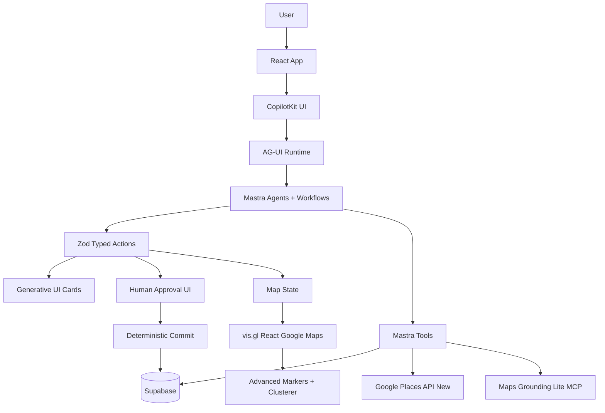

# 02 — mdeai New App Repo Strategy

## Executive summary

Build the new mdeai app with one runtime foundation: **CopilotKit `examples/integrations/mastra`**. Use the other CopilotKit, Google Maps, and event repos as component/reference sources only.

The goal is not to invent a new AI framework. The goal is to assemble a stable app from proven pieces:

- **CopilotKit** for AI UI, generative cards, shared state, and human-in-the-loop actions
- **Mastra** for agents, workflows, and tools
- **Supabase** for database, auth, RLS, audit logs, and source of truth
- **vis.gl/react-google-maps** for React Maps rendering
- **Google Maps Platform** tools for Places, Grounding Lite, clustering, and official samples
- **Hi.Events** as an event-ticketing reference, not as the foundation

Final strategy:

```text
One foundation repo
+ proven component patterns
+ minimal custom glue
+ typed contracts everywhere
```

---

## 1. Best starting repo

| Decision | Repo | Score | Why |
|---|---|---:|---|
| Primary foundation | https://github.com/CopilotKit/CopilotKit/tree/main/examples/integrations/mastra | 99/100 | Official CopilotKit + Mastra + AG-UI wiring. Closest to mdeai's desired runtime. |

Use it for:

- CopilotKit provider setup
- runtime endpoint pattern
- Mastra agent connection
- action rendering pattern
- AG-UI stream pattern

Do not use it as the complete product. Use it as the **engine skeleton**.

---

## 2. Top repo/example strategy

| Rank | Repo / example | Category | Score | Features | mdeai use case | How to use |
|---:|---|---|---:|---|---|---|
| 1 | https://github.com/CopilotKit/CopilotKit/tree/main/examples/integrations/mastra | AI runtime | 99 | CopilotKit + Mastra + AG-UI | Main AI runtime | **Foundation** |
| 2 | https://github.com/CopilotKit/CopilotKit/tree/main/examples/v2/react-router | React Router/Vite pattern | 96 | Route integration | New `/app/*` or `/v2/*` routing | Component reference |
| 3 | https://github.com/CopilotKit/CopilotKit/tree/main/examples/canvas/mastra | Generative UI | 96 | Shared state, cards, agent UI | Rental cards, event cards, map cards | Copy patterns |
| 4 | https://github.com/CopilotKit/CopilotKit/tree/main/examples/canvas/mastra-pm | Planning/workflow UI | 95 | Multi-step project planning | Host event setup wizard | Reference |
| 5 | https://github.com/visgl/react-google-maps | Maps React foundation | 96 | React maps, markers, lifecycle | Main map system | Install/use |
| 6 | https://github.com/googlemaps/js-api-samples | Official Maps samples | 95 | Advanced markers, Places, InfoWindows | Implementation examples | Reference/cite |
| 7 | https://github.com/googlemaps/js-markerclusterer | Clustering | 94 | Official marker clustering | Dense rental/event pins | Install/use |
| 8 | https://github.com/googlemaps-samples/grounding-lite-mcp-sample-app | Grounding Lite | 93 | MCP spatial grounding | Nearby cafés, venues, routes | Port patterns |
| 9 | https://github.com/googlemaps/platform-ai | Maps AI dev tooling | 92 | Code Assist MCP | Maps docs grounding during dev | Dev-time only |
| 10 | https://github.com/googlemaps/extended-component-library | Maps UI components | 90 | Place UI, overlays | Mobile map sheets, place panels | Later component source |
| 11 | https://github.com/CopilotKit/CopilotKit/tree/main/examples/showcases/banking | HITL/approvals | 91 | Confirm/approve workflows | Publish event, approve sponsor outreach | Reference |
| 12 | https://github.com/CopilotKit/CopilotKit/tree/main/examples/canvas/gemini | Gemini UI pattern | 90 | Gemini + canvas | Google AI + Maps UX | Reference |
| 13 | https://github.com/CopilotKit/CopilotKit/tree/main/examples/integrations/mcp-apps | MCP Apps | 89 | Interactive MCP apps | Venue picker, travel planner | Post-MVP |
| 14 | https://github.com/CopilotKit/OpenGenerativeUI | Generative UI concepts | 88 | AI-generated interfaces | UI design language | Reference |
| 15 | https://github.com/CopilotKit/with-agent-spec | Agent protocol | 82 | Agent interoperability | Future external agents | Defer |
| 16 | https://github.com/HiEventsDev/hi.events | Events/ticketing | 86 | Event management, ticketing, check-in | Event module reference | Reference only |
| 17 | https://github.com/google-gemini/cookbook | Gemini examples | 84 | Gemini patterns | Model/tool examples | Reference |
| 18 | https://github.com/contextablemark/clawg-ui | OpenClaw AG-UI bridge | 78 | OpenClaw via AG-UI | Future `/admin/ops` | Advanced only |
| 19 | https://github.com/kcchien/clawpilot | OpenClaw operations | 74 | OpenClaw security skill | Ops hardening | Advanced only |
| 20 | https://github.com/CopilotKit/CopilotKit/tree/main/examples/v1/travel | Travel UX | 73 | Travel planning UI | Medellín itinerary ideas | Legacy reference only |

---

## 3. Recommended architecture

```text
User
  ↓
React app
  ↓
CopilotKit UI
  ↓
AG-UI stream
  ↓
Mastra agents/workflows
  ↓
Typed tools with Zod schemas
  ↓
Supabase + Google Maps/Places/Grounding Lite
  ↓
Generative UI cards + vis.gl map rendering
```

### Mermaid diagram



---

## 4. What to copy/adapt

| Need | Use | Copy/adapt |
|---|---|---|
| Runtime wiring | CopilotKit Mastra integration | Provider, runtime endpoint, Mastra agent registration |
| Shared AI state | Canvas Mastra | `useCoAgent` state patterns |
| Event planning wizard | Canvas Mastra PM | Multi-step planning UI and task/project state ideas |
| Cards | Canvas Mastra + Generative UI examples | RentalCard, EventDraftCard, GroundedPlaceCard patterns |
| Approvals | Banking showcase | Confirm/approve/reject flow patterns |
| Maps | vis.gl | `APIProvider`, `Map`, `AdvancedMarker`, map lifecycle |
| Clustering | js-markerclusterer | Cluster renderer patterns |
| Places | js-api-samples | Place Details, Nearby Search, Autocomplete patterns |
| Grounding | Grounding Lite sample app | MCP transport and grounded result parsing |
| Event ticketing | Hi.Events | Ticket tiers, attendee/check-in/admin reference |

---

## 5. What not to rebuild custom

Do not custom-build these unless absolutely necessary:

| Avoid custom-building | Use instead |
|---|---|
| AI chat runtime | CopilotKit runtime |
| Custom SSE protocol | AG-UI |
| Custom cards from markdown | `useCopilotAction({ render })` |
| Custom shared frontend/agent state | `useCoAgent` |
| Custom approval modal logic | HITL / `renderAndWaitForResponse` pattern |
| Custom map lifecycle wrapper | vis.gl |
| Custom clustering | `@googlemaps/markerclusterer` |
| Custom Places docs logic | Google Maps Code Assist MCP |
| Custom event-ticketing concepts | Hi.Events as reference |

---

## 6. What custom code is still necessary

You still need custom code for mdeai-specific business logic:

| Custom code | Why it is necessary |
|---|---|
| Medellín-specific rental ranking | Your market logic is unique |
| Scam/trust scoring | Core product moat |
| Supabase schema/RLS | Your data ownership/security |
| Mastra tools for rentals/events | Domain-specific tools |
| Spanish/English UX copy | Local product requirement |
| Map pin categories | mdeai-specific UX |
| Approval commit functions | Must match your Supabase tables |
| Lead capture and CRM logic | Revenue workflow |

---

## 7. Recommended new app folder structure

```text
mdeai-app/
  src/
    app/
      chat/
      rentals/
      events/
      host/event/new/
      admin/
      api/copilotkit/

    lib/
      copilotkit/
      mastra/
      supabase/
      maps/
      grounding/
      schemas/

    components/
      ai/
      cards/
      maps/
      approvals/
      events/
      rentals/
      layout/

    agents-ui/
      concierge/
      rentals/
      events/
      host-event/

  packages/
    schemas/
    types/

  supabase/
    migrations/
    functions/

  tests/
    unit/
    e2e/
```

---

## 8. Phase roadmap

### Core MVP

Goal: prove the full stack with one real user flow.

Build:

1. CopilotKit + Mastra runtime
2. Supabase connection
3. vis.gl map
4. rental search cards
5. map pins
6. basic grounded nearby places
7. one approval flow for event publish

Recommended first user flow:

```text
User asks: apartments near coworking in Laureles
AI returns: rental cards + map pins + nearby cafés/coworking
```

### Post-MVP

Add:

- host event creation
- event ticketing flow
- richer Places data
- mobile map sheets
- saved searches
- lead capture
- simple admin panel

### Advanced

Add later:

- OpenClaw
- clawg-ui
- ClawPilot
- sponsor workflows
- browser agents
- multi-agent canvas
- full MCP apps
- WhatsApp automation

---

## 9. First 10 implementation tasks

| Order | Task | Primary repo/source | Success proof |
|---:|---|---|---|
| 1 | Bootstrap new app from CopilotKit Mastra integration | CopilotKit Mastra example | CopilotKit chat reaches Mastra agent |
| 2 | Add React Router or app routing | V2 React Router example | `/chat`, `/rentals`, `/host/event/new` load |
| 3 | Add Supabase client + auth | Supabase docs/current mde patterns | User session works |
| 4 | Add Zod schema package | Custom | Shared schemas import in frontend + Mastra |
| 5 | Add vis.gl map shell | vis.gl | Map loads with Map ID |
| 6 | Add AdvancedMarker + clusterer | js-api-samples + markerclusterer | Pins render and cluster |
| 7 | Build rental search tool + card | Canvas Mastra | AI renders rental cards |
| 8 | Add map pin sync | vis.gl + MapContext | Card results create map pins |
| 9 | Add Grounding Lite place search | Grounding Lite sample app | Nearby places appear with attribution |
| 10 | Add first HITL approval | Banking showcase | Event draft requires approve before DB write |

---

## 10. Risk table

| Risk | Severity | Mitigation |
|---|---:|---|
| Mixing too many example runtimes | High | One foundation only: CopilotKit Mastra |
| Overbuilding copilots too early | High | Start with one Concierge agent + domain tools |
| Maps double-loader bugs | High | Use one map provider path only |
| Grounding without attribution | High | Build `GroundingAttribution` early |
| Custom SSE sneaks back in | Medium | AG-UI only |
| Supabase writes by AI directly | High | AI proposes, user approves, deterministic commit |
| Hi.Events over-adoption | Medium | Reference only, do not fork as app base |
| OpenClaw too early | Medium | Advanced phase only |
| V1 CopilotKit examples used as base | Medium | Use legacy examples only for UX ideas |

---

## 11. Final verdict

Use this stack:

```text
CopilotKit Mastra example = foundation
Canvas Mastra = card/state patterns
vis.gl = Maps foundation
Google Maps samples = implementation references
Grounding Lite sample = geo AI pattern
Hi.Events = event/ticketing reference
Supabase = source of truth
Mastra = only orchestrator
```

Do not build a custom AI runtime. Do not start with OpenClaw. Do not fork Hi.Events as the base. Do not mix LangGraph, ADK, Pydantic AI, and Mastra into the same MVP.

The cleanest build path is:

```text
Start simple:
AI search → typed cards → map pins → grounded places → approval flow

Then expand:
events → tickets → admin → travel → sponsors → OpenClaw
```
