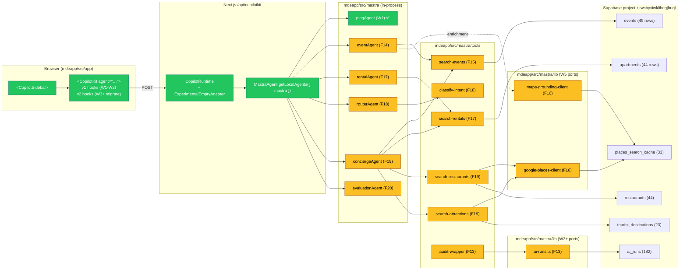
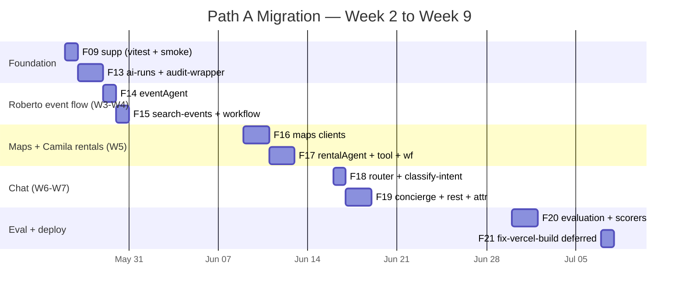
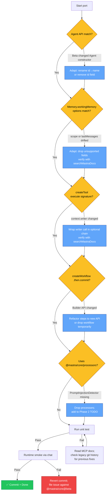
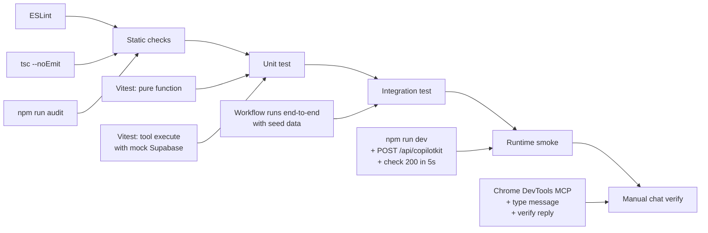
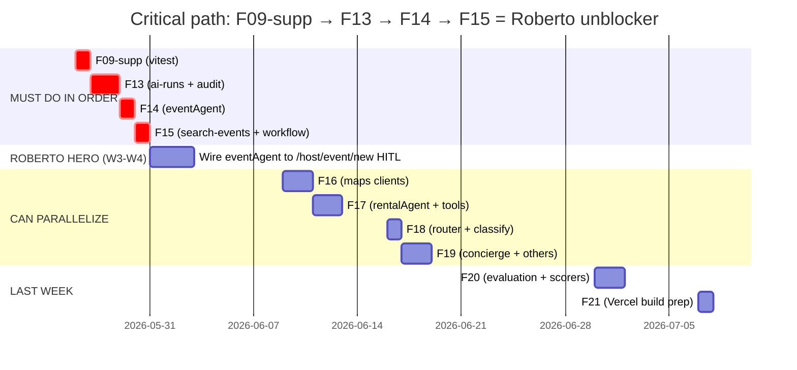

# 05 — Path A Copy + Adapt Migration Plan

> **TL;DR.** `my-mastra-app` has **5 production-ready mdeai agents, 5 search tools, 3 workflows, observability lib, Maps Grounding-Lite client, Vitest tests, Vercel deploy scripts** — built on Mastra `@1.32.1`. mdeapp runs Mastra `beta` (from the CopilotKit starter). We **port file-by-file** with verification — not blind paste. **F13-F20 = 8 ports over W2-W9** saving ~28-32h of from-scratch authoring. Each task has explicit MCP/docs checks, API-risk notes, tests, and rollback. **Net philosophy: reuse backend intelligence, replace frontend AI glue with CopilotKit.**

---

## 1. Executive summary

| Item | Value |
|---|---|
| Total files identified for port | **23** (across 8 tasks) |
| Files to skip (demos / not-needed) | **6** (weather-agent, weather-tool, weather-workflow, weather-scorer, ping demo, duckdb/editor deps) |
| Estimated effort saved | **~28-32 hours** of agent-authoring + Maps client work |
| Estimated porting effort | **~20-24 hours** spread W2-W9 |
| Mastra version delta | `my-mastra-app` `@mastra/core@1.32.1` ↔ `mdeapp` `@mastra/core@beta` |
| Top risk | Beta API drift on Agent / Memory / Workflow / processors (mitigated by per-file MCP verification) |
| Test requirement | Each port has ≥1 Vitest unit test + lint + tsc + 1 runtime smoke through chat |
| Rollback | Every port is a single git commit; revert + redeploy = ~5 min |

---

## 2. Why Path A beats full rewrite

| Lens | Full rewrite | Path A — Copy + adapt | Winner |
|---|---|---|---|
| Time to first Roberto event flow (W3) | 5-7 days | 2-3 days | **A** |
| Risk of new bugs | High (every line is new) | Low (proven logic; adapt only API surfaces) | **A** |
| Test debt | Start from 0 | Inherit 6 Vitest tests + smoke scripts | **A** |
| Mastra learning curve | Re-discover patterns | Validated patterns ready | **A** |
| Codebase coherence | Clean room | Bears some 1.32 stable idioms | rewrite (minor) |
| Maintenance | One generation | Mix of carry-over + new | rewrite (minor) |
| **Net (weighted for solo-founder W3-W10)** | | | **A** |

Path A is reversible: any file ported can be replaced with a clean-room rewrite later if patterns prove wrong. Reverse is harder (rewrites are sunk cost).

---

## 3. Architecture



---

## 4. Source → target file mapping (all 23 ports)

### W2 — testing foundation

| Task | Source file | Target file | Purpose | MCP/doc checks | API risks | Test proof | Decision |
|---|---|---|---|---|---|---|---|
| F09 supp | `my-mastra-app/vitest.config.ts` | `mdeapp/vitest.config.ts` | One green test | `mcp__mastra__searchMastraDocs("vitest")` | Vite vs Next-bundler difference | `npm run test` prints 1 passed | **PORT** |
| F09 supp | `my-mastra-app/scripts/mastra-smoke.sh` | `mdeapp/scripts/mastra-smoke.sh` (adapt) | Boot smoke | none | env var names changed | `bash scripts/mastra-smoke.sh` exits 0 | **PORT** |
| F09 supp | `my-mastra-app/scripts/verify-env-security.mjs` | `mdeapp/scripts/verify-env-security.mjs` | Pre-deploy env sanity | none | path constants drift | exits 0 with current `.env.local` | **PORT** |

### W3 — Roberto event flow + observability + workspace

| Task | Source | Target | Purpose | MCP/doc checks | API risks | Test proof | Decision |
|---|---|---|---|---|---|---|---|
| **F13** | `lib/ai-runs.ts` | `mdeapp/src/mastra/lib/ai-runs.ts` | Log every agent run to `ai_runs` | Supabase MCP confirm `ai_runs` schema | uses `SUPABASE_SERVICE_ROLE_KEY` → triggers `no-service-role-in-src.mjs` hook (carve-out needed) | unit test writes a row | **PORT + adapt** |
| F13 | `tools/audit-wrapper.ts` + `tools/risk-levels.ts` | `mdeapp/src/mastra/tools/{audit-wrapper,risk-levels}.ts` | Pre/post audit log per tool call | none (pure TS) | none | wraps test tool; console.info lines | **PORT verbatim** |
| **F13b** | `workspace/skills/{mde-prompt-qa,mde-rental-quality,mde-safe-actions,mde-event-review,mde-followup-logic}/SKILL.md` (5 files) | `mdeapp/workspace/skills/<each>/SKILL.md` | mdeai-specific runtime governance skills | beta `@mastra/core/workspace` ✅ in node_modules | Workspace/LocalFilesystem/WORKSPACE_TOOLS constructor shape — verify via `workspace.d.ts` | 3 unit tests: 5 files + mutations disabled | **PORT verbatim** |
| F13b | `src/mastra/workspaces.ts` (config) | `mdeapp/src/mastra/workspaces.ts` + register in `Mastra({ workspace })` | Workspace config: read-only filesystem + 5 disabled mutation tools | same | same + `Mastra({ workspace })` constructor option — verify | mastra ready w/ workspace=true | **PORT + verify** |
| **F14** | `agents/event-agent.ts` | `mdeapp/src/mastra/agents/event-agent.ts` | `eventAgent` — events specialist | `mcp__mastra__getMastraExports("@mastra/core/agent")` ; verify `Memory` opts shape | `Memory({ options: { workingMemory, lastMessages } })` may differ in beta — verify `lastMessages: 20` is still supported | unit: agent loads, `agent.id === "event-agent"` | **PORT + adapt model import** |
| F14 | `lib/models.ts` (subset) | `mdeapp/src/mastra/lib/models.ts` | `REASONING_MODEL` etc. constants | none (Gemini SDK) | source uses unknown LLM aliases — **rewrite to `google("gemini-3.5-flash")`** | unit: imports return defined model object | **REWRITE** (not literal copy) |
| **F15** | `tools/search-events.ts` | `mdeapp/src/mastra/tools/search-events.ts` | Supabase events query + Bogota TZ helpers | Supabase MCP `execute_sql` confirm columns (`name`, `event_type`, `event_start_time`, `ticket_price_min`, `latitude`, `longitude`, `maps_url`) | `context?.writer?.custom(...)` AG-UI stream call — verify shape in beta `@ag-ui/mastra` | unit: stubbed query returns 3 cards; e2e smoke: agent runs end-to-end | **PORT + verify AG-UI writer** |
| F15 | `workflows/event-discovery-workflow.ts` | `mdeapp/src/mastra/workflows/event-discovery-workflow.ts` | Search + format-cards 2-step | `mcp__copilotkit__search-docs("Mastra workflow createWorkflow createStep")` | `createStep, createWorkflow` from `@mastra/core/workflows` — verify beta still uses `.then().commit()` API | unit: workflow runs with mock input → returns cards | **PORT + verify workflow API** |

### W5 — Maps + Camila rentals

| Task | Source | Target | Purpose | MCP/doc checks | API risks | Test proof | Decision |
|---|---|---|---|---|---|---|---|
| **F16** | `lib/google-places-client.ts` + `.test.ts` | `mdeapp/src/mastra/lib/google-places-client.ts` + `.test.ts` | Places SDK wrapper | `google-maps-code-assist` MCP (if available) ; `mcp__copilotkit__search-docs("X-Goog-FieldMask")` | uses `@googlemaps/places@2.4.1` — add to deps | unit: stubbed SDK call returns 1 place | **PORT** |
| F16 | `lib/maps-grounding-client.ts` | `mdeapp/src/mastra/lib/maps-grounding-client.ts` | Grounding Lite via MCPClient + circuit breaker + retries | `mcp__mastra__searchMastraDocs("@mastra/mcp MCPClient")` | uses `@mastra/mcp@1.7.0` — beta version may differ; verify `MCPClient` constructor shape | unit: breaker opens after N failures | **PORT + verify MCPClient** |
| F16 | `lib/allowedGroundingTools.ts` | `mdeapp/src/mastra/lib/allowedGroundingTools.ts` | Tool whitelist + limits | none | none | unit: filter returns whitelisted tools only | **PORT verbatim** |
| **F17** | `agents/rental-agent.ts` | `mdeapp/src/mastra/agents/rental-agent.ts` | `rentalAgent` — rental specialist | same as F14 | same as F14 + verify `lastMessages: 20` | unit: agent loads; instructions ≥ 1KB | **PORT + adapt model** |
| F17 | `tools/search-rentals.ts` | `mdeapp/src/mastra/tools/search-rentals.ts` | Supabase apartments query | Supabase MCP `list_tables` confirm `apartments` columns | similar to F15: AG-UI writer call | unit: returns ≥ 1 apartment when seed data present | **PORT + verify writer** |
| F17 | `workflows/rental-search-workflow.ts` | `mdeapp/src/mastra/workflows/rental-search-workflow.ts` | Workflow wrapper | same as F15 | same as F15 | unit: workflow runs end-to-end | **PORT + verify workflow API** |

### W6 — Chat + concierge + router

| Task | Source | Target | Purpose | MCP/doc checks | API risks | Test proof | Decision |
|---|---|---|---|---|---|---|---|
| **F18** | `agents/router.ts` | `mdeapp/src/mastra/agents/router.ts` | `routerAgent` — intent dispatcher | `mcp__mastra__searchMastraDocs("Agent workflows option constructor")` | uses `new Agent({ workflows: { … } })` — **verify beta supports `workflows` constructor option** (may have moved) | unit: agent loads, can list workflows | **PORT + verify** |
| F18 | `tools/classify-intent.ts` | `mdeapp/src/mastra/tools/classify-intent.ts` | Intent classifier (LLM-based) | none | uses `createTool` shape — already verified compatible | unit: classifies "show me apartments" → rental_search | **PORT** |
| F18 | `types/intents.ts` | `mdeapp/src/mastra/types/intents.ts` | Intent enum + types | none | none | tsc passes | **PORT verbatim** |
| **F19** | `agents/concierge.ts` | `mdeapp/src/mastra/agents/concierge.ts` | `conciergeAgent` — multi-tool router | `mcp__mastra__getMastraExports("@mastra/core/processors")` | uses `PromptInjectionDetector`, `TokenLimiter` from `@mastra/core/processors` — **verify available in beta**; if not, drop or polyfill | unit: agent loads with processors | **PORT + verify processors** |
| F19 | `tools/search-restaurants.ts` + tests | `mdeapp/src/mastra/tools/search-restaurants.ts` + tests | Supabase restaurants query | Supabase MCP confirm `restaurants` columns | similar to F15 | unit: returns ≥ 1 restaurant | **PORT** |
| F19 | `tools/search-attractions.ts` + tests | `mdeapp/src/mastra/tools/search-attractions.ts` + tests | Supabase tourist_destinations query | Supabase MCP confirm columns | similar | unit: returns ≥ 1 attraction | **PORT** |
| F19 | `workflows/concierge-routing-workflow.ts` | `mdeapp/src/mastra/workflows/concierge-routing-workflow.ts` | Multi-step routing | same as F15 | same as F15 | unit: workflow dispatches correctly | **PORT + verify workflow API** |
| F19 | `types/tool-context.ts`, `types/workflow-state.ts` | mirror | Shared types | none | none | tsc passes | **PORT verbatim** |

### W8 — Evaluation + observability hardening

| Task | Source | Target | Purpose | MCP/doc checks | API risks | Test proof | Decision |
|---|---|---|---|---|---|---|---|
| **F20** | `agents/evaluation.ts` | `mdeapp/src/mastra/agents/evaluation.ts` | `evaluationAgent` — scoring helper | `mcp__mastra__searchMastraDocs("@mastra/evals scorer")` | uses `@mastra/evals@1.2.2` — verify beta has equivalent | unit: scorer returns 0..1 | **PORT + verify @mastra/evals** |
| F20 | `scorers/weather-scorer.ts` (PATTERN) | `mdeapp/src/mastra/scorers/index.ts` (new mdeai scorers) | Pattern reference — NOT literal copy | same as above | scorer naming convention | unit: 3 scorers exported (tool-call-appropriateness, completeness, translation) | **REFERENCE — write fresh** |
| F20 | `lib/ai-runs.ts` (further hardening) | extend existing F13 port | Add P95 rollup query support | none | none | unit: `ai_runs` rollup returns mock P95 | **EXTEND** |

### W9 — Deployment

| Task | Source | Target | Purpose | MCP/doc checks | API risks | Test proof | Decision |
|---|---|---|---|---|---|---|---|
| **F21** | `scripts/fix-vercel-build.cjs` | `mdeapp/scripts/fix-vercel-build.cjs` | Vercel build glitch fix for Mastra bundle | `mcp__copilotkit__search-docs("Vercel deploy Mastra build externals")` | only needed if `mastra build` is run; we use `next build` — **probably skip** | `vercel deploy --prod` succeeds in preview | **DEFER — reference only** |
| F21 | `@mastra/deployer-vercel` reference | (not installed) | Pattern reference | n/a | n/a | n/a | **REFERENCE — not installed** |

---

## 5. Files to skip (do NOT port)

| File | Why skip |
|---|---|
| `agents/weather-agent.ts` | Demo only (mdeapp has no weather use case) |
| `agents/ping.ts` | mdeapp already has its own `pingAgent` (F02) |
| `tools/weather-tool.ts` | Demo |
| `workflows/weather-workflow.ts` | Demo |
| `scorers/weather-scorer.ts` (literal copy) | Use as **pattern reference** only — rewrite for mdeai-specific scorers |
| `tools/registry.ts`, `tools/index.ts` | Tool registry pattern — adopt only if needed (mdeapp uses direct imports per upstream starter) |
| `agents/scripts/*.sh` | Duplicate of `scripts/*.sh` at app root |
| `public/health.ts` (legacy health endpoint) | mdeapp uses Next.js API routes for health — skip |
| `.mastra/output/*` | Build artifacts |
| `node_modules/` | Obviously |
| `workspace/` | Mastra workspace concept — verify if needed; defer |

---

## 6. F13-F20 task order + dependency chain



Dependency rules:
- **F13 before F14** (eventAgent uses audit-wrapper)
- **F14 before F15** (workflow imports search-events helper)
- **F16 before F17** (rentalAgent + searchRentals may use maps client for enrichment)
- **F18 before F19** (concierge uses routing patterns; classify-intent foundation)
- **F20 last** (depends on all agents existing for end-to-end eval)

Critical path: **F13 → F14 → F15** is the W3 Roberto unblocker.

---

## 7. Required CopilotKit / Mastra / MCP checks per task

Every port runs the **Skill → MCP → Code** cadence per CLAUDE.md.

### Universal pre-port checklist (run before EVERY task)

| # | Check | Tool | Block if |
|---|---|---|---|
| 1 | Confirm legacy file exists at expected path | `Read /home/sk/mde/my-mastra-app/<path>` | not found |
| 2 | Confirm current Mastra Agent API supports the constructor options we need | `mcp__mastra__getMastraExports({ package: "@mastra/core" })` + `getMastraExportDetails` for `Agent` | API drift detected |
| 3 | If file uses Mastra Memory, confirm `workingMemory.scope: "thread"` still valid | `mcp__mastra__searchMastraDocs("workingMemory scope thread resource")` | option renamed |
| 4 | If file uses `createTool`, confirm `inputSchema` / `outputSchema` shape | `mcp__mastra__searchMastraDocs("createTool inputSchema outputSchema execute context")` | execute signature changed |
| 5 | If file uses `createWorkflow`, confirm `.then().commit()` builder pattern | `mcp__mastra__searchMastraDocs("createWorkflow createStep then commit")` | builder pattern changed |
| 6 | If file uses Supabase, confirm target table + columns | `mcp__supabase__list_tables` + `execute_sql "SELECT column_name … FROM information_schema.columns"` | column drift |
| 7 | If file uses AG-UI `context.writer.custom`, confirm shape in beta | `mcp__copilotkit__search-ag-ui-docs("writer custom event")` | event format changed |
| 8 | Confirm no service-role key leaks into `mdeapp/src/**` | `mcp__supabase__get_publishable_keys` (use anon); hook `no-service-role-in-src.mjs` lint | violation |

### Task-specific checks

| Task | Extra checks |
|---|---|
| F13 (ai-runs) | RLS policy on `public.ai_runs` allows service-role inserts (`mcp__supabase__execute_sql "SELECT polname FROM pg_policies WHERE tablename='ai_runs'"`) |
| F14 (eventAgent) | Verify `gemini-3.5-flash` available in `@ai-sdk/google` (CLAUDE.md Gemini registry) |
| F15 (search-events) | Confirm `events` table has `is_active`, `status='published'`, `event_start_time`, `event_type` columns |
| F16 (maps clients) | Confirm `places_search_cache` + `place_details_cache` schemas via `mcp__supabase__list_tables` |
| F18 (router) | Verify `Agent({ workflows })` constructor option in beta — if removed, refactor router to dispatch via `routerAgent.tools` |
| F19 (concierge) | Verify `@mastra/core/processors` exists in beta (`PromptInjectionDetector`, `TokenLimiter`) |
| F20 (evaluation) | Verify `@mastra/evals` package + scorer API in beta (if missing, defer to Phase 2) |
| F21 (Vercel) | Only required if migrating to `mastra build` — confirm via `mcp__copilotkit__search-docs("mastra build deploy externals")` |

---

## 8. API compatibility risks



### Top 8 risks ranked

| # | Risk | Likelihood | Impact | Mitigation |
|---|---|---|---|---|
| 1 | `new Agent({ workflows: { … } })` constructor option dropped in beta | Medium | Blocks F18 router | Refactor to dispatch via tools array; document in F18 spec |
| 2 | `@mastra/core/processors` (PromptInjectionDetector, TokenLimiter) absent in beta | Medium | Blocks F19 concierge | Drop processors; add Phase 2 follow-up |
| 3 | `Memory({ options: { lastMessages: 20 } })` field renamed | Low | Loses recent-window control | Verify; if renamed, use new name; if dropped, accept default |
| 4 | `createWorkflow().then().commit()` builder API changed | Medium | Blocks F15, F17, F19 | Verify via Mastra MCP; if changed, refactor to new builder |
| 5 | `context?.writer?.custom()` AG-UI event shape changed in beta `@ag-ui/mastra` | Medium | Tool calls fire but cards don't render | Verify via AG-UI MCP; fall back to plain text reply |
| 6 | `@mastra/mcp@1.7.0` MCPClient signature changed in beta | Low-medium | Blocks F16 grounding | Verify via Mastra MCP; if changed, adapt constructor |
| 7 | Supabase `events` table column names drifted from legacy | Low | Blocks F15 | Run `execute_sql` to confirm; rename in mapper |
| 8 | `SUPABASE_SERVICE_ROLE_KEY` import triggers `no-service-role-in-src.mjs` hook | High (predictable) | Blocks F13 commit | Carve-out: update hook to allow `mdeapp/src/mastra/lib/` server-only paths OR move ai-runs.ts to `mdeapp/lib/` |

---

## 9. Testing strategy per port



### Per-task test matrix

| Task | Static | Unit | Integration | Runtime | Manual |
|---|---|---|---|---|---|
| F13 ai-runs | ✓ | mock client → row count +1 | n/a | first agent run logs row | check `ai_runs` table in Supabase |
| F14 eventAgent | ✓ | agent.id === "event-agent" | n/a | smoke via chat | type "music tonight" → 5 cards |
| F15 search-events | ✓ | mock Supabase → 3 cards | workflow returns cards | calls /api/copilotkit | type "events" → response |
| F16 maps clients | ✓ | circuit breaker opens/resets | mock MCP returns place | n/a | n/a (W5 — wait for surface) |
| F17 rentalAgent | ✓ | agent.id === "rental-agent" | workflow returns ≥1 apt | calls /api/copilotkit | type "1BR Laureles" → cards |
| F18 router | ✓ | classify "show apartments" → rental_search | workflow dispatch correct | n/a | type chitchat vs intent — different replies |
| F19 concierge | ✓ | agent loads with 4 tools | tool dispatch correct | n/a | type "salsa night" vs "1BR" — diff replies |
| F20 evaluation | ✓ | scorer returns 0..1 | rollup query returns mock data | n/a | observability dashboard |

### Acceptance bar (per task)

1. **0 lint errors** (`npm run lint` if present, else `eslint <touched files>`)
2. **0 type errors** on touched files (`tsc --noEmit` filtered to touched)
3. **`npm run audit` exit 0** (no new high-severity vulns introduced)
4. **All new Vitest tests pass** (`npm test` shows N+1 where N is pre-port count)
5. **Smoke through chat returns HTTP 200** for any new agent registered
6. **Evidence file** at `tasks/notes/F##-evidence.md` with diff summary + test output
7. **Rollback verified** (`git revert <sha>` returns app to pre-port state in <5 min)

---

## 10. Rollback strategy

```mermaid
flowchart LR
    Commit[Port committed] --> Smoke{Smoke OK?}
    Smoke -- Yes --> Done[Move on to next port]
    Smoke -- No --> Investigate{Root cause<br/>found in <30 min?}
    Investigate -- Yes --> Fix[Fix forward<br/>(adapt API, etc.)]
    Investigate -- No --> Revert[git revert HEAD]
    Revert --> Smoke2{App still works<br/>like F05?}
    Smoke2 -- Yes --> Postmortem[Postmortem +<br/>file Mastra issue<br/>+ park task]
    Smoke2 -- No --> EmergencyReset[git reset --hard<br/>to last known good]
    Fix --> Smoke
    Postmortem --> Continue[Continue with<br/>next task]

    classDef good fill:#22c55e,stroke:#0f766e,color:#fff
    classDef warn fill:#fbbf24,stroke:#92400e,color:#000
    classDef bad fill:#ef4444,stroke:#7f1d1d,color:#fff
    class Done,Continue good
    class Investigate,Revert,Postmortem warn
    class EmergencyReset bad
```

### Rollback rules

1. **Every port = one commit.** No "WIP" branches with partial F-tasks.
2. **F05 baseline is the contract.** If a port breaks the W1 "hi" echo, revert immediately.
3. **Time budget for fix-forward: 30 min.** If not fixed in 30 min, revert.
4. **No cascading reverts.** If F14 fails, revert F14 only; F13 stays.
5. **Postmortem template:** `tasks/notes/F##-rollback.md` — captures (a) symptom, (b) Mastra docs link checked, (c) what we'd try differently.

### Pre-commit checklist

- [ ] `npm run build` exits 0
- [ ] `npm test` shows N+1 pass
- [ ] Chat smoke returns 200
- [ ] No new hook violations (`node .claude/hooks/scan-secrets.mjs < /dev/null` and friends)
- [ ] Evidence file written

---

## 11. Final recommended implementation order



### Recommended weekly cadence

| Week | Focus | Tasks | Done means |
|---|---|---|---|
| W2 | Test foundation + observability | F09-supp, F13 | First Vitest green; first `ai_runs` row written |
| W3 | Roberto unlock | F14, F15 | `hostEventAgent` returns 5 events from Supabase |
| W4 | Roberto HITL surface | (PRD §51 task 14) | Roberto creates event in ≤30s via AI form-fill |
| W5 | Maps + rentals | F16, F17 | Camila gets pin map + rental cards |
| W6 | Chat / multi-intent | F18, F19 | Chat correctly routes rental vs event vs concierge |
| W7 | Polish + bundle | n/a | Bundle ≤80KB on /chat (PRD goal 5) |
| W8 | Eval + observability | F20 | mastra_ai_spans rollup + Sentry |
| W9 | Stripe + deploy prep | F21 | First ticket sold |
| W10 | Cutover | (PRD §51 task 20) | DNS cut to mdeai.co |

### Final pre-implementation gate (before F13)

- [ ] F06 (git + GitHub + Vercel preview) is **Done** — gives us a baseline commit history
- [ ] `.claude/hooks/no-service-role-in-src.mjs` has a carve-out for `mdeapp/src/mastra/lib/` (server-only)
- [ ] `mcp__mastra__getMastraExports` is queryable (load via ToolSearch next session)
- [ ] `mcp__supabase__execute_sql` is queryable (already verified)
- [ ] One green Vitest test exists in mdeapp (F09-supp first)

---

## 12. Answer to the final question

> **What exactly should we copy, adapt, ignore, and how do we verify each step?**

| Lens | Concrete answer |
|---|---|
| **COPY (verbatim)** | `audit-wrapper.ts`, `risk-levels.ts`, `allowedGroundingTools.ts`, `types/intents.ts`, `types/tool-context.ts`, `types/workflow-state.ts`, `vitest.config.ts`. These are pure-TS with no Mastra runtime API surface. |
| **PORT + ADAPT** | All 5 agents (`event-agent`, `rental-agent`, `router`, `concierge`, `evaluation`). All 5 tools (`search-events`, `search-rentals`, `search-restaurants`, `search-attractions`, `classify-intent`). All 3 workflows. `ai-runs.ts` (with hook carve-out). `google-places-client`. `maps-grounding-client`. |
| **REWRITE (don't copy)** | `lib/models.ts` — legacy uses OpenAI/unknown aliases; rewrite for Gemini-only per CLAUDE.md. `scorers/*` — use as pattern reference only; write fresh mdeai scorers. |
| **IGNORE** | All `weather-*` files. `agents/ping.ts` (mdeapp has its own). `tools/registry.ts` + `tools/index.ts` (we use direct imports per upstream starter). `public/health.ts`. `agents/scripts/` (dup of root scripts). `workspace/`. `.mastra/output/`. |
| **VERIFY via** | (1) `mcp__mastra__searchMastraDocs` / `getMastraExports` for every Mastra API call; (2) `mcp__copilotkit__search-docs` for AG-UI primitives; (3) `mcp__supabase__execute_sql` for every table/column; (4) Unit test before commit; (5) Chat smoke through chrome-devtools MCP |

---

## 13. Net constraints (re-stated for emphasis)

- ✅ **One runtime foundation:** CopilotKit + Mastra inside `mdeapp` (Pattern 1, not Pattern 2 separate-server)
- ✅ **Reuse backend intelligence; replace frontend AI glue** with CopilotKit primitives
- ✅ **Supabase remains source of truth** — agents never invent data
- ✅ **Maps remain deterministic renderer** — agents propose pins; `setPins` writer is single-source (RUNTIME-008)
- ✅ **AI proposes; user approves; system commits** — every revenue/state change goes through HITL (ApprovalPanel)
- ✅ **No service role key in mdeapp/src/** — except for explicit server-only paths under `mdeapp/src/mastra/lib/` (carve-out documented in F13)
- ✅ **No custom code if a proven CopilotKit/Mastra pattern exists** — `useCopilotAction` over hand-rolled SSE; `Memory` over custom session store
- ✅ **Every port must pass:** lint + build + tests + one runtime smoke
- ✅ **Be strict, practical, production-focused** — defer features not in the W1-W10 Phase 1 scope

---

## 14. Out-of-band followups (not in F13-F21)

| Topic | Where | When |
|---|---|---|
| `no-service-role-in-src.mjs` carve-out for `mdeapp/src/mastra/lib/` | `.claude/hooks/no-service-role-in-src.mjs` | Before F13 |
| Document carve-out + rationale in CLAUDE.md | `CLAUDE.md` "Hard rules" section | Before F13 |
| Verify `lastMessages` field in `Memory({ options })` is still valid in beta | `mcp__mastra__searchMastraDocs` | F14 prep |
| Verify `Agent({ workflows })` constructor option in beta | `mcp__mastra__getMastraExports("@mastra/core")` | F18 prep |
| Verify `@mastra/core/processors` exists in beta | `mcp__mastra__listMastraPackages` | F19 prep |
| Verify `@mastra/evals` package + scorer API in beta | `mcp__mastra__searchMastraDocs("@mastra/evals")` | F20 prep |

---

*Generated 2026-05-20 cross-referencing live legacy `my-mastra-app/` (10 files read), current `mdeapp/` state, CopilotKit MCP + Mastra MCP + Supabase MCP, and the 5 paired audits.*
