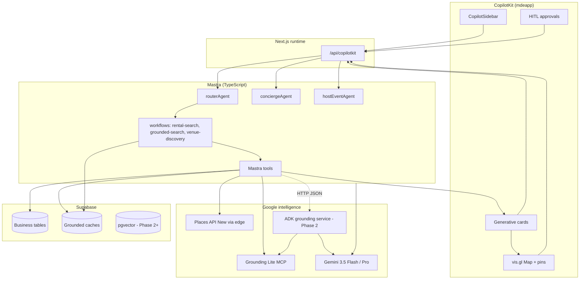

# mdeai — Google ADK + Grounding PRD

> **North star:** **Mastra** owns product orchestration. **CopilotKit** owns chat, cards, map pins, and HITL. **Supabase** owns inventory, bookings, leads, and cache. **Google ADK** (Phase 2+) becomes the **Google-native grounding specialist** — Search + Maps + Gemini tool orchestration — **not** a second product brain.

**Personas:** **Camila** (rentals + `/`), **Roberto** (events + `/host/event/new`), **Tourist** (restaurants/attractions), **Patricia** (quota, audit), **MDE Community** partners (promotion + WhatsApp later).

**OpenClaw + full-stack master plan:** [`plan/openclaw/01-openclaw-adk.md`](../openclaw/01-openclaw-adk.md).

**Execution roadmap:** [`adk-roadmap.md`](./adk-roadmap.md) (steps + repos) · **Unified architecture:** [`maps-adk-prd.md`](./maps-adk-prd.md) · **Tasks:** [`tasks/maps/INDEX.md`](../../tasks/maps/INDEX.md).

**Canonical unified architecture (Maps + ADK + Gemini):** [`maps-adk-prd.md`](./maps-adk-prd.md) — **read this first** for layer model, routing, and MVP ADK sidecar (MAP-002).

**Relationship to Maps PRD:** [`plan/maps/maps-prd.md`](../maps/maps-prd.md) — feature depth + CopilotKit §6. **Execution:** [`tasks/maps/INDEX.md`](../../tasks/maps/INDEX.md).

> **Note (2026-05-20):** §1 “Phase 1 skips ADK in prod” is **superseded** by [`maps-adk-prd.md`](./maps-adk-prd.md) — MVP ships ADK via **MAP-002**; Search Grounding remains Phase 2.

---

## Document map

| § | Topic |
|---|--------|
| 1 | Executive summary |
| 2 | Resource review table |
| 3 | Recommended architecture |
| 4 | Google ADK role |
| 5 | Mastra role |
| 6 | CopilotKit role |
| 7 | Supabase data plan |
| 8 | Real estate use cases |
| 9 | Events use cases |
| 10 | Restaurants / local business |
| 11 | MDE Community partnership |
| 12 | ADK Skills plan |
| 13 | Agents CLI plan |
| 14 | OpenClaw / Postiz / WhatsApp |
| 15 | Testing and quality |
| 16 | Implementation roadmap |
| 17 | Final recommendation |
| 18 | Official ADK docs — Cursor reading guide |

---

## 1. Executive summary

### Should mdeai use Google ADK?

**Yes — as a bounded grounding microservice, not as the main app orchestrator.** Score: **88/100** fit for mdeai; **defer production ADK runtime until MAP MVP proves pins + attribution on Mastra-only path.**

| Question | Answer |
|----------|--------|
| Use ADK? | **Yes** for combined Search + Maps grounding, eval harness, and reusable Google tool recipes |
| Replace Mastra? | **No** — hard rule |
| Replace CopilotKit? | **No** |
| Replace Supabase writes? | **No** — ADK returns JSON only; Mastra persists |
| Better than Search alone? | **Yes** — Maps grounding adds spatial truth; Search adds live facts; Supabase adds inventory |
| What ADK adds | Multi-tool Google orchestration, official `GoogleMapsGroundingTool` / `GoogleSearchTool`, Skills for dev quality, `agents-cli eval` |
| What not to overbuild | Dual orchestrators, ADK in browser, ADK payments/bookings, 8-agent EventForge clone, full itinerary engine in MVP |

### Phased truth (honest)

```text
Phase 1 (now):  CopilotKit → Mastra → Grounding Lite MCP + Places (New) → Supabase → UI
Phase 2:        CopilotKit → Mastra → ADK grounding HTTP service → Google tools → cache → UI
Phase 3:        + pgvector memory, OpenClaw enrichment, WhatsApp/Postiz automation
```

**Why Phase 1 skips ADK in prod:** `mdeapp` is TypeScript-first; MAP-002 already specifies Mastra → `mapstools.googleapis.com/mcp`. Adding Python ADK + second deploy surface before Camila sees pins is **scope creep** with **low marginal value** until combined Search+Maps flows exceed one MCP call.

---

## 2. Resource review table

Consolidated from `plan/ADK/01–10` + [`maps-prd.md`](../maps/maps-prd.md) §2. Scores are **mdeai reuse value**, not generic quality.

| Resource | Type | Main features | Best mdeai use case | Reuse | Risk | Score |
|----------|------|---------------|---------------------|-------|------|------:|
| [grounding-lite-mcp-sample-app](https://github.com/googlemaps-samples/grounding-lite-mcp-sample-app) | Official sample | MCP `search_places`, `compute_routes`, Gemini | MAP-002 Mastra tool | **Ship Phase 1** | Quota 100 QPM `search_places` | **99** |
| [Greyisheep/ag-ui-adk-grounding-app](https://github.com/Greyisheep/ag-ui-adk-grounding-app) · `github/copilotkit/ag-ui-adk-grounding-app` | Reference app | ADK + CopilotKit + AG-UI; Search/Maps sub-agents | Generative UI + tool patterns | **Reference only** | Python ADK, no map panel, not Mastra | **82** |
| [google/adk-samples](https://github.com/google/adk-samples) | Official | Multi-agent, deployment, evals | ADK service templates | Clone patterns | Version drift | **98** |
| [google/adk-python](https://github.com/google/adk-python) | SDK | Core ADK framework | `services/adk-grounding/` | Install in service | Python ops | **97** |
| [google/agents-cli](https://github.com/google/agents-cli) | CLI | scaffold, eval, deploy | Dev/test ADK service | CI eval job | Not for `mdeapp` TS | **94** |
| [adk.dev/skills](https://adk.dev/skills/) | Docs | Progressive disclosure skills | ADK repo + Cursor dev | Skills in ADK service | Confusion with Claude skills | **94** |
| [Maps Grounding codelab (Next '26)](https://codelabs.developers.google.com/next26/maps-grounding) | Codelab | Itineraries, place reasoning | Tourist concierge design | Read before Phase 2 | — | **98** |
| [GCP architecture — agentic AI + Maps](https://docs.cloud.google.com/architecture/agentic-ai-system-with-grounding-using-maps) | Architecture | Enterprise grounding patterns | ADK service design | Align security | Over-engineering | **96** |
| [ggalloro/cicerone](https://github.com/ggalloro/cicerone) | Travel ADK | Maps grounding itinerary | Tourist Phase 2+ | Prompt/tool ideas | Not Medellín-specific | **88** |
| [Neutrollized/adk-examples/06_improved_travel_rec_agent](https://github.com/Neutrollized/adk-examples/tree/main/06_improved_travel_rec_agent) | Example | Nearby rec, Maps MCP | Nearby enrichment | MCP tool shapes | Distance bugs noted in repo | **90** |
| [GoogleCloudPlatform/agent-starter-pack](https://github.com/GoogleCloudPlatform/agent-starter-pack) | Templates | Cloud Run / Vertex deploy | ADK service hosting | Phase 2 deploy | GCP cost | **92** |
| [adk-mcp-bigquery-maps codelab](https://codelabs.developers.google.com/adk-mcp-bigquery-maps) | Codelab | MCP + ADK + analytics | Patricia dashboards later | Phase 3 | — | **85** |
| [vis.gl/react-google-maps](https://github.com/visgl/react-google-maps) | React lib | Map, AdvancedMarker | **mdeapp UI** (MAP-001) | npm install | — | **98** |
| [CopilotKit/examples/integrations/mastra](https://github.com/CopilotKit/CopilotKit/tree/main/examples/integrations/mastra) | Example | Mastra + CK runtime | **mdeapp** base | Copy wiring | — | **99** |
| [CopilotKit/examples/canvas/mastra](https://github.com/CopilotKit/CopilotKit/tree/main/examples/canvas/mastra) | Example | Co-agent canvas state | MAP-001 / F48 | Copy schemas | — | **96** |
| [mcp-agent-tool-adapter](https://github.com/serkanyasr/mcp-agent-tool-adapter) | Bridge | MCP → ADK tools | Wrap Grounding Lite in ADK | Phase 2 | Maintenance | **85** |
| [tsubasakong/awesome-google-adk](https://github.com/tsubasakong/awesome-google-adk) | Index | Curated links | Discovery | Bookmark | Stale links | **80** |
| [nomadbarrio.com](https://nomadbarrio.com/) | Product | Rentals, host, sell | Business model reference | Positioning | — | **75** |
| [mdecommunity.com](https://www.mdecommunity.com/) | Community | Event promotion | Partnership §11 | Integration API TBD | — | **78** |
| [Codecademy ADK travel](https://www.codecademy.com/article/build-an-ai-travel-assistant-with-google-agent-development-kit-adk) | Tutorial | Specialist agents | Training material | Concepts only | Travel ≠ Medellín ops | **83** |
| [dev.to ADK Search/Maps series](https://dev.to/greyisheepai/building-ai-agents-with-google-search-grounding-and-adk-part-15-1n4m) | Article | Grounding flows | ADK service design | Read | — | **78** |

### Recommended GitHub clones (vendored under `github/`)

| Path | Clone command | Role |
|------|---------------|------|
| `github/copilotkit/ag-ui-adk-grounding-app` | ✅ already present | ADK + CK generative UI; **do not merge into mdeapp** |
| `github/maps/grounding-lite-mcp-sample-app` | per maps README | MCP transport for Phase 1 |
| `github/adk/` (proposed) | `git clone https://github.com/google/adk-samples github/adk/adk-samples` | Official patterns |
| `github/adk/cicerone` (optional) | shallow clone | Itinerary prompts |

**Best single reference for “ADK + CopilotKit UX”:** `github/copilotkit/ag-ui-adk-grounding-app` — study `agent/agent.py` (`GoogleMapsGroundingTool`, `GoogleSearchTool`, `AgentTool` sub-agents) and `src/app/page.tsx` (`useCopilotAction` renders). **Wire mdeapp with Mastra**, not `HttpAgent` → Python.

---

## 3. Recommended architecture

### Layer responsibilities

| Layer | Owns | Must not own |
|-------|------|----------------|
| **CopilotKit** | Chat, cards, map panel, HITL, `useCoAgent`, `useCopilotAction` | Business writes, Google API keys (server) |
| **Mastra** | Routing, workflows, tool registry, Supabase writes, booking orchestration | Inventing lat/lng/place_id |
| **ADK service** (Phase 2+) | Search+Maps grounding recipes, multi-step Google tool calls, structured JSON | Supabase, Stripe, user sessions |
| **Gemini** | Reasoning, ranking, explanations | Geo facts without tool output |
| **Grounding Lite MCP** | `search_places`, `compute_routes`, `lookup_weather` | First-party listings |
| **Places API (New)** | Details, nearby, autocomplete, photos | Browser-exposed keys |
| **Supabase** | Users, listings, events, bookings, cache, RLS, audit | LLM orchestration |
| **OpenClaw** (Phase 3) | Research/enrichment jobs | Autonomous payments |
| **Postiz** (Phase 3) | Social scheduling | Core chat path |
| **WhatsApp** (Phase 3) | Notifications, concierge channel | Source of truth |

### Target data flow



### Phase 1 vs Phase 2 wiring

| Path | When | Call chain |
|------|------|------------|
| **A — MVP** | Phase 1 | Mastra tool → Grounding Lite MCP / Places proxy → Zod → `mergePinsByCategory` |
| **B — ADK** | Phase 2 | Mastra tool → `POST /v1/ground` (ADK FastAPI) → ADK agent + Skills → JSON → Mastra normalizes → cache → UI |

**Rule:** One orchestrator per request. Never CopilotKit → ADK directly in production.

---

## 4. Google ADK role

ADK runs in an isolated **`services/adk-grounding/`** Python service (Cloud Run or local `:8080`). Mastra calls it via **HTTP** with a stable contract.

### ADK capabilities (Phase 2+)

| Capability | Tool / pattern | Inputs | Output schema |
|------------|----------------|--------|---------------|
| `search_grounded_places` | `GoogleMapsGroundingTool` + optional Lite MCP | `query`, `locationBias`, `pageSize` | `GroundedPlace[]` |
| `search_grounded_events` | `GoogleSearchTool` + Supabase event merge | `query`, `dateRange`, `neighborhood` | `GroundedEvent[]` |
| `explain_neighborhood` | Search + Maps + cached scores | `neighborhoodSlug`, `persona` | `NeighborhoodBrief` |
| `find_event_venues` | Maps grounding + Places details | `capacity`, `area`, `vibe` | `VenueCandidate[]` |
| `nearby_lifestyle_context` | Nearby + Lite search | `lat`, `lng`, `categories[]` | `NearbyContext` |
| `build_grounded_itinerary` | Maps + routes (defer heavy) | `days`, `interests`, `origin` | `ItineraryDay[]` |
| `restaurant_discovery` | Maps grounding | `cuisine`, `budget`, `area` | `GroundedPlace[]` |
| `rental_nearby_enrichment` | Nearby types | `rentalId` or `lat/lng` | `NearbyPOI[]` |

### Canonical JSON: `GroundedPlace` (align with MAP-001 `MapPinSchema`)

```typescript
// Returned by ADK → validated by Mastra → CopilotKit cards
{
  place_id: string;           // required
  name: string;
  lat: number;
  lng: number;
  maps_url: string;             // from googleMapsLinks.placeUri only
  category: "restaurant" | "cafe" | "coworking" | "gym" | "venue" | "attraction" | "grounded";
  rating?: number;
  hours_summary?: string;
  why_recommended: string;      // Gemini explanation — not a geo source
  sources: { type: "maps" | "search"; url?: string }[];
  provenance: "grounding_lite" | "places_new" | "adk_maps_tool" | "adk_search_tool";
  fetched_at: string;         // ISO
}
```

### Failure modes

| Failure | Behavior |
|---------|----------|
| MCP 429 / quota | Empty `items[]`, `metadata.reason: "quota"` — no hallucinated places |
| Missing `place_id` | Drop row; log `agent_tool_logs` |
| ADK timeout (>8s) | Mastra fallback: cache-only or Supabase-first search |
| Invalid JSON | Mastra rejects; user sees “couldn’t load places” |
| Vertex vs AI Studio key mismatch | Fail closed in prod; document in `.env` |

### Cache strategy (ADK does not write DB)

| Layer | TTL | Key |
|-------|-----|-----|
| Mastra in-memory | 0 | — |
| Supabase `grounded_places_cache` | 24–72h | `hash(query+lat+lng+tool)` |
| Supabase `places_search_cache` | 24–72h | MAP-005 |
| ADK session | Request only | No business persistence |

---

## 5. Mastra role

Per [`03-runtime-orchestration.md`](../prd/03-runtime-orchestration.md) — **max 4 agents MVP**; map “agents” in maps-prd are **tools/workflows**.

### Agents

| Agent | Key | Surface | Calls ADK? |
|-------|-----|---------|------------|
| ping | `pingAgent` | smoke | No |
| router | `routerAgent` | `/` dispatch | Phase 2: via `grounded-search` workflow |
| concierge | `conciergeAgent` | `/` chat | Phase 2: place/event discovery tools |
| host event | `hostEventAgent` | `/host/event/new` | Phase 2: `find_event_venues` |

**Not separate agents:** `rentalAgent`, `eventAgent`, `restaurantAgent` — use **workflows + tools** on router/concierge.

### Workflows (preferred)

| Workflow | Tools | ADK when |
|----------|-------|----------|
| `rental-search` | Supabase search, optional nearby | Phase 2 nearby enrichment |
| `grounded-search` | Lite MCP → ADK in Phase 2 | Complex NL place queries |
| `venue-discovery` | Places autocomplete, details | Roberto wizard |
| `nearby-intel` | MAP-006 nearby | Always Mastra; may call ADK for ranking |
| `booking-intent` | Supabase only | **Never ADK** |

### Where Mastra calls ADK

```typescript
// mdeapp/src/mastra/tools/adk-grounding-client.ts (Phase 2)
await fetch(`${ADK_GROUNDING_URL}/v1/search-places`, {
  method: "POST",
  headers: { "Content-Type": "application/json", "X-Request-Id": traceId },
  body: JSON.stringify({ query, locationBias, persona: "camila" }),
});
// → Zod parse GroundedPlace[] → mergePinsByCategory → return ToolResponse
```

### Human approval (HITL)

| Action | Approval |
|--------|----------|
| Publish event | `renderAndWaitForResponse` — Roberto |
| Create booking / charge | Stripe webhook + Supabase — **no AI auto-commit** |
| Send WhatsApp blast | Phase 3 — Patricia approval |
| Bulk lead export | Admin only |

---

## 6. CopilotKit role

| Concern | Implementation |
|---------|----------------|
| Chat | `<CopilotSidebar>` on `/` — English Phase 1 |
| Rental / restaurant / event cards | `useCopilotAction({ name, render })` mirrors Mastra tools |
| Map pins | `MapContext.mergePinsByCategory` — F49 + MAP-001 |
| Approvals | `renderAndWaitForResponse` — host publish |
| Shared state | `useCoAgent<EventDraftState>`, `useCoAgentState<MapState>` read-only |
| Agent binding | `useCoAgent({ name: "conciergeAgent" })` must match `Mastra({ agents })` |

**From `ag-ui-adk-grounding-app`:** copy **generative UI patterns** (weather card, theme toggle) — replace proverbs demo with `RentalCard`, `GroundingAttribution`, `RouteDisplay`.

**Do not copy:** `HttpAgent` to Python ADK as production path — keep `MastraAgent.getLocalAgents`.

---

## 7. Supabase data plan

All tables: **RLS enabled**, ≥1 policy, migrations in `mdeapp/supabase/migrations/`.

### Core business (existing / planned)

| Table | Purpose |
|-------|---------|
| `apartments` / listings | Camila rentals — source of truth |
| `events` | Roberto + Tourist |
| `restaurants` | Curated + enriched |
| `bookings`, `leads` | Commerce — deterministic |

### ADK / grounding cache tables (new)

#### `grounded_places_cache`

| Field | Type | Notes |
|-------|------|-------|
| `id` | uuid PK | |
| `query_hash` | text | normalized query + bias |
| `location_key` | text | geohash or neighborhood slug |
| `payload` | jsonb | `GroundedPlace[]` |
| `provenance` | text | tool source |
| `expires_at` | timestamptz | TTL 24–72h |
| `created_at` | timestamptz | |

**Indexes:** `(query_hash, location_key)`, `(expires_at)`  
**RLS:** authenticated read where product allows; **insert/update service role only**

#### `grounded_events_cache`

| Field | Type |
|-------|------|
| `query_hash` | text |
| `date_bucket` | date |
| `payload` | jsonb |
| `expires_at` | timestamptz |

TTL: **6–24h** (events are time-sensitive).

#### `neighborhood_intelligence`

| Field | Type |
|-------|------|
| `slug` | text PK — `laureles`, `poblado` |
| `scores` | jsonb — walkability, nomad_fit, nightlife |
| `summary` | text — offline Gemini OK |
| `sources` | jsonb |
| `refreshed_at` | timestamptz |

**No** `generativeSummary` from Places API (US-only). MAP-012.

#### `venue_intelligence`

| Field | Type |
|-------|------|
| `place_id` | text PK |
| `capacity_band` | text |
| `event_fit_tags` | text[] |
| `payload` | jsonb |
| `expires_at` | timestamptz |

#### `rental_nearby_context`

| Field | Type |
|-------|------|
| `rental_id` | uuid FK |
| `category` | text |
| `payload` | jsonb |
| `expires_at` | timestamptz |

#### `restaurant_profiles`

| Field | Type |
|-------|------|
| `place_id` | text |
| `mdeai_score` | numeric |
| `partnership_tier` | text |
| `payload` | jsonb |

#### `ai_runs` / `agent_tool_logs`

| Field | Type |
|-------|------|
| `run_id` | uuid |
| `agent` | text |
| `tool` | text |
| `latency_ms` | int |
| `status` | text |
| `metadata` | jsonb — redacted |

#### `booking_intents` / `lead_capture`

| Field | Type |
|-------|------|
| `user_id` | uuid |
| `intent_type` | text |
| `payload` | jsonb |
| `status` | enum — pending_human / confirmed |

**Rule:** AI may create `booking_intents` = **pending**; Stripe confirmation = human/system only.

### pgvector (Phase 2+)

| Table | Use |
|-------|-----|
| `research_chunks` | Medellín guides, scam notes — **not** booking logic |
| `user_preference_embeddings` | Optional personalization |

---

## 8. Real estate use cases

| Feature | User story | AI workflow | ADK | Mastra | CopilotKit | Supabase | Business value | Score |
|---------|------------|-------------|-----|--------|------------|----------|----------------|------:|
| AI apartment search | Camila: “2BR Laureles under $800” | classify → rental-search → pins | Nearby enrich Phase 2 | workflow + SQL | rental cards + map | `apartments` | Commission / lead | **95** |
| Airbnb-alt booking | Book viewing, not instant pay | lead → human confirm | — | booking-intent | HITL card | `leads`, `bookings` | Trust + revenue | **88** |
| Landlord tools | Owner lists unit | host flow | — | CRUD tools | form | listings | Supply | **80** |
| Nearby lifestyle | “Coworking near this flat” | nearby-intel | `nearby_lifestyle_context` | MAP-006 tool | map pins | `rental_nearby_context` | Differentiation | **92** |
| Remote-work fit | Compare neighborhoods | explain + scores | `explain_neighborhood` | merge SQL + cache | comparison card | `neighborhood_intelligence` | Nomadbarrio positioning | **90** |
| Neighborhood compare | Laureles vs Poblado | grounded-search + intel | Search+Maps | workflow | cards | cache | Moat vs Google | **93** |
| OpenClaw enrichment | Auto-fill listing copy | async job | — | edge trigger | — | listings | Ops efficiency | **70** (P3) |
| Host dashboard | Owner sees leads | — | — | admin | `/admin` | analytics | Retention | **75** |
| Booking commission | Stripe Connect | webhook | **never ADK** | deterministic | checkout | payments | Revenue | **95** |

---

## 9. Events use cases

| Feature | User story | Workflow | Revenue | Score |
|---------|------------|----------|---------|------:|
| Event discovery | Tourist: “music tonight Poblado” | Search cache + Supabase events | Affiliate / ads | **90** |
| Venue discovery | Roberto: “150p fashion venue” | venue-discovery + ADK Phase 2 | Host subscription | **92** |
| Ticketing | Andrés buys ticket | Stripe + webhook | Ticket fee | **94** |
| Nightlife nearby | After event, restaurants | nearby-intel | Sponsor | **85** |
| MDE Community promo | Partner event featured | admin + API | Revenue share | **88** |
| WhatsApp event bot | Reminders, Q&A | Phase 3 | Service fee | **75** |
| Ticket sales | Paid registration | Supabase + Stripe | Commission | **93** |
| Sponsor promotion | Restaurant sponsors event | leads table | B2B | **82** |
| Post-event analytics | Roberto sees attendance | SQL dashboards | Retention | **78** |

---

## 10. Restaurants / local business use cases

| Service | How ADK + Maps + Search helps | Phase |
|---------|-------------------------------|-------|
| AI promotion system | Grounded “why visit” copy with real `place_id` | 2 |
| Postiz social | Structured place cards → post templates | 3 |
| WhatsApp booking | Confirmed slots in Supabase only | 3 |
| Event night promos | Geo-targeted restaurant cards | 2 |
| Reservation capture | `lead_capture` pending human | 2 |
| Customer recruitment | Search grounding for trends + Maps for location | 2 |
| Sponsored recommendations | `restaurant_profiles.partnership_tier` | 2 |
| Booking commissions | Stripe — no ADK | 1–2 |

---

## 11. MDE Community partnership

| Capability | mdeai component | Phase |
|------------|-----------------|-------|
| WhatsApp AI concierge | WhatsApp Business API + Mastra router | 3 |
| Event promotion engine | `events` + Postiz + Community API | 2–3 |
| Business booking system | `booking_intents` + admin | 2 |
| Restaurant promotion | sponsored `restaurant_profiles` | 2 |
| Rental/relocation concierge | Camila path on `/` | 1–2 |
| Sponsored recommendations | disclosed in UI | 2 |
| Ticketing | Stripe + `events` | 2 |
| Analytics dashboard | Patricia `/admin` | 2 |
| Revenue share | Contractual — 10–20% promo fee (TBD) | biz |

**Integration assumption:** Community posts events via API or manual import → Supabase `events` — ADK enriches venue/geo only.

---

## 12. ADK Skills plan

Skills live under **`services/adk-grounding/skills/`** (ADK format per [adk.dev/skills](https://adk.dev/skills/)). **Not** the same as `.claude/skills/` — name clearly in docs.

| Skill | Purpose | When loaded | Eval tests |
|-------|---------|-------------|------------|
| `maps-grounding-lite` | MCP shapes, quotas, attribution | Place queries | 10 golden queries (Laureles café) |
| `google-search-grounding` | Live events/news | Time-sensitive queries | “events this weekend” |
| `medellin-neighborhood-intelligence` | Local slug vocabulary | Compare neighborhoods | Laureles vs Poblado |
| `rental-nearby-enrichment` | Category allowlists | “near this rental” | 5 rental fixtures |
| `event-venue-discovery` | Capacity + area rules | Host venue flow | 3 capacity bands |
| `restaurant-growth-automation` | B2B tone + compliance | Restaurant partner | sponsor disclosure |
| `tourist-itinerary-builder` | Route-aware planning | Tourist multi-day | defer MVP |
| `grounded-output-contracts` | Zod JSON contracts | Every tool exit | schema violation = fail |

**Install for Cursor (dev):** `npx skills add google/adk-docs/skills -y` (optional; document in `mdeapp/docs/ADK-DEV.md`).

---

## 13. Agents CLI plan

Per [adk.dev/tutorials/coding-with-ai](https://adk.dev/tutorials/coding-with-ai/).

| Step | Command / action |
|------|------------------|
| Setup | `pip install google-adk`, `npm i -g @google/agents-cli` (or npx) |
| Scaffold | `agents-cli scaffold create adk-grounding-service` in `services/` |
| Eval | `agents-cli eval --dataset tests/evals/grounded-places.json` in CI |
| Deploy | Cloud Run from `agent-starter-pack` template — **Phase 2** |
| Cursor use | Run eval after changing ADK tools; **never** scaffold into `mdeapp/src` |
| Do not use | agents-cli inside Next.js build; production Mastra hot path |

---

## 14. OpenClaw / Postiz / WhatsApp (later)

| System | Role | Phase | Safety |
|--------|------|-------|--------|
| **OpenClaw** | Listing copy, sponsor research, menu scraping | 3 | No payments; human publish |
| **Postiz** | IG/FB/LinkedIn for restaurants/events | 3 | Patricia approves calendar |
| **WhatsApp** | Reminders, concierge, booking follow-up | 3 | Template messages; rate limits |

**MVP:** none of the above on critical path for Camila pins.

---

## 15. Testing and quality plan

**Exact commands and phase gates:** [`adk-roadmap.md` §17](./adk-roadmap.md#17-testing-plan) + [`adk-roadmap.md` §20 audit](./adk-roadmap.md#20-audit-verdict-2026-05-23). Maps shared gates: [`tasks/maps/VERIFICATION-CHECKLIST.md`](../../tasks/maps/VERIFICATION-CHECKLIST.md).

| Layer | Tests |
|-------|-------|
| Floor (every task) | `cd mdeapp && npm run floor` |
| ADK grounded output | `agents-cli eval` golden set; no place without `place_id` |
| Maps/Search correctness | Attribution present; `maps_url` from API only |
| Schema | Zod in Mastra for all ADK responses |
| Cache | TTL hit/miss; no double-bill logged |
| Mastra tools | Vitest mock ADK HTTP |
| CopilotKit | Component tests for cards; pin count = card count |
| Supabase | RLS negative tests; migration smoke |
| Rate limits | Grounding Lite 100 QPM — circuit breaker; log 429 in `agent_tool_logs` |
| Fallbacks | ADK timeout >8s → cache-only; ADK down → Supabase-first message |
| Field masks | Unit test rejects Places call without `X-Goog-FieldMask` ([choose fields](https://developers.google.com/maps/documentation/places/web-service/choose-fields)) |
| ADK sidecar isolation | `rg supabase services/adk-grounding/` → 0 (no DB writes) |
| Playwright | `e2e/maps-concierge-pins.spec.ts` — X1–X5 from [`tasks/maps/VERIFICATION-CHECKLIST.md`](../../tasks/maps/VERIFICATION-CHECKLIST.md) |
| Eval datasets | `services/adk-grounding/tests/evals/*.json` — 50 Medellín queries |

**Anti-hallucination gate:** any pin without `provenance` ∈ allowed enum → reject in CI.

---

## 16. Implementation roadmap

### MVP (Phase 1) — Maps PRD path, no ADK runtime

**Score impact:** +25 platform maps readiness (Camila sees pins).

| Feature | Files / folders | Commands | Acceptance | Risk |
|---------|-----------------|----------|------------|------|
| MAP-001 contracts + vis.gl | `mdeapp/src/platform/`, `components/maps/` | `npm test`, `npm run dev` | 1 pin on `/` | Dual loader |
| MAP-002 Grounding Lite | `mastra/tools/search-grounded-places.ts` | MCP probe | 3 grounded pins + attribution | Quota |
| MAP-004–005 Places | `mastra/lib/google-places-client.ts`, edge `places-proxy` | `supabase functions deploy` | Field masks on every call | Bill shock |
| F48–F50 CK canvas | `app/page.tsx`, cards | Playwright | X1–X3 | Agent name mismatch |
| MAP-007 polish | layout, mobile sheet | Playwright 390×844 | X4 | — |

**ADK in MVP:** documentation only (`plan/ADK/`, this PRD); optional spike in `services/adk-grounding/README.md` — **not wired to prod**.

### Phase 2 — ADK grounding service + combined flows

| Feature | Files | Tests | Acceptance | Risk |
|---------|-------|-------|------------|------|
| `services/adk-grounding/` | `agent.py`, `skills/`, FastAPI | `agents-cli eval` | Mastra HTTP 200 + Zod | Python ops |
| Mastra `adk-grounding-client.ts` | tool wrapper | Vitest | 5 golden queries | Latency |
| Cache tables | migrations | SQL RLS | cache hit logged | Stale data |
| `explain_neighborhood` | workflow | eval | card without live Places | — |
| MDE Community import | edge or admin | integration | events appear on map | API contract |

### Phase 3 — Automation + memory

| Feature | Notes |
|---------|-------|
| pgvector research | neighborhood guides |
| OpenClaw enrichment | listings, restaurants |
| Postiz + WhatsApp | growth channels |
| Itinerary builder | tourist premium |

### Advanced

| Feature | Notes |
|---------|-------|
| BigQuery + Maps codelab patterns | Patricia analytics |
| Multi-region expansion | reuse skills with new slug packs |
| Vertex Agent Engine | only if scale requires |

---

## 17. Final recommendation

```text
Use Mastra as the main product orchestrator.
Use Google ADK as the Google Search/Maps/Gemini grounding specialist (Phase 2+ HTTP service).
Use Grounding Lite MCP + Places API (New) in Phase 1 without ADK runtime.
Use Supabase as the source of truth and cache.
Use CopilotKit for the user-facing chat, cards, map pins, and approvals.
Use OpenClaw/Postiz/WhatsApp later for automation and growth.
```

### Decision scores

| Decision | Score |
|----------|------:|
| ADK as grounding specialist (not brain) | **92** |
| Phase 1 Mastra-only Google tools | **96** |
| ag-ui-adk-grounding-app as reference | **82** |
| Full ADK rewrite of mdeapp | **15** — reject |
| Overall plan quality | **90** |

### Immediate next actions (Sofía)

1. Execute [`tasks/maps/INDEX.md`](../../tasks/maps/INDEX.md) MVP order — **MAP-001 → F48 → F49 → MAP-002**.
2. Keep `github/copilotkit/ag-ui-adk-grounding-app` as **read-only** reference; port **UI patterns** only.
3. Spike `services/adk-grounding/` on a branch when MAP-002 is Done — prove `agents-cli eval` on 10 Laureles queries.
4. Add Supabase migrations for `grounded_places_cache` when MAP-002 ships (can precede ADK service).
5. Link this PRD from [`plan/maps/maps-prd.md`](../maps/maps-prd.md) § Document map as “Phase 2 ADK layer”.

---

## 18. Official ADK docs — Cursor reading guide

**Purpose:** When Sofía or Cursor scaffold `services/adk-grounding/`, read ADK in this order. **Do not** treat ADK docs as instructions to rewrite `mdeapp` — Phase 1 prod stays Mastra + CopilotKit per §17.

**Machine-readable index** (always current):

| File | URL | Use |
|------|-----|-----|
| `llms.txt` | https://adk.dev/llms.txt | Navigate to any page |
| `llms-full.txt` | https://adk.dev/llms-full.txt | Cross-page grep / one-shot context |
| Page `.md` | e.g. `…/google-gemini/index.md` | Fetch single topic |

**In Cursor:** `adk-docs-mcp` → `list_doc_sources` → `fetch_docs` on `llms.txt` or a direct `.md` URL. Setup: [`plan/ADK/notes.md`](ADK/notes.md) § ADK Docs MCP.

### Core foundation (read first)

| Priority | Doc | URL | Why important | Score |
|:--------:|-----|-----|---------------|------:|
| 1 | ADK Get Started | https://adk.dev/get-started/ | Main entrypoint and architecture overview | **100** |
| 2 | About ADK (Technical Overview) | https://adk.dev/get-started/about/ | Concepts: workflows, agents, tools | **100** |
| 3 | Google Gemini models for ADK | https://adk.dev/agents/models/google-gemini/ | Gemini auth, Interactions API, tool limits | **100** |
| 4 | ADK Runtime | https://adk.dev/runtime/ | Execution lifecycle, API server, resume/cancel | **99** |
| 5 | ADK Integrations | https://adk.dev/integrations/ | MCP, Search, Maps, external tools | **99** |
| 6 | ADK API Reference | https://adk.dev/api-reference/ | Exact APIs / classes | **98** |
| 7 | ADK 2.0 | https://adk.dev/2.0/ | Graph workflows, collaborative agents (latest patterns) | **98** |

### Critical practical links (deep study)

| Doc | URL | Score |
|-----|-----|------:|
| Get Started | https://adk.dev/get-started/ | **100** |
| Gemini models | https://adk.dev/agents/models/google-gemini/ | **100** |
| Runtime | https://adk.dev/runtime/ | **99** |
| Integrations | https://adk.dev/integrations/ | **99** |
| Workflow patterns | https://adk.dev/workflows/patterns/ | **98** |
| API Reference | https://adk.dev/api-reference/ | **98** |
| ADK 2.0 | https://adk.dev/2.0/ | **98** |
| AG-UI + ADK | https://adk.dev/integrations/ag-ui/ | **97** — compare to `ag-ui-adk-grounding-app`, not `mdeapp` runtime |
| Google Search tool | https://adk.dev/integrations/google-search/ | **97** |
| Coding with AI (MCP) | https://adk.dev/tutorials/coding-with-ai/ | **95** |

### Section priorities for mdeai

#### 1. Agents

| Area | URL | mdeai use | Priority |
|------|-----|-----------|----------|
| Simple agents (LlmAgent) | https://adk.dev/agents/llm-agents/ | Grounding service root agent | High |
| **Multi-tool agent** | https://adk.dev/tutorials/multi-tool-agent/ | Maps + Search + Places together | **Critical** |
| **Agent routing** | https://adk.dev/agents/routing/ | Rental vs event vs concierge delegation | **Critical** |
| Agent team | https://adk.dev/tutorials/agent-team/ | Multi-agent coordination | High |
| **Streaming agent** | https://adk.dev/get-started/streaming/ | CopilotKit live UX patterns | **Critical** |
| Collaborative workflows | https://adk.dev/workflows/collaboration/ | Concierge multi-specialist | Medium |

#### 2. Workflows

| Area | URL | mdeai use | Priority |
|------|-----|-----------|----------|
| **Graph workflows** | https://adk.dev/graphs/ | Deterministic booking / publish flows | **Critical** |
| Graph routes | https://adk.dev/graphs/routes/ | Conditional rental/event branching | High |
| **Dynamic workflows** | https://adk.dev/graphs/dynamic/ | Conversational planning branches | **Critical** |
| Multi-agent workflows | https://adk.dev/workflows/ | Specialist coordination | High |
| **Human input** | https://adk.dev/graphs/human-input/ | OpenClaw + Roberto HITL approvals | **Critical** |
| Workflow patterns | https://adk.dev/workflows/patterns/ | Production orchestration templates | High |
| Sequential / Parallel / Loop | https://adk.dev/agents/workflow-agents/ | Template building blocks | Medium |

#### 3. Models

| Area | URL | mdeai use | Priority |
|------|-----|-----------|----------|
| **Gemini** | https://adk.dev/agents/models/google-gemini/ | Core intelligence + grounding | **Critical** |
| **Model routing** | https://adk.dev/agents/models/routing/ | Flash vs Pro cost/latency | **Critical** |
| LiteLLM | https://adk.dev/agents/models/litellm/ | Optional fallback abstraction | High |
| Claude | https://adk.dev/agents/models/anthropic/ | Optional hybrid — **out of scope Phase 1** | Low |
| Ollama / vLLM | https://adk.dev/agents/models/ollama/ · vLLM | Local models — Phase 3+ | Defer |
| Agent Platform hosted | https://adk.dev/agents/models/agent-platform/ | Cloud Run / Vertex deploy | Phase 2 |
| Apigee AI Gateway | https://adk.dev/agents/models/apigee/ | Enterprise routing — future | Defer |

**Env mapping (ADK Python service vs `mdeapp`):**

| ADK docs | mdeapp (`CLAUDE.md`) |
|----------|----------------------|
| `gemini-flash-latest` | Pin `gemini-3.5-flash` |
| `GOOGLE_API_KEY` | `GOOGLE_GENERATIVE_AI_API_KEY` in Mastra |
| `use_interactions_api=True` | Mastra thread memory today; ADK sidecar Phase 2 |

#### 4. Runtime + integrations

| Area | URL | mdeai use | Priority |
|------|-----|-----------|----------|
| **Runtime** | https://adk.dev/runtime/ | `services/adk-grounding/` lifecycle | **Critical** |
| **Integrations** | https://adk.dev/integrations/ | Grounding Lite MCP, Places, Search | **Critical** |
| agents-cli deploy | https://adk.dev/deploy/agent-runtime/agents-cli/ | Eval + deploy ADK service | Phase 2 |
| Test deployed agents | https://adk.dev/deploy/agent-runtime/test/ | Staging smoke | Phase 2 |

### Best ADK concepts for mdeai

| ADK feature | Why it matters |
|-------------|----------------|
| Multi-tool agents | Maps + Search + Places in one Google-native pass |
| Graph workflows | Deterministic booking / ticket / publish paths |
| Human input | OpenClaw approvals + Roberto publish HITL |
| Streaming agents | CopilotKit live cards and partial UI |
| Agent routing | Rental vs event vs restaurant specialization |
| Dynamic workflows | Conversational planning without losing guardrails |
| Model routing | Flash default; Pro only for hard parsing |
| Integrations | MCP + official `GoogleSearchTool` / Maps grounding |

### Three-layer architecture rule (non-negotiable)

```text
ADK specializes in:
  - Google intelligence (Gemini)
  - Search + Maps grounding
  - Geospatial reasoning
  - Gemini tool orchestration
  - Structured JSON back to Mastra (no Supabase writes)

Mastra specializes in:
  - App workflows and business logic
  - Supabase reads/writes, RLS, bookings
  - Persona routing (Camila, Roberto, Tourist)
  - Calling ADK HTTP in Phase 2; Grounding Lite MCP in Phase 1

CopilotKit specializes in:
  - Conversational UX, sidebar, canvas
  - Generative cards, map pins, approvals (HITL UI)
  - Streaming to the browser — never Python ADK in the client
```

### Recommended reading order

**Phase 1 — Core understanding**

1. [Get Started](https://adk.dev/get-started/)
2. [About ADK](https://adk.dev/get-started/about/)
3. [Gemini models](https://adk.dev/agents/models/google-gemini/)
4. [Runtime](https://adk.dev/runtime/)
5. [Integrations](https://adk.dev/integrations/)

**Phase 2 — Workflow architecture**

1. [Multi-tool agent](https://adk.dev/tutorials/multi-tool-agent/)
2. [Graph workflows](https://adk.dev/graphs/)
3. [Dynamic workflows](https://adk.dev/graphs/dynamic/)
4. [Human input](https://adk.dev/graphs/human-input/)
5. [Agent routing](https://adk.dev/agents/routing/)

**Phase 3 — Production architecture**

1. [API Reference](https://adk.dev/api-reference/)
2. [ADK 2.0](https://adk.dev/2.0/)
3. [Agent Platform hosted](https://adk.dev/agents/models/agent-platform/)
4. [Model routing](https://adk.dev/agents/models/routing/)
5. [LiteLLM](https://adk.dev/agents/models/litellm/)

### Domain focus (which docs matter most)

| Vertical | Persona | ADK doc emphasis |
|----------|---------|------------------|
| **Real estate** | Camila | Maps grounding, Places, nearby intelligence, routing, structured outputs |
| **Events** | Roberto | Search grounding, streaming agents, graph workflows, venue discovery |
| **Restaurants** | Tourist | Places API patterns, nearby search, geospatial recommendations |
| **OpenClaw** | Patricia | Human input, approval workflows, deterministic graph orchestration |

Maps **execution** remains [`plan/maps/maps-prd.md`](../maps/maps-prd.md) + [`tasks/maps/INDEX.md`](../../tasks/maps/INDEX.md) — this section is ADK **learning** only until Phase 2 service ships.

### Recommended Cursor instruction (paste into ADK tasks)

```text
Treat ADK as the Google intelligence layer only.
Treat Mastra as the workflow orchestrator and Supabase writer.
Treat CopilotKit as the frontend interaction layer.
Use Gemini + Maps/Search grounding for geospatial reasoning.
Return structured JSON from ADK; never book, charge, or write RLS tables from ADK.
Prefer graph workflows over fully autonomous agents for bookings and payments.
Read ADK via adk-docs-mcp or https://adk.dev/llms.txt before inventing APIs.
Do not replace mdeapp/src/app/api/copilotkit/route.ts MastraAgent wiring with HttpAgent → Python ADK.
```

---

*Reviewed against repo state 2026-05-22: `mdeapp` has Mastra + CopilotKit base; no MAP implementation; `ag-ui-adk-grounding-app` vendored at `github/copilotkit/ag-ui-adk-grounding-app`. §18 added: official ADK docs reading guide for Cursor.*
