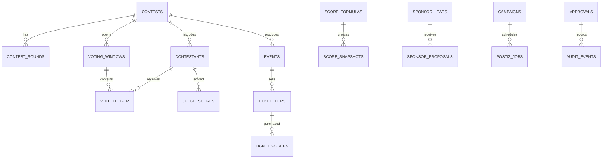

# Database Strategy

Supabase PostgreSQL is the system of record. AI can help generate drafts and summaries, but SQL owns contests, votes, money-derived state, scores, audits, contracts, and campaign history.

## Data Placement Rules

| Data | Belongs in | Reason |
|---|---|---|
| Contests, rounds, contestants | SQL | Core product truth and RLS. |
| Votes and judge scores | SQL ledgers | Exact, auditable, replayable. |
| Winners/rankings | SQL snapshots | Deterministic and explainable. |
| Tickets/orders/paid votes | SQL + Stripe ids | Stripe owns payment event; SQL owns app fulfillment. |
| Sponsor CRM/contracts | SQL | Business process and audit trail. |
| Influencer leads | SQL | Reviewable pipeline state. |
| WhatsApp campaigns | SQL | Compliance, opt-outs, delivery state. |
| Livestream engagement | SQL event tables + Realtime | Realtime display plus reporting. |
| AI campaign history | SQL canonical rows | Postiz/social state must be auditable. |
| OpenClaw logs | SQL job/evidence tables | Replayability and governance. |
| Semantic search | pgvector | Similarity after deterministic filters. |
| AI memory | Approved summaries/chunks | Avoid raw uncontrolled memory. |
| Cache | Redis/Supabase cache tables/browser cache | Short-lived read acceleration only. |
| Realtime | Supabase Realtime from SQL | Display layer, not truth layer. |

## Core Schema Strategy

| Domain | Tables |
|---|---|
| Contests | `contests`, `contest_rounds`, `contest_categories`, `score_formulas` |
| Contestants | `contestants`, `contestant_assets`, `contestant_social_links`, `contestant_status_events` |
| Events | `events`, `event_schedule_items`, `ticket_tiers`, `check_ins` |
| Votes | `voting_windows`, `vote_tokens`, `vote_ledger`, `vote_fraud_signals`, `vote_reviews` |
| Paid votes | `paid_vote_orders`, `paid_vote_credits`, `stripe_webhook_events` |
| Judge scoring | `judge_panels`, `judge_assignments`, `judge_scores`, `score_snapshots` |
| Sponsors | `sponsor_leads`, `sponsor_contacts`, `sponsor_proposals`, `sponsor_contracts`, `sponsor_deliverables` |
| Influencers | `influencer_leads`, `influencer_campaigns`, `influencer_outreach_drafts` |
| WhatsApp | `message_batches`, `message_events`, `opt_outs`, `secure_links` |
| Campaigns | `campaigns`, `campaign_assets`, `postiz_jobs`, `utm_links` |
| OpenClaw | `automation_jobs`, `source_evidence`, `policy_blocks`, `scrape_runs` |
| Moderation | `moderation_cases`, `moderation_decisions`, `moderation_evidence` |
| Analytics | `analytics_events`, `campaign_metrics`, `sponsor_roi_snapshots` |
| Audit | `approvals`, `audit_events`, `ai_runs`, `tool_invocations` |

## ERD Sketch

## SQL vs pgvector vs AI Memory

| Question | Correct path |
|---|---|
| "How many votes does Valeria have?" | SQL only. |
| "Who won Audience Favorite?" | Locked SQL snapshot. |
| "Which sponsors fit luxury beauty?" | SQL filters + pgvector over sponsor profiles + source evidence. |
| "Draft a proposal like last contest" | pgvector over approved proposal history. |
| "What has Roberto already approved?" | SQL approvals and audit events. |
| "What tone did this sponsor prefer?" | Approved sponsor notes, possibly summarized AI memory. |

## Anti-Fraud and Replayability

| Requirement | Implementation |
|---|---|
| Append-only vote ledger | No updates/deletes by app roles. |
| Idempotent Stripe webhooks | Store event ids and fulfillment ids. |
| Score snapshots | Store formula version and input ids. |
| OpenClaw evidence | Store URL, timestamp, hash, source, extracted fields. |
| Outreach audit | Store draft, approval, send event, and opt-out path. |
| Realtime derivation | Leaderboards render from views/snapshots, never model text. |

## RLS Requirements

Every new table needs RLS enabled and at least one policy. Public tables should expose only published profiles/events and never private docs, payment records, raw phone numbers, or moderation notes.

