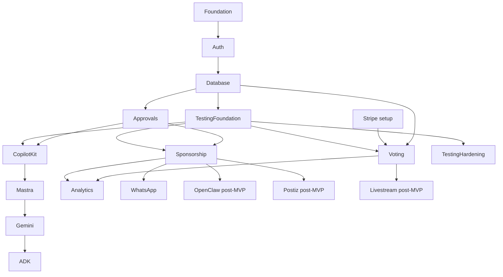

# Task Implementation Order

This is the build order for a future contest vertical. It intentionally places truth, approvals, and tests before AI automation depth.

Testing is not a final cleanup task. The test foundation starts as soon as the route namespace and database plan exist, then every later task adds its own proof: route proof, SQL proof, API proof, browser proof, and negative-case proof where applicable.

## Ordered Task Index

| Order | Task | Objective | Files/modules | Dependencies | Effort | Risk | MVP priority |
|---:|---|---|---|---|---:|---|---|
| 1 | Foundation tasks | Create route namespace, feature flag, env rules, task docs | `mdeapp/src/app/contests`, `tasks/contests` | Current mdeapp foundation | 1-2d | Low | P0 |
| 2 | Auth tasks | Add organizer, contestant, judge, sponsor, staff, admin roles | Supabase auth/RLS, `src/lib/auth` | Foundation | 2-4d | High | P0 |
| 3 | Database tasks | Add contest, event, contestant, vote, score, audit tables | Supabase migrations/types | Auth | 8-14d | High | P0 |
| 4 | Testing foundation | Add smoke script, fixture plan, proof template, CI placeholder | `tests/**`, `package.json`, task docs | Foundation + DB plan | 2-4d | Medium | P0 |
| 5 | CopilotKit setup | Contest workspace, cards, approvals, runtime route | `/api/copilotkit`, UI cards | DB + approvals + smoke proof | 3-5d | Medium | P0 |
| 6 | Mastra setup | Minimal workflow agents and tool policy registry | `src/mastra/**` | CopilotKit | 4-6d | Medium | P0 |
| 7 | Gemini setup | Gemini 3.5 Flash default, structured outputs, evals | Mastra model config/evals | Mastra | 2-4d | Medium | P0 |
| 8 | ADK setup | Venue/sponsor geo adapter with field masks | `src/lib/geo`, ADK adapter | Gemini | 3-5d | Medium | P1 |
| 9 | Voting setup | Free vote, paid vote, fraud signals, snapshots | API routes, SQL/RPC, UI | DB ledgers + Stripe | 8-12d | High | P0 |
| 10 | Sponsorship setup | CRM, sponsor packages, proposal drafts, approvals | `/sponsors`, DB, Mastra | Approvals + agents | 5-8d | Medium | P1 |
| 11 | WhatsApp setup | Opt-ins, templates, reminders, secure links | `src/lib/whatsapp`, API routes | Auth + campaigns | 4-7d | Medium | P1 |
| 12 | Analytics setup | Sponsor ROI, UTM, QR/vote/ticket reports | analytics tables/views | Votes/tickets/campaigns | 5-8d | Medium | P1 |
| 13 | OpenClaw setup | Draft-only discovery, evidence, quotas, policy blocks | automation adapter, DB jobs | Sponsor CRM + legal checklist | 5-8d | High | P2 post-MVP |
| 14 | Postiz setup | Approved campaign scheduling and status sync | Postiz adapter, campaign UI | Campaign approvals | 4-7d | Medium | P2 post-MVP |
| 15 | Livestream setup | Overlay queue, second-screen voting, provider adapter | `/live`, stream adapter | Voting + sponsor activation | 6-10d | High | P3 post-MVP |
| 16 | Testing hardening | Playwright, Chrome DevTools MCP, workflow replay, fixtures, load smoke | tests/e2e, tests/workflows | Continuous from task 4 | 5-8d | High | P0/P1 |

## MVP Cut Line

| Include in MVP | Hold for post-MVP |
|---|---|
| Tasks 1-12 plus only the testing hardening needed to prove those surfaces | OpenClaw daily scraping, autonomous or semi-autonomous DMs, Postiz scheduling automation, livestream overlays, influencer automation, sponsor marketplace |

## Dependency Graph

## Blockers

| Blocker | Needed before |
|---|---|
| Contest MVP scope | Any code task |
| CopilotKit Cloud keys | CopilotKit setup |
| Gemini model confirmation | Gemini setup |
| Stripe test/live decision | Voting and ticketing |
| WhatsApp provider/templates | WhatsApp setup |
| Sponsor outreach policy | OpenClaw/Postiz/outreach |
| Streaming provider decision | Livestream setup |

## Testing Order

1. Schema/RLS tests.
2. Approval guard tests.
3. Vote ledger tests.
4. Stripe webhook tests.
5. CopilotKit card tests.
6. Mastra workflow replay tests.
7. Browser E2E for contest/vote/ticket/admin.
8. AI governance evals.
9. WhatsApp/Postiz/OpenClaw adapter tests.
10. Realtime/load smoke before live finals.
