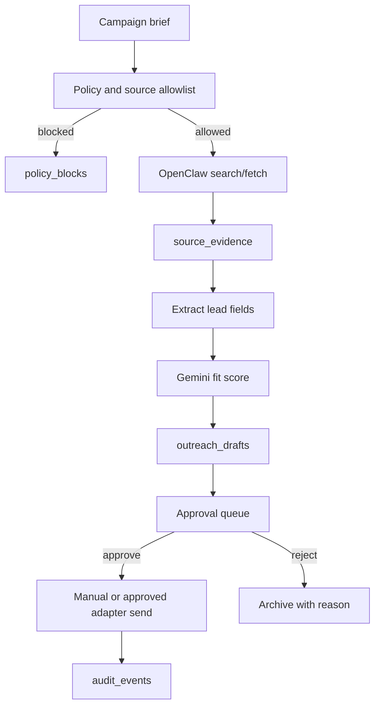

# OpenClaw Outreach Strategy

OpenClaw is a discovery and draft-generation execution layer. It should not become an autonomous spam machine. In MVP, OpenClaw creates evidence-backed leads and outreach drafts; Roberto or Patricia approves every outbound action.

## Core Rule

```text
OpenClaw may discover, enrich, and draft.
OpenClaw may not autonomously send.
```

## Outreach Pipelines

| Pipeline | Discovery | Qualification | Draft | Approval | Send |
|---|---|---|---|---|---|
| Instagram influencer outreach | Public profiles, hashtags, location signals where compliant | Audience fit, brand safety, engagement quality | DM/email draft | Required | Manual or approved adapter |
| Sponsor outreach | Places, business websites, public directories | Brand fit, geo fit, budget potential | Sponsor proposal and message | Required | CRM/manual first |
| Contestant discovery | Public referrals, creator/model pages | Eligibility and interest hypothesis | Invite copy | Required | Manual campaign |
| Fashion model discovery | Agencies, schools, creator profiles | City/category fit | Application invite | Required | Manual first |
| Nightlife partnership | Venues, event calendars, social pages | Audience overlap and activation fit | Partnership proposal | Required | Approved channel |
| LinkedIn enrichment | Company pages and role hints where compliant | Contact hypothesis only | Intro draft | Required | Manual or approved CRM |

## Architecture



## Governance Requirements

| Requirement | Implementation |
|---|---|
| Avoid spam behavior | No bulk autonomous sends; daily quotas; manual review. |
| Respect platform limits | Source-specific policy config and rate limits. |
| Log all actions | `automation_jobs`, `source_evidence`, `outreach_drafts`, `approvals`, `audit_events`. |
| Require approvals | Every outbound message references `approval_id`. |
| Minimize PII | Store business contact info only when source and purpose are clear. |
| Opt-out | Respect sponsor/influencer opt-outs across all campaigns. |
| Source evidence | Every lead card shows why the lead exists and where data came from. |

## Contact Qualification Score

| Signal | Weight | Source |
|---|---:|---|
| Brand/category fit | 25 | Website/social/category |
| Geo fit | 20 | ADK/Maps/Places |
| Audience overlap | 20 | Public metrics/campaign data |
| Activation feasibility | 15 | Venue/event inventory |
| Contact confidence | 10 | Public contact evidence |
| Risk/compliance | 10 | Source policy and opt-out status |

## MVP Limits

| Limit | Value |
|---|---|
| Outbound mode | Draft-only by default. |
| Instagram DMs | Manual approval and manual-send first. |
| LinkedIn outreach | No automated connection/message spam. |
| Daily lead quota | Small campaign-specific batch. |
| Source expansion | Requires Patricia/admin approval. |
| Direct contracts | Never sent automatically. |

