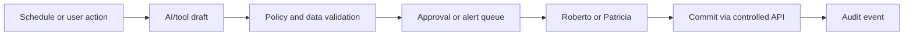

# Top MVP Automations

These are ranked by operational impact, revenue impact, engineering complexity, and automation value. MVP automations should create drafts, reminders, checks, and alerts, not uncontrolled actions.

Ranks 1-16 are the practical MVP automation pool. Ranks 17-25 are intentionally listed as post-MVP candidates so they stay visible without becoming first-release scope.

| Rank | Automation | Operational impact | Revenue impact | Complexity | Automation value | Priority |
|---:|---|---:|---:|---:|---:|---|
| 1 | Contestant missing-doc reminders | High | Medium | Low | High | P0 |
| 2 | WhatsApp rehearsal reminders | High | Medium | Low | High | P0 |
| 3 | Voting window open/close reminders | High | High | Low | High | P0 |
| 4 | Stripe webhook reconciliation alerts | High | High | Medium | High | P0 |
| 5 | QR check-in duplicate/anomaly alerts | High | Medium | Medium | High | P0 |
| 6 | Contestant voting link generator | High | High | Low | High | P0 |
| 7 | Sponsor proposal generation | Medium | High | Medium | High | P0 |
| 8 | Sponsor deliverables checklist | Medium | High | Low | High | P0 |
| 9 | Judge incomplete-score alert | High | Low | Low | Medium | P1 |
| 10 | Vote anomaly summary | High | Medium | Medium | High | P1 |
| 11 | AI social post generator | Medium | High | Low | High | P1 |
| 12 | WhatsApp fan share card | High | High | Low | High | P1 |
| 13 | Geo-targeted sponsor suggestions | Medium | High | Medium | High | P1 |
| 14 | Sponsor lead discovery draft | Medium | High | Medium | High | P1 |
| 15 | Contestant profile polish | Medium | Medium | Low | Medium | P1 |
| 16 | Campaign UTM generator | Medium | Medium | Low | Medium | P1 |
| 17 | Sponsor ROI report draft | Medium | High | Medium | High | P2 post-MVP |
| 18 | Influencer recommendation draft | Medium | Medium | Medium | Medium | P2 post-MVP |
| 19 | Postiz schedule draft | Medium | Medium | Medium | Medium | P2 post-MVP |
| 20 | Livestream reminder sequence | Medium | Medium | Medium | Medium | P2 post-MVP |
| 21 | Live overlay queue builder | Medium | Medium | Medium | Medium | P2 post-MVP |
| 22 | OpenClaw daily search strategy rotation | Medium | High | High | High | P3 post-MVP |
| 23 | Tourism package suggestions | Low | Medium | Medium | Medium | P3 post-MVP |
| 24 | Auto-clipped reels suggestions | Low | Medium | High | Medium | P3 post-MVP |
| 25 | Sponsor renewal recommendation | Medium | High | Medium | High | P3 post-MVP |

## MVP Cut Line

| Scope | Automations | Rule |
|---|---|---|
| MVP | 1-16 | May send only approved reminders/templates or create drafts/alerts for humans. |
| Post-MVP | 17-25 | Requires a shipped MVP, legal/TOS review, provider setup, and proof gates. |
| Never autonomous | Payments, vote changes, winner selection, contracts, bans, public campaign launches | Requires deterministic systems and human approval. |

## MVP Automation Flow

## Automation Rules

| Rule | Reason |
|---|---|
| Reminder automations may send only approved templates | WhatsApp compliance. |
| Sponsor/influencer automations produce drafts first | Avoid spam and brand risk. |
| Payment automations never infer success | Stripe webhook is required. |
| Vote automations never modify ledger rows | SQL truth is protected. |
| Live automations require producer/admin approval | Avoid public event mistakes. |
