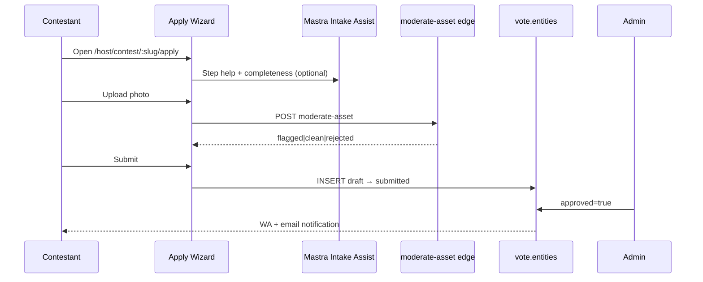

# Contest OS — Product Requirements Document

**Product:** mdeai.co — Contest Operating System  
**Version:** 2.0.0  
**Status:** Draft — implementation-oriented (supersedes [prd-contest v1](../../archive/events-superseded/contests/prd-contest.md))  
**Last updated:** 2026-05-16

### v2.0 changelog

| Change | Source |
|--------|--------|
| Operational **state machines** (contestant, vote, sponsor, judge) | Industry ops + Launchpad6/Choicely patterns |
| **Industry baseline** + expanded Launchpad6 competitive row | External competitive review |
| **Event-day operations** (backstage, live scoring, check-in) | Launchpad6 / MU production patterns |
| **Appendices E–J** — routes, edge catalog, RLS, Mastra workflows, phase map | Implementation PRD pass |
| **Schema naming** locked to `vote.*` (not `contest.*`) | Repo task [010](../../archive/010-vote-schema.md) |
| **Paid votes** explicitly Phase 3+ only (D3) | [prd.md](../../prd.md) locked decision D3 |
| Contest **intelligence graph** moat | Strategic synthesis |  
**Canonical strategy:** [prd.md](../../prd.md) v5.1 (Pillar 3 — when in conflict, prd.md wins on product boundaries)  
**Implementation audit:** [01-contests-audit.md](./01-contests-audit.md) (2026-05-16 — 0% shipped)  
**Mastra intake (propose-only):** [mastra-intake-workflow.md](./mastra-intake-workflow.md) (2026-05-17)  
**OpenClaw execution architecture:** [openclaw-contests.md](./openclaw-contests.md) (2026-05-17)  
**Task backlog:** [tasks/events/index-events.md](../index-events.md) § Phase 2 contests (tasks 010–024)  
**Architecture law:** [tasks/events/V2-tasks/events-prd-v2-mastra-maps-automation.md](../V2-tasks/events-prd-v2-mastra-maps-automation.md) §1.1  

---

## Document control

| Field | Value |
|-------|--------|
| **Owner** | Product + Platform Engineering |
| **Flagship** | Miss Elegance Colombia 2026 |
| **Phase gate** | Phase 1 Events + Tickets G1–G5 green before contest code ships ([tasks/todo.md](../../todo.md) §1) |
| **Ship gate** | `npm run floor` (lint + build + Vitest + `verify:edge` + `verify:mastra`) |
| **Non-goals** | Crypto/NFT voting, paid fan votes (Ley 643/2001), native apps, white-label SaaS export (Phase 2) |

---

# 1. Executive Summary

### Vision

**Contest OS** is the third pillar of mdeai.co: a production-grade operating system for beauty pageants, talent competitions, influencer contests, and sponsor-driven audience engagement — not a standalone “vote button.” It unifies **contest lifecycle**, **ticketed finale events**, **sponsor activations**, **trusted public voting**, **judge scoring**, and **AI-orchestrated operations** on one Supabase data plane and one chat-first surface.

### Positioning

| Market label | What buyers think they want | What mdeai sells |
|--------------|----------------------------|------------------|
| Voting app | Fan votes + leaderboard | **Trust layer** (OTP, Turnstile, hybrid score, public formula) |
| Pageant software | Contestant CRM + judging | **Contest OS** + Event OS (finals tickets, check-in) |
| Sponsor tool | Logo placement | **ROI dashboard** + audience-match + contest surfaces |
| Fan engagement app | Mobile app downloads | **PWA + WhatsApp-first** (LATAM); no app-store friction |

**One-liner:** *“Mindtrip plans your trip. mdeai runs your pageant, sells your finale tickets, proves your votes are real, and shows sponsors what they bought.”*

### Why this wins

1. **Bundle moat** — Events + contests + sponsors share `events`, `profiles`, Realtime, Stripe, and Gemini. Choicely/Eventista sell voting; Eventbrite sells tickets; nobody ships **finals night + voting + sponsor ROI** in one Colombian-first stack.
2. **Trust as product** — Latin pageants are scandal-sensitive. Hybrid scoring + public Trust page + 5-layer fraud + human moderation beats “blockchain trust” marketing without ops depth.
3. **AI-native operations** — Competitors offer no-code app builders or static portals. mdeai uses **Mastra** for intake assist, moderation proposals, fraud narrative, judge assist, and campaign copy — with **deterministic** vote commits.
4. **WhatsApp distribution** — 95% reach in Colombia; OpenClaw executes **approved** broadcasts; viral loops use `?ref=` + share cards ([prd.md](../../prd.md) §2.4).
5. **Operational realism** — Specs derived from real task YAML (010–024), RLS matrices, and edge contracts — not generic SaaS templates.

### Market opportunity

- **Global pageant voting** is a proven high-volume category (Choicely × Miss Universe: 3M+ app downloads, 200+ countries, record fan vote — [Choicely case study](https://www.choicely.com/case/miss-universe-global-beauty-pageant-app-with-3-million-downloads)).
- **LATAM** lacks a Medellín-native, bilingual, sponsor-integrated contest stack tied to local events/nightlife/fashion.
- **Revenue:** Sponsor tiers ($500–$25K), event tickets (5% platform fee), future CPL/agent packs — contests drive sponsor pipeline for Phase 3.

### Moat (defensible over 24 months)

| Moat | Mechanism |
|------|-----------|
| Data flywheel | Vote + ticket + sponsor impressions in one Postgres |
| Trust reputation | Published formula + audit log + <0.5% confirmed fraud gate |
| Organizer lock-in | Contest history, judge rubrics, contestant media in Storage |
| AI workflow IP | Mastra contest pack + eval fixtures (moderation F1, fraud F1) |
| Regional graph | Medellín venues, restaurants, maps pins on contest/event pages |

### Competitive advantages (summary)

See **Appendix A — Competitive matrix** for full comparison. Headline: mdeai is **10×** on integrated ops + AI orchestration + sponsor intelligence; competitors are **stronger** on dedicated native apps and paid-vote monetization (intentionally deferred per [prd.md](../../prd.md) D3).

### Industry baseline (what incumbents already prove)

Products like **Choicely**, **Launchpad6**, and **Eventista 1Vote** validate the category: organizers configure voting windows, entry fields, judging rounds, moderation, notifications, analytics, and social sharing; contestants submit media; supporters vote; judges score in a separate portal; admins remove fraud and export results. Miss Universe-scale programs add sponsor inventory, contestant media at scale, judge aggregation, and **public trust messaging** around how results are calculated ([Choicely MU case](https://www.choicely.com/case/miss-universe-global-beauty-pageant-app-with-3-million-downloads), [Launchpad6](https://www.launchpad6.com/competition-management-software)).

**mdeai does not reinvent voting.** It adds what thin voting SaaS lacks:

- **Event OS** (finals tickets, staff scan, host dashboard)
- **Sponsor OS** (ROI, audience-match, placements)
- **WhatsApp-native growth** (OpenClaw + Infobip)
- **Deterministic-first AI** (propose-only; audit logs; eval gates)
- **Contest intelligence graph** (conversion funnels, anomaly signatures, sponsor performance, share loops) — compounding moat over multiple pageant seasons

### Core architecture (two layers — non-negotiable)

| Layer | Owns | Must never own |
|-------|------|----------------|
| **Deterministic authority** (Supabase + edge functions) | Votes, scoring aggregation, fraud enforcement, eligibility, moderation **state**, audit logs, realtime tallies, payments | Speculative ranking, unlogged overrides |
| **AI orchestration** (Mastra + Gemini) | Workflow planning, moderation **proposals**, sponsor match drafts, intake assist, campaign copy, fraud **narratives**, analytics summaries | Direct vote INSERT, winner selection, shadow-block without human/RPC |

This matches platform-wide **Preview → Apply → Undo** ([CLAUDE.md](../../../CLAUDE.md)). In contests, violating this rule is a trust and legal incident, not a UX bug.

---

# 2. How Beauty Contests Actually Work

Operational model for **national/regional pageants** (Miss Elegance Colombia archetype), not just software features.

### 2.1 Contestant lifecycle

| Phase | Real-world activity | System touchpoints |
|-------|---------------------|-------------------|
| **Discovery** | Friend sends WA link; IG story from organizer | `/vote/:slug`, `/host/contest/:slug/apply`, `?ref=` |
| **Application** | Bio, 3 photos, socials, ID, signed waiver (Ley 1581/2012) | Intake wizard ([018](../018-contestant-intake-form.md)); Storage `identity_docs` |
| **Verification** | Organizer reviews ID match; AI flags swimsuit/borderline | `moderate-asset` edge; admin queue ([019](../019-admin-moderation-page.md)) |
| **Approval** | Profile goes live; contestant gets WA + email | `entities.approved=true`; notify edge |
| **Campaign** | Contestant pushes fan votes; shares ranking | Share modal; leaderboard; optional OpenClaw reminders |
| **Finals** | Ticketed event; runway; live audience | `events` link on `vote.contests.event_id`; staff scan |
| **Outcome** | Winner; crown; sponsor activations | `contests.status=closed`; audit snapshot |

**Example — Laura (Miss Elegance 2026):** Opens apply link on phone during lunch; 8-minute intake; one photo flagged (group shot) → replaces → submits; Daniela approves next morning; Laura shares vote link to 3 WA groups; 340 votes in 48h.

### 2.2 Organizer lifecycle

| Phase | Activity | System |
|-------|----------|--------|
| **Partnership** | Contract, brand guidelines, dates | CRM / manual; `contests` draft |
| **Setup** | Categories, scoring weights, voting window | `vote.contests.scoring_formula` JSONB |
| **Contestant pipeline** | Review queue, bulk approve | `/admin/entities` |
| **Promotion** | WA community, IG, sponsor co-brand | OpenClaw broadcast ([022](../022-leaderboard-broadcast-skill.md)) |
| **Live ops** | Monitor fraud, extend window (audited) | Admin + `audit_log` |
| **Settlement** | Sponsor reports, ticket reconciliation | Sponsor ROI + `event_orders` |

**Example — Sofía (producer):** Creates contest linked to finals event Dec 2026; sets weights 50/30/20; runs 4-hourly WA leaderboard broadcasts; on finals night watches host dashboard Realtime ticket sales + vote velocity.

### 2.3 Sponsor lifecycle

| Phase | Activity | System |
|-------|----------|--------|
| **Prospecting** | Organizer pitches brands | `ai-audience-match` (Phase 3); manual |
| **Application** | Tier selection, contract | `/sponsor/apply` (Phase 3 core — schema exists) |
| **Activation** | Logo on leaderboard, WA broadcast, contestant profile | `sponsor.placements` surfaces |
| **Measurement** | Impressions, clicks, narrative ROI | `sponsor.roi_daily_rollup`; `sponsor-roi-explain` |
| **Renewal** | Post-campaign review | Dashboard + outreach log |

**Example — Postobón:** Gold tier on Miss Elegance; logo on leaderboard footer + WA broadcast composite; 1.2M impressions in rollup; Andrés reads AI insight card in Spanish.

### 2.4 Voting lifecycle

| Step | Requirement | Owner |
|------|-------------|--------|
| 1 | Voter lands on `/vote/:slug` | Frontend |
| 2 | Turnstile + optional OTP | Edge L1 + L2 ([015](../archive/015-cloudflare-turnstile.md), [016](../archive/016-phone-otp.md)) |
| 3 | Nonce minted (60s TTL, single-use) | Edge |
| 4 | `POST vote-cast` | Edge ([011](../archive/011-vote-cast-edge-fn.md)) |
| 5 | Trigger updates `entity_tally` | DB ([014](../archive/014-hybrid-scoring-trigger.md)) |
| 6 | Realtime broadcast | `vote:tally:{contestId}` ([013](../archive/013-realtime-leaderboard.md)) |
| 7 | L5 fraud cron (async) | Edge + Mastra proposal ([017](../017-fraud-scan-cron.md)) |

**Trust rule:** Voter sees **hybrid score**, not raw vote count ([prd.md](../../prd.md) Story 3.1).

### 2.5 Event lifecycle (contest ↔ event)

Contests **do not replace** Event OS; they attach to it.

- Preliminary voting: online-only.
- Finals: `vote.contests.event_id` → ticketed `events` row; same organizer auth; staff PWA scan.
- Camila buys finale ticket **and** votes online — two revenue lines, one identity graph.

### 2.6 Judging lifecycle

| Step | Activity | System |
|------|----------|--------|
| Invite | Organizer adds judges | `vote.judges` |
| Rubric | Criteria per category | `vote.scoring_criteria` |
| Scoring | Judges enter scores (live or batch) | `vote.judge_scores` → trigger → tally |
| Audit | Scores immutable after lock | RLS + no UPDATE on locked contest |

Mastra **Judge Assist Agent** proposes normalized scores; judge **Apply** commits (propose-only).

### 2.7 Moderation lifecycle

| Stage | Actor | Outcome |
|-------|-------|---------|
| Upload | Contestant | File in Storage |
| L0 AI | `moderate-asset` | `clean` / `flagged` / `rejected` |
| L1 Human | Daniela | Approve / reject / override |
| Ongoing | Community report (Phase 3) | Queue |

Rejected at upload **blocks step**; flagged **allows submit** with admin review ([020](../020-gemini-photo-moderation.md)).

### 2.8 Promotion lifecycle

| Channel | Automation | Gate |
|---------|------------|------|
| WhatsApp Community | 4h leaderboard broadcast | OpenClaw + pg_cron backstop ([023](../023-pg-cron-backstop.md)) |
| IG/TikTok | Share cards, UTM | Frontend + Postiz (Phase 4) |
| Influencer `?ref=` | Attribution only Phase 2 | PostHog |
| Email | Transactional only | Infisical secrets |

### 2.9 Operational state machines (authoritative)

Contest operations are **deadline-heavy and audit-sensitive**. All transitions below are enforced in Postgres (`status` columns + CHECK constraints) and edge functions — not UI-only labels.

#### Contestant (`vote.entities` + application metadata)

```text
draft → submitted → needs_review → approved → published → finalist → winner
         ↘ rejected (resubmittable → submitted)
```

| State | Meaning | Who transitions |
|-------|---------|-----------------|
| `draft` | Autosaved intake; not in admin queue | Contestant |
| `submitted` | `submitted_at` set; awaits review | Contestant |
| `needs_review` | AI flagged or manual queue | System / admin |
| `approved` | `identity_verified_at`, `approved=true` | Admin |
| `rejected` | `rejection_reason` set; email sent | Admin |
| `published` | Visible on `/vote/:slug` | System on approve |
| `finalist` | Advanced round (optional) | Organizer |
| `winner` | Final placement; immutable snapshot | Organizer after close |

#### Vote (ballot row — `vote.votes`)

```text
verified → cast → counted → audited → visible_on_leaderboard
```

| State | Meaning | Owner |
|-------|---------|--------|
| `verified` | Turnstile + OTP + nonce valid | `vote-cast` edge |
| `cast` | Row INSERT accepted | Edge |
| `counted` | Included in tally trigger | DB trigger |
| `audited` | Passed L4; L5 label `clean` or human review | fraud pipeline |
| `visible` | Reflected in `entity_tally` Realtime | Broadcast |

Votes with `fraud_status != clean` may be **counted with weight 0** — formula documented on Trust page.

#### Judge score (`vote.judge_scores`)

```text
draft → submitted → locked
```

After `locked`, no UPDATE except admin audit revert (logged).

#### Sponsor campaign (Phase 3 — `sponsor.*`)

```text
applied → approved → contracted → active → reporting → renewal | churned
```

Phase 2 may use **manual** sponsor rows on contest only (placements without full checkout).

#### Contest (`vote.contests`)

```text
draft → live → closed → archived
```

| Transition | Requirement |
|------------|-------------|
| `draft → live` | Trust page counsel sign-off; ≥1 approved entity; voting window set |
| `live → closed` | `ends_at` reached OR organizer close; judging locked |
| Window extension | **Only** via `audit_log` INSERT (public notice recommended) |

### 2.10 Event-day operations (live production)

Launchpad6-style contest SaaS stops at online voting; **mdeai Event OS** extends into the room:

| Workstream | Operations | System |
|------------|------------|--------|
| **Backstage** | Contestant check-in, stage order, cue sheet | `event_check_ins` + contestant list |
| **Judges** | Live rubric entry per runway walk | Judge portal + Realtime progress channel |
| **Audience** | Giant screen leaderboard; trust URL on screen | `vote:tally` embed route |
| **Staff** | QR scan for finals tickets | Staff PWA (Phase 1) |
| **Sponsors** | Logo on screen / program | Placement manifest |
| **Emcee** | Finalists, sponsor reads | Organizer dashboard export |

**Example — Finals night, Miss Elegance:** 18:00 doors open (ticket scan). 19:30 Top 10 runway; judges score live. 20:15 audience voting still open on phones. 21:00 winner reveal uses **frozen** tally + audit snapshot — no last-second unlogged changes.

---

# 3. User Personas

| Persona | Name (archetype) | Goal | Primary surfaces |
|---------|------------------|------|------------------|
| **Contestant** | Laura, 24, Laureles | Get approved; maximize votes | Apply wizard, profile, share tools |
| **Organizer** | Sofía, 38, producer | Run contest without spreadsheets | Host contest admin, fraud queue, exports |
| **Judge** | Dr. Martínez, industry | Fair rubric scoring | Judge PWA / admin scoring |
| **Sponsor** | Andrés B., brand manager | Prove ROI | Sponsor dashboard (Phase 3) |
| **Voter** | Camila, 24, mobile | Vote once; trust leaderboard | `/vote/:slug`, chat |
| **Influencer** | @medellinbeauty | Drive referrals | `?ref=` links, share kits |
| **Platform admin** | mdeai ops | Fraud, legal, abuse | `/admin/*`, Signal alerts |
| **Staff** | Roberto | Finals check-in | Staff PWA (Event OS) |
| **Venue manager** | Hotel ballroom | Capacity, logistics | Venue track (Phase 2 events) |

---

# 4. User Journeys

### 4.1 Contestant onboarding (happy path)



### 4.2 Voting + share

1. Camila opens `/vote/miss-elegance-colombia-2026`.
2. Turnstile → OTP if required → tap contestant card.
3. `vote-cast` &lt;300ms → optimistic UI → Realtime tally tick &lt;2s.
4. Share modal: pre-filled WA message with `?ref=camila_wa`.
5. PostHog attributes registration if friend signs up.

### 4.3 Sponsor activation (Phase 3 overlap)

1. Sofía runs audience-match → top 5 brands.
2. Sends outreach template (Spanish-Paisa).
3. Andrés completes `/sponsor/apply` → Stripe → placements active on contest surfaces.

### 4.4 Judge scoring (finals week)

1. Judge logs in → sees assigned contestants + rubric.
2. Enters scores per criterion → Mastra shows **suggested** normalization (preview).
3. Judge confirms → `judge_scores` INSERT → hybrid tally updates.

### 4.5 Fraud response

1. L4 flags IP burst on `vote-cast`.
2. Cron `fraud-scan` + Mastra narrative → admin Signal.
3. Admin one-tap shadow-block (human) → votes from cluster weighted to 0.

### 4.6 WhatsApp flows

| Flow | Trigger | Content |
|------|---------|---------|
| Application received | Submit | “Estamos revisando…” |
| Approved | Admin approve | Profile live + vote link |
| Vote reminder | 48h inactive fan | Mastra draft → OpenClaw template |
| Leaderboard | Cron 4h | Screenshot + caption + UTM |
| Finals ticket | 7d before event | Link to `/events/:id` |

---

# 5. Contestant Application Wizard

**Route:** `/host/contest/:slug/apply` (mobile-first).  
**Spec source:** [018-contestant-intake-form.md](../018-contestant-intake-form.md).

### 5.1 Steps (10)

| # | Step | Required | Validation |
|---|------|----------|------------|
| 1 | Display name + bio (≥50 chars) | Yes | Zod min length |
| 2 | Hero photo | Yes | JPEG/PNG/WEBP ≤10MB; moderation |
| 3 | Two additional photos | Yes | Same |
| 4 | Social links (≥1) | Yes | URL format |
| 5 | Government ID front | Yes | Image; Storage path |
| 6 | Government ID back | Yes | Image |
| 7 | Waiver (download → sign → upload) | Yes | PDF or photo |
| 8 | Consent (Habeas Data + image rights) | Yes | Unchecked by default |
| 9 | Review | — | Read-only summary |
| 10 | Submit | — | `submitted_at` set |

### 5.2 AI-assisted completion (Mastra)

| Feature | Behavior | Boundary |
|---------|----------|----------|
| Completeness meter | “70% — falta waiver” | Read draft row only |
| Bio coach | Suggests es-CO copy | User edits before save |
| Photo tips | “Solo tú en la foto” | No auto-crop without consent |
| Reminder | WA draft 24h before deadline | OpenClaw after approval |

**Memory keys (concierge):** `lastContestSlug`, `intakeStep`, `draftEntityId`.

### 5.3 Media rules

- Max 10MB per file; client compress to ≤2MB on slow networks.
- `capture="environment"` for ID photos.
- Storage paths per [018](../018-contestant-intake-form.md) wiring plan.

### 5.4 Components (implementation map)

| Component | Path |
|-----------|------|
| Page | `src/pages/host/contest/Apply.tsx` |
| Steps | `src/components/contest/intake/*` |
| Hook | `src/hooks/useContestApply.ts` |
| Schema | `src/types/contestApply.ts` |

### 5.5 Field inventory (canonical)

Maps to `vote.entities` + Storage paths. External PRDs often say `contest.contestants` — **this repo uses `vote.entities` only** (see §16.6).

**Required**

| Field | Storage / column | Notes |
|-------|------------------|-------|
| Full legal name | `entities.metadata.legal_name` | Match ID |
| DOB / age | `metadata.dob` | Category eligibility |
| City + country | `metadata.city`, `metadata.country` | Default `CO` |
| Headshot | Storage `listing_photos` | Step 2 |
| Bio (≥50 chars) | `entities.bio` | es-CO primary |
| Social (≥1) | `metadata.socials[]` | IG/TikTok/FB |
| Phone + email | `profiles` / metadata | OTP path |
| Consent | `metadata.consent_at` | Habeas Data + image rights |
| Eligibility declarations | `metadata.eligibility` | JSON checklist |
| Government ID + waiver | `identity_docs` | Steps 5–7 |

**Optional (Phase 2+)**

| Field | Use |
|-------|-----|
| Gallery (beyond 2 extra photos) | Fashion / talent contests |
| Video intro | URL or Storage |
| Measurements / category data | Pageant divisions |
| Language preference | `metadata.locale` |
| Brand affiliations | Sponsor conflict check |
| Advocacy statement | Public profile |

**UX rules:** mobile-first, autosave per step, progress bar, draft recovery via `draftEntityId` in concierge memory. AI may **propose** bio/caption text; user must tap **Apply** before persistence.

---

# 6. Voting System

### 6.1 Principles

1. **Free votes only** in Phase 2 ([prd.md](../../prd.md) D3 — Ley 643/2001).
2. **One person → one vote per contestant per contest** (phone_hash dedup).
3. **Append-only votes**; fraud status via controlled columns only.
4. **Public leaderboard shows hybrid score**, with Trust tooltip.

### 6.2 Five-layer fraud defense

| Layer | Mechanism | Sync/async |
|-------|-----------|------------|
| L1 | Cloudflare Turnstile | Sync on cast |
| L2 | Nonce JWT 60s single-use | Sync |
| L3 | DB UNIQUE `idempotency_key`, phone_hash | Sync |
| L4 | Rate limit RPC + IP/device rules | Sync (&lt;30ms) |
| L5 | Gemini burst classification | Async cron ([017](../017-fraud-scan-cron.md)) |

### 6.3 Hybrid scoring formula

Default (`vote.contests.scoring_formula`):

```json
{ "audience": 0.5, "judges": 0.3, "engagement": 0.2 }
```

**Computation** ([014](../archive/014-hybrid-scoring-trigger.md)):

```
weighted_total =
  normalize(audience_votes) * w_audience +
  normalize(judge_scores)   * w_judges +
  normalize(engagement)     * w_engagement
```

| Component | Source | Notes |
|-----------|--------|-------|
| Audience | `vote.votes` count (weighted by fraud_status) | Realtime materialized in `entity_tally` |
| Judges | `vote.judge_scores` | Per criterion, aggregated |
| Engagement | Profile completeness, social proof, optional sponsor micro-quests (Phase 3) | Configurable |

**Sponsor weighting (Phase 3):** Optional micro-weight for sponsored engagement actions — never overrides judge/audience without published formula change + `audit_log`.

### 6.4 Realtime

- Channel: `vote:tally:{contestId}` ([supabase/migrations/20260505000200_realtime_broadcast_migration.sql](../../../supabase/migrations/20260505000200_realtime_broadcast_migration.sql) lines 94–148).
- SLA: UI update **&lt;2s** p95 ([prd.md](../../prd.md) Story 3.1).
- Scale: Supabase **Pro** before 1k+ concurrent viewers ([tasks/todo.md](../../todo.md) V8).

### 6.5 Trust transparency

- Route: `/vote/:slug/how-it-works` ([024-trust-page.md](../024-trust-page.md)).
- Live formula from DB; 5-layer fraud explained; Colombian legal review on file.
- Window changes → `audit_log` immutable row.

### 6.6 Vote analytics (organizer)

| Metric | Source |
|--------|--------|
| Votes/min | `vote.votes` time series |
| Unique voters | Distinct `phone_hash` |
| Fraud rate | `fraud_signals` / confirmed |
| Referral top | `?ref=` param |
| Geo split | IP country (aggregated, no PII export) |

---

# 7. Judge System

### 7.1 Dashboard requirements

- Contest-scoped; only assigned judges.
- Rubric per category (evening gown, swimsuit, interview, etc.).
- Mobile-friendly (iPad).
- Offline-tolerant draft scores (sync on reconnect) — Phase 3.

### 7.2 Rubric model

`vote.scoring_criteria`: `{ id, contest_id, name, weight, max_score, description }`

`vote.judge_scores`: `{ judge_id, entity_id, criterion_id, score, notes, submitted_at }`

### 7.3 Workflows

1. **Batch scoring** (pre-finals): judges score all over 48h.
2. **Live scoring** (finals night): score per runway walk; Realtime tally for audience screen.

### 7.4 AI assist (propose-only)

**Judge Assist Agent (Mastra):**

- Input: rubric + notes + optional photo reference.
- Output: structured `{ scores: [{criterion_id, score, rationale}] }`.
- Judge edits → Apply → edge `judge-score-submit` validates JWT + contest lock.

### 7.5 Anomaly detection

| Signal | Action |
|--------|--------|
| All contestants identical scores | Flag judge; admin review |
| Score &gt;5σ from panel mean | Highlight in admin |
| Scores after `judging_ends_at` | Reject at edge |

---

# 8. Sponsor System

Phase 3 marketplace is **core sponsor schema shipped**; contest surfaces are **Phase 2 placements**.

### 8.1 Contest surfaces (from sponsor tier)

| Tier | Contest surfaces |
|------|------------------|
| Bronze | Leaderboard footer logo |
| Silver | + category co-brand |
| Gold | Featured contestant slot |
| Premium | Title naming + all broadcasts |

Mapping in sponsor migrations / `placements.surface` enum (see remote backup `contest_header`, `leaderboard_footer`, etc.).

### 8.2 Contest-specific features

- **Audience-match:** Gemini ranks sponsors for contest demographics ([prd.md](../../prd.md) Story 4.3).
- **Branded contestant campaigns:** Sponsor linked to `entity_id`; creative gen **proposal** only.
- **ROI:** Impressions on vote page + WA broadcast; clicks to sponsor URL.

### 8.3 Dashboard tiles

Impressions, Clicks, CTR, Conversions, CPC, CPA — per [prd.md](../../prd.md) Story 4.2.

---

# 9. Social Growth System

### 9.1 Viral loops ([prd.md](../../prd.md) §2.4)

| Loop | Mechanism | K-factor tracking |
|------|-----------|-------------------|
| Vote → Share | Modal after successful vote | `?ref=` + PostHog |
| Ticket → Share | “I'm going!” card | Events pillar |
| Rank jump → Card | Auto congrats when rank improves | Contestant profile |
| Influencer ref | Organizer-issued handles | Phase 3 paid rev share deferred |

### 9.2 Psychology

- **Leaderboard proximity:** “Laura is #4 — 12 votes from #3” (not just rank).
- **Countdown:** Voting ends in 2d 4h — urgency without dark patterns.
- **Social proof:** “3,240 people voted today.”
- **Streaks (Phase 3):** Daily voter badge — cosmetic only.

### 9.3 Channel playbooks

| Channel | Tactic | Safety |
|---------|--------|--------|
| WhatsApp | Community broadcast, personal share | Templates approved; URL allowlist |
| Instagram | Stories card 1080×1920 | Brand assets from organizer |
| TikTok | Contestant-generated; platform TOS | No bot voting links in comments automation |
| Facebook | Community groups | Manual + OpenClaw only approved |

### 9.4 Contestant promotion system

- **Kit:** Headshot, bio snippet, vote URL, UTM, compliance line (“Votación oficial Miss Elegance…”).
- **Mastra Campaign Agent:** Drafts 3 caption variants (en + es-CO); organizer picks; Postiz schedules (Phase 4).
- **No auto-posting** contestant media without explicit consent checkbox.

### 9.5 LATAM / Colombia specifics

- Spanish-Paisa first; English secondary.
- Nequi/PSE culture → free votes (no payment friction).
- Peak voting: evening WA usage (7–10pm COT).
- Medellín fashion/nightlife cross-promo with Event OS.

---

# 10. AI System Architecture

### 10.1 Layer cake (authoritative)

```text
┌─────────────────────────────────────────────────────────────┐
│ L0  UI — Vite/React, PWA, 3-panel layout, chat canvas          │
├─────────────────────────────────────────────────────────────┤
│ L1  DETERMINISTIC — Supabase Postgres + RLS + triggers         │
│     Edge: vote-cast, moderate-asset, fraud-scan, notify-*    │
│     Stripe webhooks (events/sponsors) — NO LLM                 │
├─────────────────────────────────────────────────────────────┤
│ L2  REALTIME — vote:tally, host-event-dashboard broadcasts     │
├─────────────────────────────────────────────────────────────┤
│ L3  MASTRA — router, workflows, tools, memory, scorers       │
│     PROPOSE ONLY — preview / apply / undo                      │
├─────────────────────────────────────────────────────────────┤
│ L4  GEMINI — via edge + Mastra (structured output, multimodal) │
│     ai_runs logging on every call                              │
├─────────────────────────────────────────────────────────────┤
│ L5  OPENCLAW — approved outbound (WA, browser screenshot)    │
├─────────────────────────────────────────────────────────────┤
│ L6  HERMES — read-side ranking (SQL RPC, optional features)    │
├─────────────────────────────────────────────────────────────┤
│ L7  PAPERCLIP — governance records for high-risk actions       │
├─────────────────────────────────────────────────────────────┤
│ L8  MAPS — venues, nearby, routes (read tools, no vote write)  │
└─────────────────────────────────────────────────────────────┘
```

### 10.2 Layer ownership (external PRD alignment)

| Component | Owns | Must not own |
|-----------|------|--------------|
| Supabase + edge functions | Votes, money, fraud enforcement, scoring, moderation **state**, audit logs | Proposals, speculative outcomes |
| Mastra | Orchestration, memory, recommendations, moderation **proposals** | Direct vote/money writes |
| OpenClaw | Long-running WA/social execution | Unapproved outbound |
| Hermes | Ranking, momentum, affinity features | Final scores or vote counts |
| Gemini | Classification, generation, summarization | Authoritative mutation |
| Maps | Venue, logistics, proximity | Voting or judging |
| WhatsApp (Infobip) | Distribution, reminders | Unreviewed mass abuse |
| MCP tools | Standardized agent access | Privileged free-form writes |

### 10.3 Hard boundaries

| Action | Allowed layer | Forbidden |
|--------|---------------|-----------|
| INSERT vote | `vote-cast` edge | Mastra tool |
| Update tally | DB trigger | LLM |
| Shadow-block votes | Admin + service RPC | Auto LLM |
| Approve contestant | Admin UI | LLM |
| Send WA broadcast | OpenClaw + template | Mastra direct |
| Explain ROI | Mastra + edge read | — |

### 10.4 AI propose-only pattern ([CLAUDE.md](../../../CLAUDE.md))

1. **Preview** — AI shows moderation score, caption draft, fraud narrative.
2. **Apply** — Human or explicit edge RPC after confirm.
3. **Undo** — Admin revert with audit row.

---

# 11. Mastra Architecture

**Intake deep-dive (seven workflows, proposal queue, edge catalog):** [mastra-intake-workflow.md](./mastra-intake-workflow.md).

**Package:** `my-mastra-app/`  
**Patterns:** [Mastra workflows + agents/tools](https://mastra.ai/docs/workflows/agents-and-tools), [tools](https://mastra.ai/docs/agents/using-tools), [memory](https://mastra.ai/docs/memory/overview), [evals](https://mastra.ai/docs/evals/overview)

### 11.1 Contest Supervisor Agent (router extension)

- **Not** a monolithic “do everything” agent — coordinates **deadlines, reminders, and checklists** across contest stages.
- Extends `routerAgent` with intents: `contest_discovery`, `contest_intake_help`, `contest_leaderboard_explain` ([mastra-routing](../../../.claude/skills/mastra-routing/SKILL.md)).
- Dispatches read-only tools + `contest-intake-assist-workflow`; **never** `vote-cast`.
- Outputs: next-step proposals (“Faltan 2 días para cerrar votación — ¿enviar recordatorio WA?”) → organizer **Apply** → OpenClaw or edge notify.
- Logs every suggestion to `ai_runs` with `agent_name: contest-supervisor`.

### 11.2 Agent catalog

| Agent | Responsibility | Tools / workflows | Must NOT |
|-------|----------------|-------------------|----------|
| **Contest Supervisor** | Route contest intents | classify-intent, workflows | Cast votes |
| **Contestant Intake Assist** | Step coaching, completeness | intake workflow | Approve entities |
| **Moderation Agent** | Structured image+bio verdict | `moderation-proposal-tool` → edge | Auto-reject without UX path |
| **Fraud Agent** | Burst narrative, label proposal | fraud-burst-review-workflow | Auto shadow-block |
| **Judge Assist** | Rubric suggestions | structured output | Write judge_scores |
| **Sponsor Agent** | Read match scores, outreach draft | audience-match read | Checkout |
| **Campaign Agent** | Captions, share copy | Gemini structured | Post without approval |
| **Analytics Agent** | Plain-language ops summary | read-only SQL tools | PII export |

### 11.3 Workflows

| Workflow | Steps | Trigger |
|----------|-------|---------|
| `contest-intake-assist-workflow` | validate step → moderation proposal → completeness | Chat / apply sidebar |
| `fraud-burst-review-workflow` | feature vector in → Gemini out → signal update proposal | Cron HTTP |
| `contest-discovery-workflow` | parse slug → get leaderboard → format cards | Chat “vote miss elegance” |
| `leaderboard-caption-workflow` | read tally → Gemini caption → URL validate | OpenClaw pre-send |

Register in `my-mastra-app/src/mastra/index.ts` alongside existing four workflows.

### 11.4 Tools (typed, Zod)

| Tool | R/W | Backend |
|------|-----|---------|
| `get-leaderboard` | R | `vote.entity_tally` |
| `get-contest-meta` | R | `vote.contests` |
| `request-moderation-proposal` | R* | `moderate-asset` edge |
| `propose-fraud-label` | W (service) | `vote.fraud_signals` via RPC |
| `search-contest-events` | R | `search-events` pattern |

\*Proposal returned to UI; persistence via edge on human confirm.

### 11.5 Memory

Concierge working memory additions:

```typescript
// Illustrative schema extension
lastContestSlug?: string;
lastContestantId?: string;
intakeStep?: number;
draftEntityId?: string;
```

Thread-scoped; no ID document bytes in LLM context — signed URLs only in admin.

### 11.6 Evals / scorers (MASTRA-086)

| Scorer | Metric | Gate |
|--------|--------|------|
| `moderation-reject-precision` | ≥95% on 100 images | CI |
| `fraud-burst-f1` | ≥0.85 on 1k bursts | CI |
| `caption-url-allowlist` | 100% URLs ∈ allowlist | CI |
| `no-vote-mutation-tool` | Static analysis | `verify:mastra` |

### 11.7 Mastra task IDs (backlog)

| ID | Title | Depends on |
|----|-------|------------|
| MASTRA-084 | Contest router intent + smoke | 010 |
| MASTRA-085 | contest-intake-assist-workflow | 020, 084 |
| MASTRA-086 | Moderation + fraud scorers | MASTRA-011, 020 |
| MASTRA-087 | fraud-burst-review-workflow | 011, 014, 017 |
| MASTRA-088 | Judge scoring assist agent | 010 |
| MASTRA-089 | Contest concierge memory | 005, 010 |

See [01-contests-audit.md](./01-contests-audit.md) §4.

---

# 12. OpenClaw Automation System

**Full architecture (16 sections + phased plan):** [openclaw-contests.md](./openclaw-contests.md).

**Role:** Execution worker only — after Mastra/Paperclip approval.

| Workflow | Schedule | Actions |
|----------|----------|---------|
| **Leaderboard broadcast C** | `0 */4 * * *` | Screenshot leaderboard embed → WA Community |
| **Application reminder** | Daily 10am COT | Draft from Mastra → template send |
| **Finals ticket push** | T-7d | Link to event checkout |

**Safety:**

- Advisory lock per skill (no concurrent runs).
- URL allowlist — reject model-invented links ([022](../022-leaderboard-broadcast-skill.md)).
- Rate limits + spam stop if Twilio flags account.
- pg_cron backstop if VPS down ([023](../023-pg-cron-backstop.md)).

**Config:** `~/.openclaw/skills/leaderboard-broadcast/` on Hostinger VPS ([mde-hostinger](../../../.claude/skills/mde-hostinger/SKILL.md)).

---

# 13. Hermes Intelligence Layer

**Role:** Read-side ranking and features — **no LLM required** for hot paths.

| Capability | Implementation | Contest use |
|------------|----------------|-------------|
| Contestant momentum | Δ votes 1h / 24h | “Trending” strip |
| Audience affinity | Voter ↔ category embeddings | Sponsor match features |
| Sponsor affinity | Brand ↔ contest embedding | Phase 3 match |
| Engagement score | Profile completeness + socials | Hybrid 20% component |
| Fraud confidence | Feature vector stats | Input to L5 |
| Recommendations | pgvector on `entities.embedding` | “Similar contestants” |

Contest vote path **never** waits on Hermes — async enrichment only.

---

# 14. Maps + Venue Intelligence

Reuse **mde-maps** / Mastra geo tools (read-only):

| Use case | Tool |
|----------|------|
| Finals venue | Places autocomplete ([PLACES-018](../../maps/tasks/places/029-place-autocomplete-host-venue.md)) |
| Attendee “dinner after” | `search-restaurants` |
| Tourist voters | City context on trust page |
| Sponsor foot traffic | Phase 3 — geospatial sponsor analytics |

Link `vote.contests.event_id` → `events` → `event_venues` PostGIS.

---

# 15. Realtime Systems

| Channel | Topic | Consumers |
|---------|-------|-----------|
| Leaderboard | `vote:tally:{contestId}` | Vote page, embed, optional host overlay |
| Organizer ops | `host-contest-dashboard:{contestId}` (new) | Vote velocity, fraud flags |
| Admin moderation | `admin:entities:pending` (new) | Live queue count |
| Sponsor live | `sponsor:roi:{campaignId}` | Existing pattern |

All channels: `private: true` + RLS on `realtime.messages` ([prd.md](../../prd.md) §4.3).

---

# 16. Database Architecture

### 16.1 Schema `vote` (10 tables)

Source: [010-vote-schema.md](../../archive/010-vote-schema.md), [01-contests-audit](./01-contests-audit.md).

| Table | Purpose |
|-------|---------|
| `vote.contests` | Contest config, scoring_formula, window, status |
| `vote.categories` | Divisions (e.g. Miss, Teen) |
| `vote.entities` | Contestants |
| `vote.votes` | Append-only ballots |
| `vote.entity_tally` | Materialized rankings |
| `vote.judges` | Judge roster |
| `vote.scoring_criteria` | Rubric |
| `vote.judge_scores` | Judge inputs |
| `vote.fraud_signals` | L4/L5 signals |
| `vote.paid_vote_orders` | Reserved; unused Phase 2 |

### 16.2 Extensions (Contest OS v1.1)

| Table | Purpose |
|-------|---------|
| `public.audit_log` | Window changes, admin overrides |
| `public.ai_moderation_results` | Optional normalized moderation history |
| `growth.communications` | Broadcast log ([022](../022-leaderboard-broadcast-skill.md)) |

### 16.3 RLS summary

- Public read: live contests, approved entities, tallies.
- Votes: service-role insert only via `vote-cast`.
- Fraud: service-role only.
- Judges: own scores only.

Full matrix: [010-vote-schema.md](../../archive/010-vote-schema.md) lines 107–120 — duplicated in **Appendix G**.

### 16.6 Schema naming (do not fork)

Some external specs use `contest.*` or `sponsor.roidailyrollup`. **Canonical names in this repo:**

| External / draft | mdeai canonical |
|------------------|-----------------|
| `contest.contests` | `vote.contests` |
| `contest.contestants` | `vote.entities` |
| `contest.applications` | `vote.entities` + `status` / `submitted_at` |
| `contest.vote_nonces` | Edge KV or `vote.votes` metadata (task 011) |
| `contest.moderation_queue` | `public.ai_moderation_results` + admin views |
| `event.events` | `public.events` (Event OS) |
| `sponsor.*` | Existing sponsor migrations (Phase 3) |

Renaming requires a **migration plan + task 010 rewrite** — not a docs-only change.

### 16.4 Indexes (critical)

- `(contest_id, entity_id, created_at DESC)` on votes.
- `ivfflat` on `entities.embedding`.
- FK indexes on all judge_scores keys.

### 16.5 Storage buckets

| Bucket | Content |
|--------|---------|
| `identity_docs` | ID, waiver |
| `listing_photos` | Hero + photos (reuse pattern) |
| `broadcast_assets` | WA screenshots |

---

# 17. Production Security

### 17.1 Anti-fraud

See §6.2. Production gate: **&lt;0.5% confirmed fraud** ([prd.md](../../prd.md) Phase 2 gate).

### 17.2 Moderation

- Child safety / explicit content: hard reject at edge.
- Swimsuit borderline: flag + human.
- Daily cost cap on `moderate-asset` ([020](../020-gemini-photo-moderation.md)).

### 17.3 AI safety

- Structured output only for machine paths (Zod).
- No PII in prompts (hashes only).
- `SensitiveDataFilter` in Mastra observability ([index.ts](../../../my-mastra-app/src/mastra/index.ts)).

### 17.4 Legal (Colombia)

| Law | Requirement |
|-----|-------------|
| Ley 1581/2012 | Habeas Data consent on intake |
| Ley 643/2001 | No paid random vote lottery — free votes only |
| Counsel sign-off | Trust page before go-live ([024](../024-trust-page.md)) |

### 17.5 Rate limits

| Endpoint | Limit |
|----------|-------|
| vote-cast | 10/min/user (AI class) + IP burst L4 |
| moderate-asset | 20/min/user |
| fraud-scan | 1 Gemini call/min global |

---

# 18. MVP vs Advanced Features

### Core Setup (Phase 0 — hygiene)

- [ ] Fix prd/todo drift ([01-contests-audit](./01-contests-audit.md) HYG-1–3)
- [ ] Contest PRD approved (this doc)
- [ ] Legal counsel engaged for Trust page

### MVP (Phase 2 launch — Miss Elegance)

| Feature | Task IDs |
|---------|----------|
| vote schema | 010 |
| Turnstile + OTP | 015, 016 |
| vote-cast | 011 |
| Hybrid scoring | 014 |
| moderate-asset | 020 |
| Intake wizard | 018 |
| Admin moderation | 019 |
| Vote page + Realtime | 012, 013 |
| Trust page | 024 |
| Fraud cron | 017 |
| WA broadcast | 022, 023 |
| Link to finals event | contest `event_id` |

### Post-MVP (Phase 2.5)

- Mastra MASTRA-084–089 full pack
- Chat `contestant_enter` (C10)
- Judge PWA offline
- Contest host dashboard Realtime

### Advanced (Phase 3–4)

- Sponsor placements on contest surfaces
- Audience-match in organizer UI
- Postiz scheduling
- Engagement streaks
- Multi-contest org tenancy

### Enterprise (Phase 6+)

- White-label org
- Bogotá multi-city
- API for broadcast partners

### Production-hardening (parallel)

- Supabase Pro
- Load test 1k voters/min
- Mastra evals in `npm run floor`
- Playwright E2E vote path

---

# 19. Phased Roadmap

| Phase | Theme | Exit criteria |
|-------|-------|---------------|
| **0** | Foundations | PRD + legal + task drift fixed |
| **1** | Event OS gate | G1–G5 green ([todo.md](../../todo.md)) — **blocks contest code** |
| **2a** | Deterministic contest core | 010, 011, 014, 015, 016, 012, 013, 024 shipped + floor |
| **2b** | AI edges | 020, 017 + eval fixtures |
| **2c** | Contest UX | 018, 019 + localhost proof |
| **2d** | Growth ops | 022, 023 soak ≥95% |
| **3** | Mastra orchestration | MASTRA-084–089 + contest chat intent |
| **4** | Automation | OpenClaw + Paperclip gates enforced in code |
| **5** | Intelligence | Hermes momentum + sponsor match on contest |
| **6** | Scale | Multi-contest, Pro infra, 5+ concurrent contests |

**Do not merge Phase 2 contest UI into Phase 1 PRs** ([01-contests-audit](./01-contests-audit.md) — phase violation lesson).

---

# 20. Real-World Examples

### 20.1 Miss Elegance Colombia 2026

| Week | Ops | System |
|------|-----|--------|
| W-8 | Applications open | Intake + moderation queue |
| W-6 | Voting opens | vote-cast + leaderboard |
| W-4 | Sponsor Gold activated | Placements on vote footer |
| W-1 | Finals tickets on sale | Event OS checkout |
| W-0 | Finals night | Staff scan + live judge scores |
| W+1 | Winner + audit export | Closed contest + sponsor report |

### 20.2 Medellín nightlife influencer contest

- Generic `kind=generic` contest.
- Shorter intake (no waiver variant).
- Heavy IG share loop; lighter judge weight (80/20 audience/judge).

### 20.3 Restaurant bracket (local business)

- `kind=restaurant`; entities = venues.
- Maps pins on vote page.
- Sponsor = chamber of commerce.

### 20.4 Brand-sponsored talent search

- Sponsor funds prize; featured placement on winner card.
- ROI dashboard shows vote-page impressions.

---

# 21. Risks + Failure Points

| Risk | Impact | Mitigation |
|------|--------|------------|
| Vote-buying scandal | Brand death | 5-layer fraud + public formula |
| False positive fraud (friend group) | Viral backlash | L5 `clean` override + human review |
| Moderation false positive (swimsuit) | Contestant churn | Admin override + logged reason |
| LLM auto-blocks | Legal/trust | Propose-only; no vote tools on Mastra |
| Supabase connection cap | Leaderboard down | Pro tier before launch |
| OpenClaw spam | WA ban | Templates + approval + kill switch |
| Tracker drift | Wrong build order | HYG tasks; YAML = truth |
| Gemini outage | Moderation queue stalls | Queue manual review; degrade gracefully |
| Organizer window extension accusation | Manipulation narrative | audit_log + public notice |
| Scaling finals + voting same night | DB load | Read replicas; tally trigger perf tests |

---

# 22. Success Criteria

### 22.1 Launch readiness

| Criterion | Evidence |
|-----------|----------|
| `npm run floor` green | CI log |
| vote schema in migrations | `supabase db reset` |
| E2E vote → Realtime &lt;2s | Playwright + screenshot |
| Trust page counsel PDF | Legal folder link |
| 7-day broadcast soak | OpenClaw logs |
| Moderation eval ≥95% | Fixture report |
| Fraud eval F1 ≥0.85 | Fixture report |

### 22.2 Trust metrics

| Metric | Target |
|--------|--------|
| Confirmed fraud rate | &lt;0.5% |
| Trust page visits / voters | ≥10% |
| Admin override rate | Track; &lt;15% of flags |

### 22.3 Engagement

| Metric | Target |
|--------|--------|
| Contestants approved | ≥30 flagship |
| Votes per contest | ≥1,000 |
| K-factor | &gt;1.0 for 7 days (Phase 3 gate) |
| Apply completion | ≥70% started → submitted |

### 22.4 Sponsor

| Metric | Target |
|--------|--------|
| First sponsor contract | 1 signed |
| Sponsor NPS | ≥40 (n≥5) |

### 22.5 AI quality

| Metric | Target |
|--------|--------|
| `ai_runs` coverage | 100% Gemini paths |
| Mastra propose-only violations | 0 in contract tests |
| Caption URL hallucination | 0 in soak |

### 22.6 Operational

| Metric | Target |
|--------|--------|
| Admin review SLA | ≤24h application |
| Fraud alert latency | &lt;60s high-confidence |
| Broadcast success | ≥95% over 7d |

---

# Appendix A — Competitive Research Matrix

*Sources: Firecrawl scrape/search May 2026 — Choicely, Eventista 1Vote, Pageant Planet, prd.md, task specs.*

### A.1 Platform comparison

| Dimension | Choicely | Eventista 1Vote | Zetrix (blockchain) | Launchpad6 / Electionrunner | **mdeai Contest OS** |
|-----------|----------|-----------------|---------------------|----------------------------|----------------------|
| **Primary wedge** | White-label pageant app + voting | Paid voting portal + payments | “Transparent” on-chain votes | Competition mgmt + judging portals + moderation | Contest + Event + Sponsor bundle |
| **Judging portal** | In-app | Limited | — | **Dedicated judge sites, judging groups** | Judge PWA + hybrid tally |
| **Moderation** | Notifications | — | — | **Queues, fraud removal, analytics** | AI propose + human final |
| **Miss Universe scale** | Yes (3M+ downloads case) | Partner claims (Mrs Grand, etc.) | MU partnership marketing | — | Target: national scale first |
| **Mobile app** | Native app builder | Web-first | App | Web | **PWA** (no store friction) |
| **Paid votes** | Yes (bundles) | Yes (200+ payment methods) | — | Varies | **No Phase 2** (legal) |
| **Realtime leaderboard** | Yes | Real-time dashboard | — | Yes | Yes (`vote:tally`) |
| **Anti-fraud** | Opaque | “Advanced anti-fraud” marketing | Blockchain narrative | Basic | **5-layer + public Trust** |
| **Judge scoring** | App content | Not emphasized | — | — | **Hybrid 50/30/20 + rubric** |
| **Sponsor ROI** | In-app visibility | Revenue optimization focus | — | — | **Full sponsor schema + ROI** |
| **Event tickets** | Event app SKU | Entertainment events | — | — | **Integrated Event OS** |
| **AI intake/moderation** | No | No | No | No | **Gemini + Mastra propose** |
| **WhatsApp** | Share buttons | — | — | — | **OpenClaw + Infobip OTP** |
| **LATAM / es-CO** | Global English | Vietnam HQ, global | Global | US-centric | **Medellín-first** |
| **Maps / venue** | No | No | No | No | **Google Maps layer** |
| **Chat concierge** | No | No | No | No | **Unified /chat** |

### A.2 What to copy

| From | Copy |
|------|------|
| Choicely | Fan vote as **spectacle**; simultaneous web + app voting; National Costume vote pattern |
| Eventista | 24h white-label portal setup discipline; real-time organizer dashboard |
| Pageant Planet | Contestant/director education content; operational checklists |
| Miss Universe ops | Clear qualification narrative; finals as **event** not just votes |

### A.3 What to avoid

| Pattern | Why |
|---------|-----|
| Blockchain-as-trust | Regulatory noise; users don’t understand; ops still needed |
| Paid vote bundles Phase 2 | Ley 643/2001 lottery risk ([prd.md](../../prd.md) D3) |
| Native app store dependency | LATAM friction; PWA faster |
| Black-box fraud | Scandals destroy pageants — transparency wins |
| LLM-owned vote DB writes | Unauditable; propose-only only |

### A.4 Where mdeai is 10× better

1. **Ops integration** — one organizer login for contest + finals tickets + sponsors.
2. **Trust UX** — published hybrid formula + audit log, not marketing copy.
3. **AI orchestration** — intake, moderation, fraud narrative, captions with eval gates.
4. **Regional stack** — es-CO, WhatsApp, COP, Nequi culture, Medellín venues on map.
5. **Chat surface** — discover, vote explain, event buy in one thread (Phase 3).

### A.5 Why Miss Universe needed custom voting

- **Scale:** millions of votes, 200+ countries — requires idempotent ingest, CDN, app hub (Choicely case).
- **Brand:** owned app experience, not generic survey tool.
- **Revenue:** paid vote bundles + sponsor inventory in app.
- **Realtime:** finals night reveal depends on trusted tallies.

mdeai **does not compete on MU scale day one**; it competes on **Colombian flagship + integrated OS + trust + AI ops** for Sofía/Laura/Camila/Andrés.

---

# Appendix B — Implementation File Map (current repo)

| Area | Status | Path |
|------|--------|------|
| Vote schema migration | **Missing** | `supabase/migrations/*_vote_schema.sql` |
| vote-cast | **Missing** | `supabase/functions/vote-cast/` |
| moderate-asset | **Missing** | `supabase/functions/moderate-asset/` |
| fraud-scan | **Missing** | `supabase/functions/fraud-scan/` |
| Contest UI | **Missing** | `src/pages/**/contest/**`, `src/pages/**/vote/**` |
| Realtime trigger | **Partial** | `20260505000200_realtime_broadcast_migration.sql` |
| Mastra contest | **Missing** | `my-mastra-app/src/mastra/agents|workflows|tools` |
| Task specs | **Ready** | `tasks/events/010–024`, `archive/010–016` |
| Mastra tasks | **Planned** | MASTRA-084–089 in [01-contests-audit](./01-contests-audit.md) |

---

# Appendix C — API contracts (edge)

### `POST /functions/v1/vote-cast`

```typescript
// Request (Zod)
{
  contest_id: uuid,
  entity_id: uuid,
  nonce: string,
  turnstile_token: string,
  idempotency_key: string,
  device_fingerprint?: string
}
// Success
{ success: true, data: { tally_snapshot: EntityTally } }
// Errors
409 ALREADY_VOTED | 403 OUTSIDE_VOTING_WINDOW | 429 RATE_LIMITED
```

### `POST /functions/v1/moderate-asset`

```typescript
{ storage_path: string, bio?: string, entity_id?: uuid }
→ { label: 'clean'|'flagged'|'rejected', categories_flagged: string[], confidence: number, reason: string }
```

All Gemini calls → `ai_runs(agent_name, tokens, duration_ms, status)`.

---

# Appendix D — Related documents

| Doc | Path |
|-----|------|
| Master PRD | [prd.md](../../prd.md) |
| Events PRD | [tasks/events/events-prd.md](../events-prd.md) |
| Events V2 automation | [events-prd-v2-mastra-maps-automation.md](../V2-tasks/events-prd-v2-mastra-maps-automation.md) |
| Contest audit | [01-contests-audit.md](./01-contests-audit.md) |
| Task index | [index-events.md](../index-events.md) |
| Mastra progress | [tasks/mastra/progress-mastra.md](../../mastra/progress-mastra.md) |
| Chat architecture | [tasks/chat/docs/CHAT-ARCHITECTURE-2026.md](../../chat/docs/CHAT-ARCHITECTURE-2026.md) |
| v1 PRD (archived) | [archive/events-superseded/contests/prd-contest.md](../../archive/events-superseded/contests/prd-contest.md) |

---

# Appendix E — Routes & surfaces

| Route | Persona | Phase | Notes |
|-------|---------|-------|-------|
| `/vote/:slug` | Voter | 2 | Leaderboard + cast + trust link |
| `/vote/:slug/trust` | Voter | 2 | [024](../024-trust-page.md) |
| `/vote/:slug/embed` | Organizer | 2 | Giant screen / iframe |
| `/host/contest/:slug/apply` | Contestant | 2 | 10-step wizard |
| `/host/contest/:slug` | Organizer | 2 | Dashboard, exports |
| `/host/contest/:slug/judges` | Organizer | 2 | Roster + lock |
| `/judge/:contestId` | Judge | 2 | Scoring PWA |
| `/admin/contests` | Admin | 2 | Moderation + fraud queues |
| `/sponsor/*` | Sponsor | 3 | Marketplace |
| `/chat` | All | 3 | Contest intents via router |

**Edge functions (new for Phase 2)**

| Function | Auth | Rate limit |
|----------|------|------------|
| `vote-cast` | JWT optional + Turnstile | 10/min/user |
| `moderate-asset` | JWT contestant | 10/min/user |
| `fraud-scan` | service cron | batch |
| `judge-score-submit` | judge JWT | 30/min |
| `notify-contestant` | service | — |
| `notify-organizer` | service | — |

Existing: `search-events`, ticket edges — unchanged.

---

# Appendix F — Mastra workflow definitions (implementation)

Register in `my-mastra-app/src/mastra/index.ts`. All workflows return **proposals** unless noted.

### F.1 `contest-intake-assist-workflow`

```yaml
id: contest-intake-assist-workflow
input: { contestSlug, entityId?, step, draftFields }
steps:
  - id: load-draft
    tool: get-entity-draft  # read vote.entities WHERE id + RLS
  - id: completeness
    tool: compute-intake-completeness  # pure TS
  - id: moderation-proposal
    when: step in [2,3,4] && hasNewMedia
    tool: request-moderation-proposal  # calls moderate-asset
  - id: bio-coach
    when: step == 1
    agent: contestant-intake-assist
    outputSchema: BioCoachProposal
output: { completenessPct, moderationProposal?, bioDraft?, reminders[] }
```

### F.2 `fraud-burst-review-workflow`

```yaml
id: fraud-burst-review-workflow
trigger: HTTP from fraud-scan cron
input: { contestId, burstFeatures[] }
steps:
  - id: narrate
    agent: fraud-agent
    structuredOutput: FraudNarrative
  - id: propose-label
    tool: propose-fraud-label  # service RPC → vote.fraud_signals
output: { narrative, proposedLabel, requiresHuman: boolean }
```

### F.3 `contest-discovery-workflow`

```yaml
id: contest-discovery-workflow
input: { slugOrQuery }
steps:
  - id: resolve-contest
    tool: get-contest-meta
  - id: leaderboard
    tool: get-leaderboard
  - id: format-cards
    agent: contest-supervisor
output: { cards[], trustUrl, votingOpen: boolean }
```

### F.4 `leaderboard-caption-workflow`

```yaml
id: leaderboard-caption-workflow
input: { contestId, locale: es-CO }
steps:
  - id: tally-snapshot
    tool: get-leaderboard
  - id: caption
    agent: campaign-agent
    guard: url-allowlist-scorer
output: { caption, utmUrl, imagePrompt? }
# Consumer: OpenClaw skill 022 — human/template gate before send
```

### F.5 Router intent map (MASTRA-084)

| User utterance (es/en) | Intent | Workflow |
|------------------------|--------|----------|
| “votar miss elegance” | `contest_discovery` | contest-discovery |
| “cómo aplico al concurso” | `contest_intake_help` | contest-intake-assist |
| “por qué bajó Laura en el ranking” | `contest_leaderboard_explain` | read tools + analytics agent |

**Contract test:** static scan — no tool named `cast_vote`, `insert_vote`, or raw `supabase.from('votes').insert`.

---

# Appendix G — RLS policy spec (vote schema)

From [010-vote-schema.md](../../archive/010-vote-schema.md). Use `(select auth.uid())` pattern in migrations.

| Table | SELECT (anon) | SELECT (auth) | INSERT/UPDATE |
|-------|---------------|---------------|---------------|
| `vote.contests` | `status IN ('live','closed')` | org drafts + admin | org owner or admin |
| `vote.categories` | parent live | parent visible | parent writable |
| `vote.entities` | live + `approved=true` | own draft + org | contestant draft; admin approve |
| `vote.votes` | none | own `voter_user_id` only | **service-role only** (`vote-cast`) |
| `vote.entity_tally` | parent live | parent visible | trigger / service only |
| `vote.judges` | none | `user_id = auth.uid()` | service (invite) |
| `vote.scoring_criteria` | parent live | parent visible | org writable |
| `vote.judge_scores` | none | own judge rows | `judge-score-submit` edge |
| `vote.fraud_signals` | none | none | service only |
| `vote.paid_vote_orders` | none | buyer own | service (Phase 3+) |

**Realtime:** `vote:tally:{contestId}` — subscribe only if contest `live` and RLS on `realtime.messages` passes.

---

# Appendix H — Phase map (platform vs Contest OS)

| Platform phase ([prd.md](../../../prd.md)) | Contest OS sub-phase | Deliverables |
|----------------------------------------|------------------------|--------------|
| **Phase 1** Events + Tickets (gate G1–G5) | — | No contest code; stabilize edges |
| **Phase 2a** | “Phase 0–1” in external PRD | 010 schema, RLS, audit_log, shell routes |
| **Phase 2b** | Deterministic core | 011 vote-cast, 014 trigger, 020 moderation, 017 fraud |
| **Phase 2c** | MVP UX | 018–019 intake/vote UI, 012–013 leaderboard, 024 trust |
| **Phase 3** | Mastra + sponsor | MASTRA-084–089, sponsor dashboard, chat flows |
| **Phase 4** | OpenClaw automation | 022–023 broadcasts, Postiz |
| **Phase 5** | Hermes / intelligence | momentum RPCs, matchmaking |
| **Phase 6** | Enterprise | white-label, multi-org |

**Launch rule:** Ship **2a→2c** before any Mastra contest workflow in production traffic.

---

# Appendix I — Real-world scenario pack (from competitive review)

### I.1 Miss Elegance Colombia (flagship)

Laura applies on mobile → moderation → published profile → Camila votes on trust page → Realtime rank → Andrés sees sponsor placement impressions → finals ticket + live judge scores → winner page with **frozen audit snapshot**.

### I.2 Medellín fashion competition

Runway photos + social links; judges score style/presence; nightlife sponsors activate; WA reminders spike votes 7–10pm COT before window close.

### I.3 Influencer competition

Organizer-issued `?ref=` handles; hybrid formula mixes public support + judged criteria; Hermes surfaces momentum — **does not** change tallies.

### I.4 Nightlife venue talent show

Venue hosts crowd vote; staff PWA attendance; drink/fashion sponsor placements; live leaderboard on screen — Event OS + Contest OS same night.

---

# Appendix J — Documentation hygiene (tracker drift)

These files **overstate** contest shipping — treat **this PRD + task YAML** as truth until HYG tasks land:

| File | Issue |
|------|-------|
| [prd.md](../../../prd.md) §5.2 Phase 2 table | Marks schema/vote UI “Done” — **not in repo** |
| [tasks/todo.md](../../../tasks/todo.md) §3 | “Schema already shipped” — **false** |
| [018-contestant-intake-form.md](../018-contestant-intake-form.md) | References moderation “task 011” — should be **020** |
| [tasks/chat/C05-events-chat-flows.md](../../chat/C05-events-chat-flows.md) | Claims `vote-cast` ready — **missing** |

**HYG tasks:** update trackers when task **010** migration merges.

---

*End of Contest OS PRD v2.0.0*
