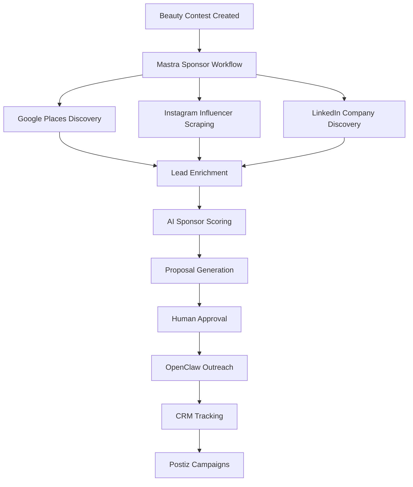

# Top OpenClaw + Apify + Instagram + LinkedIn Scrapers for Sponsors, Influencers & Event Leads

## Best Stack Recommendation

For your sponsorship/event platform, the strongest production combo is:

```text
OpenClaw
+ Apify
+ Playwright
+ Google Places
+ LinkedIn enrichment
+ Instagram scraping
+ Mastra orchestration
+ Supabase CRM
```

This gives you:

- sponsor leads
    
- influencer discovery
    
- nightlife partnerships
    
- local business outreach
    
- beauty/fashion sponsor pipelines
    
- geo-targeted sponsorship intelligence
    

---

# Top 10 Scrapers & OpenClaw Integrations

|Rank|Tool / Repo|Best For|Score|Why It Matters|
|---|---|---|--:|---|
|1|[Apify OpenClaw Integration](https://github.com/apify/apify-openclaw-integration?utm_source=chatgpt.com)|Universal scraping ecosystem|98/100|Access to 20k+ Actors for Instagram, LinkedIn, Maps, Google Search|
|2|[Apify OpenClaw Docs](https://docs.apify.com/platform/integrations/openclaw?utm_source=chatgpt.com)|Production architecture|96/100|Best official integration path|
|3|[OpenClaw Instagram Search Skill](https://clawskills.sh/skills/atyachin-instagram-search?utm_source=chatgpt.com)|Instagram influencer discovery|94/100|Search 400M+ profiles/posts/reels|
|4|[Apify Ultimate Scraper Skill](https://clawskills.sh/skills/protoss70-apify-ultimate-scraper?utm_source=chatgpt.com)|Multi-platform scraping|93/100|AI-powered universal scraper|
|5|[Apify Scrapers Marketplace](https://apify.com/scrapers/?utm_source=chatgpt.com)|Ready-made scrapers|92/100|Instagram, Facebook, Maps, TikTok|
|6|[OpenClaw Web Scraper Plugin](https://github.com/hvkeyn/openclaw-plugin-web-scraper?utm_source=chatgpt.com)|Generic website scraping|90/100|Good for sponsor sites and directories|
|7|[Decodo OpenClaw Skill](https://github.com/Decodo/decodo-openclaw-skill?utm_source=chatgpt.com)|Proxy + scraping infrastructure|89/100|Useful for anti-blocking and scaling|
|8|[OpenClaw Ultra Scraping](https://github.com/LeoYeAI/openclaw-ultra-scraping?utm_source=chatgpt.com)|Heavy scraping workflows|88/100|Large-scale extraction pipelines|
|9|[OpenClaw Browser Plugin](https://www.reddit.com/r/OpenClawUseCases/comments/1rfq10v/openclaw_browser_plugin/?utm_source=chatgpt.com)|LinkedIn/manual review workflows|84/100|Useful for enrichment and review|
|10|[Instagram DM Funnel Skill](https://www.reddit.com/r/openclaw/comments/1s6dnxn/new_skill_automate_instagram_dm_lead_capture_from/?utm_source=chatgpt.com)|Lead capture automation|82/100|IG comment → DM funnels|

---

# Best Real-World Use Cases

## 1. Beauty Sponsor Discovery

## Example

```text
Miss Medellín Finals
Need:
- makeup sponsors
- luxury brands
- salons
- wellness brands
```

Workflow:

```text
Google Places scrape
↓
Instagram scrape
↓
LinkedIn enrichment
↓
AI sponsor scoring
↓
Proposal generation
↓
CRM insertion
↓
Human-approved outreach
```

---

# 2. Influencer Discovery

## Example

```text
Find Medellín beauty influencers
with:
- female 18–30 audience
- fashion engagement
- nightlife overlap
```

OpenClaw + Apify:

- scrape profiles
    
- engagement metrics
    
- hashtags
    
- bio keywords
    
- location signals
    

Mastra:

- ranks best candidates
    
- generates outreach
    
- scores audience fit
    

---

# 3. Nightlife Sponsor Discovery

## Example

```text
Find nightlife sponsors near Provenza
```

ADK + Places:

- bars
    
- clubs
    
- rooftop lounges
    
- tequila brands
    
- vodka sponsors
    
- event venues
    

OpenClaw:

- extracts contact pages
    
- social links
    
- marketing emails
    
- event managers
    

---

# 4. Fashion Sponsor Discovery

## Example

```text
Find Medellín luxury fashion brands
for beauty contest sponsorship
```

Scrape:

- Instagram boutiques
    
- local fashion houses
    
- LinkedIn company pages
    
- shopping districts
    
- Medellín luxury businesses
    

Then AI:

- scores sponsor fit
    
- predicts activation potential
    
- generates proposals
    

---

# Best Sponsor Categories

|Category|Why Valuable|
|---|---|
|Beauty brands|Perfect demographic overlap|
|Liquor brands|Event/nightlife activations|
|Hotels|Tourism/event packages|
|Fashion boutiques|Beauty/fashion alignment|
|Gyms/wellness|Contestant sponsorships|
|Cosmetic clinics|Beauty demographic|
|Jewelry/luxury|Premium activations|
|Restaurants|Geo activations|
|Tech startups|AI/creator partnerships|
|Tourism companies|Medellín experience packages|

---

# Best Technical Stack

|Layer|Recommended Tool|
|---|---|
|AI UI|CopilotKit|
|Workflows|Mastra|
|Geo intelligence|Google ADK|
|Scraping ecosystem|Apify|
|Browser automation|OpenClaw|
|Social publishing|Postiz|
|Database|Supabase|
|Semantic matching|pgvector|
|Maps|Google Places API|
|Proxies|Decodo/BrightData|

---

# Best Architecture

```text
CopilotKit
↓
Mastra workflows
↓
ADK geo intelligence
↓
OpenClaw browser actions
↓
Apify scrapers
↓
Supabase CRM
↓
Postiz campaigns
```

---

# Best Workflow Example

## Sponsor Lead Pipeline



---

# Important Operational Reality

## Best strategy

Use:

- Apify for structured scraping
    
- OpenClaw for orchestration/browser automation
    
- Mastra for workflows
    
- ADK for geo intelligence
    

NOT:

- raw uncontrolled scraping everywhere
    

Apify is more stable/scalable than pure browser automation alone. ([Apify](https://apify.com/integrations/openclaw?utm_source=chatgpt.com "Integrate Apify with OpenClaw · Apify"))

---

# Biggest Risk Areas

|Risk|Solution|
|---|---|
|Instagram blocking|Proxy rotation|
|LinkedIn restrictions|Rate limiting|
|Browser instability|Apify-first architecture|
|Spam behavior|Approval gates|
|Compliance risk|Human review|
|AI hallucinated leads|Deterministic enrichment|
|OpenClaw overreach|Sandboxed workflows|

---

# Most Valuable AI Features

|Feature|Value|
|---|--:|
|AI sponsor scoring|10/10|
|AI influencer discovery|10/10|
|Geo sponsor intelligence|9.5/10|
|AI outreach generation|9.5/10|
|AI proposal generation|9/10|
|AI activation planning|9/10|
|AI CRM enrichment|9/10|
|AI campaign orchestration|9/10|

---

# Final Recommendation

## Best production strategy

### Core MVP

Use:

- Apify
    
- OpenClaw
    
- Mastra
    
- CopilotKit
    
- Supabase
    
- Postiz
    

Build:

- sponsor discovery
    
- influencer discovery
    
- proposal generation
    
- CRM workflows
    
- geo sponsor intelligence
    

---

## Advanced later

Add:

- autonomous campaign optimization
    
- AI negotiation assistants
    
- predictive ROI
    
- advanced social listening
    
- real-time geo heatmaps
    
- automated influencer funnels
    

---

# Most Important Insight

The real opportunity is NOT:

```text
scraping leads
```

It is:

```text
building AI-powered experiential sponsorship intelligence
```

That becomes:

- much more defensible
    
- much higher value
    
- much harder to copy
    
- significantly larger than event software alone.