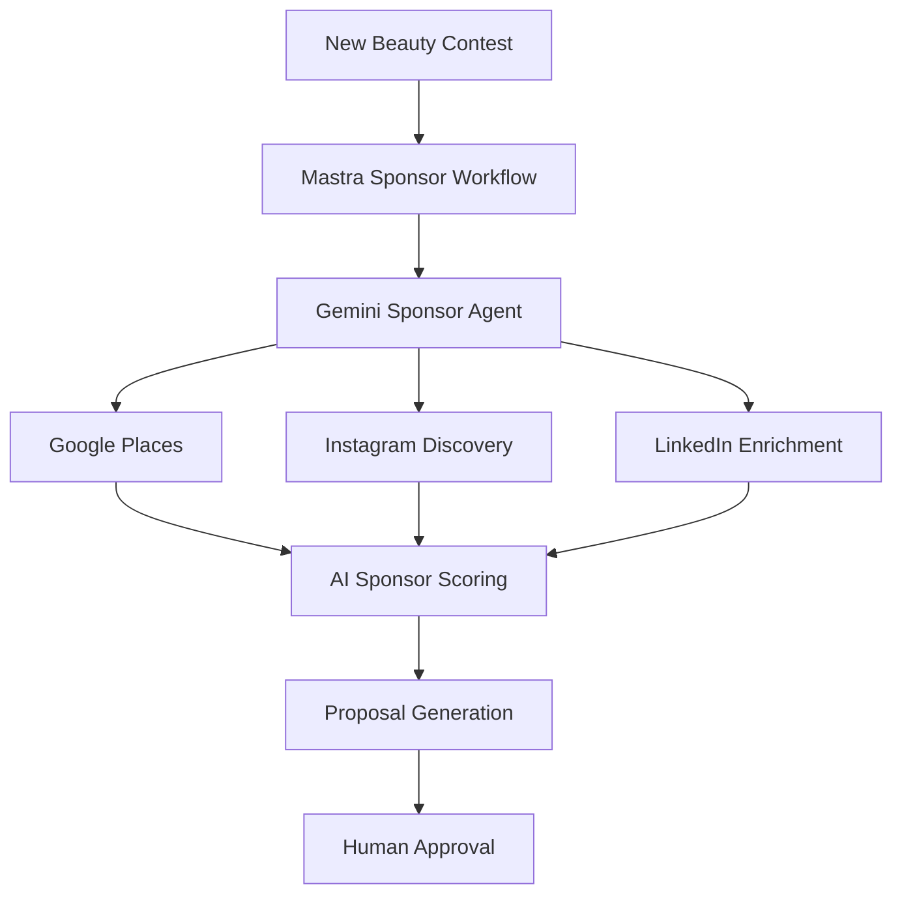

# [Gemini 3.5 Flash Official Release](https://blog.google/innovation-and-ai/models-and-research/gemini-models/gemini-3-5/?utm_source=chatgpt.com) — Best New Features for Events & Contests

## Overall Rating

|Category|Score|
|---|--:|
|Agent workflows|10/10|
|Speed|10/10|
|Multi-step orchestration|10/10|
|Real-time UX|9.5/10|
|Event/contest AI fit|9.5/10|
|Marketing automation|9.5/10|
|Sponsorship intelligence|9/10|
|Geo/event intelligence|9/10|
|Cost efficiency|9.5/10|
|Production readiness|9/10|

---

# Biggest Gemini 3.5 Flash Features

|Feature|Why It Matters for mdeai|
|---|---|
|Long-horizon agentic workflows|Multi-step event/sponsor workflows|
|Faster than frontier models|Real-time contest/event UX|
|Strong tool calling|Perfect for Mastra + ADK|
|Subagent orchestration|Sponsor agents, marketing agents, moderation agents|
|Better multimodal reasoning|Contest photos/videos/maps|
|Interactive UI generation|CopilotKit generative UI|
|Better coding/tool use|Event automations/workflows|
|Lower latency|Live voting + live events|
|Rich graphics/UI generation|Leaderboards, dashboards, campaign visuals|
|Agent collaboration|Multi-agent sponsor pipelines|

Google says Gemini 3.5 Flash is specifically optimized for:

- agents
    
- tool usage
    
- coding
    
- multi-step workflows
    
- collaborative subagents ([blog.google](https://blog.google/innovation-and-ai/models-and-research/gemini-models/gemini-3-5/?utm_source=chatgpt.com "Gemini 3.5: frontier intelligence with action"))
    

---

# Top 10 Best Uses for Events & Contests

|Rank|Use Case|Gemini 3.5 Benefit|Score|
|---|---|---|--:|
|1|AI marketing campaigns|Fast multi-step generation|10/10|
|2|Sponsor lead workflows|Long-running agents|10/10|
|3|Live event copilots|Low latency|9.8/10|
|4|Contestant AI coaching|Conversational + multimodal|9.7/10|
|5|AI influencer discovery|Tool orchestration|9.5/10|
|6|Geo sponsorship intelligence|ADK + Maps integration|9.5/10|
|7|Voting moderation AI|Fast anomaly analysis|9.4/10|
|8|Live streaming overlays|Rich interactive UI|9.3/10|
|9|WhatsApp campaign agents|Fast personalization|9.2/10|
|10|Sponsor proposal generation|Long-context reasoning|9.2/10|

---

# Why Gemini 3.5 Flash Is Important for mdeai

## Previous AI limitation

Older models struggled with:

```text
long workflows
multi-agent orchestration
real-time responsiveness
large-scale automation
```

---

# Gemini 3.5 Flash changes this

Google is explicitly positioning Gemini 3.5 Flash as:

```text
AI for agents
not just chatbots
```

([TechCrunch](https://techcrunch.com/2026/05/19/with-gemini-3-5-flash-google-bets-its-next-ai-wave-on-agents-not-chatbots/?utm_source=chatgpt.com "With Gemini 3.5 Flash, Google bets its next AI wave on agents, not chatbots | TechCrunch"))

This is perfect for your architecture:

```text
CopilotKit
↓
Mastra workflows
↓
Gemini 3.5 Flash agents
↓
ADK + Maps + tools
↓
OpenClaw/Postiz automations
```

---

# Best Features for Beauty Contests

## 1. AI Sponsor Agent

Gemini 3.5 Flash can:

```text
search
analyze
score
propose
compare
generate outreach
```

across:

- sponsors
    
- influencers
    
- nightlife venues
    
- beauty brands
    
- fashion companies
    

Very strong fit.

---

# Example Workflow



---

# 2. AI Contest Marketing

Gemini 3.5 Flash is ideal for:

- Instagram campaigns
    
- TikTok ideas
    
- reels scripts
    
- sponsor campaigns
    
- WhatsApp campaigns
    
- influencer outreach
    
- geo-targeted promotions
    

---

# Real-World Example

```text
"Promote Miss Medellín Finals
to luxury nightlife audience in Provenza"
```

Gemini can:

- generate campaigns
    
- create captions
    
- suggest creators
    
- generate sponsor activations
    
- personalize content
    

very quickly.

---

# 3. Multi-Agent Workflows

One of the biggest upgrades.

Google now heavily emphasizes:

- subagents
    
- collaborative agents
    
- multi-step orchestration ([blog.google](https://blog.google/innovation-and-ai/models-and-research/gemini-models/gemini-3-5/?utm_source=chatgpt.com "Gemini 3.5: frontier intelligence with action"))
    

Perfect for:

|Agent|Responsibility|
|---|---|
|sponsorAgent|Finds sponsors|
|marketingAgent|Creates campaigns|
|venueAgent|Finds locations|
|influencerAgent|Finds creators|
|moderationAgent|Detects fraud|
|WhatsAppAgent|Runs campaigns|
|conciergeAgent|Helps contestants/fans|

---

# 4. Live Event Features

Gemini 3.5 Flash is fast enough for:

- live leaderboards
    
- live AI commentary
    
- live sponsor overlays
    
- real-time recommendations
    
- audience engagement
    
- AI event copilots
    

Huge opportunity.

---

# Example

During finals:

```text
"Which contestant is trending tonight?"
```

AI instantly analyzes:

- votes
    
- social engagement
    
- livestream interactions
    
- sponsor performance
    

---

# 5. Better CopilotKit Experiences

Google specifically highlighted:

- richer graphics
    
- interactive UI
    
- dynamic generative interfaces ([blog.google](https://blog.google/innovation-and-ai/models-and-research/gemini-models/gemini-3-5/?utm_source=chatgpt.com "Gemini 3.5: frontier intelligence with action"))
    

Perfect for:

- sponsor cards
    
- voting cards
    
- campaign dashboards
    
- event timelines
    
- influencer workspaces
    

---

# 6. WhatsApp AI Campaigns

Gemini 3.5 Flash is ideal for:

|WhatsApp Use Case|Benefit|
|---|---|
|Contest reminders|Fast personalization|
|Voting reminders|Real-time engagement|
|Sponsor activations|Dynamic campaigns|
|Contestant onboarding|AI concierge|
|Fan engagement|Conversational experiences|
|Event updates|Live automation|

---

# 7. Geo Intelligence + ADK

Gemini 3.5 Flash + ADK is extremely strong.

Example:

```text
"Find nightlife sponsors near Provenza
for beauty contest after-party"
```

ADK:

- grounded places
    
- routes
    
- nearby venues
    

Gemini:

- ranking
    
- recommendations
    
- activation ideas
    
- campaign generation
    

---

# 8. OpenClaw + Gemini 3.5

Massive opportunity.

Gemini 3.5 Flash is designed for:

- long-running workflows
    
- orchestration
    
- tool usage
    
- subagents
    

Excellent for OpenClaw.

---

# Example

```text
Every day:
- search for sponsors
- try new search terms
- enrich leads
- generate outreach
- queue approvals
```

This is exactly the type of workflow Google is targeting with Gemini 3.5 Flash. ([blog.google](https://blog.google/innovation-and-ai/models-and-research/gemini-models/gemini-3-5/?utm_source=chatgpt.com "Gemini 3.5: frontier intelligence with action"))

---

# 9. Best Tech Stack

|Layer|Best Tool|
|---|---|
|AI UX|CopilotKit|
|Workflows|Mastra|
|Core AI|Gemini 3.5 Flash|
|Geo intelligence|ADK + Maps|
|Database|Supabase|
|Semantic search|pgvector|
|Browser automation|OpenClaw|
|Social publishing|Postiz|
|Payments|Stripe|
|Live updates|Supabase Realtime|

---

# 10. Biggest Strategic Advantage

Most event platforms use AI like:

```text
chatbot helper
```

Your architecture can use Gemini 3.5 Flash as:

```text
agentic orchestration engine
```

That is much more powerful.

---

# Final Recommendation

## Best Usage Strategy

### CORE / MVP

Use Gemini 3.5 Flash for:

- sponsor workflows
    
- marketing workflows
    
- campaign generation
    
- contestant onboarding
    
- conversational UI
    
- geo recommendations
    
- event copilots
    

---

## POST-MVP

Add:

- collaborative subagents
    
- autonomous optimization
    
- AI sponsorship intelligence
    
- predictive analytics
    
- live streaming AI overlays
    
- advanced OpenClaw orchestration
    

---

# Final Score — Gemini 3.5 Flash for mdeai

|Area|Score|
|---|--:|
|Events|9.5/10|
|Contests|9.6/10|
|Sponsorships|9.5/10|
|Marketing|10/10|
|OpenClaw orchestration|9.7/10|
|CopilotKit integration|9.5/10|
|Mastra workflows|10/10|
|ADK + Maps|9.4/10|
|Live engagement|9.3/10|
|Overall fit for mdeai|9.7/10|

Gemini 3.5 Flash is one of the strongest current models for the exact type of:

- agentic
    
- workflow-heavy
    
- event-driven
    
- multi-tool
    
- real-time
    
- AI orchestration
    

platform you are building. ([blog.google](https://blog.google/innovation-and-ai/models-and-research/gemini-models/gemini-3-5/?utm_source=chatgpt.com "Gemini 3.5: frontier intelligence with action"))