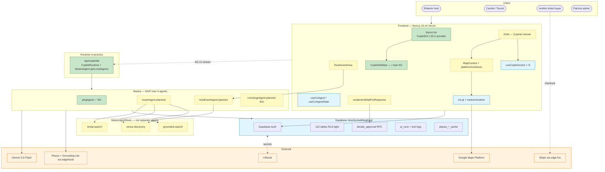

# 01 — Phase-1 system architecture

> Target topology for `mdeapp/`: Next.js 16 + CopilotKit **1.55.2** + Mastra + vis.gl. **Today:** `pingAgent` only — dashed boxes = planned MVP. Canon: [`plan/prd/02-core-architecture.md`](../prd/02-core-architecture.md), [`03-runtime-orchestration.md`](../prd/03-runtime-orchestration.md).

**Phase 2 (not in diagram):** Lingui ES/EN · `extended-component-library` · pgvector rental search · OpenClaw batch ([`06-openclaw-integration.md`](./06-openclaw-integration.md)).
