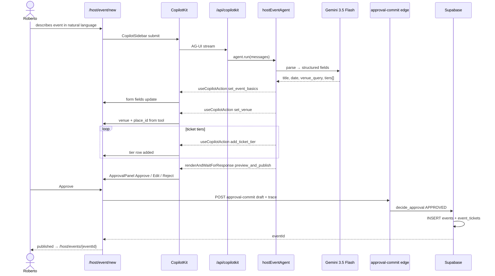

# 02 — Roberto creates an event via AI form-fill + HITL approval

> Phase-1 hero flow (PR-3). Roberto at `/host/event/new`; `hostEventAgent` fills the form via `useCopilotAction` handlers; HITL commits via `approval-commit` + `decide_approval()`. **UI: English Phase 1** (input may be Spanish). Canon: [`plan/prd/05-events-ticketing.md`](../prd/05-events-ticketing.md).

