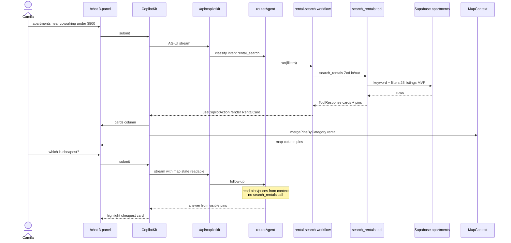

# 03 — Camila rental chat + comparative turn

> `/chat` three-panel (PR-1 + PR-5). **routerAgent** dispatches **rental-search** workflow; pins via **MapContext** (read-only `useCoAgentState`). MVP search = **keyword/filters**, not pgvector. Canon: [`plan/prd/04-maps-grounding.md`](../prd/04-maps-grounding.md), [`06-rentals-leads.md`](../prd/06-rentals-leads.md).

