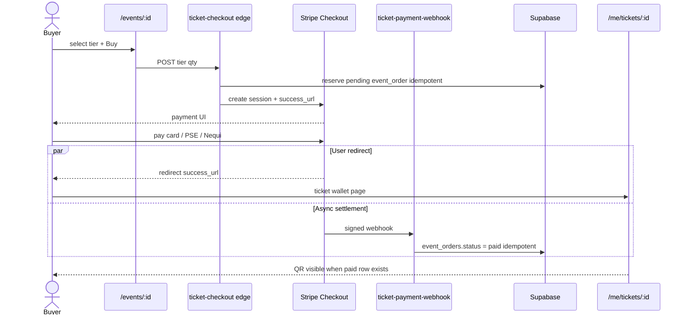

# 05 — Ticket purchase (Stripe sequence)

> Buyer (Andrés or Camila) on `/events/:id`. **Webhook updates DB only** — user redirect comes from Checkout **success_url**. Canon: [`plan/prd/05-events-ticketing.md`](../prd/05-events-ticketing.md).

