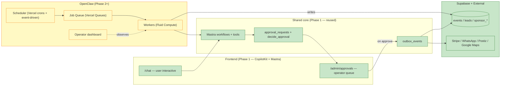

# 06 — OpenClaw integration with CopilotKit + Mastra (Phase 2+)

> **Not MVP** — [`advanced.md`](../../advanced.md). Background automation drops in without replacing CK+Mastra. OpenClaw never bypasses `approval_requests`. `outbox_events` = planned seam (may not exist in DB yet).

