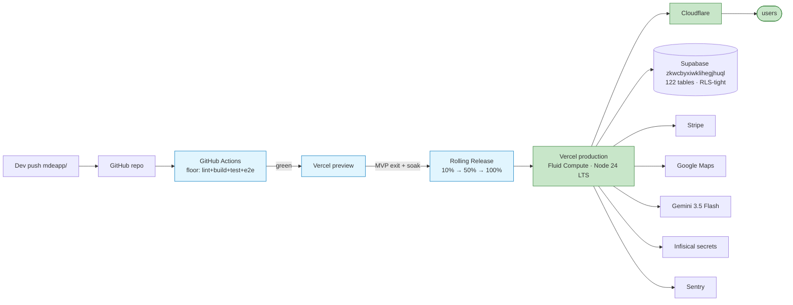

# 07 — Production deployment + cutover

> Vercel pipeline: push → CI (`npm run floor` when wired) → preview → **MVP exit soak** → rolling 10/50/100%. App path: `mdeapp/`. Canon: [`plan/prd/09-operations-security.md`](../prd/09-operations-security.md).

