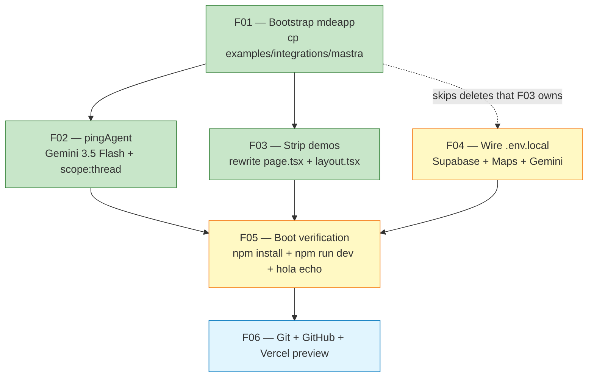

# 08 — Week 1 bootstrap task dependency graph

> The 6 foundation tasks (F01–F06) and their order. F01 + F02 + F03 are Day 1; F04 + F05 are Day 2; F06 is Day 3. End-of-week-1 = "hola" echoes in Vercel preview.

## Critical-path notes

- **F01 is blocking** for F02 + F03 (you need the example tree present before edits).
- **F02 + F03 + F04 are parallelizable on day 2.** Different files, no conflicts.
- **F05 (boot) must follow all three** — if F02 / F03 / F04 are incomplete, dev server fails.
- **F06 is gated by F05 passing.** Do not push a broken bootstrap to GitHub.

## Estimated wall-clock

| Day | Tasks | Wall-clock |
|---|---|---|
| Day 1 (~2h) | F01 + F02 + F03 | 30 min + 45 min + 45 min |
| Day 2 (~1h) | F04 + F05 | 20 min + 40 min (incl. `npm install`) |
| Day 3 (~30m) | F06 | git + gh + Vercel hookup |
