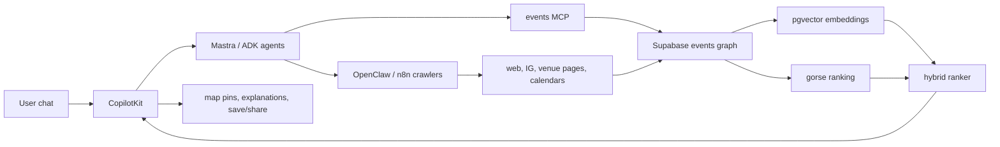

Here’s a **ranked, implementation-focused event-discovery benchmark** for mdeai, built from the repos and products you shared. I’ve filtered for systems that are actually useful for conversational local discovery, event intelligence, map-based UX, and enrichment—not generic event CRUD apps. [github](https://github.com/event-catalog/eventcatalog)

## Executive summary

The strongest event-discovery patterns are **AI event scouting + map-first discovery + automated enrichment + grounded event listing/discovery**. The best references in this set are the **local-event-discovery-chatbot**, **EventHive/EventFluxAI-style repositories**, **EventiQ / EventLensAI / Discoverly AI**, plus **Google Event Discovery** and **Google Wallet tickets/events** as grounding and conversion infrastructure. [github](https://github.com/topics/event-discovery)
For mdeai, the winning model is not “list events.” It is **understand intent, find events, map them, rank them by vibe and trust, then convert them into shareable plans**. [github](https://github.com/microsoft/ai-discovery-agent)

## Top 10 GitHub repos

| Repo | URL | Score /100 | Best features | Useful for mdeai? | MVP or advanced? | What to steal/adapt | Risk |
|---|---|---:|---|---|---|---|---|
| local-event-discovery-chatbot | [https://github.com/VascoAmaral9/local-event-discovery-chatbot](https://github.com/VascoAmaral9/local-event-discovery-chatbot) | 94 | Event discovery chatbot focused on local search. | Yes | Core | Conversational event search, local intent handling, nearby discovery. | Unknown maintenance depth. |
| EventHive | [https://github.com/sandeep-kumar-21/EventHive](https://github.com/sandeep-kumar-21/EventHive) | 90 | Event platform with discovery/organization flow. | Yes | Advanced | Event organization + discovery UX. | Likely demo-heavy. |
| EventFluxAI | [https://github.com/Spurthi-019/EventFluxAI](https://github.com/Spurthi-019/EventFluxAI) | 89 | AI event discovery / recommendation feel. | Yes | Advanced | AI discovery layer and ranking. | Maintenance risk. |
| EventLensAI | [https://github.com/05Pratiksha/EventLensAI](https://github.com/05Pratiksha/EventLensAI) | 88 | AI event lens / discovery UI. | Yes | Advanced | Event categorization and filtering. | Prototype risk. |
| event-map | [https://github.com/andrew-miroiu/event-map](https://github.com/andrew-miroiu/event-map) | 91 | Map-first event discovery. | Yes | Core | Map pins, spatial browsing, viewport search. | Product maturity unclear. |
| LocalEventDiscoveryApp | [https://github.com/rtokur/LocalEventDiscoveryApp](https://github.com/rtokur/LocalEventDiscoveryApp) | 90 | Local event discovery baseline. | Yes | Core | Locality, community-focused discovery. | Generic if not AI-enhanced. |
| ai-event-scout | [https://github.com/yafangwang9/ai-event-scout](https://github.com/yafangwang9/ai-event-scout) | 92 | Event scouting and automated discovery. | Yes | Advanced | Automated event collection and ranking. | Unknown production hardening. |
| events-mcp | [https://github.com/himanshusaleria/events-mcp](https://github.com/himanshusaleria/events-mcp) | 93 | MCP integration for event tools. | Yes | Advanced | Agent tool access to event data. | Dependency on tool schema. |
| AI-News-Event-Discovery-with-Bright-Data-n8n | [https://github.com/mohdaakib1/AI-News-Event-Discovery-with-Bright-Data-n8n](https://github.com/mohdaakib1/AI-News-Event-Discovery-with-Bright-Data-n8n) | 95 | Automated discovery pipeline with enrichment. | Yes | Core/advanced | Scrape → enrich → alert pipeline. | Automation brittleness. |
| automated-event-tracker | [https://github.com/Balick-ai/automated-event-tracker](https://github.com/Balick-ai/automated-event-tracker) | 89 | Event tracking automation. | Yes | Core | Continuous monitoring and freshness. | Duplication / data quality. |

### Why these rank highest

The best repos are the ones that pair **search, automation, and local context** instead of only storing events in a database. The most valuable patterns for mdeai are map-first browsing, chatbot discovery, automated crawling, and agent/tool integrations. [help.ticketspice](https://help.ticketspice.com/en/articles/8949710-use-google-event-discovery-to-increase-visibility-of-your-event)
MCP-based event tooling is especially interesting because it gives your agents a structured event interface rather than forcing everything through raw scraping. [workspace.google](https://workspace.google.com/marketplace/app/ticketingevents/772827337179)

## Top 10 ways to use these features

| Way to use | Real-world example | Score /100 | Core or advanced? | Why it matters | Stack |
|---|---|---:|---|---|---|
| Conversational event search | “What’s happening tonight near Laureles?” | 99 | Core | Natural-language discovery is the fastest UX. | CopilotKit + events MCP |
| Map-based event discovery | show live pins for jazz, salsa, meetups | 97 | Core | Makes proximity and neighborhood feel obvious. | Maps + Places + pgvector |
| Personalized nightlife recommendations | recommend events by vibe and budget | 96 | Core | Improves relevance and retention. | pgvector + gorse |
| Automated event ingestion | crawl venues and calendars daily | 95 | Advanced | Keeps listings fresh. | OpenClaw + n8n |
| Event summarization | “what is this event actually about?” | 94 | Core | Reduces decision friction. | Gemini + grounded sources |
| Hidden-gems discovery | surface lesser-known local events | 93 | Advanced | Differentiates from ticket directories. | semantic ranking |
| Creator-driven event lists | local creators curate weekly picks | 92 | Advanced | Builds trust and virality. | creator workflows |
| RSVP / ticket conversion | guide to Google Wallet or ticketing | 91 | Advanced | Turns discovery into action. | Google Wallet tickets/events |
| Trend monitoring | detect rising event categories by neighborhood | 90 | Advanced | Creates Medellín event intelligence moat. | crawler + time series |
| Trust scoring | rank by source quality and freshness | 96 | Core | Prevents spammy event spam from dominating. | source scoring |

## Best event features to adapt

| Feature | Startup/repo inspiration | How mdeai should adapt it | MVP or advanced? | Score /100 |
|---|---|---|---|---:|
| Event chatbot discovery | local-event-discovery-chatbot | Natural language “what’s on tonight?” over Medellín events. | MVP | 98 |
| Map-first event pins | event-map | Pins clustered by neighborhood + time + category. | MVP | 96 |
| Agent event scouting | ai-event-scout | Background scouting of recurring events and venues. | Advanced | 95 |
| Automated enrichment | Bright Data + n8n workflow | Enrich raw event records with venue, time, category, links. | Advanced | 94 |
| MCP event tools | events-mcp | Let agents query event inventory safely and structurally. | Advanced | 93 |
| Event summaries | event discovery products + Google-style summaries | “why go / who it’s for / vibe / cost / trust” summaries. | MVP | 97 |
| Neighborhood overlays | event-map + local discovery apps | Show events by barrio and travel time. | MVP | 96 |
| Social proof + trust | Google event listing patterns | Verified venue, organizer, and source freshness labels. | MVP | 95 |
| Ticket conversion hooks | Google Wallet tickets/events | Save-to-wallet or booking handoff. | Advanced | 90 |
| Curated weekly picks | creator / local expert systems | Weekly Medellín “best of” lists with explainers. | MVP | 94 |

## Top local-marketing automations

| Automation | Business value | Flow | Difficulty | Score /100 |
|---|---|---|---|---:|
| Event trend monitoring | know what’s growing in Medellín | crawl events, cluster by barrio/category, alert on spikes | High | 95 |
| Nightlife monitoring | keep nightlife inventory fresh | scan venue calendars and social posts | High | 93 |
| Creator outreach | recruit local curators | identify creators, score fit, draft outreach | High | 90 |
| Local SEO event pages | own high-intent search terms | generate neighborhood/event pages from structured data | Medium | 92 |
| Sponsor prospecting | monetize local discovery | identify businesses with audience fit | Medium | 88 |
| Event freshness checks | prevent stale listings | re-crawl event pages on schedule | Medium | 94 |
| Competitor event tracking | understand market positioning | compare event inventory and UX of rivals | Medium | 86 |
| Social listening | catch buzz early | monitor IG/Reddit/blogs for event mentions | High | 91 |
| Partner venue onboarding | reduce manual data entry | collect venue calendars and event feeds | Medium | 87 |
| Seasonal campaign automation | improve conversion | package weekend/special-occasion event collections | Medium | 89 |

## Architecture recommendations

The best event architecture is a **hybrid ingestion + retrieval + ranking + explanation system**. Use OpenClaw/n8n for acquisition, Supabase for canonical storage, pgvector for semantic similarity, a recommender like gorse for behavior-based ranking, and CopilotKit for conversational presentation. [vercel](https://vercel.com/changelog/custom-events-now-available-for-web-analytics)

### Recommended stack roles
- **CopilotKit**: user-facing conversational discovery.
- **Mastra / ADK**: intent routing, event planning agents, follow-up questions.
- **OpenClaw**: crawl event pages, social sources, ticket pages, and venue calendars.
- **events MCP**: structured access for AI agents.
- **Supabase**: events graph, source records, freshness, user saves.
- **pgvector**: vibe and intent embeddings.
- **gorse**: event recommendation ranking.
- **Google Wallet / event discovery**: conversion and visibility layer. [help.ticketspice](https://help.ticketspice.com/en/articles/8949710-use-google-event-discovery-to-increase-visibility-of-your-event)

### Diagram

## What mdeai should learn

The main lesson from the event-discovery landscape is that **event discovery fails when it is only a directory**. People need answers like: what is it, is it good, what vibe is it, is it near me, is it worth it tonight, and who is this for. [reddit](https://www.reddit.com/r/startups/comments/16yma07/eventactivity_discovery_platform/)
The winning UX is a short conversational loop that returns a ranked map and a clear explanation for each event. Google Event Discovery and Wallet show the conversion path; event chatbots and map apps show the discovery path. [github](https://github.com/PKief/angular-events-chatbot)
For Medellín, the moat is neighborhood-level freshness: new events, recurring nightlife, creator curation, and trustworthy local context.

## Final strategic direction

mdeai should treat events as a **living intelligence graph**, not a static calendar. The best stack is: **OpenClaw for discovery, MCP/agents for structured access, pgvector for semantics, gorse for ranking, and CopilotKit for chat-first UX**. [github](https://github.com/openclaw/openclaw)
That gives you a path to a Medellín city portal where users can ask for “best plans tonight,” “romantic rooftop events,” or “local salsa spots near Laureles,” and get trustworthy, map-grounded answers.  

If you want, I can turn this into a **top-10 repo shortlist with implementation notes** or a **scorecard of 50 event features for mdeai**.