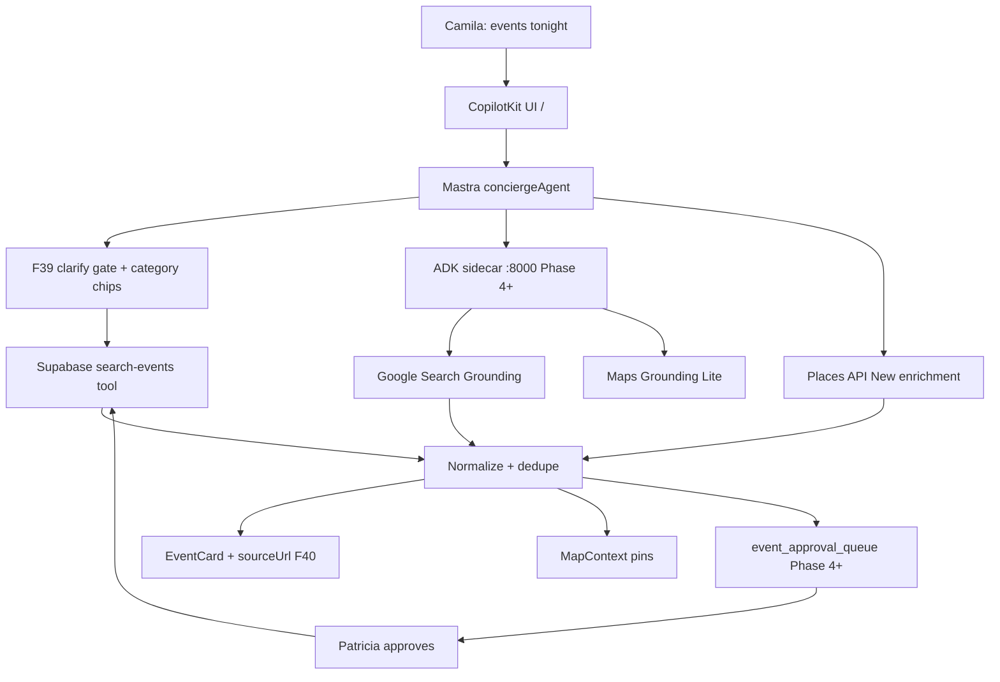

# Event grounding architecture (mdeai)

**Status:** Approved planning doc (F41) — **no `mdeapp/src` implementation** in this task.  
**Owner personas:** Camila (discovery), Patricia (approval), Sofía (phase gates)  
**Backlog:** [`tasks/events/F42-event-web-discovery-task-pack.md`](../../tasks/events/F42-event-web-discovery-task-pack.md)

## Core rule (non-negotiable)

> **Supabase owns truth.** Web search **discovers**; human approval **writes**.

MVP and Phase 1 must never treat Google Search Grounding, Firecrawl, or OpenClaw output as authoritative event rows. Those layers propose candidates; only Patricia-approved (or Roberto host-published) flows insert into `events` / ticket inventory.

## System diagram

## Phase placement

| Phase | Layer | Ship when | MVP? |
|------:|-------|-----------|------|
| 1 | Supabase `search-events` + EventCard + map pins | F15, SCREEN-006 | ✅ |
| 2 | Places venue enrichment on event rows | MAP + F40 trusted sources | partial |
| 3 | F39 clarify gate + category chips + trusted source hints | W6 polish | ✅ |
| 4 | Google Search Grounding via ADK (`Tool.googleSearch`) | F42 EVT-D04–D05 | ❌ post-MVP |
| 5 | Contest discovery + `discovered_events` dedupe tables | F42 EVT-D02–D03 | ❌ |
| 6 | OpenClaw verification/outreach | F42 EVT-D08 (plan only, gated) | ❌ never MVP |

## Stack roles

| Layer | Role in event discovery | Phase 1 |
|-------|-------------------------|---------|
| CopilotKit **1.55.2** | Chat UI, generative cards, HITL hooks | ✅ |
| Mastra | `conciergeAgent` → `eventAgent` / `eventDiscoveryWorkflow` | ✅ |
| Supabase | Source of truth (`events`, RLS, `search-events`) | ✅ |
| Gemini **3.5 Flash** | Agent model (`google/gemini-3.5-flash`) | ✅ |
| F40 trusted registry | Prompt hints + card `sourceUrl` attribution | ✅ |
| Google Search Grounding | Fresh web discovery (`groundingMetadata`) | ❌ post-MVP |
| Maps Grounding Lite | Venue facts via `tools.googleMaps` | partial (ADK dev) |
| Places API New | `place_id`, photos, field masks | partial |
| ADK `:8000` | Google tool orchestration sidecar | dev only |
| OpenClaw | Automation / outreach | ❌ never MVP |
| Stripe | Ticket checkout only | ✅ (G1) |

## MVP vs post-MVP boundary

**In scope today (Camila on `/`):**

- Clarify ambiguous queries (F39) before calling `search-events`.
- Category chips route intent without forcing DB search on generic prompts.
- Cards show optional **Source** link from [`trusted-event-sources.ts`](../../mdeapp/src/lib/events/trusted-event-sources.ts) (F40).
- Pins sync via existing MapContext path (single writer invariant).

**Explicitly deferred (do not ship without F42 + approval UI):**

- Writing grounding chunks directly into `events`.
- Auto-publish from web crawl or OpenClaw.
- New tables (`discovered_events`, `event_approval_queue`) without EVT-D02 spec + RLS.
- Mixing CopilotKit v2 hooks with Phase 1 v1 runtime.

## Grounding compliance (Phase 4+)

When EVT-D05 enables Search Grounding, UI must comply with Google display requirements:

- Show **Google Search suggestions** when `groundingMetadata.searchEntryPoint.renderedContent` is present.
- Show **sources** from `groundingChunks` / `groundingSupports` (inline + aggregate), same pattern as Maps grounding citations.

Official references (verified via Google Developer Knowledge MCP, 2026-05-20):

- [Gemini API — Grounding with Google Search](https://ai.google.dev/gemini-api/docs/google-search)
- [Gemini API — Maps grounding](https://ai.google.dev/gemini-api/docs/maps-grounding)
- [Firebase AI Logic — display grounded results](https://firebase.google.com/docs/ai-logic/grounding-google-search#use-and-display-grounded-result)
- [Gemini API terms — Grounding with Google Search](https://ai.google.dev/gemini-api/terms#grounding-with-google-search)

## CopilotKit + Mastra integration (Phase 1)

Pattern 1 only: in-process Mastra via `getLocalAgentsWithLogging` in `POST /api/copilotkit`. Agent keys must match `useCoAgent({ name })` (`conciergeAgent`, `hostEventAgent`).

Official reference:

- [CopilotKit — Mastra integration](https://docs.copilotkit.ai/integrations/mastra)
- [CopilotKit — shared state / working memory](https://docs.copilotkit.ai/integrations/mastra/shared-state)

## Data flow summary

1. **Camila** asks in chat → **conciergeAgent** classifies event intent.
2. **F39 gate** — generic “list events” → clarify category/date; specific query → `search-events`.
3. **Supabase** returns RLS-scoped rows → **EventCard** + pins.
4. **Phase 4+** — ADK returns grounded candidates → **normalize/dedupe** → **approval queue** → Patricia → Supabase write.
5. **Tickets** — Andrés/Miguel path stays Stripe-isolated (unchanged).

## Implementation backlog

All executable work lives in **F42** (`EVT-D01` … `EVT-D11`). Do not start EVT-D02+ until MVP exit criteria (G1 paid + 14/20 screens) and F41 sign-off recorded in [`tasks/notes/F41-evidence.md`](../../tasks/notes/F41-evidence.md).

## Related docs

- [`docs/events/trusted-sources.md`](../../docs/events/trusted-sources.md) — F40 registry
- [`tasks/events/F-39-prompt-event-search.md`](../../tasks/events/F-39-prompt-event-search.md) — clarify + chips source
- [`plan/mastra/github/14-mastra-system-check.md`](../mastra/github/14-mastra-system-check.md) — MASTRA-005 gate
- [`mdeapp/docs/ARCHITECTURE.md`](../../mdeapp/docs/ARCHITECTURE.md) — runtime invariants
