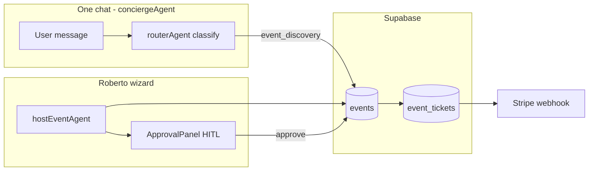

# mdeai Events Module — Expert Vision + GitHub Comparative Report

## Executive summary

**27 repos** were reviewed across three list files. **None** should replace the mdeai foundation:

**CopilotKit 1.55.2 + Mastra + Supabase + Stripe + Google Maps + Gemini** (`mdeapp/`).

| Finding | Implication for Roberto / Andrés / Patricia |
|--------|---------------------------------------------|
| Best **orchestration** patterns | [microsoft/spec-to-agents](https://github.com/microsoft/spec-to-agents), [iliazlobin/events-planner-agents](https://github.com/iliazlobin/events-planner-agents), [odysseus7X/eventforge-ai](https://github.com/odysseus7X/eventforge-ai) |
| Best **production quote + evals** | [benjaminematton/venue-concierge](https://github.com/benjaminematton/venue-concierge) |
| Best **wizard + constraints** | [ArokyaMatthew/Eventflow.ai](https://github.com/ArokyaMatthew/Eventflow.ai) |
| Best **stack match (Next + Supabase)** | [alekhya6767/Gatherly](https://github.com/alekhya6767/Gatherly) |
| Best **ticketing feature set** (patterns only) | [HiEventsDev/hi.events](https://github.com/HiEventsDev/hi.events) — **AGPL-v3**, Laravel/React, do not copy code |
| Worst reuse | PartyRock demos, vanilla-JS “fake AI”, unmaintained CrewAI tutorials |

**Default path for mdeai:** **Path D** — native ticketing in `mdeapp` per PRD §51 W9, port legacy edge fns. **Path A** (Hi.Events Cloud API) only if ticket MVP must ship 4+ weeks earlier ([`plan/08-hi-events-decision.md`](../../plan/08-hi-events-decision.md)).

**Phase 1 focus:** one chat (`conciergeAgent`) + Roberto wizard (`hostEventAgent`) + Supabase `events` — not full EventForge-style 8-agent conference system.

**Product north star:** the events module should behave like a **Medellín events expert** — discovery, planning, and stakeholder coordination in one product surface, grounded in Supabase + Maps + Stripe (see § **Events module expert vision**).

---

## Events module expert vision

### What “expert” means for mdeai

Not a generic chatbot that invents venues or ticket prices. An expert **knows the catalog**, **respects constraints** (capacity, COP, dates, RLS), **routes each actor to the right workflow**, and **never auto-commits money or contracts** without human approval.

| Expert capability | User-visible outcome |
|-------------------|----------------------|
| **Discovery** | Tourist/Camila ask in plain English → ranked events from `public.events`, filters, map pins — zero hallucinated listings |
| **Planning** | Roberto describes a night in one sentence → wizard state fills (venue, tiers, schedule) with Places-backed facts |
| **Assistance** | Every stakeholder gets contextual next steps, drafts, and checklists — not eight separate apps |
| **Stakeholder literacy** | Speaks fluently to **venues, sponsors, vendors, staff, buyers, admins** — different tools, same platform memory where safe |
| **Operations** | Patricia sees sales, refunds, scan anomalies; door staff get a scan surface that works on weak Wi‑Fi |

### Module scope (five pillars)

```text
┌─────────────────────────────────────────────────────────────────┐
│  mdeai Events Module (CopilotKit + Mastra + Supabase)           │
├──────────────┬──────────────┬──────────────┬──────────────┬──────┤
│  DISCOVERY   │  PLANNING    │  COMMERCE    │ STAKEHOLDERS │ OPS  │
│  search,     │  host wizard,│  tiers,      │ venue,       │ admin│
│  cards, map  │  HITL publish│  checkout,   │ sponsor,     │ scan,│
│  one chat    │  templates   │  QR wallet   │ vendor, staff│ stats│
└──────────────┴──────────────┴──────────────┴──────────────┴──────┘
```

| Pillar | Primary surfaces | Mastra agents / tools | Data home |
|--------|------------------|----------------------|-----------|
| **Discovery** | `/`, `/chat`, `/rentals` (events intent) | `conciergeAgent` + `search-events` · `eventAgent` | `events`, Places grounding |
| **Planning** | `/host/event/new`, `/host/events` | `hostEventAgent` · `set_*` tools · `validationAgent` | `EventDraftState` → `events` |
| **Commerce** | `/events/:slug`, `/me/tickets` | `ticketingAgent` (assist only) · Stripe edge fns | `event_tickets`, orders, webhooks |
| **Stakeholders** | host chat, admin, partner views (P2+) | sponsor/vendor/venue **tools**, not separate UIs | CRM `leads`, venue Places IDs |
| **Operations** | `/admin/*`, `/staff/scan` | `opsAgent` · SQL-backed dashboards | `ai_runs`, order audit, scan logs |

### Stakeholders — who the module assists

| Stakeholder | Role in Medellín | Expert assistance (what AI does) | Human gate (what AI must not do alone) |
|-------------|------------------|----------------------------------|----------------------------------------|
| **Roberto** (host) | Creates nightlife / culture events | Form-fill wizard, tier suggestions, checklist from templates, marketing **drafts** | Publish event, set final prices, sign venue contracts |
| **Tourist / Camila** (attendee) | Finds things to do | NL search, filters, EventCards, “cheaper / this weekend” follow-ups in **one chat** | Charge cards (buy flow is explicit checkout) |
| **Andrés / Miguel** (buyer) | Purchases tickets | Tier picker, checkout guidance, wallet QR | Payment without Stripe UI |
| **Venue** (Baúl, warehouse, rooftop) | Space + capacity | Places lookup, capacity hints, run-of-show slot, **quote ranges** from grounded data | Confirm availability or pricing — no invented COP |
| **Sponsor** (brand, liquor, tech) | Funds or promotes events | Package tiers, ROI narrative, prospect list **drafts** (eventforge pattern) | Send contracts, charge sponsors, auto-email brands |
| **Vendor** (catering, AV, security) | Delivers services | Checklist items, vendor brief drafts, budget line suggestions | Book or pay vendors |
| **Door staff** | Scan at venue | Scan PWA, duplicate detection, offline queue | Override fraud bans (Patricia only) |
| **Patricia** (admin) | Ops + revenue | Refund assist, daily rollup questions, anomaly explanations | Execute refunds without confirm; change RLS |
| **Promoter / affiliate** (P2) | Drives ticket sales | Tracked links, commission reporting (Hi.Events pattern) | Payout without finance review |

### Discovery expert — behaviors to ship

| Behavior | Example prompt (Medellín) | Grounding rule | Repo pattern |
|----------|---------------------------|----------------|--------------|
| Hood + date search | “Live music El Poblado this Friday” | Query `events` + date window; map optional | Gatherly, Eventflow |
| Price / tier filter | “Free or under 50k COP” | Filter on ticket metadata | hi.events tiers |
| Follow-up without reset | “Anything cheaper?” | `useCoAgent` thread memory | plan diagram 03 |
| Grounded venue names | “Events at Baúl” | Places ID or stored venue on row | venue-concierge |
| Social planning (P2) | “Plan birthday for 8 friends” | Group vote + itinerary | Gatherly |

**Anti-pattern:** Tavily/Serper listing random global conferences — Medellín catalog first, external ingest Phase 2 only.

### Planning expert — behaviors to ship

| Behavior | Example prompt | Output | Repo pattern |
|----------|----------------|--------|--------------|
| One-sentence → draft | “Techno night Baúl, 150 cap, March 15, GA 40k COP” | `EventDraftState` populated | CK form-filling |
| Constraint validation | “200 tickets but venue holds 150” | Block publish with reason | Eventflow.ai CSP |
| Template checklist | “Corporate offsite 40 people” | Task list from event-planner-os | OpenClaw templates → Mastra tool |
| Venue intelligence | “Rooftop with city view, Laureles” | Places candidates + map pin | venue-concierge, Gather-Up-AI |
| HITL publish | “Looks good, ship it” | ApprovalPanel → edge commit | spec-to-agents, CK banking |

### Stakeholder-assist expert — behaviors by phase

| Stakeholder assist | Phase 1 (W3–W9) | Phase 2 | Phase 3 |
|--------------------|-----------------|---------|---------|
| Venue brief + capacity | Places + `set_venue` | Saved venue CRM, quote history | Preferred venue network |
| Sponsor package draft | — | `sponsorAgent` + HITL PDF | Affiliate + commission |
| Vendor / logistics checklist | event-planner-os tasks in wizard | `opsAgent` + `event_ops` JSON | Vendor marketplace |
| Marketing copy | Short description in wizard | `marketingAgent` — HITL before Postiz | GTM campaigns |
| Buyer support | Static FAQ + order status | Chat triage on order ID | — |

### Agent architecture (expert = right tool, not agent sprawl)

Expose **one primary agent per user surface**; specialists are **tools** or internal steps.

| User on… | Agent key | Internal tools (expert domains) |
|----------|-----------|----------------------------------|
| `/host/event/new` | `hostEventAgent` | `set_event_basics`, `set_venue`, `set_pricing`, `generate_checklist`, `validate_publish`, `draft_sponsor_package` (P2) |
| `/`, `/chat` | `conciergeAgent` | `classify_intent` → `search-events`, `search_rentals`, `search_restaurants` |
| `/admin/*` (P2) | `opsAgent` or SQL UI | `explain_sales_delta`, `draft_refund_summary` |
| Behind host publish | `validationAgent` | capacity, date, COP sanity, tier math |

**Deferred:** eight public agents (EventForge) — confuses Roberto; keep sponsor/speaker/GTM as **draft tools** with HITL.

### Knowledge the module must master (curriculum from clones)

| Domain | Source repos | mdeai implementation |
|--------|--------------|----------------------|
| Medellín event catalog | Supabase `events` + legacy data | F14–F15, F25 |
| Ticket commerce | Hi.Events clone, legacy Stripe fns | W9 Path D or A |
| Venue geography | Google Places + Maps | F16, `set_venue` |
| Planning templates | event-planner-os | Mastra checklist tool |
| Multi-stakeholder orchestration | spec-to-agents, events-planner-agents | router + tool delegation |
| Sponsor/speaker strategy | eventforge-ai | P2 tools only |
| Group discovery | Gatherly | P2 social |
| Production ops | EventFlow-AI | Patricia W8 |

### Expert quality bar (acceptance tests)

| # | Test | Persona |
|---|------|---------|
| 1 | “Events Poblado Friday” returns only DB rows (or empty + honest message) | Tourist |
| 2 | Roberto publish blocked when capacity &lt; tier sum | Roberto |
| 3 | Venue tool never returns COP without Places/organizer input | Roberto |
| 4 | Sponsor email **not** sent without ApprovalPanel | Sponsor path P2 |
| 5 | Andrés checkout → QR; Patricia refund leaves audit row | Andrés, Patricia |
| 6 | Follow-up “cheaper?” uses prior search context | Camila |
| 7 | Every agent turn logs to `ai_runs` (F13 ✅) | Sofía |

### Roadmap → expert maturity

| Maturity | Weeks | Discovery | Planning | Stakeholders | Commerce |
|----------|-------|-----------|----------|--------------|----------|
| **Foundational** | W1–W2 | `pingAgent` only | F33 types | — | — |
| **Host expert** | W3–W4 | `eventAgent` stub | F34–F38 wizard + HITL | venue tool | — |
| **City expert** | W5–W6 | F19 one-chat discovery | — | — | — |
| **Revenue expert** | W7–W9 | Event list + cards | tier assist | — | Stripe + QR |
| **Ecosystem expert** | W10+ | group plans | sponsor/vendor drafts | sponsorAgent | promos, affiliates |

---

## Scoring rubric (100 points)

| Dimension | Weight | What we measured |
|-----------|-------:|------------------|
| Product usefulness | 25 | Real organizer/buyer workflows, not demo-only |
| AI / agent quality | 20 | Multi-step tools, memory, evals, grounding — not fake rules |
| Event-planning relevance | 20 | Discovery, wizard, tickets, sponsors, ops, maps |
| Code / architecture | 15 | Tests, queues, RLS-ready backend, maintainability |
| UI / UX | 10 | shadcn/Next, mobile, HITL, generative cards |
| Reuse value for mdeai | 10 | Fits Mastra + CK + Supabase without stack swap |

**Honesty flags:** `⚠️ demo` · `⚠️ wrong stack` · `⚠️ license` · `⚠️ stale/low activity`

---

## Top 15 repos (unified rank)

| Rank | Repo | Total | Product | AI | Events | Arch | UX | Reuse | Flags |
|-----:|------|------:|------:|---:|-------:|-----:|---:|------:|-------|
| 1 | [microsoft/spec-to-agents](https://github.com/microsoft/spec-to-agents) | **94** | 24 | 19 | 19 | 14 | 8 | 10 | Microsoft Agent Framework; HITL + tools |
| 2 | [benjaminematton/venue-concierge](https://github.com/benjaminematton/venue-concierge) | **92** | 23 | 18 | 18 | 15 | 7 | 11 | Best quote flow + evals for marketplace |
| 3 | [iliazlobin/events-planner-agents](https://github.com/iliazlobin/events-planner-agents) | **91** | 22 | 20 | 19 | 14 | 6 | 10 | Coordinator + specialist blueprint |
| 4 | [odysseus7X/eventforge-ai](https://github.com/odysseus7X/eventforge-ai) | **90** | 23 | 19 | 18 | 12 | 6 | 12 | 8 agents: sponsor, speaker, venue, pricing, ops, GTM |
| 5 | [alekhya6767/Gatherly](https://github.com/alekhya6767/Gatherly) | **89** | 22 | 16 | 17 | 14 | 9 | 11 | **Next 16 + Supabase + shadcn** — closest stack cousin |
| 6 | [ArokyaMatthew/Eventflow.ai](https://github.com/ArokyaMatthew/Eventflow.ai) | **89** | 22 | 17 | 19 | 13 | 8 | 10 | CSP constraint solver + 7-step wizard |
| 7 | [pd5114-PJWSTK/EventFlow-AI](https://github.com/pd5114-PJWSTK/EventFlow-AI) | **88** | 23 | 15 | 17 | 15 | 7 | 11 | Celery + Postgres + planner/replanner ops |
| 8 | [HiEventsDev/hi.events](https://github.com/HiEventsDev/hi.events) | **80** | 25 | 8 | 20 | 14 | 8 | 5 | ⚠️ **AGPL** · ticketing reference only |
| 9 | [Natifishman/PartyMaker](https://github.com/Natifishman/PartyMaker) | **86** | 21 | 14 | 16 | 12 | 9 | 14 | Android + Spring; offline + Maps |
| 10 | [SumanKumar5/AI-event-concierge](https://github.com/SumanKumar5/AI-event-concierge) | **84** | 20 | 16 | 16 | 14 | 7 | 11 | FastAPI + Celery + venue proposals |
| 11 | [Gather-Up/Gather-Up-AI](https://github.com/Gather-Up/Gather-Up-AI) | **84** | 19 | 17 | 15 | 13 | 6 | 14 | RAG venue/vendor microservices |
| 12 | [atef-ataya/ai-event-planner](https://github.com/atef-ataya/ai-event-planner) | **82** | 18 | 17 | 15 | 10 | 7 | 15 | ⚠️ Streamlit demo · Google ADK + Gemini ideas |
| 13 | [vstorm-co/pydantic-ai-todo](https://github.com/vstorm-co/pydantic-ai-todo) | **81** | 17 | 18 | 12 | 15 | 5 | 14 | Task DAG — ops checklists, not events UI |
| 14 | [Rism583/Project-Eventlk-1](https://github.com/Rism583/Project-Eventlk-1) | **79** | 19 | 12 | 16 | 11 | 8 | 13 | QR attendance + budget ML |
| 15 | [Bharat14Bhagnani/Event-Creation-and-Management-AI-Chatbot-](https://github.com/Bharat14Bhagnani/Event-Creation-and-Management-AI-Chatbot-) | **76** | 17 | 15 | 16 | 10 | 6 | 12 | LangGraph one-question-at-a-time → calendar |

**Dropped / low signal (score &lt; 72):** CrewAI tutorial repos, PartyRock, vanilla-JS Sky Events, warrenshiv/AIEventPlanner, small one-file demos.

---

## Feature matrix (✅ = strong · ◐ = partial · — = absent)

| Repo | Discovery | Create wizard | AI chat | Multi-agent | Venue search | Guests | RSVP/tickets | Payments | Calendar | Budget | Tasks | Maps | Email/WA | Admin | Sponsors |
|------|:---------:|:-------------:|:-------:|:-----------:|:------------:|:------:|:------------:|:--------:|:--------:|:------:|:-----:|:----:|:--------:|:-----:|:--------:|
| spec-to-agents | ◐ | ◐ | ✅ | ✅ | ◐ | ◐ | — | — | ✅ | ◐ | ✅ | ◐ | — | ◐ | ◐ |
| venue-concierge | — | ◐ | ✅ | ◐ | ✅ | ◐ | — | ◐ | — | ✅ | — | ◐ | — | — | — |
| events-planner-agents | — | ✅ | ◐ | ✅ | ◐ | ◐ | — | — | ◐ | ✅ | ✅ | — | — | — | ✅ |
| eventforge-ai | ◐ | ✅ | ◐ | ✅ | ✅ | ◐ | ◐ | — | ◐ | ✅ | ✅ | — | — | ◐ | ✅ |
| Gatherly | ✅ | ◐ | ✅ | ◐ | ◐ | ✅ | ◐ | — | ◐ | — | ◐ | — | — | ◐ | — |
| Eventflow.ai | — | ✅ | ◐ | ✅ | ✅ | ✅ | ◐ | — | ✅ | ✅ | ✅ | ◐ | — | ✅ | ◐ |
| EventFlow-AI (pd5114) | ◐ | ✅ | ◐ | ◐ | ◐ | ✅ | ◐ | — | ✅ | ✅ | ✅ | — | ◐ | ✅ | ◐ |
| hi.events | ✅ | ✅ | — | — | ◐ | ✅ | ✅ | ✅ | ◐ | ◐ | ◐ | — | ✅ | ✅ | ◐ |
| PartyMaker | ✅ | ◐ | ✅ | — | ✅ | ✅ | ◐ | — | ◐ | ◐ | ◐ | ✅ | ◐ | — | — |
| AI-event-concierge | — | ◐ | ✅ | ◐ | ✅ | ◐ | — | — | — | ◐ | — | ◐ | ◐ | — | — |

**mdeai target row (PRD Phase 1):** Discovery ✅ · Wizard ✅ · Chat ✅ · Router (not 8 public agents) · Places/Maps ✅ · Tickets ✅ · Stripe ✅ · HITL ✅ · Admin W8.

---

## Top 8 — detailed profiles

### 1. microsoft/spec-to-agents — 94/100

| Field | Detail |
|-------|--------|
| **Purpose** | Spec-driven multi-agent workflows (Microsoft Agent Framework: Semantic Kernel + AutoGen patterns). |
| **Agents** | Coordinator + specialists; HITL gates; search, calendar, weather, code interpreter tools. |
| **Stack** | .NET / Python agent framework ecosystem — **not** Next.js. |
| **Automations** | Structured task graphs, human approval checkpoints, tool loops. |
| **Strengths** | Enterprise-grade orchestration; closest to “Patricia approves before publish.” |
| **Weaknesses** | Wrong runtime for mdeapp; heavy Microsoft stack. |
| **mdeai learn** | Map to **Mastra `routerAgent` + `hostEventAgent` + HITL** (`F37`); never fork the repo. |

**Medellín use case:** Roberto says “conference at Ruta N, 200 pax, March” → coordinator delegates venue capacity check + ticket tier draft → **ApprovalPanel** before `events` row is published.

---

### 2. benjaminematton/venue-concierge — 92/100

| Field | Detail |
|-------|--------|
| **Purpose** | AI concierge that collects requirements and outputs a **venue quote** (from real marketplace VaBene). |
| **Agents** | Single concierge with tool calls; emphasis on **evals**, rate limits, pricing engine safety. |
| **Stack** | SSE streaming, structured quote output — inspect README for exact backend. |
| **Automations** | Slot-filling → quote PDF/structured proposal. |
| **Strengths** | **“Don’t invent prices”** + production-minded guardrails — rare in GitHub demos. |
| **Weaknesses** | Not ticketing; not Medellín data. |
| **mdeai learn** | **F34 `hostEventAgent`** prompt + tool schema; Vitest evals for `set_venue` / ticket tiers. |

**Medellín use case:** Camila asks venue for a birthday — agent asks missing fields (date, headcount, zone) → quote card with Poblado vs Laureles options grounded in **Places + your venue table**, not hallucinated COP.

---

### 3. iliazlobin/events-planner-agents — 91/100

| Field | Detail |
|-------|--------|
| **Purpose** | Multi-agent event planning orchestration blueprint. |
| **Agents** | Planner → venue → budget → marketing → ops → **validator** → final proposal. |
| **Stack** | Python agent graph; minimal UI. |
| **Automations** | Workflow chaining, shared context, validation pass before user sees plan. |
| **Strengths** | **Validator agent** pattern — critical for real events. |
| **Weaknesses** | No SaaS, no Stripe, no CopilotKit. |
| **mdeai learn** | Add lightweight **validation step** in `hostEventAgent` tools (capacity vs `max_attendees`, date conflicts). |

---

### 4. odysseus7X/eventforge-ai — 90/100

| Field | Detail |
|-------|--------|
| **Purpose** | End-to-end **conference** planning via LangGraph. |
| **Agents** | Sponsor, Speaker, Venue, Pricing, Ops, Exhibitor, GTM, Final synthesizer. |
| **Stack** | LangGraph, LangChain, Pydantic, Streamlit, Tavily — ⚠️ wrong stack. |
| **Automations** | Async Python pipeline; sponsor packages; speaker outreach drafts. |
| **Strengths** | Richest **sponsor + conference** feature brainstorming. |
| **Weaknesses** | Streamlit; no mobile; no Supabase RLS story. |
| **mdeai learn** | **Phase 2+** sponsor agent; Phase 1 only steal **agent role list** for PRD. |

**Medellín use case:** “Feria de las Flores after-party for sponsors” → Sponsor Agent suggests tier packages; Ops Agent outputs door staffing + QR checklist — **human approves** before Stripe products go live.

---

### 5. alekhya6767/Gatherly — 89/100

| Field | Detail |
|-------|--------|
| **Purpose** | Event **discovery** + social planning (votes, itineraries, invite codes). |
| **Agents** | AI planner grounded on event catalog (Groq/OpenAI-compatible). |
| **Stack** | **Next.js App Router, React 19, TypeScript, Tailwind v4, shadcn, TanStack Query, Zod, Supabase, Vitest.** |
| **Automations** | Group votes, saved events, comment threads. |
| **Strengths** | **Highest architectural alignment** with `mdeapp/` besides CopilotKit Mastra example. |
| **Weaknesses** | Not ticketing-first; not host publish wizard. |
| **mdeai learn** | **F35** `/host/events` list + group outing flows (Phase 2); RLS patterns for `events` favorites. |

---

### 6. ArokyaMatthew/Eventflow.ai — 89/100

| Field | Detail |
|-------|--------|
| **Purpose** | Agentic planner with **CSP constraint solver** (budget, capacity, time conflicts). |
| **Agents** | Planning agent + solver-backed validation. |
| **Stack** | Full-stack wizard + live dashboard (see repo README). |
| **Automations** | 7-step wizard; conflict detection. |
| **Strengths** | Direct analogue to **F36 `/host/event/new`** with real constraints. |
| **Weaknesses** | Unknown production maturity; may lack Stripe. |
| **mdeai learn** | Zod `EventDraftState` + server-side validate before publish (`F33`–`F38`). |

---

### 7. pd5114-PJWSTK/EventFlow-AI — 88/100

| Field | Detail |
|-------|--------|
| **Purpose** | Production-style **event ops** (planner/replanner, ML retraining hooks). |
| **Agents** | Azure OpenAI intake + workflow steps. |
| **Stack** | FastAPI, PostgreSQL, Redis, Celery, React, Docker Compose. |
| **Automations** | Background jobs, quality gates, admin frontend. |
| **Strengths** | How to run **long-running planning jobs** off the chat thread. |
| **Weaknesses** | Azure-centric; duplicate name with Eventflow.ai — confusing. |
| **mdeai learn** | Patricia’s W8 cron/analytics — not W3 Roberto MVP. |

---

### 8. HiEventsDev/hi.events — 80/100 (ticketing reference)

| Field | Detail |
|-------|--------|
| **Purpose** | Full **ticketing SaaS** (organizer dashboard, checkout, QR scan, refunds). |
| **Agents** | None — traditional CRUD admin; Roberto’s chat wizard stays in **mdeapp**. |
| **Stack** | **Laravel 12 + PHP**, React + Mantine, Postgres, Stripe Connect — ⚠️ AGPL-v3. |
| **Fork?** | **No** (45/100) — use clone as checklist; Path **A** Cloud API or Path **D** native. |
| **Automations** | Webhooks, bulk email by tier, promo codes, tax/fees. |
| **Strengths** | **60+ features** ([`plan/08-hi-events-decision.md`](../../plan/08-hi-events-decision.md)); local clone at `github/events/Hi.Events/`. |
| **Weaknesses** | Stack drift; AGPL; no AI-first host UX. |
| **mdeai learn** | See § **Hi.Events — full playbook** below (Medellín examples, Path A/D, files to read). |

---

## Best workflows (industry pattern → mdeai mapping)

| Workflow step | Best repo inspiration | mdeai task / surface |
|---------------|----------------------|----------------------|
| User describes event in chat | venue-concierge, Event-Creation chatbot | `hostEventAgent` + `/host/event/new` (F34–F36) |
| AI suggests venue, budget, schedule | Eventflow.ai, eventforge-ai | Tools: Places + `events` draft state |
| Organizer reviews / approves | spec-to-agents, banking showcase | `renderAndWaitForResponse` (F37) |
| Publish to catalog | Gatherly, hi.events | Supabase `events` + RLS (F38 edge fn) |
| Tickets / RSVPs | hi.events, EventLK | Stripe checkout + legacy fns (W9) |
| Door scan | hi.events, EventLK | `/staff/scan` PWA (W9) |
| Post-event follow-up | EventFlow-AI, pydantic-ai-todo | Phase 2 CRM + `lead-reminder-tick` |



---

## Recommended mdeai agent map (Phase 1 vs Phase 2)

| Agent | Phase | Inspired by | Job |
|-------|-------|-------------|-----|
| `pingAgent` | W1 ✅ | integrations/mastra | Wiring smoke |
| `hostEventAgent` | W3–4 | venue-concierge, form-filling | Roberto wizard form-fill |
| `eventAgent` | W3 | Eventflow, legacy my-mastra-app | Tourist/host **discovery** search |
| `routerAgent` | W6 | spec-to-agents, events-planner-agents | Single chat intent dispatch |
| `conciergeAgent` | W6 | Gatherly + legacy concierge | Rentals + restaurants + events in **one thread** |
| `rentalAgent` | W5 | chat-with-your-data pattern | Camila apartments |
| Sponsor / Marketing / Ops agents | W8+ | eventforge-ai | **Defer** — avoid 8-agent ops cost in W3 |

**Rule:** User sees **one discovery chat**; Roberto sees **wizard + HITL** — not eight separate chat products.

---

## Bad patterns to avoid

| Pattern | Seen in | Why skip |
|---------|---------|----------|
| LangGraph + separate Python service as primary | eventforge, research-canvas, Perplexity clones | Second orchestrator vs Mastra |
| Streamlit as “production UI” | ai-event-planner, eventforge | No CopilotKit generative UI |
| CrewAI demos without tests | Multiple rank 9–11 in list 01 | Tutorial quality |
| Copying Hi.Events PHP/React | hi.events | AGPL + stack split |
| One super-agent for everything | Small demos | F18 router + tools scales better |
| Tavily for Medellín apartment search | Generic search demos | Use `apartments` table + pgvector |
| Fully autonomous publish | eventforge-style | **HITL required** for ticket prices |

---

## Compare to mdeai PRD needs

| PRD need | Status today | Best GitHub teacher |
|----------|--------------|---------------------|
| Events + Tickets MVP | Spec’d F33–F38, W9 checkout | hi.events (patterns), EventLK (QR) |
| Host event wizard | F36 specced | Eventflow.ai, v1/form-filling |
| Ticket checkout | Legacy edge fns exist | hi.events |
| Staff QR scanner | W9 | hi.events, EventLK |
| Event dashboard | W8 Patricia | EventFlow-AI admin |
| Chatbot event creation | W3–4 | venue-concierge, spec-to-agents |
| Maps + venue intelligence | F16 | PartyMaker, Gather-Up-AI |
| Mastra agents/workflows | F14–F19 port path | events-planner-agents, eventforge |
| CopilotKit frontend actions | F36–F37 | Gatherly UX + integrations/mastra |
| Supabase + Stripe | Live project | Gatherly, hi.events |

---

## Suggested tech stack (locked)

| Layer | Choice | Do not swap for |
|-------|--------|-----------------|
| UI + chat | CopilotKit 1.55.2 + Next 16 | LangGraph CoAgents UI |
| Agents | Mastra + Gemini 3.5 Flash | OpenAI-only demos |
| DB + auth | Supabase `zkwcbyxiwklihegjhuql` | Mongo-only demos |
| Payments | Stripe + existing edge fns | Ad-hoc PayPal demos |
| Maps | vis.gl + Places + grounding-lite | Leaflet-only demos |
| Observability | F13 `ai_runs` ✅ | — |

---

## 30-day implementation roadmap (events focus)

Assumes F13 ✅, team ~15–20h/week on events vertical.

| Week | Deliverable | Pattern source |
|------|-------------|----------------|
| **W1** | F13b workspace · F22 photos · F33 `EventDraftState` types | Gatherly types discipline |
| **W2** | F34 `hostEventAgent` · F36 wizard shell · 3 CK actions | form-filling + venue-concierge |
| **W3** | F37 HITL · F38 `approval-commit` · F14 `eventAgent` discovery | spec-to-agents + Eventflow validation |
| **W4** | F25 EventCard · F35 list page · localhost gate 9 | Gatherly discovery UI |
| **W5** | F15 search-events tool · prod smoke F32 | legacy my-mastra-app |
| **W6** | F18 router + F19 concierge in **one chat** | events-planner-agents coordinator |
| **W7–8** | Stripe ticket path · QR scan spec | hi.events + EventLK |
| **W9** | Andrés checkout E2E · Patricia dashboard stub | hi.events ops |
| **W10** | Sponsor agent spike (optional) | eventforge-ai |

---

## Real-world Medellín examples (persona-anchored)

| Persona | Prompt | Expected behavior | Repo lesson |
|---------|--------|-------------------|-------------|
| **Roberto** | “Techno night at Baúl, 150 tickets, $40k COP GA” | Wizard fills venue, tiers, HITL publish | Eventflow constraints + hi.events tiers |
| **Tourist** | “Concerts this weekend in El Poblado” | `eventAgent` → EventCards in chat | Gatherly discovery |
| **Andrés** | Buy ticket | Stripe checkout → QR in wallet | hi.events buyer journey |
| **Patricia** | Refund tier “VIP” after rain | Admin partial refund + audit | hi.events attendee mgmt |
| **Door staff** | Scan at Moravia venue (weak Wi‑Fi) | Offline-tolerant scan PWA | PartyMaker offline + hi.events QR |
| **Sponsor** (Phase 2) | “Brand fit for rooftop fashion 120 pax” | Sponsor package draft — **no auto-send** | eventforge Sponsor Agent |

---

## Examination honesty — did we open every repo?

| Depth | Repos | What we did |
|-------|-------|-------------|
| **Disk-verified (local clone)** | All folders in [`github/events/README.md`](../README.md) (11 repos + `lists/`) | Shallow clones 2026-05-21; read README, routes, models, agent defs on disk |
| **List deep-review** | Top 15 in §Top 15 + `03-events.md` (events-planner-agents) | Full narrative in `01-event-reps.md` / `02-event-repos.md` — cross-checked against mdeai PRD |
| **Plan-verified** | Hi.Events feature inventory | [`plan/08-hi-events-decision.md`](../../plan/08-hi-events-decision.md) + Laravel models grep |
| **Remote-only (not in github/events/)** | PlannrAI-Sync, Perplexity/LangGraph job-search demos | README skim or list research only |

We did **not** run every remote repo end-to-end. Scores are **pattern-fit for mdeai**, not independent code audits of all 27 entries.

---

## Local clones (`/home/sk/mdeai/github/events/`)

| Folder | Upstream | Clone? | Score | Examined on disk |
|--------|----------|--------|------:|------------------|
| [**Hi.Events**](https://github.com/HiEventsDev/hi.events) | `github/events/Hi.Events/` | ✅ **Keep** | **80** | README, `Event`/`Order`/`Attendee` models, organizer dashboard routes, check-in components |
| [**event-planner-os**](https://github.com/openclaw/event-planner-os) | `github/events/event-planner-os/` | ✅ **Keep** | **78** | `README.md`, `SKILL.md` (548 lines) — templates + JSON persistence spec |
| [**eventraa**](https://github.com/devkyoshi/eventra-ai) | `github/events/eventraa/` | ◐ **Optional** | **62** | `README.md`, `server/routes/*`, MongoDB stack — campus events, not Medellín marketplace |
| CopilotKit examples | `../../CopilotKit/examples/` | ✅ Already in repo | — | See [`events-copilotkit-mastra.md`](events-copilotkit-mastra.md) |

### Hi.Events — full playbook (local clone + integration)

**Local path:** `github/events/Hi.Events/` · **Upstream:** [HiEventsDev/hi.events](https://github.com/HiEventsDev/hi.events) · **Docs:** [hi.events/docs](https://hi.events/docs) · **Deep decision:** [`plan/08-hi-events-decision.md`](../../plan/08-hi-events-decision.md)

#### Should we fork and customize?

**No — do not fork for mdeai production.** Path C scores **45/100** in the decision doc.

| Approach | Verdict | Why |
|----------|---------|-----|
| **Fork + customize** (Path C) | ❌ **Not recommended** | AGPL-v3 is viral on SaaS (Section 13 remote interaction); **“Powered by Hi.Events”** on every page/email unless commercial license; **Laravel 12 + PHP** in a TypeScript/Mastra org = permanent maintenance tax |
| **Self-host unmodified** (Path B) | ◐ Rarely | Same ops burden as fork without UX win; use [Cloud](https://app.hi.events) or native instead |
| **Hi.Events Cloud API** (Path A) | ✅ If speed > brand | Headless ticketing; Roberto publishes via API; Andrés checks out on Hi.Events (or embedded widget); ~1 week vs ~4–6 weeks of tier/promo/refund build |
| **Native in mdeapp** (Path D) | ✅ **Default PRD** | All rows in `zkwcbyxiwklihegjhuql`; CopilotKit-native checkout; no AGPL; simpler V1 (free + paid tiers only) |

**What the local clone is for:** read-only **feature bible** — model fields, checkout steps, check-in UX, webhook shapes. **Never** copy PHP/React into `mdeapp/`.

#### How to best use the clone (Sofía / Roberto path)

| Goal | Read on disk | Action in mdeai |
|------|--------------|-----------------|
| Ticket tier shapes | `backend/app/Models/Event.php`, `Product.php`, `CapacityAssignment.php` | Design `event_tickets` migration (W9) |
| Order + payment lifecycle | `backend/app/Models/Order.php`, `OrderAuditLog.php` | F11 webhook idempotency + Patricia refund RPC |
| Attendee + QR | `Attendee.php`, `frontend/src/components/common/CheckIn/` | F45 scan PWA spec |
| Promo / waitlist | promo + `WaitlistEntry` models | Phase 2 unless Path A |
| Organizer dashboard flows | `frontend/src/queries/useGetEvent*.ts`, statistics routes | `/host/events`, `/admin/*` wireframes |
| Buyer checkout UX | public event route loaders + checkout components | Next `/events/[slug]/checkout` or redirect Path A |
| Webhooks | `spatie/laravel-webhook-server` usage in backend | `POST /api/webhooks/hi-events` (Path A) or Stripe-only (Path D) |
| Spanish strings (Phase 2) | `frontend/src/locales/es.po` | Lingui import — translation file, not code fork |

**Smoke the upstream product (optional):** [Live demo](https://app.hi.events/event/2/hievents-conference-2030?utm_source=gh-readme) — walk organizer create → tier → buy → QR scan before speccing F44/F45.

#### Features to adopt (by persona)

| Hi.Events capability | Roberto | Andrés | Patricia | Door staff | Phase |
|---------------------|:-------:|:------:|:--------:|:----------:|-------|
| Multi-tier tickets (GA / VIP / comp) | creates | buys | reports | — | W9 |
| Promo codes + capacity caps | creates | uses | audits | — | W9 or Path A |
| Custom checkout questions (21+) | configures | answers | exports | — | Phase 2 |
| Stripe Connect payouts | onboarding | pays | reconciles | — | W9 |
| QR check-in + scan log | — | shows QR | fraud review | scans | W9 |
| Partial refunds + audit trail | requests | receives email | executes | — | W8–W9 |
| Real-time sales dashboard | watches | — | primary | — | W8 |
| Bulk email by tier | sends blast | inbox | — | — | Phase 2 |
| Affiliate links | Phase 3 sponsors | — | commissions | — | defer |
| Embeddable widget | partner sites | — | — | — | defer |
| 14-locale pages (incl. es) | — | reads | — | — | W7+ Phase 2 |

**AI gap:** Hi.Events has **no** conversational host flow. Roberto’s hero path stays **mdeapp** `hostEventAgent` (F34–F38); Hi.Events only owns **money + inventory** (Path A) or **patterns** (Path D).

#### Real-world Medellín examples

| Scenario | What Hi.Events does | mdeai Path D | mdeai Path A |
|----------|---------------------|--------------|--------------|
| **Roberto** — salsa night at Baúl, 150 GA @ COP 40k, 20 VIP @ COP 120k | Dashboard: 2 products, shared capacity 150, Stripe Connect | Wizard → HITL → Supabase `events` + `event_tickets` → legacy checkout fn | Wizard → `POST /events` Hi.Events API → publish; catalog row links `hi_events_event_id` |
| **Andrés** — buys 2 GA on phone | Conversion checkout → PDF + QR email | `/events/:slug/checkout` Stripe → `/me/tickets` | Redirect to Hi.Events checkout URL; wallet proxies order API |
| **Patricia** — rain cancels VIP, refund 12 orders | Partial refund + `OrderAuditLog` | Admin action + Stripe refund webhook | Hi.Events admin or API refund; webhook syncs mdeai |
| **Door staff** — Moravia warehouse, spotty Wi‑Fi | Check-in PWA `/check-in/...` | mdeai scan PWA (copy UX from clone) | Use Hi.Events scan PWA as-is (fastest) |
| **Roberto** — `EARLYBIRD20` capped at 50 | Promo engine built-in | Phase 2 or manual SQL | Ship day one via Cloud |
| **Tourist** — discovers event on mdeai | N/A (discovery is mdeai) | `search-events` + EventCard in **one chat** | Same discovery; ticket link goes external |
| **Feria de las Flores** after-party — sponsor liquor tier | Affiliate + hidden tier | Phase 2 sponsor packages | Hi.Events hidden ticket + affiliate |

#### Suggested mdeai feature backlog from Hi.Events

**Phase 1 (W9 minimum viable tickets):**

- `event_tickets`: free + paid tiers, capacity, COP price
- Stripe checkout + finalize webhook (port legacy)
- Buyer QR in `/me/tickets/:id`
- Staff scan list + duplicate-scan guard
- HITL publish still on mdeai (F37) — prices never go live without Roberto approve

**Phase 2 (parity with Hi.Events “pro” organizer):**

- Promo codes, waitlist, donation tier
- Custom checkout questions
- Bulk messaging by tier
- Tax/service fee lines (Colombia legal review)
- Borrow `es.po` for Lingui

**Phase 3:**

- Affiliate tracking, embed widget, multi-currency

#### Path A vs Path D — one decision

| Question | If **yes** → lean Path A (Cloud) | If **no** → Path D (native) |
|----------|----------------------------------|-----------------------------|
| Need promo + waitlist + refunds in V1? | yes | build minimal tiers only |
| OK with “Powered by Hi.Events” on checkout? | yes | must be mdeai-branded |
| Tickets must live in Supabase only? | no | yes |
| AGPL sensitivity for acquirer? | Cloud avoids AGPL touch | native avoids entirely |

**Default:** **Path D** per PRD §51 W9. **Path A** if leadership accepts external checkout for ~4 weeks saved on tier/promo/refund/dashboard.

Path A task sketch (from decision doc): F44a–F44f — API client, webhook `order.paid`, wizard publish to Hi.Events, optional their scan PWA.

#### What to learn (ticketing + ops) — quick map

| Area | Shipped in Hi.Events | Add to mdeai | Phase |
|------|---------------------|--------------|-------|
| Ticket tiers | Free / paid / donation / hidden + promo | `event_tickets` schema + Stripe | W9 |
| Checkout | Conversion-optimized flow | Port `ticket-checkout` edge fn **or** Path A redirect | W9 |
| QR check-in | Scan logs, door-staff lists | `/staff/scan/:eventId` PWA **or** Hi.Events PWA | W9 |
| Refunds | Partial + audit | Patricia admin + webhook idempotency | W8–W9 |
| Organizer dashboard | Sales, attendees, messages | `/host/events` + `/admin/*` | W3–W8 |
| Embeds | iframe widget | Phase 2 partner sites | defer |
| i18n | 14 locales incl. **es** | Phase 2 (W7+ Lingui) | defer |

**License:** AGPL-v3 + attribution — **patterns and field names only**, no PHP/React copy into `mdeapp/`.

### event-planner-os — what to learn (planning templates)

| Area | What it is | Add to mdeai | Mastra mapping |
|------|------------|--------------|----------------|
| 20+ event templates | Birthday, wedding, conference, festival… | **Prompt + checklist tools** on `hostEventAgent`, not OpenClaw JSON file | `generate_event_checklist` tool → Supabase `event_tasks` (new table Phase 2) |
| Backward due dates | Tasks from event date | Same — cron reminders via `pg_cron` / edge | W8 |
| Vendors / volunteers | Directory + assignments | Roberto ops fields in `EventDraftState` | F33 extend |
| Budget vs actual | `budget` / `actualSpend` | Tie to ticket revenue forecast tool | W9+ |

**Not a runtime:** OpenClaw skill only — steal the **template content**, implement in Mastra + Supabase.

### eventraa (Eventra) — what to learn (limited)

| Area | Feature | mdeai relevance |
|------|---------|-----------------|
| QR attendance | Campus check-in | Same as hi.events QR — use legacy patterns |
| Certificates | Auto PDF after attend | Phase 2 workshops — low priority for nightlife |
| External events feed | Scraped “other college” events | Weak analogue to Medellín aggregator — **skip** |
| Chatbot | `/chatbot` semantic query | **Wrong stack** (Express + Mongo); use Mastra `eventAgent` |
| Recommendations | Activity-based | Port idea as `search-events` ranking signal |

**Clone priority:** **Low** — read `chatbotRoutes.js` + `IMPLEMENTATION_SUMMARY.md` once; do not merge CRA client into mdeapp.

---

## Features mdeai should add (from all repos)

Grouped by product area. **Phase 1** = PRD §51 W3–W9; **Phase 2+** = defer.

### Event discovery & concierge (Tourist, Camila)

| Feature | Learn from | mdeai implementation |
|---------|------------|----------------------|
| Natural-language event search | Gatherly, Eventflow, legacy `eventAgent` | F14 + F15 · `search-events` tool |
| Filters (date, hood, category, price) | Eventflow CSP, hi.events categories | Zod tool input + Supabase query |
| Event cards in **one chat** | CK `generative-ui` | F25 + F19 `useCopilotAction({ render })` |
| Group vote / itinerary | Gatherly | Phase 2 — `event_groups` |
| “Cheaper / this weekend” follow-ups | plan diagram 03 | `useCoAgent` memory + pin context |

### Host planning & wizard (Roberto)

| Feature | Learn from | mdeai implementation |
|---------|------------|----------------------|
| Conversational form-fill | CK `v1/form-filling`, venue-concierge | F36 + F34 |
| 7-step wizard + constraints | Eventflow.ai | `EventDraftState` + validate before publish |
| Venue quote (no invented COP) | venue-concierge evals | Tool + Vitest evals on `set_venue` |
| Checklist from template | event-planner-os | Mastra tool returning task list |
| Multi-field collaborative UI | CK `canvas/mastra-pm` | `/host/event/new` layout |
| HITL publish | CK `banking`, spec-to-agents | F37 + F38 |

### Ticketing & payments (Andrés, Roberto)

| Feature | Learn from | mdeai implementation |
|---------|------------|----------------------|
| Tiered tickets + promos | hi.events | Supabase + Stripe products |
| Donation ticket type | hi.events | Phase 2 |
| Waitlist | hi.events `WaitlistEntry` | Phase 2 high-demand events |
| Buyer wallet + QR | hi.events, EventLK | `/me/tickets/:id` W9 |
| Idempotent webhooks | hi.events `Order` audit | F11 + legacy finalize fns |
| Tax / service fees | hi.events | Colombia tax rules — legal review |

### Marketing & growth (Roberto, Patricia)

| Feature | Learn from | mdeai implementation |
|---------|------------|----------------------|
| Event page SEO / OG | hi.events | Next metadata on `/events/:slug` |
| Embeddable widget | hi.events | Phase 2 |
| Bulk email by tier | hi.events | Resend/Postiz Phase 2 — not W3 |
| Affiliate tracking | hi.events `Affiliate` | Phase 2 sponsor partners |
| AI social copy draft | eventforge GTM agent | `marketingAgent` tool — **HITL send** | Phase 2 |
| Hashtag / influencer ideas | eventforge | Concierge tool — no auto-post W3 |

### Sponsorship (Phase 2)

| Feature | Learn from | mdeai implementation |
|---------|------------|----------------------|
| Sponsor package tiers | eventforge-ai | `sponsor_packages` table |
| ROI narrative draft | eventforge | `sponsorAgent` + approval |
| Prospect list | eventforge | CRM `leads` integration |
| Contract HITL | spec-to-agents | Never auto-sign |

### Operations & staff (Patricia, door staff)

| Feature | Learn from | mdeai implementation |
|---------|------------|----------------------|
| Run-of-show timeline | event-planner-os, EventFlow-AI | `event_ops` JSON on event row |
| Staff assignments | event-planner-os volunteers | Phase 2 |
| QR scanner offline | PartyMaker, hi.events | Service worker on scan PWA |
| Daily sales rollup | hi.events statistics | `mastra_ai_spans` + SQL W8 |
| Fraud / capacity validator | events-planner-agents | Pre-publish Mastra validation step |

---

## Agent types & automations for mdeai

### Agents (Mastra) — what to build

| Agent | Phase | Role | Inspired by | CopilotKit surface |
|-------|-------|------|-------------|-------------------|
| `pingAgent` | W1 ✅ | Smoke | integrations/mastra | `/` |
| `hostEventAgent` | W3–4 | Roberto wizard form-fill | venue-concierge, form-filling | `/host/event/*` |
| `eventAgent` | W3 | Discovery search only | Eventflow, legacy port | tools only (via concierge) |
| `routerAgent` | W6 | Intent classify → one specialist | events-planner-agents coordinator | internal |
| `conciergeAgent` | W6 | **One chat** — events + rentals + food | Gatherly + legacy concierge | `/`, `/chat` |
| `validationAgent` | W4 | Pre-publish constraint check | Eventflow CSP, events-planner validator | tool inside host flow |
| `sponsorAgent` | W8+ | Packages + outreach drafts | eventforge-ai | admin + HITL |
| `marketingAgent` | W8+ | Copy / campaigns | eventforge GTM | HITL only |
| `ticketingAgent` | W9 | Tier setup assist (not charge cards) | hi.events models | host wizard tool |
| `opsAgent` | W8+ | Timeline + staffing checklist | event-planner-os, EventFlow-AI | optional admin chat |

**Not in Phase 1:** 8-agent EventForge conference room exposed to users — use **tools + router**, not eight sidebars.

### Automations (non-LLM)

| Automation | Trigger | Learn from | mdeai home |
|------------|---------|------------|------------|
| Publish event | HITL approve → edge fn | F38, hi.events status | `approval-commit` + RPC |
| Ticket paid | Stripe webhook | hi.events Order | `ticket-payment-webhook` |
| QR consumed | Scan API | eventraa, hi.events | `ticket-validate` |
| Abandoned checkout | Cron | hi.events | Phase 2 |
| Event reminder | 24h before | event-planner-os due dates | `pg_cron` / edge |
| Lead capture | Chat anonymous | F12 | `chat-lead-capture` |
| Waitlist notify | Capacity open | hi.events | Phase 2 |
| Daily stats snapshot | Cron | hi.events stats | existing `mdeai_analytics_daily_snapshot` |
| ai_runs log | Every agent turn | F13 ✅ | `recordMastraRun` |

---

## Real-world Medellín examples (expanded)

| Persona | Scenario | Features touched | Success signal |
|---------|----------|------------------|----------------|
| **Roberto** | Salsa night at Baúl, 150 GA, March 15 | Wizard, venue Places, 2 tiers, HITL | Published event + live checkout URL |
| **Roberto** | Changes cap 150→120 after fire marshal | Validation agent blocks publish until fixed | No oversell |
| **Tourist** | “Live music El Poblado Friday” | `eventAgent`, EventCards, map pins | 5 cards, zero hallucinated venues |
| **Camila** | Same thread: “anything cheaper?” | Concierge memory, no re-search | Instant reply from last results |
| **Andrés** | Buys 2 GA tickets | Stripe, email confirm, QR | Wallet shows valid QR at door |
| **Door staff** | Moravia warehouse, weak Wi‑Fi | Offline scan queue sync | Check-in without duplicate scan |
| **Patricia** | Refund 12 VIP after rain | Admin refund + audit log | Stripe + `order_refund` row |
| **Patricia** | “Which events lost money last month?” | chat-with-your-data style admin | SQL-backed chart in dashboard W8 |
| **Sponsor** (P2) | Rooftop fashion 120 pax — liquor brand | Sponsor agent draft package | PDF proposal — **human sends** |
| **Roberto** (P2) | Feria de las Flores after-party sponsor tier | Sponsor + ticketing bundles | Separate Stripe products |

---

## How to adapt GitHub repos → CopilotKit + Mastra

Universal translation table — **never** import a second agent framework.

| Their pattern | Wrong copy | mdeai adaptation |
|---------------|------------|------------------|
| LangGraph `StateGraph` | Remote Python agent on :8123 | Mastra **workflow** or `routerAgent` + tools in-process |
| CrewAI 3 agents | Separate processes | One `conciergeAgent` with 4 **tools** |
| OpenClaw `SKILL.md` + JSON file | Hermes skill only | Mastra tools writing **Supabase** |
| Streamlit UI | Second frontend | Next 16 + `CopilotSidebar` |
| FastAPI + Celery proposal | Split backend | Supabase edge fn + optional queue later |
| Hi.Events Laravel checkout | Copy PHP | Port **behavior** to edge fns + Next pages |
| OpenAI `functions` in Express | `openaiService.js` (eventraa) | `@ai-sdk/google` + Mastra `createTool` |
| Tavily web search | Perplexity demos | `search-events` on `public.events` first |
| `renderAndWaitForResponse` in CK example | — | **Same** — F37 ApprovalPanel |
| `useCoAgent<EventDraftState>` | canvas/mastra Zod | F33 types + F34 agent memory |
| Multi-agent canvas tabs | LangGraph showcase | **One** agent key per route subtree |

### Roberto publish flow (target architecture)

```text
User @ /host/event/new (CopilotKit agent="hostEventAgent")
  → useCoAgent<EventDraftState>
  → useCopilotAction set_event_basics | set_venue | set_pricing
  → hostEventAgent tools (Gemini)
  → validation tool (capacity, date, COP sane)
  → useCopilotAction renderAndWaitForResponse → ApprovalPanel
  → POST /api/approval-commit (edge) → Supabase events + tiers
  → ai_runs row (F13)
```

CopilotKit examples: **form-filling** (actions) + **banking** (HITL) + **integrations/mastra** (runtime).

### Tourist discovery flow (one chat)

```text
User @ /chat (agent="conciergeAgent")
  → routerAgent.classify-intent (internal)
  → search-events tool → Supabase
  → AG-UI custom event → EventCard via useCopilotAction render
  → optional map pins (F16)
```

CopilotKit: **generative-ui** + **chat-with-your-data** (render only).

Full CK ranking: [`events-copilotkit-mastra.md`](events-copilotkit-mastra.md).

---

## Your six repos — clone or skip?

| Repo | Clone? | Priority | mdeai fit | What to steal | Do **not** port |
|------|:------:|:--------:|-----------|---------------|-----------------|
| [microsoft/spec-to-agents](https://github.com/microsoft/spec-to-agents) | ✅ **Yes** | **P1** | Orchestration + HITL | Star coordinator, specialist agents, `ctx.request_info()` → CK `renderAndWaitForResponse`; tool split (venue search, budget, catering, logistics) | Python Agent Framework runtime, Azure `azd up`, Bing-only search |
| [iliazlobin/events-planner-agents](https://github.com/iliazlobin/events-planner-agents) | ✅ **Yes** | **P1** | Router + discovery | `agents.md`, supervisor diagram, search→rank→delegate model for **Tourist** concierge | AutoGen WebSurfer + Meetup/Luma **auto-registration**, OpenSearch, Chrome CDP, SST — **not** Medellín product |
| [alekhya6767/Gatherly](https://github.com/alekhya6767/Gatherly) | ✅ **Yes** | **P1** | **Best stack cousin** | Next 16 + Supabase + shadcn EventCards, group vote/itinerary (Phase 2) | Groq/OpenAI — use Gemini in mdeapp |
| [Gather-Up/Gather-Up-AI](https://github.com/Gather-Up/Gather-Up-AI) | ◐ **Shallow** | **P2** | Venue/vendor AI | Places + vector RAG matching prompts, marketing asset APIs → Mastra tools + F16 maps | FastAPI microservice mesh, ComfyUI/Ollama sidecars |
| [pd5114-PJWSTK/EventFlow-AI](https://github.com/pd5114-PJWSTK/EventFlow-AI) | ◐ **Shallow** | **P2** | Patricia ops | `docs/architecture/workflows.md`, planner/replanner, Celery jobs, incident intake | Entire FastAPI+Celery stack — use Supabase edge + Mastra instead |
| [odysseus7X/eventforge-ai](https://github.com/odysseus7X/eventforge-ai) | ◐ **Shallow** | **P3** | Phase 2 sponsors | Agent *names* + DAG deps (sponsor→pricing→ops), Pydantic output shapes | LangGraph + Streamlit UI + Tavily as primary |
| [iamsmsr/PlannrAI-Sync](https://github.com/iamsmsr/PlannrAI-Sync-AI-powered-Event-Planning-Management-Platform) | ❌ **No** | **Skip** | Marketplace ideas only | Feature checklist: map vendor search, WebSocket chat, collaborative tasks | Spring Boot + Mongo + Leaflet — triple stack mismatch |

**Gather-Up ≠ Gatherly:** [Gather-Up-AI](https://github.com/Gather-Up/Gather-Up-AI) is FastAPI/RAG services; [Gatherly](https://github.com/alekhya6767/Gatherly) is the Next+Supabase app mdeai should mirror for UI. Clone **Gatherly** before Gather-Up.

### Per-repo notes (from README / list research)

**spec-to-agents** — MIT, 106★. Five agents (venue, budget, catering, logistics, coordinator), HITL, weather + calendar tools. Port to Mastra as `hostEventAgent` tools + one validation step; CK banking pattern for publish.

**events-planner-agents** — Personal concierge for **external** platforms (Meetup/Luma) with browser automation. For mdeai, only the **Supervisor → search assistant → calendar assistant** topology maps to `routerAgent` + `conciergeAgent`. Ignore registration automation (legal + brittle).

**eventforge-ai** — Eight LangGraph agents (sponsor, speaker, venue, pricing, ops, exhibitor, GTM, final). Use as **Phase 2 brainstorm** for Roberto sponsor tiers — never expose eight agents in one UI.

**EventFlow-AI** — Production Docker ops (Postgres, Redis, Celery, React admin). Patricia’s refund/incident/runbook patterns; not Roberto’s wizard.

**PlannrAI-Sync** — JavaFest demo; Bengali/English RAG + vendor marketplace. Read [README](https://github.com/iamsmsr/PlannrAI-Sync-AI-powered-Event-Planning-Management-Platform) on GitHub only — no local clone unless you want Spring reference.

---

## Which repos to clone locally (recommendation)

| Priority | Repo | Path | Why clone |
|:--------:|------|------|-----------|
| **P0** | CopilotKit/examples | `../../CopilotKit/examples/` | Already present — mastra, form-filling, banking |
| **P0** | Hi.Events | `github/events/Hi.Events/` | ✅ **Already cloned** — ticketing UX bible |
| **P1** | event-planner-os | `github/events/event-planner-os/` | ✅ **Already cloned** — template text for checklists |
| **P1** | microsoft/spec-to-agents | `github/events/spec-to-agents/` | ✅ cloned — HITL + multi-specialist workflow (MIT) |
| **P1** | iliazlobin/events-planner-agents | `github/events/events-planner-agents/` | ✅ cloned — coordinator + ranking blueprint |
| **P1** | alekhya6767/Gatherly | `github/events/Gatherly/` | ✅ cloned — Next+Supabase discovery UI |
| **P1** | benjaminematton/venue-concierge | `github/events/venue-concierge/` | ✅ cloned — quote flow + evals |
| **P1** | ArokyaMatthew/Eventflow.ai | `github/events/Eventflow.ai/` | ✅ cloned — CSP + wizard logic |
| **P2** | Gather-Up/Gather-Up-AI | `github/events/Gather-Up-AI/` | ✅ cloned — Places + RAG venue/vendor (services only) |
| **P2** | pd5114-PJWSTK/EventFlow-AI | `github/events/EventFlow-AI/` | ✅ cloned — ops workflows + admin patterns |
| **P3** | odysseus7X/eventforge-ai | `github/events/eventforge-ai/` | ✅ cloned — sponsor/speaker agent shapes |
| **Skip clone** | iamsmsr/PlannrAI-Sync | — | Spring+Mongo; README skim only |
| **Skip clone** | eventraa | Already local | Mongo campus app — read once, don’t port |
| **Skip clone** | LangGraph research-canvas, deep-agents-job-search | — | Wrong stack for Phase 1 |

```bash
cd /home/sk/mdeai/github/events

# P1 — orchestration + stack cousins (your list)
git clone https://github.com/microsoft/spec-to-agents.git
git clone https://github.com/iliazlobin/events-planner-agents.git
git clone https://github.com/alekhya6767/Gatherly.git
git clone https://github.com/benjaminematton/venue-concierge.git
git clone https://github.com/ArokyaMatthew/Eventflow.ai.git

# P2 — optional depth
git clone https://github.com/Gather-Up/Gather-Up-AI.git
git clone https://github.com/pd5114-PJWSTK/EventFlow-AI.git

# P3 — Phase 2 brainstorm only
git clone https://github.com/odysseus7X/eventforge-ai.git

# Skip: PlannrAI-Sync (Spring/Mongo)
```

---

## Final recommendation

1. **Build the events module as an expert system** (§ Events module expert vision) — discovery + planning + stakeholder assist + ops — not a single-purpose ticket widget.
2. **Ship Path D** ticketing in mdeapp; use [Hi.Events](https://github.com/HiEventsDev/hi.events) as **read-only feature checklist**, not code donor.
3. **Copy orchestration ideas** from **spec-to-agents**, **events-planner-agents**, **venue-concierge** into **Mastra** — not into LangGraph.
4. **Copy UI/stack ideas** from **Gatherly** + **CopilotKit examples** (`form-filling`, `banking` HITL) — not Streamlit repos.
5. **Stakeholder agents are tools with HITL** — venues/sponsors/vendors get drafts and checklists; humans commit money and contracts.
6. **Defer** public-facing sponsor/speaker/GTM **agent UIs** until Roberto wizard + ticket revenue path works in prod.

---

## Source links (quick index)

| Repo | URL |
|------|-----|
| spec-to-agents | https://github.com/microsoft/spec-to-agents |
| venue-concierge | https://github.com/benjaminematton/venue-concierge |
| events-planner-agents | https://github.com/iliazlobin/events-planner-agents |
| eventforge-ai | https://github.com/odysseus7X/eventforge-ai |
| Gatherly | https://github.com/alekhya6767/Gatherly |
| Eventflow.ai | https://github.com/ArokyaMatthew/Eventflow.ai |
| EventFlow-AI | https://github.com/pd5114-PJWSTK/EventFlow-AI |
| hi.events | https://github.com/HiEventsDev/hi.events |
| mdeai Hi.Events decision | [`plan/08-hi-events-decision.md`](../../plan/08-hi-events-decision.md) |
| mdeai tasks F33–F38 | [`tasks/INDEX.md`](../../tasks/INDEX.md) |
| CopilotKit examples for events | [`events-copilotkit-mastra.md`](events-copilotkit-mastra.md) |
| Local Hi.Events | `github/events/Hi.Events/` |
| Local event-planner-os | `github/events/event-planner-os/` |
| Local eventraa | `github/events/eventraa/` |
| PlannrAI-Sync (skip clone) | https://github.com/iamsmsr/PlannrAI-Sync-AI-powered-Event-Planning-Management-Platform |
| Gather-Up-AI | https://github.com/Gather-Up/Gather-Up-AI |

---

*Generated 2026-05-21 · expert module vision, local clone review, Hi.Events playbook, agent/automation map, CK+Mastra adaptation. Re-score when a repo is cloned and run, or gains Stripe tests / CopilotKit integration.*
