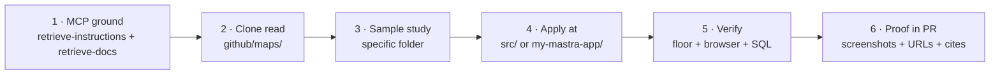

# 15 — Tools + Repos + Samples Strategy
## How to combine MCP tools, GitHub clones, and official samples for Grounding · Places New · Markers · AI workflows

> **Authoring date:** 2026-05-17
> **Status:** Execution plan. References (not duplicates) the strategy in [`100-maps-plan.md`](../100-maps-plan.md), [`13-use-what-we-have.md`](./13-use-what-we-have.md), and [`14-senior-architect-eval.md`](./14-senior-architect-eval.md).
>
> **What this doc adds:** the per-feature **workflow table** that says, for each task in a phase, exactly which MCP tool to call, which clone to read, which sample folder to study, which mdeai file to land the pattern in, and which proof to capture.
>
> **Reader expectation:** Open this doc when starting a Phase 1A / 2 / 3 / 4 / 5 task. Find the row matching your work. Follow the columns left → right.

---

## 1. TL;DR — the 4 feature surfaces

Four feature surfaces drive Phase 1A → Phase 5. Each has a dedicated MCP tool, github clone, sample folder set, and mdeai application file.

| Surface | What it does for mdeai | MCP tool of record | Clone of record | Sample folder of record | Phase |
|---|---|---|---|---|---|
| **A. AI Grounding** | "best rooftops in El Poblado" → cards + pins + attribution | `mcp__maps-grounding-lite__search_places` | `github/maps/grounding-lite-mcp-sample-app` | `services/`, `chat-app.ts` | **1A** |
| **B. Places API New** | Place Details, Nearby Search, Text Search — cache + field masks | `mcp__google-maps-code-assist__retrieve-google-maps-platform-docs` (filter: "Places API (New)") | `github/maps/js-api-samples/samples/place-*` + `github/maps/google-maps-services-js` (server) | `place-details-*/`, `nearby-search-*/`, `text-search-*/` | **2 & 3** |
| **C. Advanced Markers** | AdvancedMarkerElement pins, mapId, clustering, accessibility | `mcp__google-maps-code-assist__retrieve-google-maps-platform-docs` (filter: "Advanced Markers") | `github/maps/js-api-samples` + `github/maps/js-markerclusterer` | `advanced-markers-*/`, `marker-clustering-*/` | **5** |
| **D. AI dev workflows** | Pre-PR doc verify; ground every Maps decision | `mcp__google-maps-code-assist__retrieve-instructions` (mandatory first) + `retrieve-google-maps-platform-docs` | (none — hosted) | (none — RAG over all GMP docs) | All |

**Single rule across all four:** every Maps PR must (a) call the MCP, (b) cite a clone path, (c) cite a sample folder, (d) land in a named mdeai file, (e) ship proof. The verification cycle is in §4 below.

---

## 2. Per-surface execution matrix

For each surface: **what** to extract, **where** from, **where** to apply, **what** to prove.

### 2.1 Surface A — AI Grounding (Phase 1A)

Goal: chat query → `searchGroundedPlaces` Mastra tool → grounded result cards + map pins + `<GroundingAttribution>` badge.

| Task | MCP call (in this order) | Clone read | Sample / file to study | Apply at (mdeai) | Proof |
|---|---|---|---|---|---|
| 1A.1 Mastra tool wrapping the Lite MCP | `mcp__maps-grounding-lite__search_places` (verify live response shape with a real Medellín query) | `github/maps/grounding-lite-mcp-sample-app/` | `services/` (MCP transport setup), `instructions.ts` (system prompt), `chat-app.ts` (response parsing) | `my-mastra-app/src/mastra/tools/search-grounded-places.ts` (NEW) | Vitest + staging chat returns ≥ 3 places with `place_id` |
| 1A.2 Register on router/concierge agent | `mcp__mastra__searchMastraDocs` query "tool registration on agent" | (none — Mastra docs only) | (Mastra docs) | `my-mastra-app/src/mastra/agents/router.ts`, `concierge.ts` | Live `/chat`: grounded query invokes the tool |
| 1A.3 Grounded pins → MapContext | `mcp__google-maps-code-assist__retrieve-google-maps-platform-docs` filter `Advanced Markers` | `github/maps/js-api-samples/samples/advanced-markers-customization/` | `samples/advanced-markers-html/` (custom DOM content) | `src/context/MapContext.tsx` (extend `mergePinsByCategory` to accept `grounded` category); `src/components/map/pinContent.ts` | Map shows grounded category pins after 1A.2 |
| 1A.4 GroundingAttribution component | `mcp__google-maps-code-assist__retrieve-google-maps-platform-docs` query "Grounding Lite attribution requirements" | (docs only) | https://developers.google.com/maps/ai/grounding-lite/attribution | `src/components/grounding/GroundingAttribution.tsx` (already exists per MASTRA-066) — wire on every grounded result surface | Screenshot: "Powered by Google" + `placeUrl` visible adjacent to grounded cards |
| 1A.5 Basic Playwright smoke | `mcp__playwright-test__planner_setup_page` then `mcp__playwright-test__generator_write_test` | `tests/smoke/maps-pins.spec.ts` (existing template) | (none) | `tests/smoke/chat-grounded-places.spec.ts` (NEW) | Staging chat ≥ 3 grounded cards in browser |

**Reference-only clone for this phase:** `github/maps/ag-ui-adk-grounding-app` for streaming card UX inspiration. **Never** copy MCP wiring, RLS, or billing from it.

### 2.2 Surface B — Places API New (Phase 2 & 3)

Goal: enrich Supabase rows with `place_id`, `maps_url`, `photo_resource_names`. Drive nearby restaurants/attractions from chat. Field-mask discipline enforced.

| Task | MCP call | Clone read | Sample / file to study | Apply at (mdeai) | Proof |
|---|---|---|---|---|---|
| 2.1 `place_details_cache` migration + column extensions | `mcp__ed3787fc__search_docs` (Supabase RLS) | (none) | `supabase-migration.md` outcome rubric | `supabase/migrations/<ts>_place_details_cache.sql`; extends `events`, `restaurants`, `apartments` with `google_place_id`, `maps_url`, `directions_url`, `photo_resource_names text[]` | `supabase db diff` empty; RLS smoke 3-role |
| 2.2 Update `enrich-places.ts` to use `places-client.ts` wrapper | `mcp__google-maps-code-assist__retrieve-google-maps-platform-docs` filter `Place Details (New)` | `github/maps/js-api-samples/samples/place-details-*/` | `place-details-html/`, `place-details-fields/` | `scripts/enrich-places.ts` (rewrite); writes through `place_details_cache` | SQL: ≥ 10 rows with non-null `maps_url` AND `google_place_id`; `places-enrichment-compliance.test.ts` passes |
| 2.3 `googleMapsLinks` everywhere | (verify mask via MCP) | `github/maps/extended-component-library/src/place_overview/` (display patterns) | docs: `developers.google.com/maps/documentation/places/web-service/maps-links` | Backfill script + `src/components/map/MdeInfoWindow.tsx` (deep-link button) | Cards link to valid `https://maps.app.goo.gl/...` URLs in browser |
| 2.4 Phase 2B — Place Photos | `mcp__google-maps-code-assist__retrieve-google-maps-platform-docs` filter `Place Photos` | `github/maps/js-api-samples/samples/place-details-photos*/` | `place-photos-*/` | `scripts/enrich-places.ts` (photo resource names) + new edge fn `supabase/functions/place-photo/` (URL on user open) | Photo renders on rental card; resource name in DB; URL fetched only on open |
| 3.1 `search-restaurants` field-mask alignment | `mcp__google-maps-code-assist__retrieve-google-maps-platform-docs` filter `Nearby Search (New)` | `github/maps/js-api-samples/samples/nearby-search-*/` | `nearby-search-html/` | `my-mastra-app/src/mastra/tools/search-restaurants.ts` (already exists; verify field mask matches `places.id,places.displayName,places.location,places.types`) | Network capture: mask matches; rows return |
| 3.2 `search-attractions` mirror of 3.1 | same | same | same | `my-mastra-app/src/mastra/tools/search-attractions.ts` | same |
| 3.3 `places_search_cache` extension for repeat queries | `mcp__ed3787fc__execute_sql` (verify schema) | (none) | (none) | `supabase/migrations/<ts>_places_search_cache.sql` (extend if needed); cache write in tools | Second identical query hits cache (network proof) |

### 2.3 Surface C — Advanced Markers (Phase 5 M1–M5)

Goal: marker layer 84 → 92 per `features/15-markers-plan.md`. Price badge, rating chip, selected state, mobile sheet, Paisa cluster.

| Task | MCP call | Clone read | Sample / file to study | Apply at (mdeai) | Proof |
|---|---|---|---|---|---|
| M1 — Price badge typography + COP format | `mcp__google-maps-code-assist__retrieve-google-maps-platform-docs` filter `Advanced Markers` query "custom DOM content for marker" | `github/maps/js-api-samples/samples/advanced-markers-html/` | `advanced-markers-html/`, `advanced-markers-customization/` | `src/components/map/pinContent.ts` (extend `buildPinContent`) | Pin DOM shows `$1.2M COP` formatted; Vitest snapshot |
| M2 — Rating chip on pin | same | `samples/advanced-markers-customization/` | same | `pinContent.ts` (extend) | Pin shows `★ 4.8` when `meta.rating` set, hidden otherwise |
| M3 — Selected / hover state | `mcp__google-maps-code-assist__retrieve-google-maps-platform-docs` query "AdvancedMarker zIndex collisionBehavior" | `github/maps/js-api-samples/samples/advanced-markers-collision-behavior/` | `advanced-markers-collision-behavior/`, `advanced-markers-accessibility/` | `src/context/MapContext.tsx` (`highlightedPinId` ↔ `selected` sync); `src/components/chat/ChatMap.tsx` (collision parity); `src/components/map/MdeMarker.tsx` | Click pin → `aria-current="true"`; zIndex bump; list highlight sync |
| M4 — Mobile bottom sheet via ECL | `mcp__google-maps-code-assist__retrieve-google-maps-platform-docs` filter `Extended Component Library` query "overlay-layout mobile bottom sheet" | `github/maps/extended-component-library/src/overlay_layout/` + `examples/react_sample_app/` | `src/overlay_layout/`, `examples/react_sample_app/src/place-overview-page.tsx` | New file `src/components/map/MdeMobileSheet.tsx` + `ChatMap.tsx` integration behind `VITE_ENABLE_GMPX_OVERLAY` feature flag. **Use `<gmpx-overlay-layout>` ONLY; do NOT load `<gmpx-api-loader>`.** | 390×844 screenshot: sheet open with pin info; loader-coordination verified (single `google-maps-loader.ts` bootstrap) |
| M5 — Paisa custom cluster renderer | `mcp__google-maps-code-assist__retrieve-google-maps-platform-docs` query "marker clusterer custom renderer ariaLabelFn" | `github/maps/js-markerclusterer/src/markerclusterer.ts` + `examples/` | `src/renderer.ts` (default), `examples/custom-renderer.html` | `src/components/map/MdeMarkerCluster.tsx` (extend with custom `renderer` callback returning Paisa-emerald cluster bubble + accessible `aria-label`) | Dense Laureles screenshot: emerald cluster with count + accessible label |
| A11y sweep | `mcp__google-maps-code-assist__retrieve-google-maps-platform-docs` filter `Advanced Markers` query "accessibility ARIA keyboard" | `github/maps/js-api-samples/samples/advanced-markers-accessibility/` | `advanced-markers-accessibility/` | `pinContent.ts`, `MdeMarker.tsx` | Lighthouse a11y ≥ 90 on Maps pages; keyboard Tab → Enter opens peek |

**One pre-install (only at M4 kickoff):**

```bash
cd /home/sk/mde
npm install @googlemaps/extended-component-library@<version-after-spike>
```

### 2.4 Surface D — AI dev workflows (all phases)

The MCP layer that grounds the other three surfaces. Mandatory before every Maps PR.

| Step | When | MCP call | Why |
|---|---|---|---|
| 1. Load instructions | First call of every Maps session | `mcp__google-maps-code-assist__retrieve-instructions` with `name: "instructions"` | MCP contract: must be called before doc-retrieve tool; provides EEA rules, decision trees, code-style guidelines |
| 2. Ground every claim | Before writing code | `mcp__google-maps-code-assist__retrieve-google-maps-platform-docs` with targeted `llmQuery` + `filter` | Avoid hallucinated APIs; cite real URLs |
| 3. Verify field mask | For any Places API call | same, query "X-Goog-FieldMask for [endpoint]" | Cost lever |
| 4. Verify SKU | For cost-sensitive features | same, query "Places UI Kit vs Places API New pricing" | Cheapest path |
| 5. Verify migration / deprecation | For any "legacy vs new" choice | same, query "deprecated [API] migration to new" | Don't ship deprecated APIs |
| 6. Cite docs URL in PR | Every PR | append `utm_source=gmp-code-assist` to all `developers.google.com/maps/...` URLs | Attribution rule per MCP system instructions |

**Mandatory disclaimer block** (per MCP system instructions) at the end of every Maps PR description:

> Usage of Google Maps Platform products and services may incur costs against your Google Cloud project billing account.
> Restrict API keys per https://docs.cloud.google.com/api-keys/docs/add-restrictions-api-keys?utm_source=gmp-code-assist.
> Use of this code is subject to the Google Maps Platform Terms of Service: https://cloud.google.com/maps-platform/terms?utm_source=gmp-code-assist.

---

## 3. The 6-step development workflow (per task)

Universal cycle. Apply to any task in §2.1–§2.3. Each task lands one row at a time.



| Step | Tool | Deliverable in PR description |
|---|---|---|
| 1. MCP ground | `mcp__google-maps-code-assist__*` (both tools) | One doc URL with `utm_source=gmp-code-assist` per claim |
| 2. Clone read | `Read` tool against `github/maps/<repo>/<file>` | File path + line range |
| 3. Sample study | `Glob` + `Read` over `github/maps/js-api-samples/samples/<folder>` | Sample folder name |
| 4. Apply | `Edit` / `Write` against mdeai file | Diff |
| 5. Verify | `npm run floor` + `mcp__chrome-devtools__*` + Supabase MCP `execute_sql` | exit-0 log + screenshot + SQL result |
| 6. Proof | PR description per `.claude/outcomes/maps-grounding.md` / `runtime-action-pipeline.md` | Outcomes grader `satisfied` (Phase 1C+) |

---

## 4. Phase-by-phase application

Aligns this strategy with the master plan's phases:

| Phase | Surfaces touched | Tasks (from §2) | Outcome rubric |
|---|---|---|---|
| **0** Ship blockers | D | Enable `mapstools.googleapis.com`; fix `verify:mastra-all`; see-all 5 pins | (none — config + cleanup) |
| **1A** Grounding core | A + D | 1A.1, 1A.2, 1A.3, 1A.4, 1A.5 | extends `.claude/outcomes/maps-grounding.md` in 1B |
| **1B** Observability | A + D | quota log (1B.1), telemetry (1B.2), full Playwright (1B.4) | `.claude/outcomes/maps-grounding.md` extended |
| **1C** Runtime Action Pipeline | A + C + D | SSE tracing, `ai_runs.pins_emitted`, Playwright pipeline spec | **NEW** `.claude/outcomes/runtime-action-pipeline.md` (criteria sketch in `100-maps-plan.md` §5.1) |
| **2** Places enrichment | B + D | 2.1, 2.2, 2.3 | **NEW** `.claude/outcomes/maps-places-enrichment.md` (criteria sketch in `100-maps-plan.md` §5.2) |
| **2B** Place Photos | B + D | 2.4 | extends `.claude/outcomes/maps-places-enrichment.md` |
| **3** Nearby intelligence | B + D | 3.1, 3.2, 3.3 | extends `.claude/outcomes/maps-places-enrichment.md` |
| **4** Host wizard autocomplete | B + D | Places UI Kit `<gmp-place-autocomplete>` (per `14-senior-architect-eval.md` correction) | TBD (write at start of Phase 4) |
| **5** Marker polish | C + D | M1, M2, M3, M4, M5 + a11y sweep | **NEW** `.claude/outcomes/maps-markers.md` (write at Phase 5 start) |

---

## 5. Sample folders to memorize (one-line each)

The single most-cited collection. Save time by knowing where each pattern lives.

### Inside `github/maps/js-api-samples/samples/`

| Folder | Why |
|---|---|
| `add-map/` | Bare `<Map>` setup baseline |
| `advanced-markers-accessibility/` | `role` + `aria-label` + keyboard nav on pins (M3 + a11y) |
| `advanced-markers-collision-behavior/` | `collisionBehavior: OPTIONAL_AND_HIDES_LOWER_PRIORITY` (M3) |
| `advanced-markers-customization/` | PinElement vs custom HTML content (M1, M2) |
| `advanced-markers-html/` | Custom DOM content for pins (M1, M2) |
| `infowindow-simple/` | InfoWindow anchored to AdvancedMarker (already shipped) |
| `place-details-html/` | Place Details (New) request shape (Phase 2) |
| `place-details-fields/` | Field mask selection (Phase 2) |
| `place-photos-*/` | Photo resource name → URL on demand (Phase 2B) |
| `nearby-search-html/` | Nearby Search (New) request body (Phase 3) |
| `text-search-*/` | Text Search (New) fallback path (Phase 3 tail queries) |
| `places-autocomplete-*/` | Reference for what Places UI Kit replaces at Phase 4 |
| `marker-clustering-*/` | (also see js-markerclusterer/examples/) — cluster patterns |
| `maps-padding/` | `fitBounds({ top, right, bottom, left })` (already shipped) |
| `geocoding-simple/` | `marker.map = null` cleanup (already shipped) |
| `address-validation/` | Future — host address cleanup |
| `3d-*` (~40) | **NEVER** for mdeai — defer |

### Inside `github/maps/extended-component-library/`

| Path | Why |
|---|---|
| `src/overlay_layout/` | Phase 5 M4 mobile bottom sheet |
| `examples/react_sample_app/` | React wrapper integration patterns (Phase 5 M4 spike) |
| `src/place_overview/` | Custom Paisa place card alternative (Phase 5 post-M4) |
| `src/place_picker/` | **DO NOT USE for autocomplete** — Places UI Kit is cheaper |
| `src/api_loader/` | **DO NOT USE** — our custom loader is audited 97/100 |
| `src/store_locator/` | Too generic for chat-first mdeai |

### Inside `github/maps/js-markerclusterer/`

| Path | Why |
|---|---|
| `src/markerclusterer.ts` | Renderer callback signature for M5 |
| `src/renderer.ts` | Default renderer baseline |
| `examples/custom-renderer.html` | Custom renderer pattern (M5) |

### Inside `github/maps/grounding-lite-mcp-sample-app/`

| Path | Why |
|---|---|
| `services/` | MCP transport setup (`StreamableHTTPClientTransport`) — Phase 1A |
| `chat-app.ts` | Streaming UX reference |
| `instructions.ts` | System prompt patterns for grounding agents |
| `components/` | UI for grounded place cards (inspiration only) |
| `mcpServer.ts` | **NEVER USE** — we use the hosted MCP, not a self-hosted one |

---

## 6. Hooks + skills support per surface

Each surface ships with build-time and stop-time enforcement:

| Surface | Pre-write hook | Stop hook | Skill |
|---|---|---|---|
| A. AI Grounding | (none — Mastra tool layer; integrity covered by 1C rubric) | `stop-attribution-gate` (rejects "verified" claims w/o evidence) | `mde-maps`, `mastra`, `mastra-routing` |
| B. Places API New | `places-api-field-mask` (blocks calls without `X-Goog-FieldMask`) | `stop-rls-gate` (Place Details cache migration must enable RLS) | `mde-maps`, `mde-supabase` |
| C. Advanced Markers | `advanced-marker-needs-mapid` (blocks `<AdvancedMarker>` without `mapId` on parent `<Map>`) | `stop-attribution-gate` | `mde-maps`, `mde-testing` |
| D. AI dev workflows | (none — MCP layer) | `stop-attribution-gate` | `working-with-claude-code`, `mde-maps` |

---

## 7. Anti-patterns specific to this workflow

| Anti-pattern | Why bad | What to do instead |
|---|---|---|
| Reading the MCP doc but skipping the clone | Misses canonical sample naming + structure | Read the matching sample folder before writing code |
| Reading a clone but not calling the MCP | Misses NEW vs LEGACY classification | MCP always returns `apiState: NEW / CURRENT / LEGACY / DEPRECATED` |
| Copying sample code verbatim into `src/` | Bloat + license risk + Vite-incompatible patterns | Adapt the pattern; cite the source file:line in PR comments |
| Skipping the `utm_source=gmp-code-assist` URL suffix | Attribution rule violation per MCP system instructions | Append to every `developers.google.com/maps/...` link in PRs and code comments |
| Skipping `internal-usage-attribution-ids` on Maps JS loads | Attribution policy gap | Set `solutionChannel="mdeai_v1"` on `<APIProvider>` (see MCP instructions §internal_usage_attribution_id_examples) |
| Calling MCP only once at session start | Stale by mid-session | Call MCP per task, not per session |
| Trusting one MCP context | RAG-confidence varies | Use the top 3 contexts when scores are within 0.1 of each other |

---

## 8. Open MCP queries to run before Phase 1A (homework)

Run these via `mcp__google-maps-code-assist__retrieve-google-maps-platform-docs` and paste answers into the matching task spec:

| Query | Filter | Target task |
|---|---|---|
| "Grounding Lite vs Vertex Maps grounding — which is GA on Gemini API and what's the per-call cost" | `Grounding Lite` | 1A.1 |
| "GroundingAttribution display requirements — what text and logos must be visible" | `Grounding Lite` | 1A.4 |
| "Place Details (New) field mask for `places.googleMapsLinks` — exact path and pricing SKU" | `Place Details (New)` | 2.3 |
| "Places UI Kit `<gmp-place-autocomplete>` session token best practices for Colombia bias" | `Places UI Kit` | 4 |
| "AdvancedMarkerElement `collisionBehavior` values and rendering rules" | `Advanced Markers` | M3 |
| "MarkerClusterer custom renderer return shape and `ariaLabelFn` requirements" | `MarkerClusterer` | M5 |
| "Extended Component Library `<gmpx-overlay-layout>` mobile bottom-sheet API and loader coordination" | `Extended Component Library` | M4 |

These answers become the "Reference" section in each task spec at Phase start.

---

## 9. Definition of "strategy ready to execute"

- [x] Per-surface matrix written (§2.1–§2.4)
- [x] 6-step universal workflow defined (§3)
- [x] Phase mapping done (§4)
- [x] Sample folder catalogue (§5)
- [x] Hook + skill support per surface (§6)
- [x] Anti-patterns enumerated (§7)
- [x] Pre-Phase-1A MCP homework queued (§8)

**Pending user action:**

- [ ] Approve Phase 0 + Phase 1A start (per `100-maps-plan.md` §11.1)
- [ ] Confirm Phase 4 venue picker is **Places UI Kit `<gmp-place-autocomplete>`** (not ECL Place Picker — see `14-senior-architect-eval.md` correction)
- [ ] Enable `mapstools.googleapis.com` on the Maps API key (GCP Console — Phase 0 blocker)

---

## Cross-references

- [`100-maps-plan.md`](../100-maps-plan.md) — phase plan
- [`13-use-what-we-have.md`](./13-use-what-we-have.md) — per-clone extraction matrix
- [`14-senior-architect-eval.md`](./14-senior-architect-eval.md) — MCP-grounded production stack recommendation
- [`02-google-mastra.md`](./02-google-mastra.md) — architecture separation principles
- [`features/15-markers-plan.md`](../features/15-markers-plan.md) — M1–M5 detail
- [`features/16-google-maps-features.md`](../features/16-google-maps-features.md) — platform scorecard 73 → 88

---

## Disclaimer

Usage of Google Maps Platform products and services may incur costs against your Google Cloud project billing account.

Google Maps Platform products / APIs / services referenced in this strategy:
- Maps JavaScript API
- Places API (New)
- Places UI Kit
- Maps Grounding Lite (MCP)
- Maps Platform Code Assist (MCP)
- AdvancedMarkerElement
- `@googlemaps/markerclusterer`
- `@googlemaps/extended-component-library`
- `@googlemaps/places`

Restrict API keys per https://docs.cloud.google.com/api-keys/docs/add-restrictions-api-keys?utm_source=gmp-code-assist.

Use of this code is subject to the Google Maps Platform Terms of Service: https://cloud.google.com/maps-platform/terms?utm_source=gmp-code-assist.
