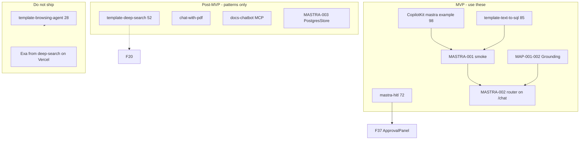

## Verdict

**`tasks/mastra/` specs are ~78% correct — not 100%.** Safe to start **MASTRA-001** and **MASTRA-005**; **MASTRA-002** blocked on **MAP-001**; **MASTRA-003** post-MVP. Below: required patches per task, verified against disk, [`task-verifier`](.claude/skills/task-verifier/SKILL.md), [CopilotKit×Mastra ref](.claude/skills/copilotkit-integrations/references/integrations/mastra.md), and Mastra MCP (`listMastraPackages` — **`@mastra/pg` not installed**).

---

## Cross-cutting (INDEX + folder)

| Change | Why |
|--------|-----|
| **Standardize `depends_on` slugs** | MASTRA-001 uses full slugs; MASTRA-002/004/005 use `F08`, `F13`, `MAP-001` — task-verifier wants resolvable paths (`F08-supabase-auth-login-page.md`, etc.) |
| **MAP-001 → MASTRA-002 handoff** | MAP-001 wires **`pingAgent`** on `/chat` for test pins; MASTRA-002 must say *replace* that wiring, not greenfield |
| **Add integration-surface table** to MASTRA-002 & MASTRA-004 | task-verifier §2b requires Pattern 1 vs HTTP :4111 |
| **Note `npm run floor` is red today** | ESLint warning in `search-rentals.ts` — MASTRA-001 AC should fix or scope lint before claiming floor green |
| **Optional MASTRA-006** | CopilotKit [#3426](https://github.com/CopilotKit/CopilotKit/issues/3426) state/context sync regression (card select → agent sees it) — not in folder today |

---

## MASTRA-001 — Core wiring smoke

**Grade: B** — direction good; test scope needs tightening.

### Required changes

| # | Patch |
|---|--------|
| 1 | **Add `classify-intent` to targets** — `mdeapp/src/mastra/tools/classify-intent.ts` + `__tests__/classify-intent.test.ts` (tool is passthrough; test **schema**, not Gemini) |
| 2 | **Add `search-rentals` test gap** — disk has tests for events/restaurants/attractions only; **no** `search-rentals` test. AC: add `search-rentals-logic.test.ts` or extend smoke |
| 3 | **Add workflow files to `target_files`** — `rental-search-workflow.ts`, `event-discovery-workflow.ts`, `mastra/index.ts` |
| 4 | **Clarify test type** — “confidence &lt; 0.6 / follow-up” = **router prompt + workflow step unit tests**, not live LLM integration (mastra-smoke-test: deterministic only) |
| 5 | **Register assertion** — extend existing `smoke.test.ts` (already lists 6 agents) with: `routerAgent` has `classifyIntentTool` + both workflows in agent config |
| 6 | **`conciergeRoutingWorkflow`** — add note: registered on `mastra/index.ts` but **not** on `routerAgent.workflows` — smoke must not assume concierge dispatch |
| 7 | **Stale Easy summary** — drop “progres reads 0 tools”; tools exist on disk |
| 8 | **Add `verified_against`** — [Mastra workflows docs](https://mastra.ai/docs/workflows/overview) + `@/mastra/smoke-test` skill |

### Verified disk

- ✅ `mastra-router-smoke.test.ts` — **missing** (expected Not Started)
- ✅ `smoke.test.ts` — 7 tests, agent registration only
- ✅ `classify-intent` — no `__tests__`

---

## MASTRA-002 — Router on `/chat`

**Grade: C+** — nested CopilotKit fix is in spec; MAP handoff + CK state gaps remain.

### Required changes

| # | Patch |
|---|--------|
| 1 | **MAP-001 handoff section** — “MAP-001 ships `/chat` with `pingAgent` + test pin tool; this task swaps to `routerAgent` + removes/repoints test tool” |
| 2 | **Add `depends_on` slug** — `../maps/MAP-001-platform-map-pipeline.md` (full path) |
| 3 | **Integration surface table** (task-verifier §2b):

```markdown
| Surface | mdeai | DoD probe |
|---------|-------|-----------|
| Pattern 1 in-process | ✅ `/api/copilotkit` | POST 200 from `/chat` |
| Mastra HTTP :4111 | Studio only | N/A for Done |
| Agent map key | `routerAgent` | grep layout + useCoAgent |
```

| 4 | **CopilotKit shared-state guard** — add AC from [shared state read/write](https://docs.copilotkit.ai/mastra/shared-state/in-app-agent-read) + note [#3426](https://github.com/CopilotKit/CopilotKit/issues/3426): if using `useCopilotReadable`, add regression test |
| 5 | **Follow-up memory caveat** — `routerAgent` has **no `memory` block** today; “show cheaper” stickiness is **prompt-only** until MASTRA-003 — don’t over-promise in Easy summary |
| 6 | **Add `target_files`** — `mdeapp/src/app/chat/page.tsx` may need sidebar from MAP-001; document where `<CopilotSidebar>` lives |
| 7 | **POST proof command** — add to §4 Verification:

```bash
curl -s -o /dev/null -w "%{http_code}" -X POST http://localhost:3001/api/copilotkit \
  -H "Content-Type: application/json" -d '{}'
# expect 400/200 — not 404
```

| 8 | **Add `verified_against`** — CopilotKit [quickstart](https://docs.copilotkit.ai/mastra/quickstart) + vendored `CopilotKit/examples/integrations/mastra/` |

### Verified disk

- ❌ `/chat` route absent
- ✅ Root `layout.tsx` still `agent="pingAgent"` — nested layout requirement is **correct**

---

## MASTRA-003 — PostgresStore

**Grade: C** — best spec after last patch; package + route wiring gaps.

### Required changes

| # | Patch |
|---|--------|
| 1 | **Install step in AC** — `npm install @mastra/pg` (MCP: **`@mastra/pg` not in `listMastraPackages`**; lockfile has `@mastra/core@1.35.0` beta only) |
| 2 | **Official doc link** — add `verified_against: https://mastra.ai/docs/memory/storage` (plan `08-storage.md` cites this) |
| 3 | **Add `route.ts` to targets** — [08-storage.md](plan/mastra/examples/features/08-storage.md) step 3: pass **`thread` + `resource`** from CopilotKit session into bridge |
| 4 | **Expand AC** — grep `file:mastra-agent-memory.db` and `file::memory:` → **0** in `mdeapp/src/mastra/**` |
| 5 | **Pooler URL note** — `DATABASE_URL` = Supabase **pooler**, server-only; `max: 3` dev / `max: 10` prod per `plan/mastra/02-best-old.md` |
| 6 | **Production cutover gate** — add explicit AC: *“No prod cutover until cold-start recall test passes (turn 11 remembers turn 1)”* — aligns PRD §11.3 vs roadmap post-MVP deferral |
| 7 | **Fix F20 cross_task** — add line in **F20** task: “PostgresStore owned by MASTRA-003; F20 = scorers + deploy prep only” (F20 still says “W9 follow-on PostgresStore”) |
| 8 | **`depends_on: MVP-exit`** — not a file slug; use `../../mvp.md` + checklist link or `tasks/audit/` gate doc |

### Verified disk

- ✅ Three ephemeral stores: `:memory:` index, `file:mastra-agent-memory.db`, ping `file::memory:`
- ❌ `@mastra/pg` not installed

---

## MASTRA-004 — ai_runs + audit

**Grade: B+** — best scoped task; dependency slugs + route wiring incomplete.

### Required changes

| # | Patch |
|---|--------|
| 1 | **Full `depends_on` slugs** — `F08-supabase-auth-login-page.md`, `F13-ai-runs-observability.md` |
| 2 | **Route implementation spec** — F13 already says: parse session in `route.ts`, pass `resourceId` + `userId` into `getLocalAgentsWithLogging({ mastra, resourceId, requestContext })` — add as **Goals** bullet (today route passes only `{ mastra }`) |
| 3 | **Dual observability line** — DoD probes **`public.ai_runs` only**; `mastra_ai_spans` out of scope (task-verifier §2d) |
| 4 | **Enum probe SQL** — keep AC; run via Supabase MCP before coding |
| 5 | **Anonymous path AC** — logged-out chat still writes row with `user_id IS NULL` (F13 regression) |
| 6 | **`classify-intent`** — explicitly **out of scope** for `withAudit` (read-only classifier) |
| 7 | **Timing vs MASTRA-002** — can run parallel after MASTRA-001; but **logged-in `/chat` proof** requires MASTRA-002 or temporary ping on `/chat` — note in AC |

### Verified disk

- ✅ `logging-mastra-agent.ts:53` — `userId: null` hardcoded
- ✅ Search tools — no `withAudit` imports yet

---

## MASTRA-005 — PR gate

**Grade: B** — target file wrong; checks incomplete per official pins.

### Required changes

| # | Patch |
|---|--------|
| 1 | **Remove or defer `.github/workflows/ci.yml`** — **no CI workflow in mdeai repo root** (only vendored github/*). Target `mdeapp/package.json` scripts only until F06 CI lands |
| 2 | **Add checks** from CLAUDE.md + CopilotKit ref:

```txt
- @copilotkit/* === 1.55.2 (no v2 imports)
- google("gemini-3.5-flash") in agents (grep deprecated 2.0/2.5)
- getLocalAgentsWithLogging in route (not bare getLocalAgents)
- No SUPABASE_SERVICE_ROLE in mdeapp/src/**
```

| 3 | **`depends_on`** — `F09-floor-script-and-vitest.md` |
| 4 | **Script name** — `check:mastra` vs extend `floor` — pick one; document in INDEX |
| 5 | **`:memory:` rule** — gate fails on `:memory:` only **after MASTRA-003 Done** (already noted; add `MASTRA-003` to `depends_on` for that rule or env flag) |

---

## `my-mastra-app-coverage.md`

Already patched for 6 agents — **one more fix**:

| Patch | Detail |
|-------|--------|
| MAP-001 out-of-scope line | Still says `routerAgent (F18)` — change to **MASTRA-002** |
| Add MASTRA crosswalk column | Link each row to MASTRA-001…005 |

---

## Suggested execution order (verified)

```text
MAP-001 (pingAgent on /chat + map)
  → MASTRA-001 (Vitest router/workflow)
  → MASTRA-002 (swap to routerAgent nested layout)
  → MASTRA-004 (parallel after 001; full proof after 002)
MASTRA-005 anytime after F09
MASTRA-003 after MVP exit checklist
```

---

## Summary table

| Task | Safe to execute? | Must patch before coding? |
|------|------------------|---------------------------|
| MASTRA-001 | ✅ Yes | Minor (test scope, search-rentals test) |
| MASTRA-002 | ❌ Until MAP-001 | Yes (MAP handoff, CK state AC) |
| MASTRA-003 | ⏸ Post-MVP | Yes (route thread/resource, @mastra/pg) |
| MASTRA-004 | ✅ After MASTRA-001 | Yes (depends_on slugs, route spec) |
| MASTRA-005 | ✅ Yes | Yes (drop ci.yml target, add pin checks) |

Want me to **apply these patches** to the five `MASTRA-*.md` files + `INDEX.md` now?


## Verdict on your forensic audit

**Your audit is ~85% correct** — direction, scores, and blockers match [`plan/mastra/prd-mastra.md`](plan/mastra/prd-mastra.md) and [`plan/mastra/mastra-roadmap.md`](plan/mastra/mastra-roadmap.md). It is **not 100% correct** on a few factual details and some fixes are **already in the docs** (wording/placement gaps remain).

**Verified against:** roadmap, PRD, disk probes (2026-05-22), CopilotKit #3426 scrape, Mastra 1.0 blog, MAP-001 task spec.

---

## Overall scores — ✅ Correct

| Your claim | Verified |
|------------|----------|
| Correctness ~78/100 | ✅ Aligns with planning 82 / implementation 52 framing |
| Implementation 52–58/100 | ✅ PRD says **52**; roadmap frontmatter **52** |
| Not production-ready | ✅ `production_ready: false` in PRD frontmatter |
| MAP-001 top blocker | ✅ PRD §2.1 Maps **15/100**; no `/chat` on disk |

**Disk today:** no `mdeapp/src/app/chat/` · root `layout.tsx` still `agent="pingAgent"` · 6 agents registered · **0 Playwright specs** · `@mastra/core` **1.35.0** (beta, already 1.x).

**Floor is not green right now:** `npm run floor` fails on ESLint warning in `search-rentals.ts` — implementation readiness is slightly worse than “52 but floor green.”

---

## Blocker table — line by line

| Blocker | Your audit | Verified? | Nuance |
|---------|------------|-----------|--------|
| `/chat` uses `pingAgent` | Critical | ⚠️ **Half right** | **`/chat` does not exist.** Root layout pins `pingAgent` for the whole app. Accurate line: *“No `/chat`; when MAP-001 lands, must use nested `routerAgent` provider (MASTRA-002), not inherit root ping.”* |
| MAP-001 not built | Critical | ✅ | Spec exists: [`tasks/maps/MAP-001-platform-map-pipeline.md`](tasks/maps/MAP-001-platform-map-pipeline.md) |
| Agents/workflows not UI-tested | Critical | ✅ | PRD §2.4 all workflows ❌ wired to UI; no E2E |
| Ticketing legacy / not ported | Critical | ✅ **Already in MVP** | Not missing from strategy — **under-emphasized in mastra-roadmap MVP exit checklist** |
| In-memory Mastra storage | High | ✅ | `LibSQLStore(:memory:)` in `mastra/index.ts` + separate file DB in `agent-memory.ts` |
| `verify_jwt=false` legacy edges | High | ✅ | Legacy `/home/sk/mde/supabase/config.toml` — many `verify_jwt = false` |
| CopilotKit shared-state sync | High | ✅ **with nuance** | [#3426 open](https://github.com/CopilotKit/CopilotKit/issues/3426) — **`useCopilotReadable` context**, not necessarily `useCoAgent` map pin state. Your regression test is still worth adding; scope it to **shared state + readable context** |
| Fake-ready labels | High | ✅ | PRD §2.5 already has fake-ready table; enforcement is the gap |

---

## Suggestions — correct vs needs adjustment

### ✅ Correct and worth doing

1. **Wording:** `Core bootstrap complete. Core production hardening incomplete.` — roadmap §80 *“Core (complete — do not reopen)”* is too strong given ping + `:memory:` debt.

2. **CopilotKit guard test** — valid. Issue #3426 is **open** (Mar 2026), Mastra integration, context propagation gap in runtime. Add tests for both:
   - `useCoAgent` state (selected listing / pin)
   - `useCopilotReadable` if you use readable context

3. **MAP-001 acceptance** — your list matches the task spec (MapPin, MapProvider, MapContext, 3 pins, no console errors). **Playwright is not in MAP-001 AC today** — only Vitest + manual (`tasks/maps/MAP-001` §8). PRD §11.2 puts Playwright at **MVP exit (W8–9)**. Your suggestion to add Playwright earlier is a **good hardening upgrade**, not a correction of an error.

4. **Critical path order** — ✅ matches roadmap M1→M10 and PRD §1.6 priorities.

5. **Architecture principles** — ✅ all match roadmap + PRD §3.

6. **Mastra version pin / changelog** — ✅ Mastra 1.0 blog confirms codemods (`npx @mastra/codemod@latest v1`). **Repo is already on `@mastra/core@1.35.0` beta** — add “verify lockfile + run codemod before major bumps,” not “you’re pre-1.0.”

### ⚠️ Partially correct / already documented

7. **PostgresStore pre-cutover gate** — Your gate is **policy-wise right**, but not a fix for a wrong roadmap:
   - Roadmap **intentionally** defers PostgresStore until after MVP exit (`MVP_EXIT → PGSTORE` graph).
   - PRD §11.3 prod checklist **already** lists “PostgresStore enabled” before cutover.
   - **Inconsistency to fix in docs:** W8–9 calendar says “e2e + **F20 storage**” while Post-MVP lane says “after MVP exit.” Clarify: *MVP demo can use `:memory:`; production cutover requires PostgresStore + cold-start test.*

8. **Ticketing as hard MVP blocker** — **Already true** in [`mvp.md`](mvp.md) O1 (paid ticket), roadmap M8 EVT-01, PRD §14.4 #1 business value. **Gap:** mastra-roadmap **MVP exit checklist** (§131) omits Stripe/paid ticket — add one line there; your audit is right about visibility, wrong that it’s absent from strategy.

9. **“Too many planned items near-ready”** — PRD §2.5 already labels fake-ready items. Issue is **discipline**, not missing documentation.

### ❌ Incorrect or aspirational

10. **Required repo tests list** — Several commands **do not exist** today:

| Command | Exists? |
|---------|---------|
| `npm run floor` | ✅ (currently **failing** ESLint) |
| `npm run test` | ✅ (43 tests pass) |
| `npm run verify:edge` | ❌ |
| `npm run verify:mastra` | ❌ (MASTRA-005 proposes this) |
| `npx playwright test tests/e2e/*.spec.ts` | ❌ no Playwright wired in `mdeapp` |

Label these as **target MVP exit gates**, not “run now.”

11. **“`/chat` still uses pingAgent`”** — Misleading until MAP-001 exists. Correct: **no product chat surface yet.**

12. **Mastra CopilotKit doc link (v0.x)** — Your citation is valid historically; mdeapp uses **Pattern 1 in-process** + CopilotKit **1.55.2**, not v0 server-only paths. Prefer vendored [`CopilotKit/examples/integrations/mastra/`](CopilotKit/examples/integrations/mastra/) + [CopilotKit Mastra shared state docs](https://docs.copilotkit.ai/integrations/mastra/shared-state/in-app-agent-read).

---

## Score table — adjusted

| Area | Your score | Verified | Comment |
|------|-----------:|----------|---------|
| Architecture direction | 86 | ✅ ~86 | Strong and consistent |
| MVP sequencing | 80 | ✅ ~80 | M8 ticketing in graph; checklist thin |
| Mastra best practices | 78 | ✅ ~78 | Beta 1.35; storage deferral intentional |
| CopilotKit best practices | 76 | ✅ ~74–76 | #3426 is real risk for context/state |
| Testing plan | 62 | ✅ ~58–62 | Playwright planned, not implemented; floor red |
| Production readiness | 52 | ✅ 52 | PRD explicit |

**Your 78/100 audit grade:** ✅ fair for **plan quality**. **Implementation** stays **~52** until MAP-001 + router wire + O1 ticket proof.

---

## Doc patches worth making (priority)

1. **mastra-roadmap.md** §80 — soften “Core complete” wording.
2. **mastra-roadmap.md** MVP exit checklist — add: `Paid ticket (O1): checkout → webhook → paid → QR validate`.
3. **mastra-roadmap.md** — explicit line: *Production cutover blocked until PostgresStore + cold-start memory test* (align W8–9 vs Post-MVP).
4. **MAP-001 or W8 task** — add optional Playwright smoke (or keep Vitest-only for MAP-001, Playwright at MVP exit per PRD).
5. **prd-mastra.md** §11.1 — mark `verify:edge`, `verify:mastra`, Playwright as **planned scripts**, not current.

---

## Bottom line

Your audit is **directionally accurate and actionable**. It is **not 100% correct** because:

- `/chat`/pingAgent blocker is misstated (route missing, not wrong agent yet).
- Ticketing and PostgresStore gates are **mostly already in PRD/mvp** — need **checklist visibility**, not new strategy.
- Test commands mix **current** (`floor`, `test`) with **planned** (Playwright, verify scripts).
- CopilotKit #3426 is about **context/readable**, not only map pin selection — test both.

**Highest-ROI proof path (unchanged and verified):**

```text
MAP-001 → MASTRA-001 → MASTRA-002 (nested routerAgent)
→ rental WF + cards + pins → Andrés paid ticket (EVT-01)
→ Playwright at MVP exit → PostgresStore before prod cutover
```

Want me to apply the roadmap/PRD wording patches directly?


Here’s how **official Mastra templates** and **[mastra-ai org repos](https://github.com/orgs/mastra-ai/repositories)** fit your existing plan (`index-mastra.md`, `mastra-roadmap.md`, `prd-mastra.md`, `plan/mastra/github/`).

## Rule of thumb (unchanged)

```text
Prod UI     → CopilotKit vendored example (98) + Pattern 1 in mdeapp
Search/data → Supabase SQL tools + MAP-002 Grounding (not browser scrape)
Workflows   → Steal Mastra template *patterns*, wire in mdeapp, Gemini only
```

Your [`plan/mastra/github/index-github.md`](plan/mastra/github/index-github.md) already encodes this. The [Mastra Templates catalog](https://mastra.ai/templates) is the **same family** as `mastra-ai/template-*` repos (synced from the monorepo per their FAQ).

---

## Official templates → mdeai (scored for *your* MVP)

| [mastra.ai template](https://mastra.ai/templates) | GitHub | Score | Use in mdeai | When / task |
|--------------------------------------------------|--------|------:|--------------|-------------|
| **(none — you already have it)** | CopilotKit `integrations/mastra` | **98** | **Ship path** | W1 ✅ · MASTRA-002 |
| **Chat with Database** | (catalog; same idea as text-to-sql) | **85** | Typed SQL tools, Zod, no NL2SQL on prod | `search-rentals` / `search-events` · [06-text-to-sql](plan/mastra/github/06-template-text-to-sql.md) · MASTRA-001 |
| **Docs Chatbot** | [template-docs-chatbot](https://github.com/mastra-ai/template-docs-chatbot) | **68** | MCP docs pattern for **host policy** | Post-MVP J11 · [09-docs-chatbot](plan/mastra/github/09-template-docs-chatbot.md) |
| **Deep Search** | [template-deep-search](https://github.com/mastra-ai/template-deep-search) | **~52** 🟡 | **Workflow only:** nested WF, self-eval loop, suspend/resume — **not** Exa on Vercel hot path | Post-MVP / Advanced — see below |
| **Customer Feedback Summarization** | template-customer-feedback-summarization | **~45** 🟡 | Patricia batch summaries | W8+ admin |
| **Chat with PDF** | template-chat-with-pdf | **~45** 🟡 | Roberto host KB / policy RAG | Phase 2 · [`examples/rag/`](plan/mastra/examples/rag/) |
| **Chat with YouTube** | template-chat-with-youtube | **~40** 🟡 | Tourist “what’s on” enrichment | Phase 2 — SQL + events first |
| **Slack Agent** | template-slack-agent | **~40** 🟡 | Colombia channel | Phase 2+ (frozen in roadmap) |
| **GitHub PR Code Review** | template-github-review-agent | **~35** 🔴 | Sofía CI, not product | Defer |
| **Browser Agent** | [template-browsing-agent](https://github.com/mastra-ai/template-browsing-agent) | **28** 🔴 | **Do not use** for listings/restaurants | [11-browsing-agent](plan/mastra/github/11-template-browsing-agent.md) · roadmap Advanced ❌ |
| **Google Sheets / CSV / Flash cards / Mastra Code** | various | **&lt;30** 🔴 | Ops/dev toys | Skip Phase 1 |

**Not in your github index yet:** add **Deep Search** to [`99-github-backlog.md`](plan/mastra/github/99-github-backlog.md) as 🟡 **52** — “pattern library for workflows + HITL suspend/resume,” not a new search stack.

---

## Deep Search — what to steal vs ignore

[template-deep-search](https://github.com/mastra-ai/template-deep-search) is a **research agent**: Exa search → evaluate gaps → loop until satisfied → citations. It explicitly targets CopilotKit / Client SDK integration ([README](https://github.com/mastra-ai/template-deep-search)).

| Steal for mdeai | Do **not** port |
|-----------------|-----------------|
| Nested workflow + **suspend/resume** for clarifying questions (maps to Mastra WF docs you already scored) | **Exa** as prod search for Camila/Tourist (you have Supabase + Grounding) |
| “Evaluate own work” step pattern → future **evals / scorers** (F20, MASTRA-005) | Separate Mastra server on `:4111` as user path |
| Multi-agent coordination *inside one workflow* | Replacing `routerAgent` with a research super-agent |

**Roberto MVP (F37 HITL publish):** use **CopilotKit `renderAndWaitForResponse`** + [mastra-hitl](plan/mastra/github/04-assistant-ui-mastra-hitl.md) UX ideas — **not** Deep Search’s research loop.

**Tourist “deep neighborhood research”:** Post-MVP only — could inspire a **batch** workflow on VPS (Firecrawl / research), never blocking MAP-001–002.

---

## Browsing Agent — hard no for geo product

[template-browsing-agent](https://github.com/mastra-ai/template-browsing-agent) (40★, Browserbase/Stagehand) conflicts with your PRD:

- Cost + fragility on Vercel  
- No `place_id` / Grounding attribution (MAP-002)  
- Scam-risk for rental listings  

**Use instead:** Places API + Grounding MCP · [`examples/domains/05-google-maps.md`](plan/mastra/examples/domains/05-google-maps.md).

**Only acceptable use:** Lucía staging smoke or Patricia one-off audit on VPS — already in [11-template-browsing-agent.md](plan/mastra/github/11-template-browsing-agent.md).

---

## mastra-ai org — repos worth attention beyond the index

From [mastra-ai/repositories](https://github.com/orgs/mastra-ai/repositories) (105 repos), these are the **additional** ones that matter for your three plan docs:

| Repo | Stars | mdeai role | Lane |
|------|------:|------------|------|
| **mastra** (framework) | 24k | API truth when docs MCP flaky | Always |
| **ui-dojo** | 153 | Compare CK vs other UI frameworks | MVP UI polish |
| **template-text-to-sql** | 24 | **Core** tool discipline | MASTRA-001 / Camila |
| **skills** | 55 | Agent authoring conventions | F13b / Sofía |
| **mastra-agent-course** | 23 | Onboarding | Docs only |
| **template-deep-search** | 4 | Workflow/HITL patterns | Post-MVP |
| **template-slack-agent** | 8 | WhatsApp/Slack later | Advanced |
| **template-github-review-agent** | 9 | PR automation | Advanced |
| **template-chat-with-pdf** | 5 | Host RAG | Post-MVP |
| **weather-agent** | 4 | Obsolete (you have pingAgent) | Ignore |

Everything else in the org (workshops, mastra-code-ui, gtc-planner, etc.) is **learning material**, not MVP imports.

---

## Where repos plug into **your** task tracks



| Your task | Best external reference |
|-----------|-------------------------|
| **MAP-001 / MASTRA-002** | CopilotKit vendored + canvas state — **not** Mastra templates |
| **MASTRA-001** | [template-text-to-sql](https://github.com/mastra-ai/template-text-to-sql) + existing `tools/__tests__` |
| **F33–F38 Roberto** | CK form-filling + [mastra-hitl](plan/mastra/github/04-assistant-ui-mastra-hitl.md) — **not** Deep Search |
| **F46 Camila rentals** | text-to-sql + domain playbook — **not** browsing-agent |
| **MAP-002 Tourist** | Grounding MCP — **not** Deep Search Exa |
| **MASTRA-003** | Mastra docs [features/08-storage](plan/mastra/examples/features/08-storage.md) — templates use Studio LibSQL; you need Postgres |
| **MASTRA-005** | [mastra-system-check](plan/mastra/github/14-mastra-system-check.md) |
| **Post-MVP research** | [template-deep-search](https://github.com/mastra-ai/template-deep-search) workflow shape only |

---

## Alignment with `mastra-roadmap.md` / `prd-mastra.md`

Both docs already say the right things; templates **don’t change priority**:

1. **Core (done):** F13 + CK — no new template.  
2. **MVP now:** MAP-001 → MASTRA-001 → MASTRA-002 — templates add **discipline**, not new surfaces.  
3. **Advanced frozen:** browsing-agent, OpenClaw hot path, multi-agent sprawl — Deep Search’s *agent network* vibe stays post-MVP.  

**Implementation order from github index still wins** — only insert Deep Search after item 6 as “7 — workflow pattern reference when building suspend/resume or eval loops.”

---

## Practical “clone or read?” guide

| Action | Repo / template |
|--------|------------------|
| **Already in repo** | `CopilotKit/examples/integrations/mastra/` — clone unnecessary |
| **Read 1–2 files** | text-to-sql (`tool` + schema), mastra-hitl (approval UI) |
| **Studio-only spike** | deep-search (`npx create-mastra@latest --template deep-search`) on a **branch**, extract WF steps into `mdeapp` — never ship Exa keys to prod without MAP/quota story |
| **Never clone into mdeapp** | browsing-agent, weather-agent, Mastra Code |

---

## Gaps to close in `plan/mastra/github/`

1. Add playbook **`16-template-deep-search.md`** (or backlog row) — score **52**, patterns for WF + suspend/resume + eval loop.  
2. Cross-link [mastra.ai/templates](https://mastra.ai/templates) at top of `index-github.md` as canonical catalog URL.  
3. Map catalog entries **Chat with Database** → existing doc 06 (avoid duplicate task specs).

If you want that doc + backlog row written into the repo next, say so — it’s planning-only, no `mdeapp` code.

## [template-text-to-sql](https://github.com/mastra-ai/template-text-to-sql) for mdeai

**Catalog name:** “Chat with Database” on [mastra.ai/templates](https://mastra.ai/templates). **Score in your pack:** **85/100** — already in [`plan/mastra/github/06-template-text-to-sql.md`](plan/mastra/github/06-template-text-to-sql.md).

### What the template actually does

- Agent **introspects schema** → model writes **arbitrary SQL** → runs on bundled **SQLite** (`data.db`).
- Demo is Mastra Studio (`npx create-mastra@latest --template text-to-sql`, `:4111`).
- README positions NL → SQL as the product ([GitHub README](https://github.com/mastra-ai/template-text-to-sql)).

### What mdeai should do instead (you’re already closer)

You already implemented the **safe** version in `mdeapp/src/mastra/tools/search-rentals.ts`:

| Template pattern | mdeai (correct for prod) |
|------------------|---------------------------|
| NL → generated SQL | NL → **Zod args** (`neighborhood`, `minBedrooms`, `maxPricePerNight`) |
| SQLite sample DB | **Postgres** via `DATABASE_URL` + parameterized query in code |
| Agent picks tables/columns | **Fixed** `SELECT` — no hallucinated columns |
| Studio-only | **CopilotKit Pattern 1** + `rentalSearchWorkflow` |

Same idea for **events** → `search-events.ts`, not a second NL2SQL agent.

**Do not** port “Chat with Database” as Camila’s hot path on Supabase: RLS bypass risk, injection surface, non-deterministic queries, harder evals.

### What to steal from the template (why 85/100)

1. **Golden example queries** from the README (“2BR in Laureles”, “avg salary by dept”) → copy into **eval datasets** / MASTRA-001 tests ([`examples/evals/`](plan/mastra/examples/evals/)).
2. **Tool discipline** — schema described in tool description + strict inputs (your Zod is the upgrade).
3. **“Answers must come from query results”** → `faithfulness` / tool-call scorers (F20 / MASTRA-005).
4. **Studio spike** — Sofía can run the template once to compare UX; ship nothing from SQLite to prod.

### Where it lands in your tracks

| Task | Use of text-to-sql |
|------|-------------------|
| **MASTRA-001** | Harden `search-rentals` / `search-events` tests using template’s **example query list** as fixtures |
| **MASTRA-002** | Router dispatches `rentalSearchWorkflow` — not an NL2SQL agent |
| **F46 / Camila** | Cards from tool JSON — same J2 path as playbook |
| **Post-MVP** | Optional **Patricia admin** read-only SQL with allowlisted views — still not user-facing NL2SQL |

### Clone or read?

- **Don’t** scaffold `mdeapp` from this template (wrong stack: OpenAI default, SQLite, separate Studio server).
- **Do** read `src/mastra/tools/` in the repo for tool shape ideas only.
- **Prod reference** stays [`CopilotKit/examples/integrations/mastra/`](../../CopilotKit/examples/integrations/mastra/) + your existing tools.

---

Your message ended with **“and also”** — if you meant **deep-search**, **browsing-agent**, or another template from the catalog, name it and we can score it the same way. Quick refs from the last turn:

| Template | Verdict |
|----------|---------|
| [template-deep-search](https://github.com/mastra-ai/template-deep-search) | 🟡 ~52 — workflow/HITL patterns only, not Exa on Vercel |
| [template-browsing-agent](https://github.com/mastra-ai/template-browsing-agent) | 🔴 28 — skip; use Places + Grounding |