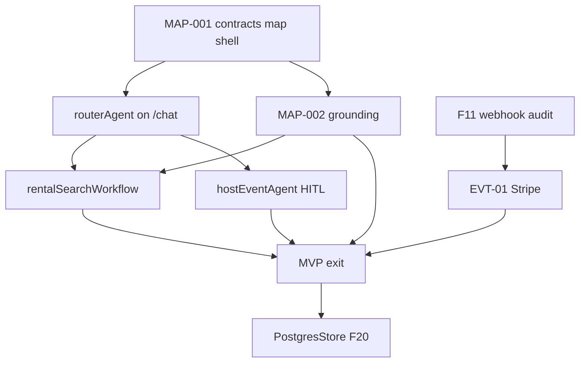

# Mastra roadmap — core · MVP · post-MVP · advanced

> **Purpose:** One **honest** execution lane for Mastra/CopilotKit only. Does **not** replace [`roadmap.md`](real-estate/draft/roadmap.md) or [`plan/prd/10-delivery-roadmap.md`](../../plan/prd/10-delivery-roadmap.md) — **extends** them with agent/orchestration sequencing.
>
> **Rule:** Supabase owns data · Mastra owns orchestration · CopilotKit owns UI · Maps owns geo display.

---

## Impact on overall PRD / MVP

| Document | What changes when this roadmap ships |
|----------|--------------------------------------|
| [`prd.md`](../../prd.md) | Repo truth flips: router on `/chat`, map pins, host agent — scores 48→75+ |
| [`mvp.md`](../../mvp.md) | O1–O4 become **provable** (paid ticket, event row, rental lead, `/chat`) |
| [`roadmap.md`](real-estate/draft/roadmap.md) | PR-1…5 green; **~58→78** platform readiness |
| [`advanced.md`](../../advanced.md) | Unchanged — still frozen until MVP exit |

**MVP definition (unchanged):** Roberto event + Andrés paid ticket + Camila pins/lead + `/chat` + MAP-001–002 + floor green.

**What this roadmap deliberately does NOT do:**

- Multi-agent fan-out (one router + workflows)
- RAG/pgvector for rental cards (SQL tools first)
- PostgresStore before MAP-001 shell (can parallel F11 only)
- OpenClaw/Hermes/browser automation on Vercel hot path
- CopilotKit v2 migration

---

## Lane overview

```mermaid
flowchart LR
  subgraph core [Core - DONE W1-W2]
    F01[F01-F06 boot]
    F13[F13 ai_runs]
  end
  subgraph mvp [MVP - NOW]
    MAP[MAP-001-002]
    R[routerAgent /chat]
    RO[Roberto HITL]
    CA[Camila rental WF]
    TK[EVT tickets]
  end
  subgraph post [Post-MVP W11-18]
    PG[PostgresStore durable]
    EV[Evals CI]
    AD[Admin Patricia]
  end
  subgraph adv [Advanced 19+]
    OC[OpenClaw VPS]
    RAG[RAG host policy]
    CK2[CK v2 eval]
  end
  core --> mvp --> post --> adv
```

| Lane | Weeks | Outcome | Readiness target |
|------|-------|---------|------------------|
| **Core** | W1–W2 | CK+Mastra boot, auth, `ai_runs`, Vercel | ✅ Done |
| **MVP** | W3–W10 | Revenue paths + map trust | **78/100** |
| **Post-MVP** | W11–18 | Durable memory, evals, ops depth | 85/100 |
| **Advanced** | 19+ | Automation moat (controlled) | 90+ selective |

---

## Core (complete — do not reopen)

| ID | Deliverable | Status | Proof |
|----|-------------|--------|-------|
| F01–F06 | Next + CK 1.55.2 + Mastra + Vercel | ✅ | `mdeapp.vercel.app` |
| F07–F10 | shadcn, auth, Vitest floor | ✅ | `npm run floor` |
| F13 | `ai_runs` via CopilotKit hook | ✅ | 193 rows; tests pass |
| F12 | Legacy JWT audit | ✅ | — |

**Mastra core law:** [`03-best-practices.md`](03-best-practices.md) · vendored [`CopilotKit/examples/integrations/mastra/`](../../CopilotKit/examples/integrations/mastra/)

**Known core debt (acceptable for MVP):**

- `LibSQLStore(:memory:)` — fix in Post-MVP lane, not blocking MAP-001
- UI still `pingAgent` on `/` — fixed in MVP lane step 2

---

## MVP (NOW — critical path)

**Hard gate:** **MAP-001** before Roberto (F33+) or Camila rental UI (F46).

### MVP sequence (Mastra-specific)

| Seq | Work | Mastra artifact | Persona | Depends | ~days |
|-----|------|-----------------|---------|---------|------|
| **M1** | MAP-001 contracts + `/chat` shell | `useCoAgent` + map actions | Camila, Tourist | F09 | 3–5 |
| **M2** | Switch UI to **`routerAgent`** | `classify-intent` + workflow dispatch | All | M1 | 1 |
| **M3** | MAP-002 grounding + attribution | Tools → grounded pins | Tourist | M1 | 2–3 |
| **M4** | **`rentalSearchWorkflow`** + `search-rentals` | SQL tool, ≤5 cards | Camila | M2, listings seed | 3–4 |
| **M5** | Generative UI `RentalCard` | `useCopilotAction` mirror | Camila | F24 | 2 |
| **M6** | **`hostEventAgent`** + WM `EventDraftState` | tools: set_basics, venue, tiers | Roberto | M1, F33 | 4–5 |
| **M7** | HITL `renderAndWaitForResponse` | ApprovalPanel → edge commit | Roberto | M6, F38 | 3 |
| **M8** | EVT-01 ticket edges | N/A (Supabase) — blocks O1 | Andrés | F11 | 3–5 |
| **M9** | `chat-lead-capture` wire from tool | lead row | Camila | M4 | 1 |
| **M10** | MAP-007 polish + floor e2e | — | Lucía | M3 | 2 |

**Parallel (not on critical path):** F11 Stripe audit · F22 photos · tool unit tests.

### MVP Mastra agent map (target)

| Agent | Surface | Tools / workflows | Phase 1 |
|-------|---------|-------------------|---------|
| `routerAgent` | `/chat` | classify → rental/event WF | ✅ ship |
| `rentalAgent` | optional specialist | search-rentals | 🔨 via workflow first |
| `eventAgent` | discovery | search-events | 🔨 |
| `conciergeAgent` | restaurants/POI | search-restaurants, attractions | 🔨 after MAP-002 |
| `hostEventAgent` | `/host/event/new` | form-fill + HITL tools | 📋 F34 |
| `pingAgent` | `/` dev echo | none | ✅ keep for smoke |
| `evaluationAgent` | CI only | scorers | ⏸ F20 |

### MVP exit checklist (Mastra)

- [ ] `/chat` uses `routerAgent` — not `pingAgent`
- [ ] `rentalSearchWorkflow` returns cards + map pins (deterministic SQL)
- [ ] `hostEventAgent` + HITL → `events` row
- [ ] `ai_runs` row per turn with correct `agent_name`
- [ ] No Gemini-invented `place_id` (MAP-002)
- [ ] localhost proof in task evidence

---

## Post-MVP (W11–18)

| ID | Work | Why | Defer if |
|----|------|-----|----------|
| **F20** | `PostgresStore` + thread memory parity | Camila turn 11 survives cold start | MVP exit done |
| **F20b** | `@mastra/observability` → `mastra_ai_spans` | Patricia trace UI | ai_runs enough for MVP |
| **Evals CI** | 3 scorers + nightly sample | Lucía regression | No `/chat` traffic |
| **F13b** | Workspace skills | Agent governance | — |
| **concierge depth** | Full tourist routing | Revenue #2 | MAP stable |
| **Hermes batch** | Better rental rank | Not hot path | — |

---

## Advanced (19+ — frozen from MVP)

| System | Verdict | Notes |
|--------|---------|-------|
| OpenClaw prod outbound | ⏸ | VPS; approval gate only |
| Browserbase / browsing-agent | ❌ | Use Places + Grounding |
| Apify on Vercel request path | ❌ | VPS enrichment |
| pgvector RAG for listings | ⏸ | SQL + filters first |
| Multi-agent networks (>1 router) | ❌ | Router + WF only |
| CopilotKit v2 | ⏸ | Phase 2 when Mastra bridge ships |
| `mastra_channel_*` WhatsApp | ⏸ | Phase 2+ |
| AgentStack components | ❌ | Patterns only |

---

## Week calendar (aligned with `roadmap.md`)

| Week | Mastra focus | CK focus | Proof |
|------|--------------|----------|-------|
| W3 | MAP-001 + router on `/chat` | MapContext, pin actions | 3 pins on map |
| W4 | hostEventAgent + HITL tools | form-filling showcase | draft state updates |
| W5 | rental WF + cards | RentalCard generative UI | ≤5 cards |
| W6 | concierge tools + MAP-006 | grounded restaurants | 5 POIs |
| W7 | lead tool → edge | sidebar on `/chat` | `leads` row |
| W8–9 | e2e + F20 storage | floor + Playwright | MVP exit |
| W10–12 | soak, cutover prep | — | prod checklist |

**Realistic duration:** 12–14 weeks to MVP exit (not 10).

---

## Dependency graph (Mastra)

---

## What NOT to build yet

| Temptation | Why wait |
|------------|----------|
| 7 parallel “module agents” | Router + workflows cover MVP |
| Vector DB for rentals | 25 listings = SQL |
| Mastra HTTP server on Vercel | Pattern 1 in-process |
| Full Path A port F14–F17 | F46 replaces rental path |
| Evals on every message | Sampled CI only |
| Studio-only features in prod | Sofía debug only |

---

## Links

| Doc | Role |
|-----|------|
| [`prd-mastra.md`](prd-mastra.md) | Full 16-section master PRD |
| [`index-mastra.md`](index-mastra.md) | Scored feature index |
| [`audit/00-supabase-mastra-audit.md`](audit/00-supabase-mastra-audit.md) | Supabase go/no-go |
| [`../../roadmap.md`](real-estate/draft/roadmap.md) | Platform roadmap |
| [`../../mvp.md`](../../mvp.md) | MVP outcomes |
