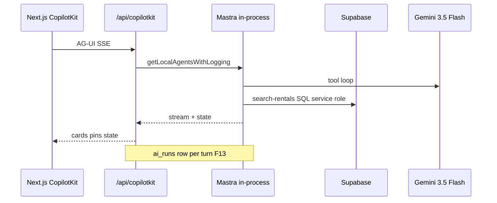
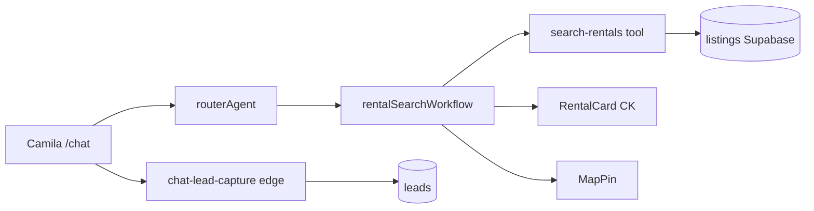

# mdeai.co — Master production PRD & architecture playbook

> **What this document is:** CTO-grade **single master plan** for Medellín AI — consolidating [`prd.md`](../../prd.md) v7, [`roadmap.md`](real-estate/draft/roadmap.md), [`mvp.md`](../../mvp.md), [`plan/mastra/`](./), [`tasks/mastra/`](../../tasks/mastra/) execution specs, maps/events/real-estate module PRDs, and **live repo + Supabase audit** (2026-05-21).
>
> **What this is not:** A license to mark tasks Done without localhost proof. **Planning 82/100 · Implementation 52/100 · Not production-ready.**

**Companion docs:** [`mastra-roadmap.md`](mastra-roadmap.md) (execution lanes) · [`audit/00-supabase-mastra-audit.md`](audit/00-supabase-mastra-audit.md) (Supabase go/no-go) · [`index-mastra.md`](index-mastra.md) (scored playbooks) · [`04-user-stories.md`](04-user-stories.md) (J1–J12 acceptance)

---

# 1. Executive Summary

## 1.1 What mdeai actually is

**mdeai.co** is a **Maps-first AI concierge** for Medellín that unifies:

- **Real estate discovery** (nomad rentals, leads — Camila)
- **Event hosting + ticketing** (Roberto hosts, Andrés buys)
- **Restaurant & tourism discovery** (grounded places — Tourist)
- **One conversational surface** (`/chat`) with map pins, cards, and human approval for money/publish actions

It is **not** a generic chatbot SaaS. Revenue proof in Phase 1: **one paid ticket**, **one published event**, **one rental lead with map pins**.

## 1.2 Current status (2026-05-21)

| Layer | State |
|-------|--------|
| **Planning** | Strong — PRD v7, MAP specs, task index, Mastra playbooks |
| **`mdeapp/`** | Foundation + partial Mastra (agents/workflows in code; UI = `pingAgent` echo) |
| **Supabase** | 122 tables; Mastra Postgres tables populated; RLS on Mastra = service_role |
| **Maps in mdeapp** | ❌ Not started (MAP-001 blocker) |
| **Legacy `/home/sk/mde/`** | Frozen — port patterns only |

## 1.3 Business model (Phase 1)

| Stream | Mechanism | Persona |
|--------|-----------|---------|
| **Event tickets** | Stripe checkout + commission | Andrés, Roberto |
| **Rental leads** | Agent/broker commission on converted lease | Camila |
| **Concierge** | Engagement → future affiliate/sponsor (Phase 2) | Tourist |
| **SaaS (events)** | Deferred — prove host wizard first | Roberto |

## 1.4 Personas

| Persona | Role | Primary surface |
|---------|------|-----------------|
| **Camila** | Apartment seeker | `/chat`, `/rentals` |
| **Roberto** | Event host | `/host/event/new` |
| **Tourist** | Food/attractions/neighborhoods | `/chat` |
| **Andrés / Miguel** | Ticket buyer | Event page → checkout |
| **Patricia** | Ops / billing | `/admin/*`, `ai_runs` |
| **Sofía** | Engineering | CI, `npm run floor` |
| **Lucía** | QA | Playwright, evals |

## 1.5 MVP definition (TRUE MVP)

From [`mvp.md`](../../mvp.md) — **all four required:**

1. Roberto — one AI-assisted **published** event (HITL) → `events` row  
2. Andrés — one **paid** ticket → `event_orders.status = paid`  
3. Camila — rental chat → **≤5 map pins** + one `leads` row  
4. Platform — `/chat` three-panel + **MAP-001–002** + `npm run floor` green  

**Out of MVP:** native rental booking, WhatsApp prod, Hermes hot-path, contests, sponsors, Lingui, RAG for listings, multi-agent sprawl.

## 1.6 Production priorities (ordered)

1. **MAP-001** — contracts + map pipeline + `/chat` shell  
2. **Router on `/chat`** — `routerAgent` (code exists; wire UI)  
3. **Roberto HITL** — `hostEventAgent` + approval edge  
4. **EVT-01** — ticket checkout/webhook port + **F11** secrets  
5. **Camila rental workflow** — SQL `search-rentals` + cards + lead edge  
6. **PostgresStore** — post-MVP exit (durable memory)  
7. **Cutover** — only after MVP checklist + soak  

---

# 2. Current Architecture Audit

**Scoring:** 0–100 production readiness per area (honest, repo-backed).

## 2.1 Summary scorecard

| Area | State | Score | Top risk | Missing |
|------|--------|------:|----------|---------|
| **Frontend (Next 16)** | Auth, home sidebar, shadcn | 65 | No `/chat`, no map | MAP-001, MapContext |
| **Backend (Next API)** | `/api/copilotkit` ✅ | 70 | In-memory Mastra store | PostgresStore |
| **Agents** | 6 agents registered | 55 | UI uses `pingAgent` only | Wire router, host agent |
| **Workflows** | 3 workflows registered | 50 | Not user-tested | E2E + snapshots |
| **Supabase data** | 122 tables, RLS legacy | 75 | JWT-off AI edges | F11, port edges |
| **Maps** | Legacy only | 15 | **Blocker** | vis.gl, MAP-001–012 |
| **RAG / pgvector** | Legacy embed fn | 25 | Overbuild temptation | Defer for listings |
| **Memory** | WM types partial | 40 | `:memory:` LibSQL | F20 Postgres |
| **Testing** | 4 smoke + tool unit | 45 | No map/host e2e | Playwright MAP |
| **Observability** | `ai_runs` ✅, spans in DB | 68 | Dual audit trails | Unify Patricia views |
| **CI/CD** | Vercel + floor | 70 | No eval gate | F20 scorers |
| **Edge functions** | 40+ legacy, 1 mdeai | 55 | verify_jwt false | Port + harden |
| **Realtime** | Supabase available | 50 | Not wired for tickets | Post-MVP |
| **Vector search** | `ai-embed` legacy | 30 | Not MVP path | SQL first |
| **Storage** | Supabase buckets | 60 | — | Event photos |
| **AG-UI / CK** | Pattern 1 ✅ | 85 | Pinned 1.55.2 | v2 deferred |
| **Mastra integration** | In-process ✅ | 72 | Ephemeral storage | PostgresStore |
| **Overall platform** | Not prod-ready | **52** | MAP-001 | PR-1→5 |

## 2.2 Frontend

**Current:** `mdeapp/src/app/page.tsx` — `CopilotSidebar` + `useCoAgent({ name: "pingAgent" })`. Auth at `/login`. Stub `/host/event/new`.

**Risks:** Persona flows split across plan docs but not routes. **Fake-ready:** host page exists without `hostEventAgent`.

**Missing:** `/chat` layout, `MapProvider`, generative cards, `useCopilotAction` mirrors.

## 2.3 Backend & runtime



## 2.4 Agents & workflows (repo truth)

| Registered | File | Wired to UI |
|------------|------|-------------|
| `pingAgent` | agents | ✅ `/` |
| `routerAgent` | agents/router.ts | ❌ |
| `rentalAgent` | agents/rental-agent.ts | ❌ |
| `eventAgent` | agents/event-agent.ts | ❌ |
| `conciergeAgent` | agents/concierge.ts | ❌ |
| `evaluationAgent` | agents/evaluation.ts | ❌ |
| `rentalSearchWorkflow` | workflows | ❌ |
| `eventDiscoveryWorkflow` | workflows | ❌ |
| `conciergeRoutingWorkflow` | workflows | ❌ |

## 2.5 Fake-ready vs production-ready

| Item | Label | Evidence |
|------|-------|----------|
| CK runtime | ✅ Production-ready | POST 200 localhost |
| Router agent code | 🔨 Partial | Not on `/chat` |
| Mastra Postgres tables | ✅ DB ready | 64 messages, 932 spans |
| mdeapp → Postgres storage | 📋 Planned | `:memory:` in index.ts |
| MAP pipeline | 📋 Spec only | No vis.gl in mdeapp |
| Ticketing in mdeapp | 📋 Spec | Legacy edges only |
| RAG concierge | ⏸ Deferred | advanced.md |

---

# 3. Mastra Strategy

## 3.1 Why Mastra

- **Workflow-first** orchestration (rental search, event discovery) — deterministic steps before LLM prose  
- **First-class** CopilotKit integration via AG-UI (`@ag-ui/mastra`)  
- **Storage + evals + Studio** on one stack — avoids 2400 LoC custom glue from legacy  
- **Gemini** via `@ai-sdk/google` — aligns with production AI rule  

## 3.2 Architecture pattern (mandatory)

**Pattern 1 — in-process only:**

```text
Next POST /api/copilotkit → CopilotRuntime → MastraAgent.getLocalAgents({ mastra })
No separate Mastra HTTP server on Vercel hot path
```

## 3.3 Agent structure

```text
routerAgent (lean)
  ├─ classify-intent (tool)
  ├─ rentalSearchWorkflow
  ├─ eventDiscoveryWorkflow
  └─ conciergeRoutingWorkflow (later)

hostEventAgent (Roberto only — separate surface)
  └─ HITL tools + renderAndWaitForResponse on CK side

pingAgent (dev smoke only)
```

**Anti-pattern:** Vendor/Marketing/Activations agents — **cut** per events PRD.

## 3.4 Workflow strategy

| Workflow | Steps | Deterministic core |
|----------|-------|-------------------|
| `rental-search` | classify → SQL search → rank → format cards | Supabase query |
| `event-discovery` | filters → SQL → cards | Supabase query |
| `concierge-routing` | intent → delegate | MAP-002 grounded |

Use **branching + snapshots** for HITL resume (Roberto publish) — see [`examples/workflows/`](examples/workflows/).

## 3.5 Memory strategy

| Tier | Phase 1 | Phase 2+ |
|------|---------|----------|
| **Working memory** | Zod schema per agent (`MdeState`, `EventDraftState`) | Same + `platform/contracts` |
| **Thread memory** | In-memory LibSQL | **PostgresStore** shared with Mastra |
| **Observational memory** | Table exists | Defer |
| **Resource memory** | `mastra_resources` | Host policies |

**Rule:** `createThreadMemory` storage **must equal** `Mastra({ storage })` — one URL.

## 3.6 Observability

| Channel | Table | Owner |
|---------|-------|-------|
| Product audit | `ai_runs` | F13 ✅ CopilotKit hook |
| Mastra traces | `mastra_ai_spans` | F20+ observability package |
| Studio | Local :4111 | Sofía debug |

## 3.7 HITL strategy

Roberto publish: agent tool calls `renderAndWaitForResponse` → `ApprovalPanel` → user `respond()` → `approval-commit` edge → `events` + tiers.

**Never** auto-publish from LLM without approval row.

## 3.8 Evaluation strategy

- **Phase 1:** Unit tests on tool SQL + intent classify; manual Studio  
- **Post-MVP:** `mastra_scorers` + sampled CI (toxicity, tool appropriateness) — not every message  

## 3.9 Tool architecture

```text
mdeapp/src/mastra/tools/
  classify-intent.ts      # router only
  search-rentals.ts       # service role Supabase
  search-events.ts
  search-restaurants.ts
  search-attractions.ts
  audit-wrapper.ts        # risk + ai_runs
```

**Rules:** Zod inputs strict — no `??` on required fields. `withAudit` on side effects.

## 3.10 Streaming

AG-UI events via CopilotKit — see [`examples/streaming/`](examples/streaming/). Workflow streaming for long rental searches optional.

## 3.11 Router strategy

- **Confidence threshold 0.6** — below → clarifying question  
- **Follow-up preservation** — “when can I view?” stays `rental_search`  
- **No prose recommendations from router** — workflow output only  

## 3.12 Multi-agent strategy

**One router + workflows.** Specialists (`rentalAgent`, `conciergeAgent`) optional; **do not** fan-out to 5 agents per turn.

## 3.13 Grounding strategy

Gemini **never invents** `place_id`, coords, hours. **MAP-002:** Grounding Lite MCP + attribution UI.

## 3.14 MCP strategy

| MCP | Use |
|-----|-----|
| Supabase | Schema, RLS verify |
| CopilotKit | API verify |
| Mastra docs | Patterns |
| Google Maps code assist | vis.gl, markers |
| Grounding | Tourist POI |

**Not on Vercel hot path:** Apify browser, OpenClaw.

## 3.15 Recommended folder structure

```text
mdeapp/src/
  platform/contracts/     # PR-1 — MapPin, EventDraft, ToolResponse
  platform/maps/          # MAP-001 pipeline
  mastra/
    index.ts
    agents/
    workflows/
    tools/
    types/
    lib/                  # models, ai-runs, agent-memory
    copilotkit/
  app/
    chat/
    host/event/new/
    api/copilotkit/
  components/
    cards/
    approvals/
```

## 3.16 Anti-patterns

| Anti-pattern | Why bad |
|--------------|---------|
| Separate Mastra server on Vercel | Cold start + auth split |
| Browser automation for Places | Cost + fragility |
| RAG for 25 listings | SQL is faster/cheaper |
| Autonomous publish/send | Trust failure |
| `mastra.agents.X` dynamic access | Beta TypeError |

**Canon:** [`03-best-practices.md`](03-best-practices.md)

---

# 4. CopilotKit Strategy

## 4.1 Version & runtime

- **CopilotKit 1.55.2** pinned — no v2 mix  
- **`ExperimentalEmptyAdapter`** — local agents only  
- Runtime: `src/app/api/copilotkit/route.ts`  

## 4.2 Sidebar strategy

| Surface | Component |
|---------|-----------|
| `/` dev | `CopilotSidebar` (temporary) |
| `/chat` prod | Sidebar + center map + right cards (MAP-007) |
| `/host/event/new` | Sidebar + wizard form | CK form-filling showcase |

## 4.3 Generative UI

`useCopilotAction({ name, render, available: "disabled" })` mirrors agent tools — rental cards, place cards, approval panel.

**Reuse:** `CopilotKit/examples/integrations/mastra/`, `showcases/generative-ui`, `showcases/banking` (HITL).

## 4.4 Shared state

`useCoAgent<T>({ name, initialState })` — `T` must match agent working memory Zod + `src/lib/types.ts`.

## 4.5 Working memory sync

Agent updates WM → AG-UI state sync → React renders. **Triple sync:** agent Zod, `lib/types.ts`, `platform/contracts` (W4+).

## 4.6 HITL UX

`renderAndWaitForResponse` → component gets `respond(value)` → agent continues.

## 4.7 Map integration

Tool returns `MapPin[]` → `useCopilotAction` or state hook → `MapContext.setPins` — **merge by category**, don’t wipe rental pins when restaurant results arrive.

## 4.8 What NOT to build manually

- Raw SSE parser — AG-UI handles  
- Custom chat runtime — CopilotRuntime  
- Assistant UI as replacement — patterns only from mastra-hitl repo  

---

# 5. Supabase Strategy

**Audit:** [`audit/00-supabase-mastra-audit.md`](audit/00-supabase-mastra-audit.md) — **62/100** conditional go.

## 5.1 Schema philosophy

- **Reuse** live project `zkwcbyxiwklihegjhuql` — 122 tables  
- **New tables** only with RLS + policies + migration in plan  
- **Mastra tables** — system; service_role only  

## 5.2 Ideal additions (MVP)

| Table / log | Purpose |
|-------------|---------|
| `grounding_quota_log` | MAP-002 cost |
| `places_request_log` | Field mask audit |

## 5.3 Realtime

Ticket paid → optional Realtime channel for buyer UI — **post-MVP**; MVP can poll.

## 5.4 Edge function plan (mdeapp)

| Function | MVP | Auth |
|----------|-----|------|
| `chat-lead-capture` | ✅ exists | optional user + rate limit |
| `approval-commit` | 📋 F38 | JWT + service |
| `ticket-checkout` | 📋 EVT-01 | JWT |
| `ticket-payment-webhook` | 📋 EVT-01 | Stripe signature |
| `places-proxy` | 📋 MAP-004 | rate limit + mask |

## 5.5 RAG storage

**Defer** listing embeddings for MVP. Host **policy PDF** RAG = Phase 2 ([`examples/rag/`](examples/rag/)).

## 5.6 Event / rental / lead schemas (use existing)

- `events`, `event_tickets`, `event_orders`  
- `listings` / rentals views  
- `leads` with intent enum  

---

# 6. Google Maps + Geo Strategy

**Canon:** [`plan/maps/maps-prd.md`](../../plan/maps/maps-prd.md) · [`tasks/maps/notes.md`](../../tasks/maps/notes.md)

## 6.1 Production architecture

```text
Tool (Mastra) → platform/contracts MapPin
  → CopilotKit state / action
  → MapContext (vis.gl)
  → AdvancedMarker + mapId on parent Map
Places enrichment → edge proxy with X-Goog-FieldMask
Grounding → MCP MAP-002 (not browser scrape)
```

## 6.2 Geo ranking

1. SQL filters (neighborhood, price, beds)  
2. Optional Hermes **batch** rerank (post-MVP)  
3. Grounding order for POI — **never** LLM reorder without data  

## 6.3 Tourist discovery

`/chat` → `conciergeAgent` → `search-restaurants` / `search-attractions` + MAP-002 grounded pins.

## 6.4 Anti-patterns

- Missing `mapId` on `<Map>`  
- Calling Places without field mask  
- LLM-invented coordinates  

---

# 7. RAG + AI Knowledge System

## 7.1 MVP — SQL first

| Domain | Retrieval |
|--------|-----------|
| Rentals | `search-rentals` SQL |
| Events | `search-events` SQL |
| Restaurants | DB + Places |
| Tourism tips | Grounding MCP |

## 7.2 Advanced RAG (Phase 2+)

| Corpus | Store | Use |
|--------|-------|-----|
| Host policy PDFs | pgvector | Roberto Q&A |
| Vendor knowledge | pgvector | Sponsor (deferred) |
| City guides | curated chunks | Tourist |

## 7.3 What should NOT use RAG

- Live listing search  
- Ticket availability  
- Anything needing exact price/availability — **SQL or API**  

## 7.4 Memory hierarchy

```text
Turn → mastra_messages (Postgres)
Session → mastra_threads + WM schema
User → leads, orders (Supabase app tables)
```

---

# 8. Real Estate System

## 8.1 Architecture



## 8.2 Medellín use cases

- “2BR Laureles under $800 USD, remote work” → preference `remote_work`  
- “Show cheaper” → same intent, refined filters  
- “When can I view?” → follow-up preserved → showing HITL light  

## 8.3 Ranking (MVP)

SQL order by price, neighborhood match, verified flag — **no** vector rerank.

## 8.4 Booking roadmap

| Phase | Capability |
|-------|------------|
| MVP | Lead capture only |
| Post-MVP | Showing propose HITL |
| Advanced | Stripe deposit / native booking |

## 8.5 Affiliate / SaaS

Commission on signed lease; landlord SaaS dashboard post-MVP ([`plan/real-estate/`](../../plan/real-estate/)).

---

# 9. Events + Ticketing System

## 9.1 Event lifecycle

```text
Draft (EventDraftState WM) → HITL approve → events row live
→ ticket tiers → checkout → webhook → paid → QR validate
```

## 9.2 Stripe architecture

- **Separate** webhook secrets events vs sponsors (F11)  
- `ticket-checkout` creates session — service role  
- `ticket-payment-webhook` idempotent `event_orders` update  

## 9.3 Organizer AI

`hostEventAgent` + tools: `set_event_basics`, `set_venue`, `add_ticket_tier`, `preview_and_publish` (HITL).

## 9.4 Scaling

Edge functions stateless; DB indexes on `event_id`, `user_id`; Realtime for inventory optional later.

**Canon:** [`plan/events/events-prd.md`](../../plan/events/events-prd.md)

---

# 10. Restaurants + Tourism

## 10.1 Concierge workflows

`conciergeRoutingWorkflow` → restaurant/attraction SQL tools → MAP-002 for discovery cards.

## 10.2 Itinerary (advanced)

`ai-trip-planner` legacy edge — **do not** wire to mdeapp MVP; rebuild as workflow Phase 2.

## 10.3 Grounding

All tourist POI cards show **Google attribution** (MAP-002).

---

# 11. Testing + QA Strategy

## 11.1 Tooling

| Layer | Tool | Gate |
|-------|------|------|
| Unit | Vitest | `npm run floor` |
| Tool logic | Vitest `tools/__tests__` | CI |
| E2E | Playwright | MAP-001+ host path |
| AI eval | Mastra scorers sample | Post-MVP CI |
| Maps | `data-mapid-present` assert | MAP-008 |
| Supabase RLS | SQL scripts / MCP | Release checklist |
| Runtime | localhost `curl` + evidence | **Mandatory Done** |

## 11.2 Quality gates (MVP exit)

- [ ] `npm run floor` exit 0  
- [ ] Playwright: 3 pins on `/chat`  
- [ ] Playwright: HITL publish → event visible  
- [ ] Stripe test → paid order  
- [ ] SQL: lead row from chat  
- [ ] No console errors on `/chat` 60s session  

## 11.3 Production deployment checklist

1. Env vars on Vercel (no service role in client)  
2. F11 webhook secrets rotated  
3. MAP-002 attribution visible  
4. PostgresStore enabled (post-MVP hardening)  
5. `ai_runs` sampling < 1% failures  
6. Legacy AI edges disabled for new app hostname  

**Skill:** task-verifier anti-fake-done checklist.

---

# 12. GitHub Repositories Strategy

**Full scorecard:** [`github/index-github.md`](github/index-github.md)

## 12.1 TOP 20 repos (condensed)

| Score | Repo | Reuse | Risk |
|------:|------|-------|------|
| 98 | CopilotKit×Mastra vendored | **Prod reference** | Low |
| 85 | template-text-to-sql | Tool discipline | Low |
| 82 | mastra-system-check | PR audit skill | Low |
| 78 | ui-dojo | CK page patterns | Med |
| 72 | assistant-ui/mastra-hitl | HITL UX ideas | Med |
| 68 | template-docs-chatbot | MCP docs | Med |
| 58 | apify-mcp-agent | VPS only | High if Vercel |
| 55 | BunsDev/mastra-starter | Folder layout | Low |
| 52 | personal-assistant | Multi-MCP Phase 2 | Med |
| 48 | tanstack-travel | Streaming ideas | Med |
| 45 | meeting-assistant | Defer | — |
| 38 | Retrip product | UX inspiration | — |
| 38 | AgentStack | **Patterns only** | High |
| 32 | mastra-claw-workshop | VPS | — |
| 28 | browsing-agent | **Skip** | High |
| — | github/events vendored | Legacy ideas | — |

## 12.2 Implementation order

1. Vendored CK+Mastra  
2. text-to-sql discipline  
3. mastra-hitl UX  
4. ui-dojo generative UI  
5. mastra-system-check on every Mastra PR  

## 12.3 Do not copy

OpenAI-only runtimes, separate Mastra HTTP server, Assistant UI runtime, Browserbase for Places.

---

# 13. MVP vs Advanced Systems

| TRUE MVP | Phase 2 | Advanced / fantasy |
|----------|---------|-------------------|
| MAP-001–002, 007 | MAP-004–012 full | ECL native shell |
| router + 3 workflows | PostgresStore | Multi-agent networks |
| hostEventAgent + HITL | Evals CI | OpenClaw prod |
| SQL search tools | RAG host PDFs | Hermes hot path |
| Stripe ticket port | Landlord dashboard | Contest marketplace |
| `ai_runs` | `mastra_ai_spans` UI | Sponsor AI suite |
| 25 listings seed | 250+ listings | Vector listing search |
| English UI | Lingui ES | WhatsApp concierge |

**Overengineered — defer:** AgentStack import, browsing-agent, workspace VPS paths, pgvector rentals, 7 module agents.

---

# 14. Production Roadmap

**Detailed lanes:** [`mastra-roadmap.md`](mastra-roadmap.md) · platform [`roadmap.md`](real-estate/draft/roadmap.md)

## 14.1 Critical path

```text
MAP-001 → router on /chat → MAP-002 → (Roberto track | Camila track) → MVP exit → PostgresStore
```

## 14.2 Week-by-week (realistic 12–14 weeks)

| Week | Focus | Exit proof |
|------|-------|------------|
| W3 | MAP-001 + router | pins on map |
| W4 | Roberto agent + HITL | draft → approve |
| W5 | Rental WF + cards | ≤5 cards |
| W6 | Concierge + MAP-006 | restaurant pins |
| W7 | Lead + ticket port | lead + paid test |
| W8–9 | e2e + floor | MVP checklist |
| W10–12 | soak / cutover prep | prod gate |

## 14.3 Blockers

1. MAP-001  
2. F11 Stripe  
3. UI agent wiring  
4. `:memory:` storage (post-MVP hardening, not MAP blocker)  

## 14.4 Highest business value first

1. Paid ticket (O1)  
2. Published event (O2)  
3. Rental lead + pins (O3)  
4. Trusted `/chat` (O4)  

---

# 15. Real-World User Journeys

**Full acceptance:** [`04-user-stories.md`](04-user-stories.md) (J1–J12). Summary:

## 15.1 Camila (rentals)

| Step | Frontend | Backend | AI | Maps | DB |
|------|----------|---------|-----|------|-----|
| Open `/chat` | 3-panel | — | — | empty map | — |
| Ask 2BR Poblado | sidebar | copilotkit | router → rental WF | pins | listings query |
| Tap card | card click | — | — | highlight pin | — |
| Confirm interest | lead CTA | edge fn | tool | — | `leads` insert |

## 15.2 Roberto (events)

| Step | Frontend | Backend | AI | Maps | DB |
|------|----------|---------|-----|------|-----|
| `/host/event/new` | wizard | copilotkit | hostEventAgent | venue pin | WM only |
| Approve | ApprovalPanel | edge | HITL respond | — | `events` |
| Publish | — | — | — | — | tiers live |

## 15.3 Tourist

`/chat` → router → concierge → MAP-002 grounded restaurants → attribution on card.

## 15.4 Andrés (attendee)

Browse event → `ticket-checkout` → Stripe → webhook → `/me/tickets/:id` QR.

## 15.5 Patricia (admin)

Query `ai_runs` + later `mastra_threads` for support; no direct Mastra table access from browser.

---

# 16. Final Recommendations

## 16.1 Architecture recommendation

**Keep Pattern 1.** One router, typed tools, SQL-first search, CK generative UI, Supabase edges for money/leads only.

## 16.2 Ideal stack (unchanged)

Next 16 · CK 1.55.2 · Mastra · Supabase · Gemini 3.5 Flash · vis.gl · Places + Grounding MCP · Vercel · Stripe edges

## 16.3 Simplification opportunities

- Collapse specialist agents into workflows-only for MVP  
- Skip RAG entirely Phase 1  
- Use `ai_runs` only (defer span UI)  
- Single `/chat` instead of per-vertical apps  

## 16.4 Biggest risks

| Risk | Mitigation |
|------|------------|
| MAP-001 slip | PR-1 only until pins work |
| Fake Done tasks | task-verifier + localhost proof |
| JWT-off legacy edges | Route mdeapp away from `ai-chat` |
| Gemini geo hallucination | MAP-002 + schema validation |
| Storage loss on cold start | PostgresStore post-MVP |

## 16.5 Biggest opportunities

- First **grounded** Medellín concierge with map + ticket proof  
- Reuse 122-table Supabase — speed to revenue  
- Mastra workflows = testable deterministic core  

## 16.6 Technical debt cleanup

1. Wire `routerAgent` on `/chat`  
2. PostgresStore (F20)  
3. Port ticket edges to `mdeapp/supabase/functions/`  
4. Add `platform/contracts`  
5. Retire dependency on legacy `ai-chat` edge  

## 16.7 Production hardening checklist

See §11.3 + [`audit/00-supabase-mastra-audit.md`](audit/00-supabase-mastra-audit.md) §10.

---

## Document map

| Need | Read |
|------|------|
| Execute next sprint | [`mastra-roadmap.md`](mastra-roadmap.md) |
| Score a feature | [`index-mastra.md`](index-mastra.md) |
| Supabase go/no-go | [`audit/00-supabase-mastra-audit.md`](audit/00-supabase-mastra-audit.md) |
| Platform PRD v7 | [`plan/prd/README.md`](../../plan/prd/README.md) |
| MVP outcomes | [`mvp.md`](../../mvp.md) |

**Maintainers:** Update **implementation_score** when PR-1→5 land. Do not raise to production-ready without MVP exit checklist.
