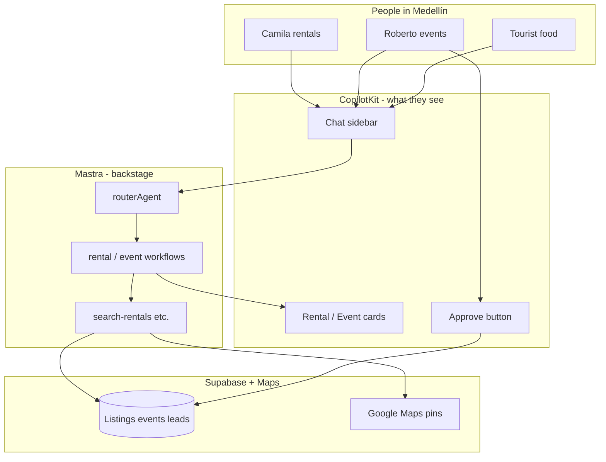

# mdeai — Mastra + CopilotKit summary

**One sentence:** mdeai.co is a Medellín concierge app where people **chat**, see results on a **map**, and complete real actions (rental lead, published event, paid ticket) — powered by **CopilotKit** (chat UI) + **Mastra** (AI brain) + **Supabase** (data) + **Google Maps** (places).

---

## Who does what (four boxes)

Think of four teammates. Each has one job; they don’t steal each other’s work.

| Teammate | Job | Real-world analogy |
|----------|-----|-------------------|
| **Supabase** | Stores listings, events, leads, tickets, users | The building’s filing system + locks (RLS) |
| **Mastra** | Decides intent, runs search workflows, calls tools | The concierge **backstage** — routing and procedures |
| **CopilotKit** | Sidebar chat, cards, forms, “Approve” buttons | What **Camila and Roberto see and tap** |
| **Google Maps** | Pins, places, attribution | The **map on screen** — never guessed by the AI |

```text
Camila types in CopilotKit sidebar
    → Next.js /api/copilotkit
    → Mastra routerAgent + rentalSearchWorkflow
    → Supabase SQL (real listings)
    → CopilotKit shows RentalCards + map pins
```

**Gemini** only **explains** what tools returned. It must not invent addresses, `place_id`, or prices.

---

## What “Mastra + CopilotKit” means in practice

### CopilotKit (the product face)

- Chat sidebar on `/` today; **`/chat`** with map is the real product surface.
- Shared state (`useCoAgent`) so the UI shows what the agent is working on.
- **Generative UI:** rental cards, event preview, approval panel — not walls of JSON.
- **Human-in-the-loop:** Roberto taps **Approve** before anything goes live.

**Reference we copy:** vendored example at `CopilotKit/examples/integrations/mastra/` (score 98/100).

### Mastra (the orchestration brain)

- **Agents** — specialized instructions (router, host event, etc.).
- **Tools** — typed functions that hit Supabase (`search-rentals`, `search-events`, …).
- **Workflows** — step-by-step pipelines (classify → search → format cards).
- **Studio** (`localhost:4111`) — Sofía debugs agents without touching production.

**Not in prod:** a separate Mastra server users hit directly. Everything runs **inside** Next.js (Pattern 1).

---

## MVP — what “done” looks like (four proofs)

From [`mvp.md`](../../mvp.md). All four required before we call Phase 1 shipped.

| # | Outcome | Persona | Real-world example |
|---|---------|---------|-------------------|
| **O1** | One **paid** ticket | Andrés | Buys entrada to a salsa night; `event_orders.status = paid` |
| **O2** | One **published** event | Roberto | Says *“Jazz in Poblado Saturday 8pm, $20 tickets”* → approves preview → live `events` row |
| **O3** | Rental chat → map + lead | Camila | *“2BR in Laureles under $80, good WiFi”* → ≤5 pins on map → one `leads` row |
| **O4** | Unified `/chat` + trust | Tourist / Camila | *“Coffee near Provenza”* → grounded restaurant pins + **Google attribution** |

**Out of MVP:** WhatsApp prod, browser scraping listings, vector RAG for apartments, 7 competing agents, native rental checkout.

---

## Real-world journeys (how it should feel)

### Camila — rentals

1. Opens **`/chat`** (three panels: chat · map · cards).
2. Asks: *“Apartment for two months, Laureles, remote work, under $2,500/month.”*
3. **Mastra `routerAgent`** classifies `rental_search` → runs **`rentalSearchWorkflow`**.
4. Tool **`search-rentals`** queries Supabase (real rows — not AI imagination).
5. **CopilotKit** shows up to five **RentalCards**; map gets pins in Laureles.
6. She says *“I want to view #2”* → **`chat-lead-capture`** edge writes **`leads`** for the broker.

**Follow-up that must work:** *“Show cheaper options”* stays in rentals (router does not “forget” intent).

---

### Roberto — event host

1. Opens **`/host/event/new`** with **CopilotKit** sidebar.
2. Says: *“Techno party at a warehouse in Envigado, 200 capacity, early bird $15.”*
3. **`hostEventAgent`** fills wizard fields (working memory `EventDraftState`).
4. Preview card appears → **ApprovalPanel** (Approve / Edit / Reject).
5. On Approve → edge **`approval-commit`** → **`events`** + ticket tiers in Supabase.
6. Camila and Tourist can discover the event via search and map.

**CopilotKit pattern:** `renderAndWaitForResponse` (like a banking “confirm transfer” flow).

---

### Tourist — food & neighborhoods

1. Same **`/chat`** as Camila.
2. Asks: *“Best arepas within walking distance of Parque Lleras.”*
3. Router → concierge path → **`search-restaurants`** + **MAP-002 Grounding**.
4. Cards show real places; map pins use **`place_id`** from Google — with **“Google Maps”** attribution on the card.

**We do not use:** [template-browsing-agent](https://github.com/mastra-ai/template-browsing-agent) (browser bots scraping the web on Vercel).

---

### Andrés — ticket buyer

1. Finds Roberto’s event on the site.
2. Stripe checkout (edge functions ported to mdeapp).
3. Webhook marks order **paid**; QR on **`/me/tickets/:id`**.

Mastra is light here — **Supabase + Stripe** own money truth.

---

### Patricia & Sofía — ops & engineering

| Persona | What they use | Example |
|---------|---------------|---------|
| **Patricia** | `ai_runs` table | *“Why was this reply slow?”* → row shows agent, model, duration |
| **Sofía** | `npm run floor`, Mastra Studio | Merge blocked if tests fail; trace a bad tool call at :4111 |

---

## Where we are today (honest)

| Built | Not built yet |
|-------|----------------|
| App on Vercel, login, sidebar, **pingAgent** smoke | **`/chat`** with map (MAP-001) |
| Mastra **router + 3 workflows + 5 tools** in code | UI still uses **pingAgent** on `/`, not router |
| **`ai_runs`** logging (F13 ✅) | Chat memory lost on cold start (`:memory:` storage) |
| Auth + shadcn + tests | Roberto wizard + HITL + paid ticket in **mdeapp** |

**Scores:** planning **~82/100** · implementation **~52/100** · **not production-ready** for full MVP.

---

## What to build next (simple order)

```text
1. MAP-001     → map + /chat shell + shared pin contracts
2. MASTRA-001  → prove router + workflows with tests
3. MASTRA-002  → routerAgent on /chat (not pingAgent)
4. MAP-002     → grounded places + attribution
5. Roberto     → F33–F38 host wizard + approve
6. Camila      → rental cards + lead
7. Tickets     → F11 + EVT-01 Stripe
8. MASTRA-003  → save chat history in Postgres (after MVP)
```

### Mastra tasks ([`tasks/mastra/`](../../tasks/mastra/INDEX.md))

| Task | Plain English | ~time |
|------|---------------|------|
| **MASTRA-001** | Automated checks that router and workflows really run | 2–3h |
| **MASTRA-002** | Product chat uses the **router**, not echo bot | 1–2h |
| **MASTRA-004** | Log **who** asked (user id) + audit on search tools | 1.5h |
| **MASTRA-003** | Remember conversation after server restart | 3–4h (post-MVP) |
| **MASTRA-005** | Checklist before merging Mastra PRs | 1h |

### Other critical tasks (not in `tasks/mastra/`)

| Task | Plain English |
|------|---------------|
| **MAP-001** | Map appears; tools can add pins |
| **MAP-002** | Google-sourced places show legal attribution |
| **F33–F38** | Roberto AI event wizard + approve |
| **F11** | Separate Stripe secrets for tickets vs sponsors |
| **EVT-01** | Ticket checkout works on new app |

Track everything: [`tasks/progres.md`](../../tasks/progres.md) · [`todo.md`](../../todo.md).

---

## GitHub templates — what helps (without confusion)

Official [Mastra templates](https://mastra.ai/templates) are **examples to learn from**, not apps we deploy as-is.

| Template | Use for mdeai? | Why |
|----------|----------------|-----|
| **CopilotKit + Mastra** (vendored in repo) | ✅ **Yes — production** | Already our stack |
| **[text-to-sql](https://github.com/mastra-ai/template-text-to-sql)** | ✅ **Ideas only** | We use **typed** `search-rentals`, not free SQL from the model |
| **mastra-hitl** (Assistant UI demo) | ✅ **UX ideas** for Roberto approve |
| **deep-search** | 🟡 Later | Workflow patterns only — not Exa search in prod |
| **browsing-agent** | ❌ **No** | Use Places API + Grounding instead |

Full scorecard: [`github/index-github.md`](github/index-github.md).

---

## What we deliberately skip (avoid scope creep)

- **Many agents** chatting with each other — one **router** + workflows is enough.
- **RAG / vectors** for finding apartments — SQL on 25 listings first.
- **Browser automation** for Zillow/Facebook — enrichment on VPS later only.
- **CopilotKit v2** — stay on **1.55.2** for Phase 1.
- **OpenClaw / WhatsApp** on the hot path — Phase 2+.

---

## One diagram — full stack



---

## Where to read more

| If you want… | Open |
|--------------|------|
| Full technical PRD (16 sections) | [`prd-mastra.md`](prd-mastra.md) |
| Week-by-week execution | [`mastra-roadmap.md`](mastra-roadmap.md) |
| Feature scores & playbooks | [`index-mastra.md`](index-mastra.md) |
| Task specs to implement | [`tasks/mastra/INDEX.md`](../../tasks/mastra/INDEX.md) |
| Supabase + Mastra DB audit | [`audit/00-supabase-mastra-audit.md`](audit/00-supabase-mastra-audit.md) |
| Implementation rules | [`03-best-practices.md`](03-best-practices.md) |
| Platform MVP (all modules) | [`../../mvp.md`](../../mvp.md) · [`../../roadmap.md`](real-estate/draft/roadmap.md) |

---

## Glossary (30 seconds)

| Term | Meaning |
|------|---------|
| **Pattern 1** | Mastra runs inside Next.js `/api/copilotkit` — not a second public AI server |
| **AG-UI** | Wire protocol between CopilotKit UI and Mastra agents |
| **HITL** | Human must approve before money or publish |
| **MAP-001** | Map + pin pipeline — biggest UI blocker |
| **ai_runs** | Audit log Patricia uses — one row per AI turn |
| **Grounding** | Google-backed place search — Tourist trust |

*This page is the elevator pitch. Details and acceptance tests live in the linked docs.*
