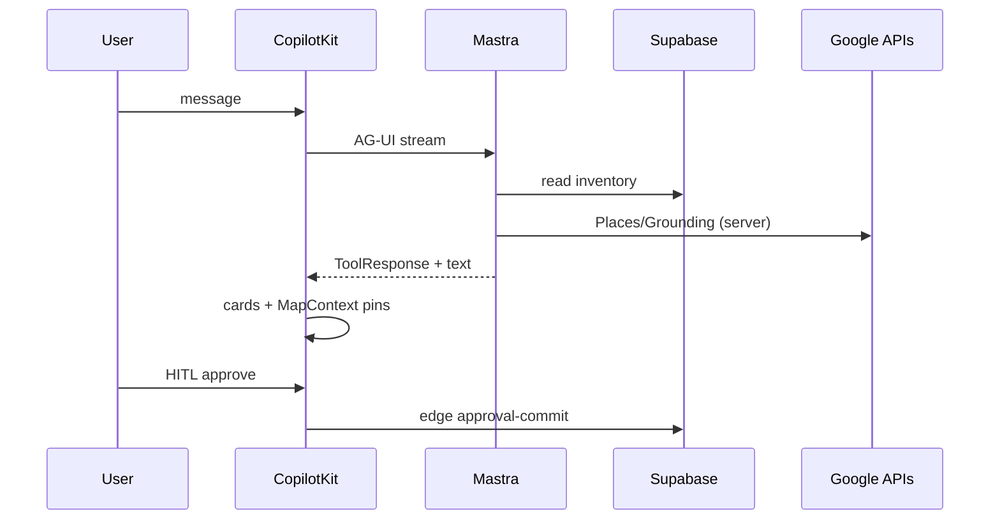

# 02 — Core architecture

> [← Executive strategy](./01-executive-strategy.md) · [Next: Runtime →](./03-runtime-orchestration.md)

## Document spec

| Field | Value |
|-------|-------|
| **Implementation impact** | Every feature must declare which lane it touches |
| **Tasks** | Architecture reviews, forbidden-pattern lint rules |

---

## 1. Layer responsibilities

| Layer | Owns | Must never |
|-------|------|------------|
| **Supabase** | Rows, RLS, RPCs, webhooks storage | Run LLM inference |
| **Mastra** | Tools, workflows, routing, working memory | Render UI or hold secrets client-side |
| **CopilotKit** | Chat, cards, HITL, `useCoAgent` | Invent geo or write commerce rows directly |
| **Google Maps** | Pin render, camera, clustering | Decide inventory or pricing |
| **Gemini** | Language, ranking copy, form-fill suggestions | Output `place_id`, coords, URLs, hours |
| **Edge functions** | Stripe, Places proxy, approval commit | Replace Mastra orchestration |
| **Vercel** | Hosting, env, previews | Business logic |

---

## 2. Unified request flow

---

## 3. Vertical modules (one platform)

| Module | Data SoT | Orchestration | UI |
|--------|----------|---------------|-----|
| Rentals | `apartments`, `leads` | `rental-search` workflow | RentalCard + pins |
| Events | `events`, `event_tickets` | `hostEventAgent` + `venue-discovery` | Wizard + HITL |
| Concierge | cache + `tourist_destinations` | router + grounded tool | Place cards |
| Ticketing | `event_orders` | **edge only** | Checkout + wallet |

Deep specs: [04](./04-maps-grounding.md) · [05](./05-events-ticketing.md) · [06](./06-rentals-leads.md).

---

## 4. Anti-patterns (reject in PR review)

| Anti-pattern | Why |
|--------------|-----|
| Custom SSE chat transport | AG-UI provided |
| Second orchestrator | Operational doubling |
| LLM-written `events` insert | HITL + edge commit |
| Client-side Places with API key | Secret leak + mask bypass |
| Multiple pin writers | Race + inconsistent map |
| Service role in `mdeapp/src/**` | Security |
| Maps npm before MAP-001 contract | Integration thrash |

---

## 5. Phase boundaries

| Phase | Scope |
|-------|-------|
| **Phase 1 (MVP)** | PR-1–5, English, 4 agents max |
| **Post-MVP** | Clustering polish, admin depth, Lingui |
| **Advanced** | OpenClaw batch, Hermes offline, Connect booking |

[`advanced.md`](../../advanced.md) — contamination rule: MVP must be green first.

---

## 6. Technology lock

| Tech | Version / rule |
|------|----------------|
| Next.js | 16 App Router |
| CopilotKit | **1.55.2** only |
| Mastra | Local + `@ag-ui/mastra` |
| Gemini | `gemini-3.5-flash` default |
| Maps | vis.gl + `mapId` + field masks |
| Stripe | Checkout + webhooks in edge |
| i18n | English Phase 1 |

---

## 7. Conflict resolutions (canonical)

See [00-forensic-audit.md §3](./00-forensic-audit.md#3-biggest-contradictions-resolved).

---

## 8. Scaling posture (design)

- **Chat:** stateless UI + thread memory in Mastra storage (LibSQL dev → Postgres prod)  
- **Maps:** cache tables before live Places/Grounding  
- **DB:** existing 122 tables; add logs not duplicate inventory  
- **Cutover:** rolling % traffic after MVP exit soak  

Detail: [09-operations-security.md](./09-operations-security.md).
