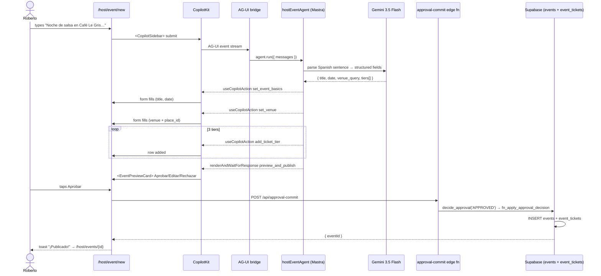
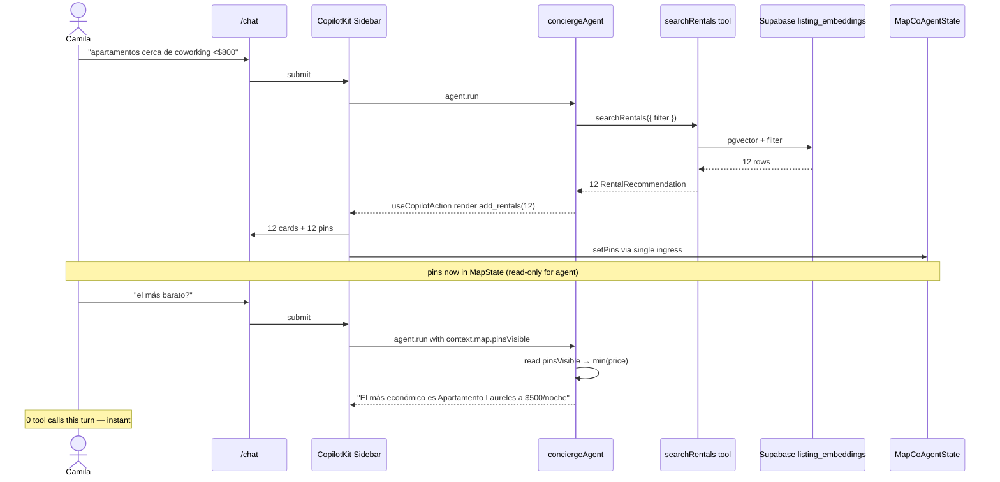

# PART II — Users + Flows

> [← Part I](./01-foundation.md) · [Index](../prd.md) · [Next: Part III — Architecture →](./03-architecture.md)

## 8. Core user journeys

Preserved from legacy v5.1 §2.1 with updated route paths for the new app.

### 8.1 Persona A — **Miguel** (digital nomad)

> 31, remote dev, Berlin → Medellín for 3 months. Zero Spanish. $1,200–1,800/mo. Wants verified apartment + lease translation.

**New journey:**
1. Lands on `/chat`, types *"apartments in Laureles, fast wifi, $1500 budget"* (English)
2. CopilotKit `useCopilotAction({ render })` shows 12 rental cards inline
3. Map pins drop in sync via `useCoAgentState` (read-only)
4. Asks *"closest to coworking?"* — agent answers from the 12 pins already shown (no re-search)
5. Taps a pin → place card (`@googlemaps/extended-component-library` `<gmp-place-overview>`)
6. Submits a lead → `leads` table → WhatsApp routes to landlord (Phase 2 OpenClaw)

### 8.2 Persona B — **Camila** (event-goer, voter)

> 24, paisa, Laureles. TikTok/IG. PSE/Nequi. Doesn't install apps.

**New journey:**
1. Lands on `mdeai.co` (homepage) → search bar + map
2. Types *"rooftops with salsa Friday under $50.000"*
3. Cards + pins appear in chat (`useCopilotAction({ render })`)
4. Taps an event card → `/events/:id` (server-rendered, fast)
5. Stripe Checkout → webhook → ticket in `/me/tickets/:id`
6. QR code visible; saves to wallet

### 8.3 Persona C — **Roberto** (event host) — **Phase 1 hero flow**

> 38, runs a venue in Provenza. Used Eventbrite + WhatsApp + Excel before. Wants one tool.

**New journey:**
1. Logs in, lands on `/host/events`
2. Taps "Crear evento" → `/host/event/new`
3. Sidebar opens (`<CopilotSidebar>`); empty form
4. Types: *"Noche de salsa en Café Le Gris este viernes, 3 tarifas de $20.000 a $80.000 COP"*
5. `hostEventAgent` parses; calls 3 frontend actions: `set_event_basics`, `set_venue`, `add_ticket_tier` × 3
6. Form fills in front of him
7. Preview card via `renderAndWaitForResponse` shows **Aprobar / Editar / Rechazar**
8. Taps "Aprobar" → `approval-commit` edge fn → `decide_approval()` RPC → `events` + `event_tickets` insert
9. Toast: *"¡Publicado! Ver en /host/events/{id}"*

### 8.4 Persona D — **Andrés** (door staff)

> 22, runs the door at a venue. Uses an old Android phone.

**Phase 1.5 journey** (deferred from MVP scope):
- PWA at `/staff/scan/:eventId/:token` — port from legacy
- Scans QR → `ticket-validate` edge fn → check-in row written

### 8.5 Persona E — **Patricia** (admin)

> 42, ops + finance.

**New journey:**
- `/admin/events` → all events with status
- `/admin/approvals` → queue of `approval_requests` (live RLS-tight table)
- `/admin/leads` → rentals lead board (chronological)

### 8.6 Persona F — **Sofía** (developer) / **Lucía** (QA)

- Sofía: adds new rental field → edit `src/types/mde-state.ts` only (Zod schema is single source)
- Lucía: runs `npm run floor` → lint + build + test + e2e exits 0

---

## 9. Core AI flows

### Camila's comparative chat flow (`/chat`, week 6)

> [← Part I](./01-foundation.md) · [Index](../prd.md) · [Next: Part III — Architecture →](./03-architecture.md)
