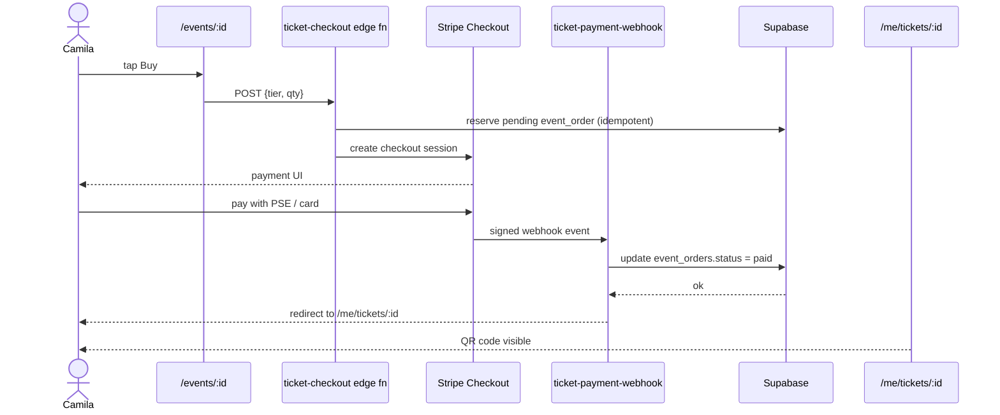

# PART IV — Product Surfaces

> [← Part III](./03-architecture.md) · [Index](../prd.md) · [Next: Part V — Code Organization →](./05-code.md)

## 22. Rental system architecture

| Surface | URL | What |
|---|---|---|
| Rental list + map | `/rentals` | 44 apartments + 20 rentals; `useCopilotAction({ render })` cards + map pins via `useCoAgentState` |
| Rental detail | `/rentals/:id` | Server-rendered; `<gmp-place-overview>` + photos + lead capture form |
| Chat with rentals | `/chat` | Concierge agent answers comparative queries from visible pins |
| Lead submission | inline modal | Posts to existing `chat-lead-capture` (after `verify_jwt` fix) |

**Search backend:** `pgvector` (`listing_embeddings`, 44 rows already indexed) + filter on price, neighborhood, beds.

## 23. Booking architecture

**Phase 1: affiliate only.** Lead capture → WhatsApp → landlord closes outside the platform.

**Phase 5 (native booking):**
- New tables: `rental_reservations`, `rental_payments`
- Stripe Connect for landlord payouts
- Calendar sync (Airbnb iCal import)

## 24. Ticketing architecture

Preserved from legacy (works today, just port edge fns):

| Component | Source | New repo |
|---|---|---|
| `ticket-checkout` edge fn | legacy `supabase/functions/ticket-checkout/` | port week 9 |
| `ticket-payment-webhook` edge fn | legacy | port week 9 + Stripe dashboard proof |
| `ticket-validate` edge fn | legacy | port week 9 |
| Buyer wallet `/me/tickets/:id` | new SSR page | week 8 |
| Staff scan PWA `/staff/scan/:eventId/:token` | port from legacy | week 9 (or Phase 1.5) |

**Multi-tier ticket schema reference:** Hi.Events `tickets` model (read-only — AGPL). Adopt fields we lack via migration.

### Buyer journey (Camila buys a ticket)

## 25. Contest system roadmap (Phase 3)

- Anti-fraud (vote-buying detection)
- Identity layer (Cédula via Veriff or similar)
- Legal compliance (Colombian contest regulations)
- Dispute resolution + appeals
- Sponsor-funded prize pools

**Not Phase 1, not Phase 2.** Existing legacy `mvp.md` confirms.

## 26. Sponsor marketplace roadmap (Phase 3)

- Sponsor onboarding (`sponsor_profiles` table exists, deploy-only fns need forensic)
- AI brand-fit (Hermes ranking — pgvector)
- ROI dashboard
- Stripe Connect for sponsor payouts
- Approval flow (sponsor proposes contract → host approves → platform commits)

**Existing infrastructure to port (Phase 3):** 12 sponsor edge functions currently deploy-only.

## 27. OpenClaw roadmap

**See [Part IX — Advanced OpenClaw + Autonomous Operations Strategy](./09-openclaw.md).**

Phase-1 prep only: ensure `approval_requests`, `correlation_id`, `agent_tool_calls`, `outbox_events`, and `packages/types/` exist so OpenClaw drops in later without rewrite.

## 28. Future WhatsApp roadmap

| Feature | Phase | Existing |
|---|---|---|
| Inbound webhook | Phase 2 forensic | `whatsapp-webhook` deploy-only (D-grade) — port + HMAC proof |
| Lead reply automation | Phase 2 | Will route via OpenClaw outreach (deferred) |
| Booking confirmations | Phase 2 | Stripe webhook → WhatsApp message via Twilio |
| Concierge handoff | Phase 3 | OpenClaw async escalation |

**Existing Twilio credentials in env:** `TWILIO_ACCOUNT_SID`, `TWILIO_API_KEY`, `TWILIO_API_SECRET`, `TWILIO_PHONE_NUMBER`. Ready to wire when forensic completes.

> [← Part III](./03-architecture.md) · [Index](../prd.md) · [Next: Part V — Code Organization →](./05-code.md)
