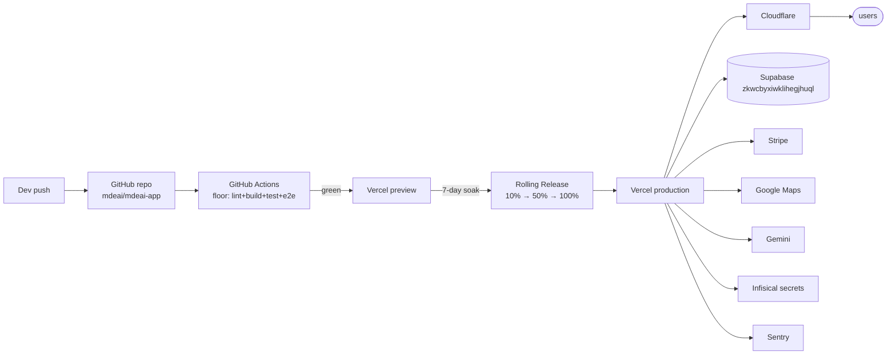

# PART VI — Operations

> [← Part V](./05-code.md) · [Index](../prd.md) · [Next: Part VII — Reuse Strategy →](./07-reuse.md)

## 36. Observability + logging strategy

| Layer | Tool | What |
|---|---|---|
| Frontend errors | Sentry | Runtime errors with `correlation_id` |
| Backend errors | Sentry + Supabase Logs | Same `correlation_id` |
| AI runs | `agent_runs` table (existing) | Tokens, duration, status, agent, model |
| Tool calls | `agent_tool_calls` table (existing) | Per-call ledger |
| Grounding | `grounding_call_log` (NEW W6) | Per-call cost ledger |
| Drift detection | `map_render_drift_log` (verify exists) | emitted ↔ rendered pin counts |
| AG-UI events | CopilotKit `/cpk-debug-events` (dev only, NODE_ENV !== production) | Stream inspection |
| CopilotKit API verification | `copilotkit-docs` MCP server (`search-docs`, `search-code`) | **Required before every CopilotKit change** — the API moves between releases; do not rely on training data |
| Mastra API verification | `mastra-docs` MCP (`searchMastraDocs`, `mastraDocs`, `readMastraDocs`) | **Required before every Mastra change** — Mastra `beta` channel shifts often |
| Gemini model + deprecation check | `gemini-api-docs-mcp` (`search_docs`) | **Required before naming any Gemini model** — preview models (e.g. `2.0-flash-exp`) get superseded |

**`correlation_id` propagates end-to-end:** CopilotKit AG-UI event → Mastra `agent_runs.correlation_id` → tool's `agent_tool_calls.correlation_id` → edge fn → Supabase RPC → Sentry transaction.

## 37. Security architecture

| Surface | Defense |
|---|---|
| Service role keys | **Never in `src/**`.** Edge fns only. Enforced by hook `no-service-role-in-src` |
| Secrets | Infisical → Vercel → Supabase Edge Functions |
| Webhook signatures | Stripe signing secret (audit week 1 — separate ticket vs sponsor in `.env.local`: `STRIPE_WEBHOOK_SECRET` vs `STRIPE_SPONSOR_WEBHOOK_SECRET`) |
| Auth | Supabase Auth (existing — email/password + Google OAuth) |
| RLS | Every table has RLS on; every reviewed table has ≥ 1 policy |
| CSP + secure headers | Next.js `headers()` config + `vercel.ts` `routes.cacheControl` |
| Rate limiting | Existing `check_rate_limit_rpc` (10 AI/min/user, 30 search/min/user) |
| Approval gate | All high-stakes writes require approval; no direct AI writes |
| Bot detection | **Vercel BotID** (GA June 2025) on checkout + lead capture |

## 38. RLS strategy

Preserved from legacy:

- **Every table:** `ENABLE ROW LEVEL SECURITY` + ≥ 1 policy
- **Pattern:** `(select auth.uid())` subquery (not direct `auth.uid()`)
- **SELECT:** public for listings, user-scoped for personal data
- **INSERT/UPDATE/DELETE:** always require `auth.uid()` match OR admin role check via `user_roles` EXISTS subquery
- **Admin writes:** service role in edge functions only

## 39. Approval flow examples

### Example 1 — Roberto publishes event

```
1. hostEventAgent fills EventDraftState via 3 frontend actions
2. Calls `preview_and_publish` HITL action
3. <ApprovalPanel draft={draft}> renders with Aprobar/Editar/Rechazar
4. Roberto taps Aprobar
5. POST /api/approval-commit with {trace_id, draft}
6. Edge fn calls decide_approval(trace_id, 'APPROVED', draft)
7. RPC: fn_apply_approval_decision inserts events + event_tickets in tx
8. Returns {eventId}
9. UI navigates to /host/events/{eventId}
```

### Example 2 — Sponsor matches event (Phase 3)

```
1. sponsorMatchAgent suggests sponsor for event
2. Host sees proposal card with Aprobar/Editar/Rechazar
3. On approve: approval-commit creates sponsor_contracts row + Stripe Connect transfer
4. On reject: approval_decisions logs REJECTED + reason
```

### Example 3 — Rental lead enrichment (Phase 2 OpenClaw)

```
1. Lead arrives → leads row inserted
2. OpenClaw enrichment workflow:
   - Lookup landlord via existing landlord_profiles
   - Check listing freshness
   - Suggest WhatsApp template
3. Suggestion appears in /admin/leads as proposal
4. Patricia (admin) reviews + approves
5. WhatsApp outreach fires
```

## 40. Production deployment architecture



**New since legacy:** Vercel **Rolling Releases** (GA June 2025) for gradual cutover instead of all-at-once.

## 41. Vercel strategy

- **One Vercel project per app** (legacy mde + new mdeai-app)
- **Runtime:** Fluid Compute (Node 24 LTS) for everything — no edge-runtime constraint
- **Config:** `vercel.ts` (typed, replaces `vercel.json`) — install `@vercel/config` (`npm i -D @vercel/config`)
- **ISR / streaming:** for `/events/:id` and `/rentals/:id` (SEO + freshness)
- **Cutover:** Rolling Releases (10/50/100%) + Vercel rewrite from legacy domain
- **Optional:** Vercel **AI Gateway** for Gemini + OpenAI fallback unified API (post-MVP)
- **Optional:** Vercel **Queues** for OpenClaw background jobs (Phase 2)
- **Optional:** Vercel **Sandbox** for testing untrusted user code (Phase 3 — not needed now)

`vercel.ts` example shape:

```ts
import { routes, type VercelConfig } from '@vercel/config/v1';

export const config: VercelConfig = {
  buildCommand: 'npm run build',
  framework: 'nextjs',
  headers: [
    routes.cacheControl('/api/places/autocomplete', { public: true, maxAge: '1 hour' }),
  ],
  // crons: added in W9 when ticket-orders cleanup is needed.
  // Example shape (do NOT add until /api/cleanup-expired-orders route exists in §30):
  //   crons: [{ path: '/api/cleanup-expired-orders', schedule: '*/30 * * * *' }],
};
```

## 42. Scaling strategy

| Concern | Today | Phase 1 limit | Action |
|---|---|---|---|
| Concurrent buyers per event | 50 (load tested) | 200 | Stripe handles; Supabase row lock OK |
| AI requests | 10/min/user | unchanged | Existing rate limit |
| Map quota | Manual monitoring | $200/day alert | Set Google Maps quota cap |
| pgvector listings | 44 rows | 5,000 | pgvector handles easily; HNSW index when > 10k |
| Supabase connection pool | 60 | unchanged | Supabase pooler enabled (use `DATABASE_URL` pooler URL from env) |
| Vercel function timeout | 300s default | unchanged | More than enough for chat |
| Vercel function concurrency | Fluid Compute reuses instances | scales automatically | No cold-start work needed |

> [← Part V](./05-code.md) · [Index](../prd.md) · [Next: Part VII — Reuse Strategy →](./07-reuse.md)
