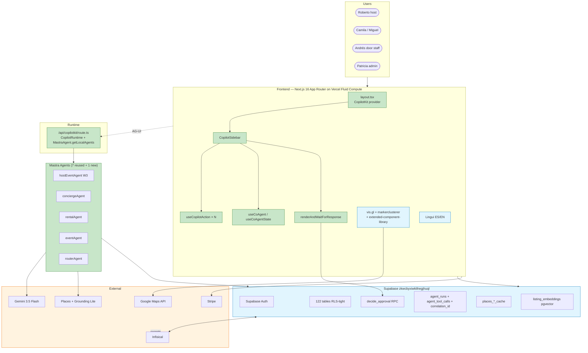

# PART VIII — Delivery

> [← Part VII](./07-reuse.md) · [Index](../prd.md) · [Next: Part IX — OpenClaw →](./09-openclaw.md)

## 49. Risk analysis

| Risk | Likelihood | Impact | Mitigation |
|---|---|---|---|
| Mastra `beta` channel API drift | Medium | High | Pin exact beta hash; quarterly upgrade ceremony |
| CopilotKit `1.55.2` → `v2` pressure | Medium | Medium | Stay on `1.55.2` for MVP; v2 is Phase 2 exploration |
| Shared-state sync bug ([CopilotKit #3426](https://github.com/CopilotKit/CopilotKit/issues/3426)) | Medium | High | Use `useCoAgentState` read-only for Map; sync assertion |
| Dual maintenance (legacy + new app) | High | Medium | Hard-freeze legacy at end of week 1 |
| Scope creep | High | High | Phase-1 parity list locked; everything else defers |
| Two Mastra instances drift | Medium | Medium | Week 5: copy agents into new repo; W8 decide remote vs local |
| Supabase RLS regression | Low | High | Verify RLS on first write via MCP |
| Hi.Events AGPL contamination | Low | High | Read-only review; no file copy |
| Gemini quota | Medium | Medium | Existing budget; monitor `agent_runs` |
| Stripe secret drift (ticket vs sponsor) | Medium | High | **W1 P0 blocker** — confirmed in `.env.local` (separate `STRIPE_WEBHOOK_SECRET` + `STRIPE_SPONSOR_WEBHOOK_SECRET`) |
| 32 deploy-only edge fns silent break | Medium | High | **W5 forensic** — import or retire each |
| Vercel CLI outdated (53 → 54) | Low | Low | Upgrade before first deploy: `npm i -g vercel@latest` |
| `@ag-ui/mastra@beta` typing on `MastraAgent.getLocalAgents` | Low | Low | Example uses `// @ts-expect-error - ignore for now, typing error` — keep until bridge stabilizes |
| Gemini model name drift (`gemini-2.0-flash-exp` deprecated) | Low | High | **Use `gemini-3.5-flash`** per current Google docs; verify via `gemini-api-docs-mcp` before each rename |

## 50. Phase roadmap

### Week 1 — Bootstrap

- Hard-freeze legacy `/home/sk/mde/`
- New repo at `/home/sk/mdeai/mdeapp/` from `examples/integrations/mastra/`
- `pingAgent` Gemini echo
- Vercel preview deploys
- Audit Stripe webhook signing secrets (already separate per env; verify dashboard)
- Fix `chat-lead-capture` verify_jwt drift in legacy
- Upgrade Vercel CLI to 54.2.0

### Phase 1 — MVP (weeks 2–10)

- W2: Supabase Auth + role context + shadcn init
- W3: `/host/event/new` (Roberto pilot) — form-fill from `v1/form-filling` patterns
- W4: Approvals (`renderAndWaitForResponse` + `decide_approval()`); event publish live
- W5: `/rentals` + Maps + edge fn forensic (32 → ≤ 4 deploy-only)
- W6: `/chat` with grounded search (`grounding-lite-mcp` pattern)
- W7: `extended-component-library` cards + Lingui ES/EN
- W8: `/admin/events`, `/admin/approvals`, `/admin/leads`; test count 0 → 90 in mdeapp
- W9: Stripe ticket flow port + Stripe dashboard proof; Vercel preview soak
- W10: Cutover via Vercel **Rolling Releases** (10/50/100%) + 7-day production soak

### Post-MVP — Phase 2 (weeks 11–18)

- OpenClaw background jobs (enrichment, nightly sync) — on Vercel **Queues**
- WhatsApp webhook forensic
- MCP Apps exploration
- Lingui full ES catalog
- Affiliate booking (Airbnb / Booking.com referral)
- Optional: Vercel **AI Gateway** for unified Gemini + OpenAI fallback

### Advanced — Phase 3 (weeks 19–28)

- Sponsor marketplace + Hermes ranking
- Contest + voting (with anti-fraud)
- OpenClaw supervised multi-agent ops
- Deep research mode (`research-canvas` pattern)
- Browser-control agents

### Scale — Phase 4+ (weeks 29+)

- Native rental booking (Stripe Connect)
- Multi-city expansion
- Operator dashboards
- OpenClaw operational AI

## 51. First 20 implementation tasks (exact order)

> The first 10 are from [`01-copilotkit-plan.md`](../01-copilotkit-plan.md) §6 and [`02-repo-plan.md`](../02-repo-plan.md) §11. Tasks 11–20 are week 2–3.

| # | Week | Task | Repo / sample input | Done when |
|---:|---|---|---|---|
| 1 | 1 | Bootstrap `/home/sk/mdeai/mdeapp/` from `examples/integrations/mastra/` | example | `ls src/app/api/copilotkit/route.ts` |
| 2 | 1 | Rewrite `mastra/agents/index.ts` `weatherAgent` → `pingAgent` (Gemini) | example | echo agent registers |
| 3 | 1 | Delete `weather.tsx`, `moon.tsx`, `proverbs.tsx`; rewrite `page.tsx` | (none) | sidebar mounts, no errors |
| 4 | 1 | Copy `.env.local` from legacy; rename `VITE_*` → `NEXT_PUBLIC_*` | legacy env | env loads |
| 5 | 1 | `npm install` + `npm run dev` + verify "hola" echo | (none) | Gemini responds in Spanish |
| 6 | 1 | `git init` + `gh repo create mdeai/mdeai-app --private` + first push | (none) | Vercel preview boots |
| 7 | 2 | `npx shadcn@latest init` + Paisa brand tokens | shadcn | `src/components/ui/` populated |
| 8 | 2 | Wire Supabase Auth (anon client + `/login` page) | Supabase docs | session persists |
| 9 | 2 | Add `floor` npm script + 1 Vitest smoke test | (none) | `npm run floor` exits 0 |
| 10 | 2 | Document legacy hard-freeze date + write `docs/ARCHITECTURE.md` | (none) | committed |
| 11 | 2 | **P0:** confirm Stripe webhook secrets distinct in Infisical (ticket vs sponsor) | `.env.local` shows separate keys; Stripe dashboard | both endpoints verified |
| 12 | 2 | **P0:** fix `chat-lead-capture` verify_jwt drift in legacy | legacy | live + repo configs match |
| 13 | 3 | Create `packages/types/` workspace with `EventDraftState` Zod | example shape | both `src/` and `src/mastra/tools/` (same `mdeapp/`) import |
| 14 | 3 | Build `hostEventAgent` (Spanish prompt + 20 event templates from event-planner-os) | `canvas/mastra` + `event-planner-os` | agent registers; tests pass |
| 15 | 3 | Build `/host/events` list page (read existing events table) | shadcn + Supabase | table renders 0 rows clean |
| 16 | 3 | Build `/host/event/new` shell + 3 frontend actions | `v1/form-filling` | sidebar fills form on test sentence |
| 17 | 4 | Build `<ApprovalPanel>` with `renderAndWaitForResponse` | `integrations/mastra/page.tsx:102` + `showcases/banking` | Aprobar/Editar/Rechazar work |
| 18 | 4 | Build `/api/approval-commit` edge fn wrapping `decide_approval()` | existing RPC | first event published end-to-end |
| 19 | 4 | Add Playwright e2e for Roberto pilot at 390×844 | Playwright | green on flag-on |
| 20 | 4 | First production preview deploy + soak start | (none) | Vercel preview Ready, 0 errors |

After task 20 → week 5 Maps + week 6 chat (Camila path).

## 52. Final recommended architecture

> [← Part VII](./07-reuse.md) · [Index](../prd.md) · [Next: Part IX — OpenClaw →](./09-openclaw.md)
