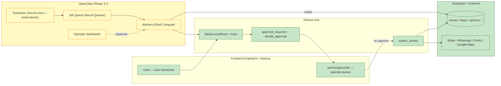

# PART IX — Advanced OpenClaw + Autonomous Operations Strategy

> [← Part VIII](./08-delivery.md) · [Index](../prd.md) · [Next: Part X — Summary →](./10-summary.md)

## A1. What OpenClaw is

OpenClaw is an **operational layer** for mdeai — background automation, scheduled jobs, long-running multi-step workflows, and (eventually) supervised autonomous operations. It is **not** the user-facing chat layer. It is **not** a runtime replacement for CopilotKit or Mastra.

| OpenClaw is | OpenClaw is NOT |
|---|---|
| Background workers + queues | The frontend AI |
| Multi-agent supervision | The user chat layer |
| Operational dashboards | The Mastra runtime |
| Scheduled enrichment jobs | The CopilotKit foundation |
| Approval-gated outreach | An autonomous human-replacement |
| Reconciliation + analytics | A money-spending agent |

## A2. Why it matters later

mdeai's Phase 2+ surfaces (sponsor outreach, event scraping, host scoring, WhatsApp follow-ups) all share three traits:

1. **They run async** — minutes to hours, not the seconds of chat
2. **They batch** — process many records, not one user interaction
3. **They require approval before any external effect** — never auto-spend, never auto-publish

OpenClaw solves the orchestration layer for these. Building them ad-hoc as cron jobs would create the same kind of debt the legacy chat has today.

## A3. What infrastructure to design NOW (Phase 1)

Without building OpenClaw itself, these Phase 1 choices make it possible later **without rewrites**:

| Choice today | Why it matters later |
|---|---|
| `correlation_id` end-to-end in `agent_runs` | OpenClaw tasks can trace cross-system effects |
| `approval_requests` + `decide_approval()` RPC reused | OpenClaw queues approvals through the same gate |
| `agent_tool_calls` per-call ledger | OpenClaw can replay tool calls deterministically |
| Outbox pattern (`outbox_events` table — verify exists) | OpenClaw consumes reliable side-effect queue |
| Mastra workflow shape (`mdeapp/src/mastra/workflows/`) | OpenClaw drives Mastra workflows from background |
| Service-role-only edge fns for writes | OpenClaw runs as service role, never as user |
| Single Zod source (`packages/types/`) | OpenClaw tasks share schemas with frontend |
| Vercel **Queues** beta available | Drop-in event streaming when ready |

## A4. What should NOT be built yet

| Don't build in Phase 1 | Reason |
|---|---|
| OpenClaw runtime / orchestrator | Premature — no async workload to justify |
| Multi-agent broadcast / fan-out | No real use case yet |
| Autonomous outreach loops | Approval gate not battle-tested |
| Sponsor matching | Sponsor profiles need real data first |
| Hermes ranking | Need 100+ events to train |
| Browser-control agents | Phase 3 research |

## A5. How OpenClaw integrates safely with CopilotKit + Mastra



**Key rule:** OpenClaw never bypasses `approval_requests`. Every write that has external effect (money, message, public publish) goes through the same approval gate that Phase-1 chat uses.

## A6. Human governance strategy

| Governance | Implementation |
|---|---|
| Default: human-in-the-loop | All OpenClaw tasks land in `/admin/approvals` queue |
| Operator override | Patricia can pause/resume any worker, kill any task |
| Audit log | Every OpenClaw action logged in `agent_runs` + `agent_tool_calls` |
| Budget cap | Per-task USD budget; worker refuses if exceeded |
| Rate limit | Per-tool calls/minute; uses existing rate-limit RPC |
| Anti-loop | Max tool-call depth (e.g. 20); abort if exceeded |
| Explainability | Every proposal has reasoning text in `approval_requests.reasoning` |

## A7. Approval architecture (OpenClaw extension)

Phase-1 approval flow (Roberto event) extended to OpenClaw tasks:

```
1. OpenClaw worker proposes action (e.g. "send WhatsApp to 47 stale leads")
2. Worker writes approval_request with reasoning + dry-run preview
3. Admin queue surfaces it in /admin/approvals
4. Patricia reviews, sees preview + cost estimate
5. Approve → outbox_events row inserted (one per recipient)
6. Outbox consumer fires WhatsApp via Twilio (with rate limit)
7. Each delivery logs to agent_tool_calls
8. Failures retry with exponential backoff
9. Patricia can pause/cancel mid-batch
```

## A8. Safety and anti-runaway protections

| Protection | Mechanism |
|---|---|
| Worker max runtime | 30 minutes per task; killed if exceeded |
| Worker max writes | Per-task limit; refuses on overrun |
| Worker max external calls | Per-task limit; refuses on overrun |
| Worker max budget USD | Per-task cap; aborts on overrun |
| Tool-call depth | Hard cap at 20 nested calls |
| Recursion detection | Same tool + same args within 60s = abort |
| Dead-man's switch | Worker pings heartbeat every 10s; killed if silent for 60s |
| Emergency stop | `/admin/emergency-stop` button kills all workers + drains queue |

**AI must NEVER:**
- spend money autonomously
- publish campaigns autonomously
- message users at scale autonomously
- modify production inventory autonomously
- issue refunds autonomously
- approve payouts autonomously

**Every external effect requires human approval.**

## A9. Multi-agent orchestration roadmap

| Phase | What |
|---|---|
| 1 | **Single-agent per route** (hostEventAgent on `/host/event/new`, conciergeAgent on `/chat`) — no orchestration needed |
| 2 | **Background workflows** — Mastra `Workflow` runs `step1 → step2 → step3` on schedule; still single agent per step |
| 3 | **Supervised multi-agent** — one supervisor agent dispatches to specialist agents; supervisor proposes plan; operator approves; specialists execute |
| 4 | **Autonomous-but-approved** — long-running campaigns with intermediate approval checkpoints; operator can approve full campaign or per-step |
| 5 | **Operations platform** — full dashboard of running workers, queues, budgets, throughput; Patricia + team manage 50+ concurrent workflows |

## A10. Real-world Medellín use cases (Phase 2+)

### Use case 1 — Event Operations Automation

> Roberto publishes his salsa night on Friday at 6pm. By Wednesday 9pm, only 12 of 80 tickets sold.

OpenClaw worker:
1. Detects low sales velocity vs. similar events
2. Proposes 3 actions in `/admin/approvals`:
   - Suggest reduced Tier-3 price ($60→$45 COP)
   - Draft Instagram story for Roberto to approve
   - Suggest WhatsApp blast to past attendees of similar events
3. Patricia reviews; approves only the Instagram draft (rejects WhatsApp blast — too noisy)
4. Worker emits to outbox; Roberto signs in to Instagram and posts (no auto-publish in Phase 2)
5. Outcome logged

### Use case 2 — Venue Intelligence Pipeline

> Nightly: scan Google Maps for new venues in Provenza/Laureles/El Poblado.

OpenClaw scheduled workflow:
1. Mastra tool `searchGroundedPlaces` runs over 8 neighborhoods
2. New venues compared against `venues` table
3. Net-new candidates queued in `venue_candidates`
4. Patricia reviews 0–10/day in `/admin/venues`
5. Approve → `venues` row inserted + `host_outreach` queued
6. Reject → logged, won't re-surface for 30 days

### Use case 3 — Rental Enrichment

> Nightly: for each apartment, refresh price + photos + amenities.

OpenClaw workflow:
1. Loop apartments WHERE last_enriched < NOW() - 7 days
2. For each: call Places API + scrape source URL (rate-limited)
3. Compute price z-score; flag if >2σ from neighborhood mean
4. Stale listings (no update in 14d) → `apartments.status = stale`
5. Surface to admin for re-verification

### Use case 4 — Contest Operations (Phase 3)

> Miss Elegance Colombia votes during voting window.

OpenClaw workflow:
1. Vote arrives → `vote_attempts` row
2. Worker checks: IP, device fingerprint, payment method, contestant share-link
3. Suspicious patterns flagged in `fraud_queue`
4. Operator reviews; can mark contestant as compromised
5. Final tally is operator-approved, not auto-computed

### Use case 5 — WhatsApp Concierge (Phase 2)

> Miguel's lead sits 6 hours without landlord reply.

OpenClaw workflow:
1. Detect stale lead
2. Propose follow-up template
3. Patricia approves
4. Worker sends via Twilio with rate limit + signing
5. Reply lands in `lead_replies`; routes back to landlord

### Use case 6 — Sponsor Marketplace (Phase 3)

> Brand "Aguila Beer" looking for nightlife events.

OpenClaw workflow:
1. Match scoring against events (Hermes ranking)
2. Propose top 5 to brand
3. Brand selects, signs Stripe Connect contract
4. Each event: approved by host; on approval, sponsor visible on event page

## A11. OpenClaw + MCP strategy

| MCP | Runtime-critical? | Phase |
|---|---|---|
| Google Maps Code Assist (`platform-ai`) | Dev-only | Phase 1 |
| Gemini Docs MCP | Dev-only | Phase 1 |
| Developer Knowledge MCP | Dev-only | Phase 1 |
| Browser automation (Playwright MCP) | Optional dev/QA | Phase 1 |
| Internal operational MCPs (custom) | Phase 3+ runtime | Phase 3 |
| Analytics MCP (Postiz/Linear) | Phase 2 background | Phase 2 |
| Vercel MCP server | Dev-time deploys/logs | Phase 1 (optional) |

Phase 1 MCP exposure to **end users**: **zero.** MCP is dev-time only at MVP.

## A12. OpenClaw phase roadmap (detailed)

### Phase 1 (now — week 10): NO OpenClaw runtime

- Architecture preparation only:
  - `correlation_id` standardized
  - `approval_requests` + `decide_approval()` battle-tested
  - `agent_tool_calls` per-call ledger live
  - `outbox_events` exists (or added if missing)
  - Single Zod source via `packages/types/`

### Phase 2 (weeks 11–18): Background jobs

- Mastra workflows on Vercel **crons** (defined in `vercel.ts`)
- Vercel **Queues** beta for at-least-once delivery
- Single workflow: nightly rental enrichment
- Approval gate enforced (admin reviews flagged stale listings)
- Add `worker_runs` table for OpenClaw-style telemetry
- WhatsApp webhook forensic

### Phase 3 (weeks 19–28): Supervised multi-agent

- Add supervisor agent that dispatches to specialists (rental, event, places)
- Operator dashboard `/admin/operations`
- Add `tasks` queue table
- First multi-agent flow: venue intelligence pipeline
- Contest + sponsor systems begin

### Phase 4 (weeks 29–40): Operational AI

- Long-running campaigns (e.g. WhatsApp follow-up sequences)
- Per-task budget caps enforced
- Auto-retry with exponential backoff
- Sponsor + host outreach automation (approval-gated)

### Phase 5 (week 41+): Orchestration platform

- 50+ concurrent workflows
- Multi-tenant operator views (Vercel **for Platforms** if needed)
- SLA dashboards
- Possible OpenClaw runtime as separate Node service

> [← Part VIII](./08-delivery.md) · [Index](../prd.md) · [Next: Part X — Summary →](./10-summary.md)
