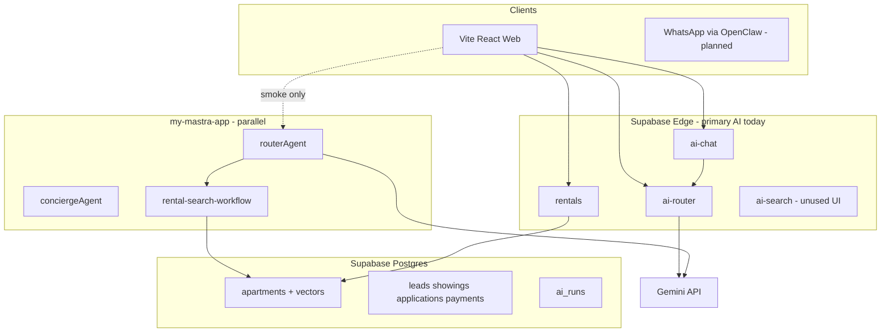
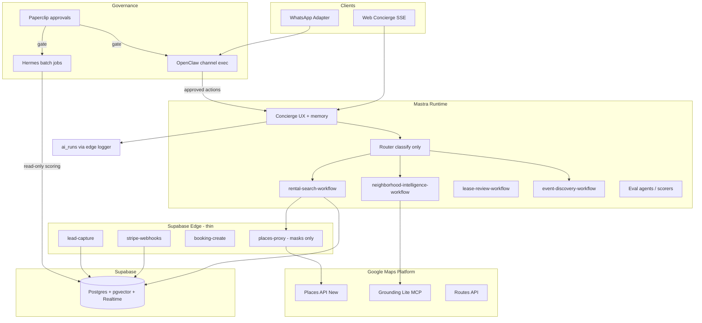
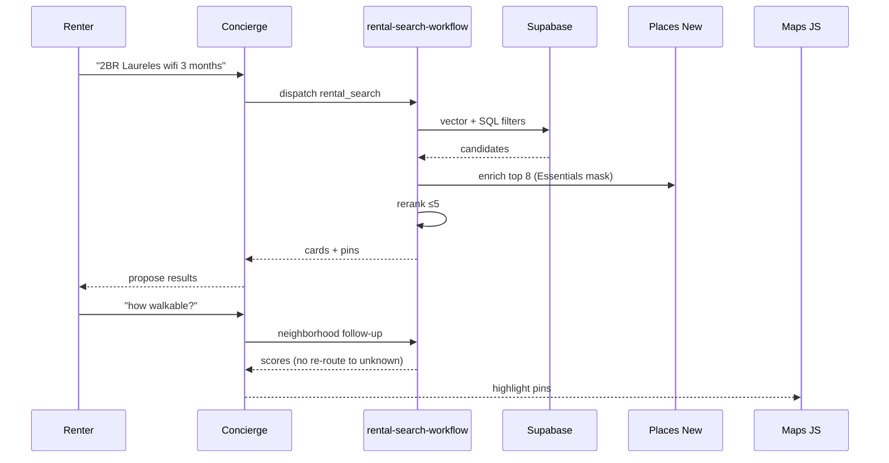
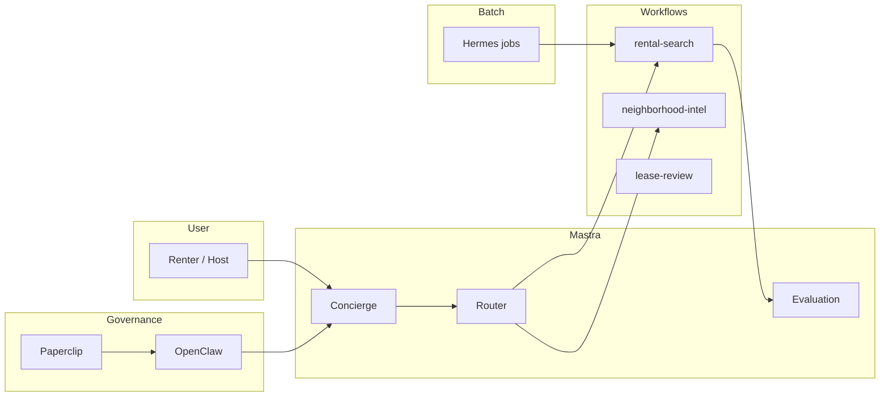
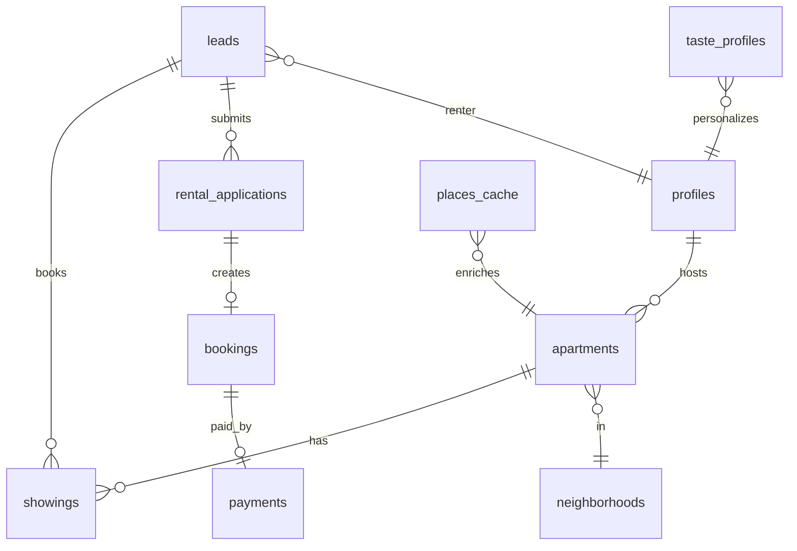

# Real Estate + City AI — Master PRD (V2)

> **North star:** Medellín’s **WhatsApp-first, chat-native** platform for **medium-term furnished rentals** and **city concierge** — with **Google Maps intelligence**, **Mastra-orchestrated agents**, and **Supabase as the only system of record** for money, inventory, and leads.

---

## Repo truth (`mdeapp`, 2026-05-20)

| | |
|--|--|
| **Built** | No `/rentals`, no `rentalAgent`, no `rental-search` workflow in `mdeapp/` |
| **Missing** | 25 curated listings, `RentalCard`, lead capture, rental pins on map |
| **Blocked** | Camila MVP until **PR-1** (map pipeline) + **PR-5** |
| **Proof** | Chat query → ≤5 rental cards + pins + one `leads` row |
| **PR track** | PR-5 — [`roadmap.md` § Repo-first PR track](real-estate/draft/roadmap.md#repo-first-pr-track) |

**Mastra §4 agent list:** MVP = **`rentalAgent` (thin)** + **`rental-search` workflow** on **`routerAgent`** — not Landlord Assistant / Lease Review agents in Phase 1.

---

## Document map

| Section | Content |
|---------|---------|
| §0 | Executive audit summary |
| §1 | Architecture scorecard |
| §2 | Critical red flags |
| §3 | Current vs recommended architecture |
| §4 | Mastra-first target architecture (incl. §4.6–4.8 platform audit) |
| §5 | Google Maps AI architecture |
| §6 | OpenClaw · Hermes · Paperclip · boundaries |
| §7 | Master product requirements (incl. §7.10–7.17 feature catalog from `docs/prd-realestate.md`) |
| §8 | Roadmap & phases (incl. §8.4 Mastra backlog) |
| §9 | Diagrams (Mermaid) |
| §10 | Data · API · security · ops |
| §11 | Checklists & matrices |
| §12 | Migration plan & next steps |

---

## §0 — Executive audit summary

### What exists today (verified in repo, 2026-05-15)

| Layer | Evidence | Maturity |
|-------|----------|----------|
| **Rentals UX** | `Rentals.tsx`, `RentalsIntakeWizard`, `RentalsSearchResults`, `RentalsListingDetail`, 3-panel explore | **Strong prototype** — intake + display; weak conversion loop |
| **Listings data** | `apartments` schema (PostGIS, amenities, freshness); marketplace-v1 cites seeded dev data | **Schema ready** — production inventory gap |
| **Edge AI** | `rentals`, `ai-router`, `ai-chat`, `ai-search`, `ai-embed`, `chat-lead-capture`, `_shared/tool-registry` | **Split brain** — production path is edge-first |
| **Mastra** | `my-mastra-app`: router → workflows (`rental-search`, `event-discovery`, `concierge-routing`), concierge memory, Postgres store, observability | **Parallel stack** — not wired as sole concierge runtime for mdeai.co |
| **Maps** | `ChatMap`, `MdeMap`, Mastra `google-places-client`, Places tools (restaurants/attractions/events) | **Partial** — UI + tools; no full lifestyle scoring pipeline |
| **CRM** | `leads`, `showings`, `rental_applications`, `payments`, `landlord_inbox` in migrations/skills | **Tables exist** — end-to-end flows **UNVERIFIED** in prod |
| **Agents (external)** | Paperclip, Hermes, OpenClaw docs under `tasks/real-estate/docs`, transcripts | **Installed / documented** — not production-governed paths |
| **Events vertical** | `tasks/events/V2-tasks/` 72-task spine (EVT-001…072) | **Separate product** — share platform primitives only |

### Strategic diagnosis

1. **Two orchestration stacks** (Supabase edge `ai-router` + Mastra router) create routing drift, duplicate intent schemas, and higher ops cost.
2. **AI proposes; humans (and Stripe webhooks) commit** — correct pattern in CLAUDE.md — but **booking/payment** paths are not closed-loop in production.
3. **Maps intelligence** is underused: search is filter + optional semantic embed, not **Grounding Lite + Places (New) enrichment + explainable neighborhood scores**.
4. **WhatsApp-first LATAM** is designed on paper; **web-first** is what ships — channel adapter must not own CRM state.
5. **Multi-vertical platform** (rentals + events + future sponsors) needs **one spine ID** (`EVT-NNN` pattern for events; adopt **`RE-NNN`** for rentals V2 tasks) and **shared Mastra concierge** with vertical workflows.

### Recommended direction (one sentence)

**Consolidate user-facing AI on Mastra (router + workflows + memory + evals), keep Supabase edge functions for auth-bound CRUD/webhooks/Stripe, use Gemini via official SDK with Maps Grounding Lite for discovery intelligence, and restrict OpenClaw/Hermes to approved side-effect channels with Paperclip gates.**

---

## §1 — Architecture scorecard (/100)

| Subsystem | Score | Rationale |
|-----------|------:|-----------|
| **Rentals frontend (Vite/React)** | 72 | Solid 3-panel + intake; missing map-first lifestyle UX, wallet, application/payment surfaces |
| **Supabase schema & RLS** | 85 | Broad model (apartments, CRM, vectors); needs rental-specific indexes + negative tests |
| **Edge functions (AI + rentals)** | 68 | `rentals` mature; `ai-search` not wired to UI; config drift risk |
| **Mastra runtime** | 65 | Good workflow split; not default path from `Concierge` page; auth/storage wired |
| **Intent routing & memory** | 58 | Dual routers; follow-up preservation documented in mastra-routing only |
| **Google Maps / Places** | 60 | Keys + ChatMap; missing systematic enrichment, caching, billing masks |
| **Lead / CRM lifecycle** | 45 | Tables + `p1-crm`; no proven WhatsApp → lead → showing → pay funnel |
| **Payments & commission** | 30 | Stripe patterns exist for **events**; rental booking loop incomplete |
| **WhatsApp / OpenClaw** | 25 | High risk; transcripts warn: approval before send; not prod |
| **Hermes intelligence** | 40 | Skills for ranking/lease; no eval datasets in repo |
| **Paperclip governance** | 35 | Conceptual; budgets/approvals not on rental money paths |
| **Security & compliance** | 78 | RLS default; admin guard gaps; PII in agent logs need filters |
| **Observability** | 55 | `ai_runs` + Mastra observability; no unified trace across edge+Mastra |
| **Testing & evals** | 62 | Vitest strong platform-wide; rental-specific evals thin |
| **Multi-vertical readiness** | 50 | Events V2 spine mature; rentals task spine not mirrored |
| **Mobile-first / PWA** | 70 | Responsive; scanner/a11y gates on events, not rentals |
| **Cost control** | 55 | Rate limits on edge; no unified token budget per thread |
| **Revenue readiness** | 35 | 12% fee model in PRD; no first reconciled rental commission |

**Weighted platform readiness (rentals vertical): 54/100** — architecture promising; **revenue path not proven**.

---

## §2 — Critical red flags

| # | Red flag | Impact | Mitigation |
|---|----------|--------|------------|
| R1 | **Dual AI routers** (edge `ai-router` vs Mastra `routerAgent`) | Context loss, duplicate maintenance | Single router entry: Mastra HTTP from concierge; edge router deprecated |
| R2 | **Zero production listings** (per v1 PRD) | All AI demos hollow | Seed 25 verified listings before marketing |
| R3 | **OpenClaw customer-facing without Paperclip** | Compliance, wrong sends, token burn | Internal ops only until approval + audit log |
| R4 | **Hermes on PII without retention policy** | Ley 1581 / GDPR-style exposure | Redact logs; workspace-scoped memory; no raw cédula in prompts |
| R5 | **Maps API cost drift** | Field mask sprawl, duplicate Places calls | Server-side mask registry + 24h cache (`places_cache`) |
| R6 | **Admin auth gaps** | Privilege escalation | `useAdminAuth` audit on all `/admin/*` |
| R7 | **Payment webhook not rental-idempotent** | Double booking / oversell | Reuse events idempotency ledger pattern |
| R8 | **Scraping-first supply strategy** | Legal + quality risk | Landlord-direct + founder outreach (v1 30-day plan) |
| R9 | **Mastra not on Vercel production path** | Split deploy, cold paths | Mastra on Hostinger/VPS or Vercel workflow with health checks |
| R10 | **No rental eval suite** | Ranking/regression invisible | Golden queries + NDCG@5 + lease fixture set |

---

## §3 — Current vs recommended architecture

### 3.1 Current (simplified)



### 3.2 Recommended (Mastra-first, Supabase SoT)



### Why each change matters

| Change | Why | Tradeoff |
|--------|-----|----------|
| Mastra owns conversation | Workflows, memory, observability are first-class | Ops: second runtime to deploy |
| Edge thins to webhooks + CRUD | Deno edges excel at signed webhooks, not long agent loops | Move complex chains out of edge |
| Places via server proxy | Keys + masks + caching centralized | Slight latency vs client Places |
| OpenClaw = channel only | Transcripts: CRM actions need human approval | Slower WhatsApp automation |
| Hermes = offline/batch | Ranking, lease PDFs, market snapshots | Not on hot path latency |
| Paperclip before money/send | Budget + approval for side effects | More human taps early |

---

## §4 — Mastra-first rearchitecture

### 4.1 Agent topology

| Agent | Model (target) | Owns | Never owns |
|-------|----------------|------|------------|
| **Router** | `gemini-3.1-flash-lite` (classify) | Intent + confidence + dispatch | Prose, cards, DB writes |
| **Concierge** | `gpt-5.5` or Gemini Pro (UX) | Thread memory, card layout, clarifiers | Direct Stripe, inventory mutation |
| **Rentals specialist** | Workflow-backed | Search explain, apply CTA | Payment capture |
| **Neighborhood intelligence** | Workflow + Grounding Lite | Scores, “live where?” narratives | Legal advice |
| **Lease review** | Structured output | Extract terms, risk flags | Binding legal opinion |
| **Lead qualification** | Tool + schema | BANT-style score | Spam outbound |
| **Evaluation / rerank** | Flash lite | NDCG rerank, card order | User-visible policy |
| **Event discovery** | Existing workflow | Event cards | Ticket checkout (edge) |
| **Maps intelligence** | Tools only | geocode, nearby, routes | Billing without cache |
| **Fraud / listing verification** | Batch Hermes | Anomaly flags | Auto-unpublish without admin |

### 4.2 Workflow catalog (rentals V2)

| Workflow | Steps | Output |
|----------|-------|--------|
| `rental-search-workflow` | parse → SQL/vector search → Places enrich → rerank ≤5 → format cards | Listing cards + map pins |
| `neighborhood-intelligence-workflow` | geocode → Places nearby → score dimensions → narrative | NeighborhoodReport JSON |
| `lifestyle-match-workflow` | user prefs + grounding → weighted score | Ranked neighborhoods |
| `lease-review-workflow` | PDF → extract → bilingual summary → risk tier | LeaseReview (propose only) |
| `lead-qualification-workflow` | intake → score → CRM row | Lead + next questions |
| `showing-schedule-workflow` | availability → propose slots → create showing (on confirm) | Showing row |
| `concierge-routing-workflow` | existing — extend intents | Dispatch only |

### 4.3 Memory architecture

| Memory type | Store | Scope | TTL |
|-------------|-------|-------|-----|
| **Thread working** | Mastra Postgres store | `resourceId` = user, `threadId` = session | 90d inactive |
| **Rental search** | Fields: `lastRentalQuery`, `lastRentalResults`, `selectedListingId` | Per thread | Session |
| **Taste profile** | Supabase `taste_profiles` + pgvector | Per user | Long-lived |
| **Lead context** | `leads.structured_profile` | Per lead | Until converted |
| **Neighborhood cache** | `places_cache` table | Global keyed by place_id | 24–72h |
| **Market snapshots** | `market_snapshots` | City/neighborhood | Weekly |

**Rule:** Router stateless; **Concierge owns memory** (per mastra-routing skill).

### 4.4 MCP & tools

| MCP / tool source | Use |
|-------------------|-----|
| **Maps Grounding Lite** (`search_places`, `compute_routes`) | Live discovery, commute, lifestyle |
| **Maps Code Assist** (dev only) | Doc-correct masks |
| **Supabase MCP** | Schema audits, RLS checks |
| **Mastra tools** | `search-rentals`, `search-restaurants`, `search-attractions` → unify behind `places-enrich` |
| **Custom** | `create-lead`, `propose-showing`, `emit-cards` (no auto-book) |

### 4.5 Human approval gates (Paperclip)

| Action | Gate |
|--------|------|
| First WhatsApp template to new lead | Human or template allowlist |
| Lease summary shown to renter | User tap “I understand — not legal advice” |
| Application forwarded to landlord | Paperclip if amount > threshold |
| Payout to landlord | Stripe + ledger (no LLM) |
| Listing publish | Admin moderation queue |
| OpenClaw outbound > N/day | Budget + kill switch |

### 4.6 Mastra platform audit (docs — 2026-05-15)

Sourced from [mastra.ai/llms.txt](https://mastra.ai/llms.txt) and [`.claude/skills/mastra/links.md`](../../../.claude/skills/mastra/links.md) (Supatabs index + scrape of supervisor, guardrails, suspend/resume, evals, semantic recall, GraphRAG). **Rule:** adopt platform primitives before custom orchestration; map each to an `RE-NNN` task or post-`RE-040` backlog.

| Mastra area | Capability | mdeai rentals use | Task / phase |
|-------------|------------|---------------------|--------------|
| **Agents** | [Supervisor agents](https://mastra.ai/docs/agents/supervisor-agents) (`agents` map + delegation hooks) | Concierge supervises `rental-agent`, `event-agent`, `maps` tools — replaces ad-hoc router prose | RE-013; refactor router → supervisor post-MVP |
| **Agents** | [Agent approval](https://mastra.ai/docs/agents/agent-approval) | Tool calls that create leads or forward applications need explicit approve | RE-015, RE-030, RE-033 |
| **Agents** | [Guardrails](https://mastra.ai/docs/agents/guardrails) + [processors](https://mastra.ai/docs/agents/processors) | Block PII leakage, legal advice, off-topic checkout | RE-028 |
| **Agents** | [Structured output](https://mastra.ai/docs/agents/structured-output) | `FilterJson`, `NeighborhoodReport`, `LeaseReview` schemas | RE-011, RE-025, RE-030 |
| **Agents** | [Background tasks](https://mastra.ai/docs/agents/background-tasks) + [response caching](https://mastra.ai/docs/agents/response-caching) | Async enrich; cache repeated “Laureles 2BR” class queries | RE-024 |
| **Agents** | [Channels](https://mastra.ai/docs/agents/channels) · [WhatsApp guide](https://mastra.ai/guides/guide/whatsapp-chat-bot) | OpenClaw ↔ Mastra channel adapter pattern | RE-034–035 |
| **Agents** | [Networks](https://mastra.ai/docs/agents/networks) · [A2A](https://mastra.ai/docs/agents/a2a) · [Signals](https://mastra.ai/docs/agents/signals) | Future: external landlord agents — **not** MVP | Backlog |
| **Agents** | [Voice](https://mastra.ai/docs/agents/adding-voice) · [Voice overview](https://mastra.ai/docs/voice/overview) | Hands-free concierge (es-CO) | Backlog |
| **Workflows** | [Suspend & resume](https://mastra.ai/docs/workflows/suspend-and-resume) · [snapshots](https://mastra.ai/docs/workflows/snapshots) | Showing slot proposal → user confirms → resume → `showings` insert | RE-015 |
| **Workflows** | [Human-in-the-loop](https://mastra.ai/docs/workflows/human-in-the-loop) | Landlord approves application forward | RE-016, RE-033 |
| **Workflows** | [Scheduled workflows](https://mastra.ai/docs/workflows/scheduled-workflows) | Weekly `market_snapshots` (Hermes output ingest) | RE-036 |
| **Workflows** | [Error handling](https://mastra.ai/docs/workflows/error-handling) · [time travel](https://mastra.ai/docs/workflows/time-travel) | Replay failed enrich step; ops debug | RE-038 |
| **Workflows** | [Agents & tools in steps](https://mastra.ai/docs/workflows/agents-and-tools) | `rental-search` steps call Places tools, not monolithic agent | RE-014, RE-024 |
| **Memory** | [Semantic recall](https://mastra.ai/docs/memory/semantic-recall) · [observational memory](https://mastra.ai/docs/memory/observational-memory) | “Still want Laureles?” without re-intake; taste from past threads | RE-028 |
| **Memory** | [Working memory](https://mastra.ai/docs/memory/working-memory) · [message history](https://mastra.ai/docs/memory/message-history) | `lastRentalQuery`, active listing id per thread | RE-010, RE-028 |
| **Memory** | [Memory processors](https://mastra.ai/docs/memory/memory-processors) | Strip card JSON bloat before long threads | RE-028 |
| **Streaming** | [Workflow](https://mastra.ai/docs/streaming/workflow-streaming) · [tool](https://mastra.ai/docs/streaming/tool-streaming) · [events](https://mastra.ai/docs/streaming/events) | `/concierge` SSE: card stream + tool progress | RE-013 |
| **Streaming** | [Background task streaming](https://mastra.ai/docs/streaming/background-task-streaming) | Long Places enrich with partial UI | RE-024 |
| **Evals** | [Scorers](https://mastra.ai/docs/evals/overview) · [built-in](https://mastra.ai/docs/evals/built-in-scorers) · [CI](https://mastra.ai/docs/evals/running-in-ci) | Answer relevancy + toxicity on concierge; NDCG@5 dataset | RE-027, RE-038 |
| **Evals** | [Datasets / experiments](https://mastra.ai/docs/evals/datasets/overview) | 50-query golden set versioning | RE-027 |
| **RAG** | [Chunking](https://mastra.ai/docs/rag/chunking-and-embedding) · [GraphRAG](https://mastra.ai/docs/rag/graph-rag) | Lease PDF corpus + listing description index | RE-030 (lease); backlog (listings) |
| **MCP** | [Overview](https://mastra.ai/docs/mcp/overview) · [MCP Apps](https://mastra.ai/docs/mcp/mcp-apps) | Maps Grounding Lite in dev; prod via `places-proxy` | RE-007 |
| **Workspace** | [Filesystem](https://mastra.ai/docs/workspace/filesystem) · [search](https://mastra.ai/docs/workspace/search) · [sandbox](https://mastra.ai/docs/workspace/sandbox) | Hermes batch artifacts; **not** renter hot path | RE-029, RE-036 |
| **Browser** | [AgentBrowser](https://mastra.ai/docs/browser/agent-browser) · [Stagehand](https://mastra.ai/docs/browser/stagehand) | Listing URL verification (admin) | Backlog |
| **Server** | [Supabase auth](https://mastra.ai/docs/server/auth/supabase) · [middleware](https://mastra.ai/docs/server/middleware) · [custom routes](https://mastra.ai/docs/server/custom-api-routes) | Concierge host JWT; rate limits | RE-010 |
| **Server** | [Mastra Client](https://mastra.ai/docs/server/mastra-client) | Vite app → Mastra on Hostinger/VPS | RE-013 |
| **Deployment** | [Mastra Server](https://mastra.ai/docs/deployment/mastra-server) · [workflow runners](https://mastra.ai/docs/deployment/workflow-runners) · [web framework](https://mastra.ai/docs/deployment/web-framework) | Co-deploy with `my-mastra-app`; durable runs | RE-010, RE-038 |
| **Observability** | [Tracing](https://mastra.ai/docs/observability/tracing/overview) · [SensitiveDataFilter](https://mastra.ai/docs/observability/tracing/processors/sensitive-data-filter) | Unified trace edge+Mastra; redact phone/email in spans | RE-028 |
| **Observability** | Exporters: [Sentry](https://mastra.ai/docs/observability/tracing/exporters/sentry) · [Langfuse](https://mastra.ai/docs/observability/tracing/exporters/langfuse) | Production APM choice | RE-038 |
| **Platform** | [Mastra platform](https://mastra.ai/docs/mastra-platform/overview) · [Studio](https://mastra.ai/docs/studio/overview) | Local prompt iteration before prod deploy | Dev only |
| **Editor** | [Mastra Editor](https://mastra.ai/docs/editor/overview) | Stored prompts for router/concierge A/B | Post-MVP |
| **Tools** | [Creating tools](https://mastra.ai/docs/tools/creating-tools) · [web search guide](https://mastra.ai/guides/guide/web-search) | `search-rentals`, `places-enrich`, optional web for neighborhood narrative | RE-014, RE-025 |
| **Guides** | [AI Recruiter workflow](https://mastra.ai/guides/guide/ai-recruiter) · [Research Assistant RAG](https://mastra.ai/guides/guide/research-assistant) | Patterns for `lead-qualification` + lease RAG | RE-030 |

**Already in repo (`my-mastra-app`):** `router`, `concierge`, `rental-agent`, `event-agent`, `evaluation`, `rental-search-workflow`, `event-discovery-workflow`, `concierge-routing-workflow`, `search-rentals` / restaurants / attractions tools, `weather-workflow` (template only).

**Not yet in repo (prioritize by RE spine):** supervisor concierge, suspend/resume on showing flow, `@mastra/evals` scorers in CI, semantic recall fields, scheduled market workflow, SensitiveDataFilter on traces, GraphRAG lease index.

### 4.7 Extended agent & tool catalog (target state)

| ID | Agent / tool | Model (indicative) | Inputs | Outputs | Wired in |
|----|--------------|-------------------|--------|---------|----------|
| A1 | **router** (or **supervisor**) | `gemini-3.1-flash-lite` | user message + thread meta | intent, confidence, dispatch | `router.ts` → migrate supervisor |
| A2 | **concierge** | Gemini Pro / GPT-5.x | thread + workflow results | cards, clarifiers, map state | `concierge.ts` |
| A3 | **rental-agent** | workflow-backed | FilterJson, listing ids | explanations, CTAs | `rental-agent.ts` |
| A4 | **neighborhood-agent** | Flash + Places tools | lat/lng, prefs | `NeighborhoodReport` | **new** — RE-025 |
| A5 | **lease-agent** | structured | PDF bytes (Hermes pre-parse) | `LeaseReview` propose-only | RE-030 |
| A6 | **evaluation-agent** | flash-lite | query, candidate set | rerank scores | `evaluation.ts` |
| T1 | `search-rentals` | — | filters | listing rows | exists |
| T2 | `places-enrich` | — | place_ids, mask tier | cached details | RE-024 |
| T3 | `create-lead` | — | contact, listing_id | lead id (edge) | RE-006 |
| T4 | `propose-showing` | — | slots[] | suspend payload | RE-015 |
| T5 | `emit-cards` | — | ranked listings | SSE card events | RE-013 |
| T6 | `compute-commute` | Routes API | origin, dest | minutes | RE-025 |
| T7 | `web-search` (optional) | — | neighborhood query | citations | RE-025 backlog |

### 4.8 Workflow patterns (Mastra-native)

| Workflow | Mastra patterns | User-visible step |
|----------|-----------------|-------------------|
| `rental-search-workflow` | Linear steps + tool streaming + workflow scorers on final step | Cards appear incrementally |
| `showing-schedule-workflow` | **suspend** until user picks slot; **resume** → edge `showing-create` | “Pick a time” → confirm |
| `lead-qualification-workflow` | Agent step + structured output → Supabase tool | BANT score in CRM |
| `lease-review-workflow` | RAG retrieve + structured output; **no** auto-forward | Summary + risk tier |
| `neighborhood-intelligence-workflow` | Parallel Places tool calls + merge | Map layer + narrative |
| `market-snapshot-workflow` | **Scheduled** + workspace write | Landlord digest (Hermes) |
| `concierge-routing-workflow` | Router dispatch only; no DB writes | Intent switch |

```text
Renter confirms showing
  → showing-schedule-workflow suspends (snapshot stored in Mastra Postgres)
  → UI shows slot picker (propose-only)
  → user.resume({ approved: true, slotId })
  → workflow resumes → edge creates showing row (auth + RLS)
```

---

## §5 — Google Maps AI architecture

### 5.1 API surface (official)

| API | Role | Call site |
|-----|------|-----------|
| **Places API (New)** | Details, photos, types, hours | Edge `places-proxy` + enrichment worker |
| **Geocoding** | Address → lat/lng | Listing wizard + search bias |
| **Routes API** | Commute time | Neighborhood workflow |
| **Maps JavaScript** | `AdvancedMarkerElement`, Map ID | `ChatMap` / `MdeMap` |
| **Grounding Lite (MCP)** | Agentic `search_places`, weather, routes | Mastra tools / dev MCP |
| **Gemini Maps grounding** | Widget + grounded answers | Concierge optional panel |

### 5.2 Scoring model (Medellín-specific)

| Dimension | Source | Weight (nomad) |
|-----------|--------|----------------|
| Walkability | Places density + distance | 0.15 |
| Safety proxy | curated neighborhood table + user reports | 0.15 |
| WiFi/work | listing field + reviews | 0.20 |
| Transit | Routes to Zona Rosa / metro | 0.10 |
| Nightlife / quiet | Places types + time | 0.10 |
| Cowork proximity | Places search | 0.15 |
| Price vs market | `market_snapshots` | 0.15 |

### 5.3 Caching & cost

```text
Client → Mastra workflow → places-proxy (edge)
                              ├─ cache hit → return
                              └─ miss → Places API (field mask from registry)
                              → write places_cache
```

- **Rate limits:** 10 AI req/min/user (CLAUDE.md); Places batch enrichment off hot path.
- **Attribution:** Grounding Lite attribution UI on map cards (MASTRA-066 pattern from events).

### 5.4 Query flows



---

## §6 — System boundaries (OpenClaw · Hermes · Paperclip · Mastra · Supabase · Gemini)

| System | **Owns** | **Never owns** |
|--------|----------|----------------|
| **Supabase** | SoT: listings, leads, bookings, payments, RLS, webhooks, Realtime | LLM reasoning |
| **Mastra** | Conversation orchestration, workflows, thread memory, eval runs | PCI, Stripe secrets in prompts |
| **Gemini** | Generation, structured output, multimodal | Direct DB writes without tools |
| **OpenClaw** | Channel delivery, cron digests, draft messages | Canonical lead state, payments |
| **Hermes** | Batch ranking, lease extraction, market reports, skills | Real-time chat routing |
| **Paperclip** | Approvals, budgets, heartbeats, task tickets | User-facing copy |
| **Postiz** (adjacent) | Social distribution | CRM |

**Adoption order** (from `docs/100-real-estate.md`, validated):  
1) Listing → contact → `landlord_inbox` loop  
2) Mastra concierge on web  
3) Places enrichment + maps scores  
4) Hermes ranking when labeled data exists  
5) OpenClaw WhatsApp with Paperclip gates  
6) Full automation

---

## §7 — Master product requirements

### 7.1 Positioning

**For** digital nomads, expat couples, and medium-term renters in Medellín  
**Who** need furnished housing without Airbnb fees or WhatsApp chaos  
**mdeai** is a **city AI concierge**  
**That** combines verified listings, map-grounded neighborhood intelligence, and bilingual lease clarity  
**Unlike** FincaRaiz or Airbnb  
**We** deliver WhatsApp-speed coordination with AI propose-only trust UX at **12%** service fee.

### 7.2 Competitive moat (updated)

| Moat | Mechanism | Phase |
|------|-----------|-------|
| **Multi-source + scam filter** | Price z-score, photo hash, cross-source verify; `considered_but_rejected` in tool envelope ([`CHAT-CENTRAL-PLAN`](../../../docs/CHAT-CENTRAL-PLAN.md)) | Post-MVP ingest |
| Medium-term + WiFi depth | Schema fields + ranking | Live |
| Map-grounded lifestyle search | Places + Grounding + scores (commute, walkability, nightlife, quietness, nomad) | V2 |
| Mastra workflow memory | Follow-ups stay in rental intent | V2 |
| Bilingual lease propose-only | Lease workflow + disclaimer | V2 |
| Events + city bundle | Shared concierge, separate money paths | Live (events) |
| Landlord supply lock-in | Dashboard + payouts | V2 |
| WhatsApp-native coordination | OpenClaw delivery; Supabase SoT; human approval on outbound | P4 (§8.1) |

### 7.3 Core MVP (rentals revenue path)

| # | Capability | Acceptance |
|---|------------|------------|
| M1 | 25+ verified listings | Real photos, price, availability |
| M2 | Intake → ranked results | p95 < 3s; ≤5 cards; map pins |
| M3 | Lead capture | ≥80% rental sessions → `leads` row |
| M4 | Showing schedule | Host notified; `showings` row |
| M5 | Application flow | 4-step; landlord summary |
| M6 | Stripe pay + booking | 1 end-to-end commission reconciled |
| M7 | Admin moderation | Queue + badge |
| M8 | Mastra concierge path | Router follow-up preservation smoke green |

### 7.4 User personas

(Carry forward from v1 PRD §3 — Sarah nomad, Marco/Ana couple, Carlos landlord, Valentina PM, internal ops.)

### 7.5 Key journeys

1. **Web nomad:** intake → map search → showing → apply → pay  
2. **Landlord:** onboard → list → inbox → showing → payout  
3. **WhatsApp expat:** OpenClaw intake → Mastra tools → human-approved replies  
4. **Ops:** Paperclip heartbeat → stale leads → moderation  

### 7.6 WhatsApp-first (LATAM)

- Templates for showing confirm / move-in (Infobip or Meta Cloud API)  
- Session handoff to web for payment (PCI)  
- Portuguese/Spanish detection in router  
- **No** auto-send without approval until error rate < 1% in staging  

### 7.7 AI-native UX principles

1. **Propose → Apply → Undo** on all mutations  
2. **Max 5 cards** per turn  
3. **Explain ranks** (1 line per listing)  
4. **Map + chat** synchronized selection  
5. **Confidence < 0.6** → one clarifier  

### 7.8 Events integration

- Shared **Concierge** router; `event_discovery` workflow separate  
- **No** rental checkout from LLM tools (mirror EVT-049 pattern)  
- Cross-sell: “events near your listing” on detail page only  

### 7.9 Revenue (rentals)

| Stream | Rate | When |
|--------|------|------|
| Booking service fee | 12% | MVP |
| Featured listing | TBD | Post-MVP |
| Landlord SaaS | Subscription | Phase 5 (platform PRD) |

### 7.10 Product feature catalog (merged from `docs/prd-realestate.md`)

**5A — Rental discovery (Camila on web)**  
Natural-language intents: quiet + coworking, walkable nightlife, remote-work fit, solo-traveler safety, metro proximity. Results: ≤5 ranked cards + map pins + optional neighborhood education in-thread.

**5B — WhatsApp concierge (distribution; not SoT)**  
Inbound flow: message → intent → qualification → search → Hermes rank → **draft** reply → lead row. Capabilities: bilingual EN/ES/PT, lease Q&A (propose-only), showing booking, reminders, follow-ups, neighborhood education. **Execution:** OpenClaw after Paperclip approval (§6, §7.6).

**5C — Lead qualification (Hermes + Mastra `lead-qual` workflow)**  
Offline/batch scoring; hot-path may use rule weights until labeled data exists.

| Signal | Weight |
|--------|--------|
| Budget clarity | 15 |
| Timeline urgency | 20 |
| Remote-worker fit | 10 |
| Engagement quality | 15 |
| Booking intent | 20 |
| Neighborhood specificity | 10 |
| Showing request | 10 |

| Tier | Score | Ops routing |
|------|-------|-------------|
| Hot | 80–100 | Patricia/Juan priority; landlord notify under 1h |
| Warm | 60–79 | Nurture sequence; showing nudge |
| Cold | 0–59 | Education content; no landlord spam |

Outputs for landlords: urgency, booking intent, landlord–listing fit (see §7.14).

**5D — Showing scheduler**  
Google Calendar sync (or Cal.com embed), WhatsApp confirmations (approved templates), reminders, reschedule, landlord notify, no-show recovery. Target flow: request → slot proposal (Mastra **suspend/resume**, §4.8) → user confirm → `showings` insert → reminder cron → optional Telegram ops alert.

**5E — Landlord dashboard**  
Lead inbox, showing management, applicant summaries, response analytics, lead quality score, per-listing performance, WhatsApp transcript history (read-only from `conversations` / outreach tables).

### 7.11 Generative UI — CopilotKit card types

Mirror [`CHAT-CENTRAL-PLAN`](../../../docs/CHAT-CENTRAL-PLAN.md) + CopilotKit `generative-ui` example. User turn → agent tool → client renders by `type`:

| Card | When | Key fields |
|------|------|------------|
| **RentalCard** | Search results | title, price, beds, Wi‑Fi Mbps, neighborhood, furnished, landlord rating, walkability, commute, nearby cafés/gyms/coworking |
| **MapPreviewCard** | Map-first ask | bounds, pin set, selected id |
| **NeighborhoodCard** | Hood compare / education | name, vibe bullets, price band, nomad score |
| **CommuteCard** | “How far to X?” | origin, destination, minutes, mode |

**Shared CopilotKit state** (working memory + UI): selected listings, neighborhood preferences, trip/move-in context, map selection, showing draft status. HITL outbound chain:

```text
AI draft → Approval Card (CopilotKit) → human Approve/Edit/Reject → Paperclip ticket → OpenClaw sends
```

### 7.12 Trust layer — tool response envelope

Every rental search tool returns a fixed envelope (edge today → Mastra tool tomorrow). Client renders cards + **Not-a-fit** table from rejections — primary trust UX vs Airbnb-only listings.

```typescript
// Target: supabase/functions/_shared/tool-response.ts (or Mastra tool return type)
export interface ToolResponse<T = unknown> {
  type: "rentals";
  message: string;
  total_count: number;
  considered: number;
  listings: T[];
  filters_applied: Record<string, unknown>;
  considered_but_rejected?: { listing_summary: string; reason: string }[];
  actions?: ChatAction[];
  agent_label?: string;
}
```

SSE phases (handoff → thinking → actions → `[DONE]`) stay compatible with concierge stream (§10.1).

### 7.13 Medellín neighborhood profiles (product copy + ranking priors)

Use in **NeighborhoodCard**, Hermes reports, and router education — not hard filters on protected classes (§11.1 fair housing).

| Hood | Positioning |
|------|-------------|
| **Laureles** | Quieter, local feel, strong cafés, cheaper than Poblado, long-stay friendly |
| **Poblado** | Nightlife, coworking density, premium pricing, nomad hub |
| **Envigado** | Family-oriented, calmer, residential feel |
| **Sabaneta** | Value pricing, growth corridor, metro access |

Map scores (§5.2): Wi‑Fi, walkability, commute-to-coworking, safety proxy (Places + editorial), remote-work fit, landlord responsiveness, building amenities.

### 7.14 Landlord metrics & behavioral intelligence

**Landlord-facing KPIs:** response time, inquiry→showing conversion, showing→booking rate, top-performing listings.

**Hermes behavioral signals (batch):** repeat searches, engagement quality, return visits, saved listings, showing likelihood, churn risk — feed `taste_profiles` + rerank (§4.3).

### 7.15 OpenClaw agent roster (post-MVP; never SoT)

| Agent | Owns | Does not own |
|-------|------|----------------|
| Concierge | Intake, Q&A, search handoff, follow-up drafts | Ranking math (Hermes), payments |
| Rentals search | Filter, rank request, geo enrich | DB writes without Mastra tool |
| Lead qualification | hot/warm/cold, urgency, intent | Autonomous landlord email |
| Follow-up | Stale recovery, nurture, no-show | Send without approval |
| Content | IG posts, listing reels, hood posts, event cross-promo | Publish without Postiz + approval |
| Operations | WA health, API spend, delivery failures, spam warnings | User-facing copy |

Hermes also scores **sponsors + influencers** when events/marketing modules are live (advanced; see `openclaw/14-openclaw-user-stories.md`).

### 7.16 MVP vs post-MVP vs advanced (aligned with `docs/prd-realestate.md`)

| Bucket | Includes |
|--------|----------|
| **Core MVP (this PRD §7.3, P0–P1)** | Web rental chat, cards, map pins, lead capture, landlord inbox, showing scheduler, admin moderation, Mastra concierge — **WhatsApp sandbox only** until P4 |
| **Post-MVP (P2–P3)** | Social automation (Postiz), influencer workflows, neighborhood AI reports, landlord analytics deep dive, commute optimization |
| **Advanced** | Predictive lead scoring, AI negotiation assistant (propose-only), growth engine, WA broadcast, multi-agent campaigns, lease review AI, full booking automation |

> **Scope note:** `docs/prd-realestate.md` lists “WhatsApp concierge” and “Hermes scoring v1” inside **Core MVP**. This V2 doc **defers production WhatsApp to P4** (§8.1) after web money path + Mastra eval — stricter gate, same end state.

### 7.17 Why this wins (competitive narrative)

| Typical portal | mdeai |
|----------------|-------|
| Static listings | Intent + neighborhood understanding |
| Search filters only | Conversational + map-synced discovery |
| No coordination | Showings, applications, approved outreach |
| Single channel | Web concierge + WhatsApp distribution |
| Generic global | Medellín-specific scores + bilingual lease clarity |

**Strategic rule (non-negotiable):** AI automates **coordination**, not **trust**. Humans approve outreach, close deals, negotiate, verify leases. AI handles speed, routing, reminders, organization, intelligence, repetitive drafts.

---

## §8 — Roadmap

### 8.1 Launch phases

| Phase | Weeks | Focus | Exit criteria |
|-------|-------|-------|---------------|
| **P0** | 1–2 | Inventory + contact loop | 25 listings; landlord_inbox reply |
| **P1** | 3–6 | MVP booking | 1 paid booking; floor green |
| **P2** | 7–10 | Mastra default + maps scores | Concierge 100% Mastra; cache live |
| **P3** | 11–14 | Hermes rank + lease | NDCG@5 baseline; lease fixture 90% |
| **P4** | 15–18 | WhatsApp + Paperclip | Approved outbound; 0 budget overruns |
| **P5** | 19+ | Multi-city scaffold | Medellín playbook export |

### 8.2 MVP vs advanced

| MVP | Advanced |
|-----|----------|
| Manual landlord outreach | Scraping partnerships |
| Rule + vector rerank | Hermes NDCG rerank |
| Static neighborhood table | Live Places scoring |
| Web pay | WhatsApp pay links |
| English-primary UI | Full es-CO copy |

### 8.3 Rental V2 task spine (mirror events)

**Roadmap + tasks (authoritative):** [`roadmap.md`](./roadmap.md) · [`000-index.md`](./000-index.md) · [`../V2-tasks/README.md`](../V2-tasks/README.md) — **40** tasks `RE-001`…`RE-040` in `core/` · `mvp/` · `post-mvp/` · `advanced/`.

Legacy suggested tasks (superseded by generated spine):

| # | Slug | Title |
|---|------|-------|
| 001 | seed-verified-listings | Seed 25 verified listings |
| 002 | mastra-concierge-production-route | Wire Concierge page to Mastra SSE |
| 003 | deprecate-edge-ai-router | Feature-flag edge router off |
| 004 | places-proxy-field-masks | Server Places proxy + mask registry |
| 005 | places-cache-migration | places_cache table + TTL |
| 006 | rental-search-places-enrich | Enrich step in rental-search-workflow |
| 007 | neighborhood-intelligence-workflow | New workflow + scores |
| 008 | lead-capture-unify | Unified lead-capture edge |
| 009 | showing-create-flow | Showing scheduler E2E |
| 010 | application-wizard | Application 4-step UI |
| 011 | stripe-rental-webhook | Idempotent rental payment webhook |
| 012 | booking-create-edge | booking-create + RLS |
| 013 | landlord-dashboard-mvp | Landlord KPI dashboard |
| 014 | admin-moderation-queue | Listing moderation |
| 015 | rental-eval-golden-set | 50-query eval harness |
| 016 | mastra-memory-audit | Thread memory fields audit |
| 017 | maps-attribution-ui | Grounding attribution on cards |
| 018 | paperclip-approval-poc | Approval on landlord forward |
| 019 | openclaw-sandbox-intake | Sandbox WhatsApp intake only |
| 020 | production-floor-rentals | Rentals in npm run floor scope |

### 8.4 Mastra capability backlog (post RE-040)

Validated in [mastra.ai/llms.txt](https://mastra.ai/llms.txt) + [`links.md`](../../../.claude/skills/mastra/links.md) (2026-05-15). Not in current `RE-001`–`RE-040` spine — V3 when first booking + eval harness are green.

| Priority | Capability | Doc | Trigger |
|----------|------------|-----|---------|
| P2 | Supervisor concierge (replace router-only) | [supervisor-agents](https://mastra.ai/docs/agents/supervisor-agents) | RE-023 + RE-027 green |
| P2 | Live scorers on concierge (`@mastra/evals`) | [built-in-scorers](https://mastra.ai/docs/evals/built-in-scorers) | RE-027 harness |
| P3 | GraphRAG on listing descriptions | [graph-rag](https://mastra.ai/docs/rag/graph-rag) | >100 listings |
| P3 | AgentBrowser listing verification | [agent-browser](https://mastra.ai/docs/browser/agent-browser) | Admin moderation scale |
| P3 | Voice concierge (es-CO) | [voice overview](https://mastra.ai/docs/voice/overview) | Mobile WA handoff |
| P4 | A2A landlord partners | [a2a](https://mastra.ai/docs/agents/a2a) | Multi-city |

Detail mapping: **§4.6–4.8** · sequencing: [`roadmap.md`](./roadmap.md) §6.1.

---

## §9 — Architecture diagrams

### 9.1 Agent collaboration



### 9.2 Data architecture (core entities)



### 9.3 Folder structure (target)

```text
my-mastra-app/src/mastra/
  agents/          router, concierge, rental, neighborhood, evaluation
  workflows/       rental-search, neighborhood-intel, lease-review, lead-qual
  tools/           search-rentals, places-enrich, create-lead (propose)
  scorers/         rental-ndcg, tool-appropriateness
  storage/         postgres store config
  lib/             google-places-client, models

src/
  pages/Rentals.tsx, Concierge.tsx
  components/rentals/, chat/, map/
  hooks/useRental*.ts

supabase/functions/
  rentals/           intake (thin → delegate to Mastra over time)
  lead-capture/
  booking-create/
  rental-payment-webhook/
  places-proxy/
  _shared/tool-registry.ts  # shrink to non-agent utilities

tasks/real-estate/V2-tasks/
  core/ mvp/ advanced/ production/   # optional phase dirs
```

---

## §10 — Technical specifications

### 10.1 API contracts (concierge)

**POST** `/api/concierge/chat` (Mastra host)

```typescript
// Request
{ threadId?: string; message: string; locale?: 'en' | 'es' | 'pt'; mapViewport?: LatLngBounds }
// Response (SSE)
{ type: 'text' | 'cards' | 'map_pins' | 'proposal'; data: unknown }
// Proposal requires client POST /api/concierge/apply
```

### 10.2 Event schemas (Realtime)

| Channel | Event | Payload |
|---------|-------|---------|
| `host:{landlordId}` | `lead.created` | `{ leadId, score }` |
| `host:{landlordId}` | `showing.updated` | `{ showingId, status }` |
| `user:{uid}` | `application.status` | `{ applicationId, status }` |

### 10.3 Security checklist

- [ ] RLS on all rental commerce tables  
- [ ] `(select auth.uid())` pattern  
- [ ] Service role only in webhooks  
- [ ] No Maps/Stripe keys in client except `VITE_GOOGLE_MAPS_API_KEY`  
- [ ] Mastra `SensitiveDataFilter` on spans  
- [ ] Admin routes guarded  
- [ ] Lease disclaimer on all AI contract output  
- [ ] WhatsApp opt-in logged  

### 10.4 Testing strategy

| Layer | Tool |
|-------|------|
| Unit | Vitest — filters, rerank, masks |
| Edge | `npm run verify:edge` |
| Mastra | `scripts/mastra-smoke.sh` |
| Eval | Golden 50 queries — NDCG@5 |
| E2E | Playwright — intake → lead row |
| Load | 50 concurrent checkout (reuse events pattern) |

### 10.5 AI evaluation strategy

- **Router:** accuracy + follow-up stay-rate  
- **Search:** NDCG@5 labeled pairs (Medellín)  
- **Lease:** field F1 on 20 PDF fixtures (ES/EN)  
- **Safety:** prompt injection suite on concierge  

### 10.6 Deployment

| Component | Target |
|-----------|--------|
| Frontend | Vercel (mdeai.co) |
| Supabase | Hosted project |
| Mastra | Hostinger VPS or dedicated Node service |
| OpenClaw | VPS Docker (existing mde-hostinger skill) |

### 10.7 Cost projections (order of magnitude)

| Item | Monthly (MVP) |
|------|----------------|
| Gemini + router | $200–500 |
| Places API | $100–300 (with cache) |
| Supabase | $25–75 |
| Vercel | $20 |
| Infisical | existing |
| **Total** | **~$400–900** before revenue |

### 10.8 Revenue projections (illustrative)

| Metric | M6 target |
|--------|-----------|
| Bookings | 10 |
| Avg rent | $1,000 |
| GMV | $10,000 |
| 12% fee | $1,200 |

---

## §11 — Matrices

### 11.1 Risk matrix

| Risk | L | I | Mitigation |
|------|---|---|------------|
| Dual stack confusion | H | H | Mastra default milestone |
| Empty inventory | H | H | P0 seed gate |
| WhatsApp compliance / ban | M | H | Templates + approval; rate limits; **number warm-up**; suppression list |
| Fair housing (discriminatory filters) | M | H | No protected-class hard filters; compliance copy review; audit logs |
| Outreach spam | M | M | STOP keywords; suppression enforcement; operating-hour caps |
| Maps bill shock | M | M | Cache + masks |
| Agent hallucination on lease | M | H | Grounded maps + tool-only retrieval + Supabase SoT + structured output |

### 11.2 Technical debt matrix

| Debt | Effort | Priority |
|------|--------|----------|
| ai-search unwired | S | P1 |
| Edge router duplicate | M | P0 |
| Admin auth | S | P0 |
| Rental webhook idempotency | M | P1 |
| Eval harness missing | M | P2 |

### 11.3 Production readiness checklist

- [ ] `npm run floor` green including Mastra smoke  
- [ ] 25 listings live  
- [ ] 1 booking E2E with Stripe test  
- [ ] RLS negative tests  
- [ ] Maps attribution visible  
- [ ] ai_runs logging 95% success  
- [ ] Runbook for OpenClaw kill switch  
- [ ] Ley 1581 privacy note on forms  

---

## §12 — Migration plan

### Phase A (week 1–2) — No user-visible risk

1. Add `places_cache` migration + `places-proxy` edge.  
2. Extend `rental-search-workflow` enrich step.  
3. Seed listings + landlord_inbox loop.  
4. Fix admin auth.

### Phase B (week 3–4) — Concierge cutover

1. Feature flag `MASTRA_CONCIERGE=1` on `/concierge` and `/rentals` chat entry.  
2. Log both routers in shadow mode; compare intent.  
3. Disable edge `ai-router` for rental intents when flag on.

### Phase C (week 5–6) — Money path

1. `rental-payment-webhook` + idempotency.  
2. Application + booking UI.  
3. First production booking.

### Phase D (week 7+) — Agents

1. Hermes ranking offline job.  
2. Paperclip on landlord forward.  
3. OpenClaw sandbox → limited prod.

---

## §13 — Final strategic recommendations

1. **Stop building two brains** — Mastra becomes the only conversational orchestrator; edge keeps webhooks and thin CRUD.  
2. **Ship supply before AI** — 25 real listings unlock honest evals and demos.  
3. **Maps is the moat** — invest in neighborhood scoring + Grounding Lite, not more chat tabs.  
4. **WhatsApp is distribution, not database** — OpenClaw sends; Supabase remembers.  
5. **Mirror events discipline** — `RE-NNN` task spine, floor gates, propose-only money.  
6. **Measure ranking** — without NDCG@5, “AI search” is marketing.  
7. **Revenue in 6 weeks** — optimize for one paid booking, not 15 agents.  
8. **Trust UX is product** — ship `considered_but_rejected` and rank explanations before more agents (§7.12).  
9. **Coordination ≠ trust** — §7.17 strategic rule; every OpenClaw send stays behind Paperclip.

---

## Appendix A — Obsolete patterns to remove

| Pattern | Replace with |
|---------|----------------|
| Edge-heavy multi-step agent chains | Mastra workflows |
| Client-side Places Details | Server proxy + cache |
| LLM-triggered checkout | User confirm + Stripe hosted |
| Scraping-as-supply v1 | Landlord direct |
| Generic chitchat router reset | Follow-up preservation + memory |

## Appendix B — Official documentation index

- Gemini API: https://ai.google.dev/gemini-api/docs  
- Maps grounding: https://ai.google.dev/gemini-api/docs/maps-grounding  
- Places API (New): https://developers.google.com/maps/documentation/places/web-service/op-overview  
- Grounding Lite MCP: `mde-maps` skill references  
- **Mastra (full tree):** https://mastra.ai/llms.txt · **mde index:** [`.claude/skills/mastra/links.md`](../../../.claude/skills/mastra/links.md) · audit §4.6–4.8 (2026-05-15)  
- Supabase RLS: https://supabase.com/docs/guides/database/postgres/row-level-security  

## Appendix C — Related repo docs

| Path | Use |
|------|-----|
| `plan/real-estate/docs/prd-realestate.md` | Strategic feature catalog + agent roster (merged into §7.10–7.17) |
| `plan/real-estate/real-estate-prd.md` | CopilotKit example rankings + implementation playbook |
| `tasks/real-estate/tasks/prd-real-estate.md` | v1 journeys, feature inventory |
| `tasks/real-estate/docs/100-real-estate.md` | Trio tool comparison |
| `tasks/real-estate/transcripts/100-openclaw-doc.md` | OpenClaw RE synthesis |
| `prd.md` | Platform-wide strategy |
| `tasks/events/V2-tasks/README.md` | Task spine pattern reference |

---

**Last updated:** 2026-05-15  
**Next action:** Execute **RE-001** via `mde-task-lifecycle`; track in [`roadmap.md`](./roadmap.md) · [`../V2-tasks/README.md`](../V2-tasks/README.md).
