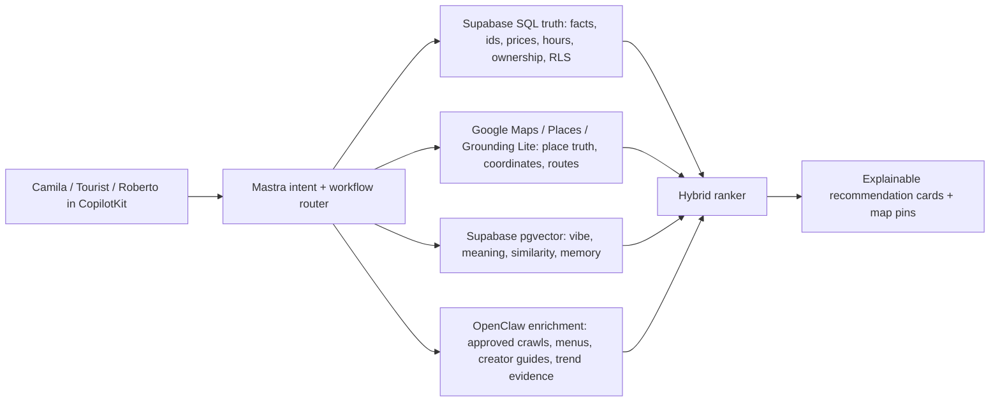
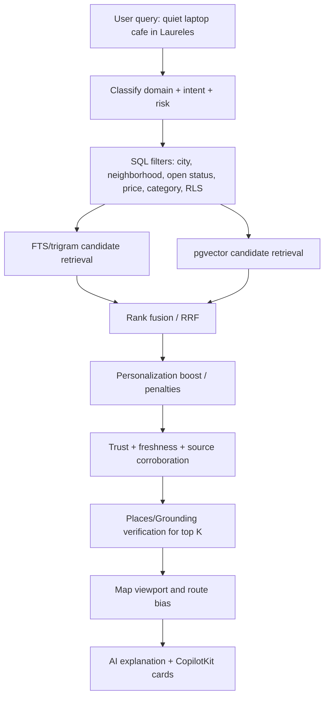
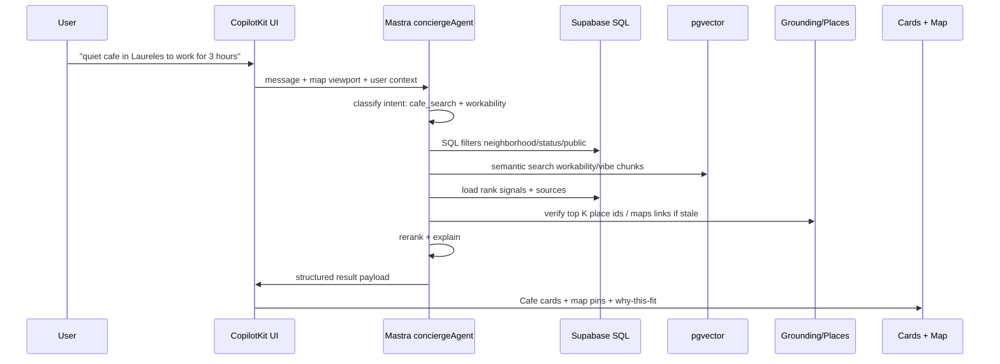
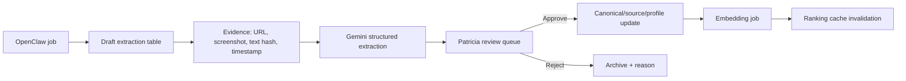

# mdeai pgvector architecture strategy

Generated: 2026-05-27 UTC / 2026-05-26 America/Bogota  
Workspace: `/home/sk/mdeai`  
Target app: `/home/sk/mdeai/mdeapp`  
Primary output: production-grade semantic city intelligence plan for `mdeai.co`

## 1. Executive summary

mdeai should use pgvector as the semantic memory and recommendation substrate for Medellin, not as a replacement for SQL, Google Maps, Places API New, Grounding Lite MCP, or human-reviewed source provenance.

The product moat is not "vector search." The moat is a living Medellin intelligence graph that can answer queries like:

- "quiet remote-work cafe in Laureles with ergonomic seating and calm weekday energy"
- "authentic social-impact coffee tour, not a reseller, good for first-time visitors"
- "rental near cafes and gyms but away from Provenza party noise"
- "events like this one, but better for founders and creators"
- "restaurants Camila would like after saving three brunch spots and rejecting loud rooftops"

The correct architecture is hybrid:



Current state, verified live on Supabase project `zkwcbyxiwklihegjhuql`:

| Check | Result |
|---|---|
| pgvector installed? | Yes. `vector` extension installed, version `0.8.0`, schema `public`. |
| Spatial/text support? | Yes. `postgis` `3.3.7`, `pg_trgm` `1.6`, `pg_stat_statements` `1.11`, `pg_cron` `1.6.4`. |
| Existing vector tables? | `listing_embeddings`, `event_embeddings`, `restaurant_embeddings`. |
| Dimensions/model | `vector(768)`, `gemini-embedding-001`. |
| Existing row counts | `listing_embeddings`: 44, `event_embeddings`: 43, `restaurant_embeddings`: 43. |
| Existing RPCs | `semantic_search_*` and `hybrid_search_*` for listings/events/restaurants. |
| Existing indexes | HNSW cosine indexes exist, but duplicate HNSW indexes were found and need cleanup before scale. |
| Missing | No city-wide embedding registry, no cafe/coffee-tour embeddings, no neighborhood semantic profiles, no creator intelligence embeddings, no user taste-vector schema, no evaluation harness. |

Recommendation: keep Supabase pgvector as the first vector store. Do not add Pinecone/Qdrant/Milvus yet. mdeai's initial scale is city-depth, not internet-scale. The fastest production path is to standardize the existing pgvector work into one governed semantic layer with strict separation between facts, meaning, generated summaries, grounded data, and inferred recommendations.

## 2. Official docs and reference links

### Core official documentation

| Surface | Full URL | mdeai use |
|---|---|---|
| Supabase pgvector extension | https://supabase.com/docs/guides/database/extensions/pgvector | Enable vectors in Postgres and keep semantic search close to SQL/RLS. |
| Supabase semantic search | https://supabase.com/docs/guides/ai/semantic-search | Baseline for table + embedding + match RPC design. |
| Supabase hybrid search | https://supabase.com/docs/guides/ai/hybrid-search | Combine `tsvector` and pgvector for query quality. |
| Supabase IVFFlat indexes | https://supabase.com/docs/guides/ai/vector-indexes/ivf-indexes | Use only after enough rows; HNSW is preferred for changing data. |
| Supabase Next.js vector search example | https://supabase.com/docs/guides/ai/examples/nextjs-vector-search | Useful app-level reference, not a direct architecture. |
| pgvector GitHub | https://github.com/pgvector/pgvector | Authoritative operators, HNSW/IVFFlat syntax, halfvec/sparsevec capabilities. |
| Google Places API New Text Search | https://developers.google.com/maps/documentation/places/web-service/text-search | Ground text queries to real Places; every call needs a field mask. |
| Places API field masks | https://developers.google.com/maps/documentation/places/web-service/choose-fields | Cost and payload control via `X-Goog-FieldMask`. |
| Grounding Lite MCP | https://developers.google.com/maps/ai/grounding-lite | Lightweight MCP-backed trusted geo grounding; returns place IDs and coordinates. |
| Gemini Grounding with Google Maps | https://ai.google.dev/gemini-api/docs/maps-grounding | Gemini responses grounded with Maps data, with limitations. |
| Vertex AI Grounding with Google Maps | https://cloud.google.com/vertex-ai/generative-ai/docs/grounding/grounding-with-google-maps | Enterprise variant and production safety constraints. |
| Gemini embeddings | https://ai.google.dev/gemini-api/docs/embeddings | `gemini-embedding-001`, Matryoshka output dimensionality, retrieval settings. |
| OpenAI embeddings FAQ | https://help.openai.com/en/articles/6824809-embeddings-faq | General best-practice reference for normalized embeddings; not default mdeai provider. |
| OpenAI embeddings API reference | https://platform.openai.com/docs/api-reference/embeddings/create | Comparative API reference only; production mdeai remains Gemini-first. |
| Mastra RAG docs | https://mastra.ai/en/docs/rag/overview | Chunking, vector DB, retrieval, reranking patterns for Mastra workflows. |
| Mastra RAG product page | https://mastra.ai/rag | High-level RAG pipeline reference. |
| CopilotKit Mastra docs | https://docs.copilotkit.ai/mastra/ | AG-UI connection from Mastra agents to CopilotKit UI. |
| CopilotKit AG-UI backend reference | https://docs.showcase.copilotkit.ai/mastra/backend/ag-ui | Event/SSE architecture reference; verify against pinned v1.55.2/local examples before coding. |
| OpenClaw GitHub | https://github.com/openclaw/openclaw | Browser/task automation reference. Use behind approvals only. |
| OpenClaw docs | https://clawdocs.org/ | Operational/security docs. Treat as fast-moving; verify before use. |

### GitHub repos scored for mdeai

| Rank | Repo | Full URL | Score /100 | Use or learn from | Fit |
|---:|---|---|---:|---|---|
| 1 | pgvector | https://github.com/pgvector/pgvector | 99 | Use directly via Supabase. | Core. |
| 2 | TripSage AI | https://github.com/BjornMelin/tripsage-ai | 94 | Learn from Supabase pgvector, hybrid RAG, travel workflows, caching, QStash, observability. | Advanced reference. |
| 3 | Gorse | https://github.com/gorse-io/gorse | 92 | Learn from/optionally adopt for collaborative filtering after mdeai has interaction volume. | Phase 3+. |
| 4 | OpenClaw | https://github.com/openclaw/openclaw | 90 | Use as controlled enrichment/acquisition layer, never as product truth. | Phase 4 with approvals. |
| 5 | HNSWLib | https://github.com/nmslib/hnswlib | 88 | Learn HNSW tuning concepts; use pgvector HNSW in production first. | Engineering reference. |
| 6 | TREK | https://github.com/mauriceboe/TREK | 84 | Learn map-first trip UX, collaboration, budgets, PWA. | Product reference. |
| 7 | hybrid-retrieval-system | https://github.com/Arnavadi19/hybrid-retrieval-system | 82 | Learn structured vs semantic routing and graph/vector split. | Architecture reference. |
| 8 | ai-docs-vector-db-hybrid-scraper | https://github.com/BjornMelin/ai-docs-vector-db-hybrid-scraper | 81 | Learn crawler-to-vector ingestion patterns. Adapt to OpenClaw/Firecrawl if needed. | Enrichment reference. |
| 9 | Travel AI Agent React/FastAPI/Cosmos | https://github.com/jonathanscholtes/Travel-AI-Agent-React-FastAPI-and-Cosmos-DB-Vector-Store | 77 | Learn end-to-end travel agent shape; do not copy Cosmos architecture. | API-flow reference. |
| 10 | travel-planner-with-RAG | https://github.com/shashank29-p/travel-planner-with-RAG | 72 | Learn simple RAG travel baseline; too small for production mdeai. | Tutorial reference. |

### Important local docs reviewed

| Local path | Why it matters |
|---|---|
| `/home/sk/mdeai/plan/vector/docs/02-github-repos.md` | Existing repo/use-case shortlist; useful but needed source cleanup and production grounding. |
| `/home/sk/mdeai/plan/vector/docs/03-core.md` | Existing high-level mapping; good but not enough DB/task detail. |
| `/home/sk/mdeai/plan/vector/listings/*` | Medellin listing seed material. |
| `/home/sk/mdeai/tasks/agent/10-cafeintelligence-plan.md` | Coffee-tour roadmap; already says pgvector exists but not wired for tours. |
| `/home/sk/mdeai/tasks/agent/tasks/CTI-011-postMVP-embeddings-pipeline.md` | Existing focused embeddings task for coffee tours. |
| `/home/sk/mdeai/tasks/maps/MAP-012-neighborhood-intelligence.md` | Neighborhood intelligence must be cached/grounded, not live hallucinated prose. |
| `/home/sk/mdeai/supabase/migrations/20260509205216_pgvector_semantic_search.sql` | Existing vector tables/RPCs/HNSW setup. |
| `/home/sk/mdeai/supabase/migrations/20260510000000_vdb01_hybrid_fts_search.sql` | Existing hybrid FTS + vector audit record. |

## 3. Architecture strategy

### What should use vectors

Use pgvector for semantic meaning where exact filters fail:

| Domain | Embed | Example |
|---|---|---|
| Cafes | Vibe summaries, workability descriptions, review themes, creator notes. | "quiet remote-work cafe in Laureles with natural light and long-stay tolerance." |
| Restaurants | Cuisine/vibe summaries, dish themes, dining occasion, review themes. | "date-night Italian restaurant with calm lighting and handmade pasta." |
| Coffee tours | Authenticity, educational depth, social impact, route difficulty, scenery. | "community-focused hillside coffee tour with hands-on harvesting and local history." |
| Events | Audience, vibe, music/culture themes, creator/community fit. | "founder-friendly networking event with practical AI builders." |
| Rentals | Lifestyle fit, neighborhood vibe, lease-risk summaries, host notes. | "quiet furnished apartment near coworking and gyms, away from nightlife noise." |
| Neighborhoods | Curated profile, density summaries, lifestyle tradeoffs, trend summaries. | "walkable, residential, cafe-dense area for remote workers." |
| Creator intelligence | Creator niche, venue taste, audience, trust signal summaries. | "local coffee creator focused on third-wave cafes and hidden patios." |
| User preferences | Taste summaries and interaction-derived preference vectors. | "likes quiet cafes, brunch, safe walkability, avoids loud rooftops." |
| AI memory | Long-term user preference summaries and approved trip context. | "Camila saved Laureles, rejected expensive Poblado lofts, likes gyms nearby." |
| Similarity relationships | Entity-to-entity similarity caches. | "Cafe A is similar to Cafe B because both are calm, specialty, work-friendly." |

### What should not use vectors

Do not embed fields whose meaning is already exact or factual:

- `place_id`, `maps_url`, URLs, phone, email.
- Ratings, review counts, prices, latitude/longitude, opening hours.
- User IDs, access-control fields, role fields, payment state.
- "Open now", "sold out", "available", "published", "approved".
- Raw scraped pages before extraction and trust scoring.
- Service-role-only operational logs.

### SQL vs embeddings vs grounded search

| Layer | Owns | Examples | Persona-visible effect |
|---|---|---|---|
| SQL truth | Facts, ownership, status, RLS, money, dates. | `price_monthly`, `place_id`, `event_start_time`, `approval_status`. | Patricia can audit what mdeai actually knows. |
| Embeddings | Meaning, vibe, similarity, memory. | "quiet", "romantic", "social impact", "founder-friendly". | Camila can search in human language. |
| Grounded search | Current external facts and citations. | New venue, current event, recent closure, source URL. | Tourist gets fresh answers with sources. |
| Maps/Places | Place identity, coordinates, routes, hours, ratings where licensed. | `place_id`, lat/lng, route ETA, Maps URL. | Map pins and directions are real. |
| OpenClaw enrichment | Acquisition and extraction proposals. | Menus, creator guides, screenshots, Instagram/manual site evidence. | Patricia reviews new intelligence before it affects ranking. |
| AI summaries | Human-readable synthesis, never source of truth. | `ai_summary`, `best_for`, `not_best_for`. | Cards explain fit without inventing facts. |
| Inferred recommendations | Scored output of SQL + vector + trust + personalization. | "Recommended because..." | Users trust why mdeai picked a place. |

### Truth boundary

Every recommendation must identify which claims are:

| Type | Storage | Can the LLM invent it? | Example |
|---|---|---:|---|
| Factual truth | SQL canonical tables + source rows. | No. | Place ID, address, price, date, host, ticket tier. |
| Grounded data | Places/Grounding/Search result cache with timestamp. | No. | Current Maps URL, coordinates, source citation. |
| Semantic meaning | Embedding rows with source text and model metadata. | No, generated from approved text. | "quiet work-friendly vibe." |
| AI-generated summary | Profile tables with `review_status`. | Only as draft until reviewed. | "Best for first-time visitors." |
| Inferred recommendation | Ranking output/logs with score breakdown. | Can synthesize explanation from evidence only. | "Better fit than X because..." |

## 4. Database strategy

### Naming pattern

Use a shared semantic foundation, then domain-specific profile tables:

- Canonical entity tables: `cafes`, `restaurants`, `coffee_tours`, `events`, `apartments`, `neighborhoods`, `creators`.
- Source/provenance: `<entity>_sources`.
- AI profiles: `<entity>_profiles`.
- Rank signals: `<entity>_rank_signals`.
- Embeddings: one canonical `semantic_embeddings` registry, plus compatibility views if needed.
- Similarity: `semantic_similarity_edges`.
- Logs: `semantic_search_logs`, `recommendation_logs`, `embedding_jobs`.

Do not create one-off vector tables forever. The existing `listing_embeddings`, `event_embeddings`, and `restaurant_embeddings` can remain for compatibility, but the production strategy should converge on a shared `semantic_embeddings` table with strict `entity_type`, `entity_id`, `content_type`, and `model` fields.

### Core table designs

#### `cafes`

| Area | Strategy |
|---|---|
| Purpose | Canonical cafe truth for cards, maps, and ranking. |
| Columns | `id uuid pk`, `name`, `slug`, `place_id`, `maps_url`, `lat`, `lng`, `address`, `neighborhood_id`, `website`, `phone`, `price_level`, `rating`, `review_count`, `hours_jsonb`, `status`, `verified_status`, `last_places_verified_at`, `created_at`, `updated_at`. |
| Vector usage | None directly; use `semantic_embeddings` for profile/review/source chunks. |
| Indexing | Unique `slug`; unique partial `place_id where place_id is not null`; btree `neighborhood_id,status`; GiST/PostGIS geography if using `geog`; optional trigram on `name`. |
| Update strategy | Places refresh weekly/monthly; manual/admin edits write source trail; status changes invalidate profile and ranking cache. |
| Scaling concerns | Avoid live Places calls on every chat turn; cache details. |
| RLS | Public read for active/verified; service/admin write; no anon insert. |
| Cache | `place_details_cache`, `cafe_rank_cache`, CDN/proxy for photos. |

#### `restaurants`

| Area | Strategy |
|---|---|
| Purpose | Canonical restaurant truth for `/chat`, tourism, nightlife, and dining recommendations. |
| Columns | Existing `restaurants` plus `place_id`, `maps_url`, `lat`, `lng`, `cuisine_types`, `occasion_tags`, `dietary_tags`, `reservation_url`, `ai_summary`, `source_confidence`, `last_places_verified_at`. |
| Vector usage | Dish/vibe/review/menu themes in `semantic_embeddings`. |
| Indexing | `place_id`, `cuisine_types gin`, `price_level`, `neighborhood_id`, HNSW via embeddings. |
| Update strategy | Menus via approved OpenClaw extraction; Places refresh; manual corrections. |
| Scaling concerns | Menu embeddings can outgrow entity embeddings; store by content type and expire stale menu chunks. |
| RLS | Public read active; service/admin write. |
| Cache | Details cache + menu extraction cache with source hash. |

#### `coffee_tours`

| Area | Strategy |
|---|---|
| Purpose | Canonical coffee-tour inventory for Tourist and Camila concierge flows. |
| Columns | `id`, `name`, `slug`, `operator_name`, `place_id`, `maps_url`, `area`, `lat`, `lng`, `meeting_point`, `duration_minutes`, `price_min_cop`, `price_max_cop`, `languages text[]`, `pickup_available`, `booking_url`, `whatsapp`, `verified_status`, `physical_difficulty`, `last_verified_at`. |
| Vector usage | Authenticity, social impact, educational depth, scenic route, cultural immersion, route complexity in `semantic_embeddings`. |
| Indexing | Unique `slug`; partial unique `place_id`; btree `pickup_available`, `area`; GIN `languages`; HNSW semantic chunks. |
| Update strategy | CTI-001A/B first, CTI-011 embeddings second; only embed reviewed profile text. |
| Scaling concerns | Small corpus: exact vector scan may beat ANN initially; HNSW becomes useful after thousands of chunks. |
| RLS | Public read verified; admin/service write; user interactions per `auth.uid()`. |
| Cache | `coffee_tour_cache` for API/source snapshots; invalidate when profile hash changes. |

#### `events`

| Area | Strategy |
|---|---|
| Purpose | Roberto's published events and tourist event discovery. |
| Columns | Existing `events` plus event profile fields: `audience_tags`, `vibe_tags`, `venue_place_id`, `maps_url`, `event_status`, `source_confidence`, `last_verified_at`. |
| Vector usage | Audience/vibe/agenda/creator/event-type chunks; sponsor fit later. |
| Indexing | `event_start_time`, `is_active`, `venue_place_id`, GIN `tags`, HNSW event embeddings. |
| Update strategy | Re-embed on description/audience/profile changes; expire after event end. |
| Scaling concerns | Time decay is mandatory; stale events must not rank. |
| RLS | Public read active/published; host/admin write; hidden drafts owner-only. |
| Cache | Search results short TTL; event cards cached until event update. |

#### `rentals` / `apartments`

| Area | Strategy |
|---|---|
| Purpose | Camila's rental search source of truth. |
| Columns | Existing `apartments` plus `lease_risk_summary`, `neighborhood_fit_summary`, `wifi_verified_at`, `host_trust_score`, `scam_risk_score`, `source_quality`, `last_verified_at`. |
| Vector usage | Lifestyle descriptions, lease notes, host reliability summaries, neighborhood fit. |
| Indexing | `status`, `neighborhood`, `price_monthly`, bedrooms, `wifi_speed`, PostGIS location, HNSW listing embeddings. |
| Update strategy | Re-embed on description/amenities/profile hash changes. |
| Scaling concerns | Use SQL filters before vector for budget/bedrooms/availability. |
| RLS | Public/anon read active listings only; user-owned saved/interactions via `(select auth.uid())`; no service key in client. |
| Cache | `rental_rank_cache` keyed by query/filter/viewport for hot queries. |

#### `neighborhoods`

| Area | Strategy |
|---|---|
| Purpose | Medellin neighborhood intelligence for comparisons and map overlays. |
| Columns | `id`, `name`, `slug`, `city`, `boundary geometry`, `center_lat`, `center_lng`, `curated_summary`, `review_status`, `last_verified_at`. |
| Vector usage | Curated lifestyle profile, density/trend summary, user feedback themes. |
| Indexing | Unique `slug`; GiST boundary; HNSW neighborhood profile embeddings. |
| Update strategy | Weekly `neighborhood_scores` refresh, quarterly Patricia copy review. |
| Scaling concerns | Do not call Places live per chat; cache rollups. |
| RLS | Public read reviewed rows; admin/service write. |
| Cache | `neighborhood_scores`, `neighborhood_trends`, `neighborhood_rank_cache`. |

#### `creator_intelligence`

| Area | Strategy |
|---|---|
| Purpose | Track local creators, guides, social lists, and their venue taste. |
| Columns | `id`, `creator_name`, `handle`, `platform`, `profile_url`, `niche_tags`, `audience_geo`, `trust_score`, `rights_status`, `last_seen_at`, `review_status`. |
| Vector usage | Creator taste profile, list themes, venue captions after approved extraction. |
| Indexing | Unique `(platform, handle)`; GIN `niche_tags`; btree `trust_score`; HNSW creator embeddings. |
| Update strategy | OpenClaw proposes extraction; human approves before active ranking. |
| Scaling concerns | Rights/TOS risk; do not store private/user-only content. |
| RLS | Public read only approved public creator records; write admin/service. |
| Cache | Creator collection cache; source hashes. |

#### `user_preferences`

| Area | Strategy |
|---|---|
| Purpose | Deterministic preference record per user. |
| Columns | `user_id`, `home_neighborhood`, `budget_range`, `liked_tags`, `disliked_tags`, `dietary`, `work_style`, `nightlife_preference`, `updated_at`. |
| Vector usage | Separate `user_preference_embeddings` or `semantic_embeddings` rows with `entity_type='user_preference'`. |
| Indexing | PK `user_id`; GIN arrays. |
| Update strategy | Update from explicit actions first, inferred actions second with confidence. |
| Scaling concerns | Over-personalization; allow reset. |
| RLS | Owner read/write; service can write via audited tool; admin read restricted. |
| Cache | Per-user preference cache in server memory/Redis if needed. |

#### `saved_places`

| Area | Strategy |
|---|---|
| Purpose | User saves, collections, trip boards, feedback signals. |
| Columns | `id`, `user_id`, `entity_type`, `entity_id`, `collection_id`, `note`, `save_context`, `created_at`, `last_interacted_at`. |
| Vector usage | Optional embedding of user note + save context, not place facts. |
| Indexing | `(user_id, entity_type, entity_id)` unique; `user_id, created_at`; collection index. |
| Update strategy | Every save emits ranking signal event. |
| Scaling concerns | Saved notes may be private/PII; do not expose. |
| RLS | Owner-only. |
| Cache | User collection cache. |

#### `ai_memory`

| Area | Strategy |
|---|---|
| Purpose | Long-term, scoped memory for Mastra/CopilotKit. |
| Columns | `id`, `user_id`, `thread_id`, `memory_type`, `summary`, `source_message_ids`, `confidence`, `expires_at`, `created_at`. |
| Vector usage | Embed memory summary for semantic recall. |
| Indexing | `user_id, memory_type`, `thread_id`; HNSW over memory embeddings. |
| Update strategy | Summarize only after meaningful turns; expire low-confidence memories. |
| Scaling concerns | Privacy, drift, hallucinated memory; keep provenance. |
| RLS | Owner read; service write; no public access. |
| Cache | Short-lived active-thread memory cache. |

#### `semantic_search_logs`

| Area | Strategy |
|---|---|
| Purpose | Evaluate and improve retrieval/ranking. |
| Columns | `id`, `user_id nullable`, `session_id`, `query_text`, `query_embedding_hash`, `filters`, `viewport`, `candidate_ids`, `result_ids`, `scores`, `latency_ms`, `clicked_id`, `created_at`. |
| Vector usage | Do not store full query embedding by default; hash + optional sampled debug embeddings. |
| Indexing | `created_at`, `domain`, `user_id`, GIN `filters`. |
| Update strategy | Insert per semantic search; sample high-volume logs. |
| Scaling concerns | Partition monthly once large. |
| RLS | Service/admin only; user privacy redaction. |
| Cache | Not cached; analytics pipeline. |

#### `ranking_signals`

| Area | Strategy |
|---|---|
| Purpose | Shared scoring table across entity types. |
| Columns | `entity_type`, `entity_id`, `signal_name`, `signal_value`, `confidence`, `source_count`, `computed_at`, `breakdown jsonb`. |
| Vector usage | None. |
| Indexing | `(entity_type, entity_id)`, `(signal_name, signal_value desc)`. |
| Update strategy | Nightly/triggered recompute; never manually edited except overrides. |
| Scaling concerns | Keep score history in separate table if needed. |
| RLS | Public read only if non-sensitive; service write. |
| Cache | Materialized rank cache for hot domains. |

#### `semantic_embeddings`

| Area | Strategy |
|---|---|
| Purpose | Canonical vector registry. |
| Columns | `id`, `entity_type`, `entity_id`, `content_type`, `content_id`, `content_text`, `content_hash`, `embedding vector(768)`, `model`, `dimension`, `language`, `source_id`, `trust_score`, `review_status`, `expires_at`, `created_at`, `updated_at`. |
| Vector usage | The vector layer. |
| Indexing | HNSW `(embedding vector_cosine_ops)`; btree `(entity_type, entity_id)`; `(content_hash)` unique where current; partial indexes by `entity_type`. |
| Update strategy | Upsert by `content_hash`; invalidate on source/profile change. |
| Scaling concerns | Consider partitioning by `entity_type` after millions of rows; use exact search for tiny partitions. |
| RLS | Public read only for public approved entity chunks; private user memory owner-only; service write. |
| Cache | Query-result cache keyed by query embedding hash/filter/viewport. |

#### `semantic_similarity_edges`

| Area | Strategy |
|---|---|
| Purpose | Precomputed entity-to-entity relatedness. |
| Columns | `id`, `from_entity_type`, `from_entity_id`, `to_entity_type`, `to_entity_id`, `similarity`, `reasons jsonb`, `model`, `computed_at`. |
| Vector usage | Generated from embedding similarity + structured overlap. |
| Indexing | `(from_entity_type, from_entity_id, similarity desc)`; `(to_entity_type, to_entity_id)`. |
| Update strategy | Recompute nightly or after embedding changes. |
| Scaling concerns | Store top N only. |
| RLS | Mirrors source entity visibility. |
| Cache | Used directly for "similar places" cards. |

## 5. Embedding strategy

### Model policy

Use Gemini embeddings by default because mdeai is Gemini-first. Current deployed layer uses `gemini-embedding-001` with `outputDimensionality: 768`; keep that until the model registry is re-verified before coding a migration.

OpenAI embedding docs are useful for general principles such as normalized embeddings, dimensionality tradeoffs, and vector database usage, but OpenAI should not become the default provider unless explicitly approved for a specific fallback path.

### What to embed

Embed atomic meaning units:

| Content type | Good embedding text |
|---|---|
| Cafe workability | "Quiet remote-work cafe in Laureles with ergonomic seating, cold brew, fiber internet, natural lighting, and calm weekday atmosphere." |
| Cafe social vibe | "Lively brunch cafe in Provenza with outdoor patio, design-forward interior, and stronger weekend social energy than weekday work focus." |
| Coffee tour authenticity | "Community-focused hillside coffee tour in Barrio La Sierra with local-family guides, hands-on harvesting, public transit access, and social-impact storytelling." |
| Rental lifestyle | "Furnished one-bedroom in Laureles near gyms and cafes, better for quiet remote work than nightlife, with reliable fiber internet and walkable errands." |
| Event vibe | "Small founder meetup for builders and AI operators, practical talks, networking over drinks, early evening schedule." |
| Neighborhood profile | "Laureles is residential, flat, cafe-dense, and better for daily routines; El Poblado is more polished, nightlife-heavy, and tourist-oriented." |
| Creator taste | "Creator focuses on hidden specialty coffee patios, calm brunch, third-wave roasters, and local owner stories." |

### What not to embed

Bad embedding text:

- "4.8 stars, 123 reviews, open now."
- "https://maps.google.com/..."
- "place_id: ChIJ..."
- "COP 250000, 6 hours, phone +57..."
- Raw JSON records.
- Long unclean crawled pages with navigation/footer text.

Those belong in SQL, source tables, or cache tables.

### Chunking rules

Use semantic chunks by intent, not fixed page length.

| Entity | Chunk types |
|---|---|
| Cafe | `workability`, `coffee_quality`, `food_brunch`, `vibe`, `neighborhood_fit`, `review_themes`, `creator_mentions`. |
| Restaurant | `cuisine_dishes`, `occasion`, `ambience`, `dietary`, `review_themes`, `menu_summary`. |
| Coffee tour | `authenticity`, `education`, `social_impact`, `logistics`, `scenery`, `difficulty`, `family_friendliness`. |
| Rental | `lifestyle_fit`, `amenities`, `lease_risks`, `host_trust`, `neighborhood_context`. |
| Event | `audience`, `agenda`, `vibe`, `venue_context`, `community_fit`. |
| Neighborhood | `remote_work`, `nightlife`, `walkability`, `tourism`, `family`, `cost`, `trend`. |

### Multiple embeddings per entity

Do not store one blended embedding per entity and call it done. For Camila's query "quiet cafe with outlets" and Tourist's query "specialty coffee story", the same cafe needs different vectors.

Recommended minimum per mature entity:

| Domain | Minimum vectors |
|---|---|
| Cafe | profile, workability, coffee quality, ambience, review themes. |
| Restaurant | profile, cuisine/dishes, occasion/vibe, review themes. |
| Coffee tour | profile, authenticity, education, logistics. |
| Rental | lifestyle, amenities, host/lease risk, neighborhood fit. |
| Event | audience, theme, venue, schedule/context. |
| Neighborhood | lifestyle profile, category rollup summary, trend summary. |

### Refresh and invalidation

| Trigger | Action |
|---|---|
| Canonical fact changes only | Do not re-embed unless profile text changes. |
| `ai_summary` / profile changes | Recompute affected content hash and embedding. |
| Source removed or trust downgraded | Invalidate chunks derived from that source. |
| Places rating/hours changes | Update SQL/cache, not embedding. |
| User preference changes | Recompute user preference vector after explicit preference or 3+ consistent interactions. |
| OpenClaw extraction approved | Create source row, profile draft, then embed reviewed chunk. |
| Embedding model changes | Create new model rows; do not overwrite old rows until A/B verified. |

### Semantic drift prevention

- Store `content_text`, `content_hash`, `model`, `dimension`, `source_id`, and `review_status`.
- Never rewrite source-derived text without changing the hash.
- Keep embeddings rebuildable from SQL/source rows.
- Run eval queries before and after re-embedding.
- Keep "why recommended" explanations sourced to structured signals and source snippets, not raw vector distance alone.

### Grounding verification

Every entity that appears on a map must have at least one of:

- Google `place_id` verified via Places API New or Grounding Lite.
- Human-reviewed source and coordinates with `verified_status='manual_verified'`.
- Explicit "unverified" badge and no directions CTA.

## 6. Hybrid retrieval strategy

Recommended query path:



### Retrieval scoring

Start with this score family:

```text
final_score =
  0.28 semantic_intent_match
+ 0.18 lexical_match
+ 0.16 trust_score
+ 0.12 freshness_score
+ 0.10 map_fit_score
+ 0.08 personalization_score
+ 0.05 popularity_score
+ 0.03 business_priority
- penalties
```

Penalties:

- stale source over TTL,
- missing `place_id` for map-first result,
- conflicting sources,
- closed/inactive/unavailable,
- low trust score,
- tourist-trap penalty for "local/authentic" intents,
- missing required factual filter such as Wi-Fi, pickup, budget, bedrooms, date.

### SQL filtering

Use SQL before vector when the constraint is factual:

- neighborhood,
- distance/viewport,
- open/published/active,
- price/budget,
- bedrooms,
- date/time,
- language,
- pickup,
- dietary tags,
- RLS.

### Vector similarity

Use vector search after SQL/FTS has reduced the search space, or run vector retrieval in parallel and intersect/rerank. For small tables, exact scan may be simpler and more accurate than ANN.

### Reranking

Rerank top 30-100 candidates with:

- semantic score,
- FTS score,
- structured fit,
- trust/freshness,
- user preference,
- map viewport/route,
- diversity constraints.

Do not ask Gemini to rerank hundreds of raw records. Gemini can explain top-ranked cards after deterministic ranking, and can do limited reranking when the candidate list is small and fully sourced.

### Map viewport bias

Map bias is a boost, not a hard filter unless the user says "near me", "within 15 minutes", or the UI mode is viewport search.

| Query | Bias |
|---|---|
| "near me" | Hard distance filter. |
| "in Laureles" | Neighborhood filter. |
| "show me options around this map" | Viewport filter. |
| "best authentic coffee tour near Medellin" | No viewport hard filter; route-time boost. |

### Freshness scoring

| Domain | TTL |
|---|---|
| Event facts | Hours/days; expires after event. |
| Places details | 7-30 days depending on field. |
| Cafe/restaurants vibe | 30-90 days. |
| Menus | 14-30 days. |
| Coffee tours | 30-90 days; logistics monthly. |
| Rentals | Daily/weekly; availability is factual and must be current. |
| Neighborhood profiles | Weekly score refresh, quarterly narrative review. |

## 7. CopilotKit, Mastra, ADK, Maps, Supabase, pgvector

### Responsibilities

| Component | Responsibility |
|---|---|
| CopilotKit | Render conversational results, cards, compare drawers, save buttons, map state, HITL approval UI. |
| Mastra | Intent routing, tool orchestration, retrieval workflow, ranking workflow, memory summarization. |
| Google ADK | Ground map searches, run geo/search sidecar flows, keep Maps logic bounded and typed. |
| Grounding Lite MCP | Fast geospatial grounding for trusted place candidates. |
| Places API New | Place identity/details/photos/routes with `X-Goog-FieldMask`. |
| Supabase SQL | Canonical truth, RLS, provenance, logs, rank signals, saved places. |
| pgvector | Semantic candidate generation, similarity relationships, memory recall, taste matching. |
| OpenClaw | Browser-based enrichment proposals, never direct write to canonical truth without approval. |
| Gemini | Query understanding, embedding generation, grounded explanations, summarization drafts. |

### Mastra workflow



### Agent responsibilities

| Agent/workflow | Role |
|---|---|
| `conciergeAgent` | Front-door router for `/chat`, cafes, restaurants, attractions, tours, neighborhoods. |
| `rentalAgent` | Camila rental search and lead flow. |
| `eventAgent` / `hostEventAgent` | Roberto event creation and event discovery. |
| `cityIntelWorkflow` | Cross-domain retrieval: neighborhood + places + events + restaurants. |
| `semanticRetrievalTool` | Shared SQL + vector + FTS candidate generator. |
| `rankAndExplainTool` | Deterministic ranking + evidence-backed explanation. |
| `openClawEnrichmentWorkflow` | Draft enrichment jobs for Patricia review. |

### CopilotKit UI ideas

- Result cards show: match reason, source age, grounded badge, not-a-fit reason.
- Map pins encode entity category and confidence.
- "Why this?" opens score breakdown: semantic fit, distance, freshness, trust.
- "Similar" card uses `semantic_similarity_edges`.
- "Save" updates `saved_places` and eventually user preference vector.
- "Refine" chips map to structured filters and semantic boosts, not prompt-only tricks.

## 8. OpenClaw semantic enrichment strategy

OpenClaw should be an acquisition and enrichment worker, not a trusted source of truth.

### What OpenClaw should do

| Use case | Output |
|---|---|
| Instagram/creator discovery | Candidate creators, public venue mentions, source URL/screenshot, rights status. |
| Menu extraction | Structured menu items, price ranges, dietary tags, source hash. |
| Review theme extraction | Draft themes and confidence; source attribution. |
| Cafe vibe extraction | Draft profile chunks for review. |
| Hidden-gem discovery | Candidate places mentioned across sources with corroboration count. |
| Neighborhood trend monitoring | New openings, recurring mentions, category density changes. |
| Tourism intelligence | Tour operators, booking links, logistics, authenticity signals. |
| Nightlife trend analysis | Candidate recurring events and venues, freshness alerts. |

### What OpenClaw should not do

- Do not write directly to canonical `cafes`, `restaurants`, `events`, `apartments`, or `coffee_tours`.
- Do not scrape private or logged-in content without explicit legal/product approval.
- Do not automate outreach, bookings, payments, or listings publication without HITL.
- Do not generate ratings/review counts.
- Do not replace Places API for place identity.
- Do not install arbitrary ClawHub/community skills in production without audit.

### Approval workflow



### Trust/safety controls

- Domain allowlist per job.
- Per-job budget and rate limits.
- Read-only browser sessions where possible.
- Screenshot/text hash evidence retained.
- Source rights field: `public`, `licensed`, `partner`, `user_submitted`, `restricted`.
- Human approval required before ranking impact.
- Kill switch for OpenClaw queue.
- Audit rows linked to `approval_requests` / `approval_decisions`.

## 9. Top semantic systems mdeai should build

| Rank | System | Business value | Real-world example | Core/advanced | Score /100 | Required stack | Architecture |
|---:|---|---|---|---|---:|---|---|
| 1 | Vibe search | Converts natural language into usable discovery. | "quiet cafe with natural light near Laureles." | Core | 99 | CopilotKit, Mastra, Supabase, pgvector, Maps | SQL filters + vector chunks + map cards. |
| 2 | Work-friendly cafe search | High-value nomad use case. | "I need a 3-hour work spot with outlets." | Core | 98 | pgvector, Places, rank signals | Workability chunks + factual amenity filters. |
| 3 | Coffee-tour authenticity engine | Unique Medellin tourism moat. | "not reseller, real finca, social impact." | Core | 96 | Coffee tour schema, OpenClaw, Places, pgvector | Profile chunks + source trust + logistics SQL. |
| 4 | Neighborhood semantic intelligence | Helps Camila choose where to live. | "Laureles vs Poblado for remote work." | Core | 95 | MAP-012, Supabase, pgvector, Maps | Cached density + curated profile + explanations. |
| 5 | Event vibe matching | Improves Roberto discovery and ticketing. | "events with founders, not generic nightlife." | Core | 94 | Events, pgvector, CopilotKit | Audience/vibe embeddings + date filters. |
| 6 | Lifestyle rental matching | Makes rentals defensible vs portals. | "quiet, gym nearby, no party street." | Core | 94 | Apartments, PostGIS, pgvector | SQL budget + semantic lifestyle + trust. |
| 7 | Explainable local recs | Trust layer for all domains. | "recommended because..." | Core | 93 | Rank logs, sources, Gemini | Score breakdown + citations. |
| 8 | Creator semantic maps | Viral acquisition and local authority. | "cafes from Medellin coffee creators." | Advanced | 91 | OpenClaw, creators, embeddings | Approved creator collections + map share. |
| 9 | AI itinerary generation | Cross-sell cafes/events/tours. | "one day in Medellin for coffee and salsa." | Advanced | 88 | Mastra workflows, Maps routes, pgvector | Multi-domain retrieval + route-time rerank. |
| 10 | Hidden-gem discovery | Differentiated local intelligence. | "places locals mention but tourists miss." | Advanced | 87 | OpenClaw, source graph, pgvector | Multi-source clustering + trust gate. |

## 10. Top 10 pgvector features for cafes

| Feature | Query | Retrieval logic | Reranking | UI idea | Maps integration |
|---|---|---|---|---|---|
| Quiet cafe matching | "quiet laptop cafe in Laureles" | SQL neighborhood + cafe status; vector `workability` + `ambience`. | Penalize loud/nightlife tags; boost recent workability evidence. | Workability badge + quiet reason. | Fit bounds to top 5. |
| Laptop-friendly scoring | "where can I work for 4 hours?" | Structured Wi-Fi/outlet/long-stay + vector review themes. | Hard-filter verified Wi-Fi if requested. | "Good for 3h work" chip. | Distance from user/current map. |
| Date-night cafe matching | "cozy cafe for a date" | Vector `ambience` and `occasion`. | Boost lighting/dessert/evening hours; penalize laptop-heavy. | Date-night card variant. | Evening route/parking note. |
| Specialty coffee discovery | "serious pour-over coffee" | Vector `coffee_quality`; structured roaster tags. | Boost third-wave/roaster/source count. | Coffee profile tab. | Nearby roaster cluster. |
| Creator-inspired search | "cafes creators love" | Creator taste embeddings + cafe similarity. | Trust by creator quality/source rights. | Creator collection map. | Shareable creator route. |
| Brunch atmosphere | "calm brunch with patio" | Vector brunch/ambience + outdoor seating SQL. | Boost recent brunch menu evidence. | Brunch menu snippets. | Patio photo + directions. |
| Hidden gems | "less touristy cafe" | Vector authenticity/local themes. | Penalize over-touristed/chain/popularity mismatch. | "Why hidden" explanation. | Show slightly off-main corridors. |
| Similar cafes | "more like Pergamino but quieter" | Entity-to-entity similarity + negative constraint. | Similarity edges + quiet boost. | Similarity carousel. | Nearby/similar split. |
| Review theme analysis | "not too loud, good seating" | Review-theme chunks. | Cross-source corroboration. | Pros/cons bullets. | Current open hours. |
| Local authenticity ranking | "local owner, not chain" | Source/profile embeddings + structured ownership. | Boost local mentions, source diversity. | Local-authority badge. | Neighborhood context card. |

## 11. Top 10 pgvector features for coffee tours

| Feature | Example semantic embedding | Scoring logic | Ranking logic | Grounding strategy |
|---|---|---|---|---|
| Authentic local farm matching | "hands-on family finca with harvesting and coffee processing near Medellin." | Authenticity + source trust + operator directness. | Boost direct operator, penalize reseller-only pages. | Places + official website + source review. |
| Social impact tours | "community coffee tour supporting local families and neighborhood transformation." | Social impact tag + source evidence. | Boost La Sierra-style verified community claims. | Require corroborated source before claim. |
| Beginner-friendly tours | "introductory coffee farm tour with guide, tasting, easy logistics." | Education + logistics + difficulty. | Boost pickup/language/duration clarity. | Places + booking/source details. |
| Scenic mountain tours | "Andean mountain finca with views, nature, birdwatching, cloud forest." | Scenery chunk + route time. | Boost scenic evidence and map route fit. | Maps route + source photos. |
| Luxury/private tours | "private transport coffee hacienda with lunch, premium tasting, flexible schedule." | Private/premium tags + price. | Boost pickup/private fields. | Booking URL/source verification. |
| Educational coffee experiences | "seed-to-cup processing, depulping, fermentation, roasting, brewing methods." | Education depth score. | Boost detailed processing sources. | Official/operator source. |
| Cultural immersion | "local family guide, neighborhood history, Paisa culture, community story." | Culture chunk + source confidence. | Boost direct local operators. | Human review for sensitive history. |
| Family-friendly tours | "safe structured coffee tour with pickup, low physical difficulty, children welcome." | SQL difficulty + pickup + family tag. | Hard-filter if user mentions kids. | Verified operator details. |
| Photographer/content route | "scenic hillside coffee terraces, colorful transit, view points, rustic finca." | Scenery + creator/photo tags. | Boost visual/source photo evidence. | Maps viewpoints + photo cache. |
| Budget/backpacker tours | "affordable coffee experience accessible by public transit, social local vibe." | Price + transit + authenticity. | Budget SQL first; vector second. | Transit route/meeting point verified. |

## 12. Top 50 mdeai semantic features

| # | Feature | Short explanation | Why valuable | Core/advanced | Score /100 | Stack |
|---:|---|---|---|---|---:|---|
| 1 | Vibe cafe search | Search by mood and use case. | Strong daily utility. | Core | 99 | CopilotKit, Mastra, pgvector, Places |
| 2 | Workability index | Rank cafes by remote-work fit. | Nomad retention. | Core | 98 | Supabase, pgvector, Maps |
| 3 | Coffee-tour authenticity | Distinguish direct/local tours. | Tourism moat. | Core | 97 | OpenClaw, Places, pgvector |
| 4 | Neighborhood comparison | Explain Laureles vs Poblado. | Rental conversion. | Core | 96 | MAP-012, Supabase |
| 5 | Lifestyle rental matching | Match living style, not just price. | Better Camila outcomes. | Core | 95 | Apartments, PostGIS, pgvector |
| 6 | Event audience matching | Match events by audience/vibe. | Ticket conversion. | Core | 94 | Events, pgvector |
| 7 | Restaurant occasion search | Date, brunch, family, business meal. | Restaurant discovery. | Core | 94 | Restaurants, pgvector, Places |
| 8 | Explainable cards | Show why each rec fits. | Trust. | Core | 93 | Rank logs, Gemini |
| 9 | Source-backed summaries | AI profile with source trail. | Reduces hallucination. | Core | 93 | Sources, Gemini |
| 10 | Similar places | "More like this but quieter." | Exploration loop. | Core | 92 | Similarity edges |
| 11 | Hidden-gem clustering | Surface long-tail venues. | Differentiation. | Advanced | 91 | OpenClaw, embeddings |
| 12 | Creator maps | Convert creator taste to maps. | Virality. | Advanced | 91 | Creator intel, OpenClaw |
| 13 | Review theme extraction | Summarize pros/cons. | Decision support. | Core | 90 | Gemini, sources |
| 14 | Menu semantic search | Find dishes/vibes. | Restaurant utility. | Advanced | 90 | OpenClaw, embeddings |
| 15 | Cafe crowd/timing intelligence | Calm weekday vs busy weekend. | Better fit. | Advanced | 89 | Logs, sources |
| 16 | Nightlife vibe discovery | Salsa, rooftop, techno, casual. | Tourist engagement. | Advanced | 89 | Events, restaurants |
| 17 | Founder/startup map | Founder cafes/events/coworking. | Niche authority. | Advanced | 88 | Events, cafes, creators |
| 18 | Wellness semantic search | Yoga, gyms, healthy food nearby. | Lifestyle depth. | Advanced | 88 | Places, pgvector |
| 19 | Digital nomad starter pack | Search routines by neighborhood. | Retention. | Core | 88 | Neighborhoods, cafes, rentals |
| 20 | Family-friendly recommendations | Filter/rank safe structured options. | Wider audience. | Core | 87 | SQL + vectors |
| 21 | Route-aware itineraries | Group by route time. | Practical travel. | Advanced | 87 | Maps, Mastra |
| 22 | Rain-aware alternatives | Swap outdoor plans. | Helpful concierge. | Advanced | 86 | Weather, Maps |
| 23 | Tourist-trap penalty | Downrank generic/affiliate noise. | Trust. | Advanced | 86 | Source scoring |
| 24 | Local authenticity score | Local ownership and source diversity. | Moat. | Core | 86 | Sources, rank signals |
| 25 | Safety-sensitive caveats | Avoid invented crime claims. | Risk control. | Core | 85 | Curated only |
| 26 | Saved-place taste vector | Learn from saves. | Personalization. | Advanced | 85 | Saved places, embeddings |
| 27 | Cross-domain recommendations | Cafe near event/rental. | Cross-sell. | Core | 85 | Supabase, Maps |
| 28 | Coffee quality graph | Roasters, beans, methods. | Coffee authority. | Advanced | 85 | Cafe profiles |
| 29 | Tour difficulty matching | Match physical ability. | Better tourism UX. | Core | 84 | SQL + profile |
| 30 | Budget-aware recommendations | Fit price intent. | Conversion. | Core | 84 | SQL rank |
| 31 | Trust freshness badges | Show last verified. | Confidence. | Core | 84 | Cache/source TTL |
| 32 | Not-a-fit explanations | Explain excluded results. | Better control. | Core | 83 | Ranker |
| 33 | Neighborhood trend monitoring | New openings/hotspots. | Moat. | Advanced | 83 | OpenClaw, cron |
| 34 | Social-impact discovery | Find meaningful local experiences. | Brand fit. | Core | 83 | Tours, sources |
| 35 | Creator outreach scoring | Find partners. | Growth. | Advanced | 82 | Creator intel |
| 36 | Sponsor-event matching | Match brands/events. | Revenue. | Advanced | 82 | Events, pgvector |
| 37 | Rental scam-risk semantic flags | Detect suspicious language. | Trust. | Advanced | 82 | Sources, Gemini |
| 38 | Best time to visit | Timing summaries. | Practical UX. | Advanced | 81 | Logs, Places |
| 39 | Local culture trails | Museums, cafes, events by theme. | Tourism. | Advanced | 81 | Maps, pgvector |
| 40 | Photo-vibe matching | Match user screenshot/vibe. | Delight. | Advanced | 80 | Vision, embeddings |
| 41 | Accessibility matching | Stairs, transit, mobility. | Inclusion. | Core | 80 | SQL/source profiles |
| 42 | Bilingual semantic layer | ES/EN later. | Colombia fit. | Advanced | 80 | Gemini embeddings |
| 43 | Collection recommendations | Recommend saved-map sets. | Virality. | Advanced | 79 | Similarity edges |
| 44 | Local authority pages | SEO from intelligence graph. | Acquisition. | Advanced | 79 | Profiles, sources |
| 45 | Concierge memory recall | Remember user taste. | Retention. | Advanced | 78 | AI memory |
| 46 | Ranking evaluation dashboard | Detect bad retrieval. | Quality. | Core | 78 | Search logs |
| 47 | Drift alerts | Stale/changed semantic data. | Safety. | Core | 78 | Embedding jobs |
| 48 | Human review queues | Approve enriched facts. | Governance. | Core | 77 | OpenClaw, approvals |
| 49 | Gorse recommender integration | Collaborative filtering. | Scale after signals. | Advanced | 76 | Gorse, Supabase |
| 50 | Autonomous enrichment loops | Continuous city graph refresh. | Long-term moat. | Advanced | 75 | OpenClaw, queues |

## 13. Medellin intelligence moat

Google Maps is necessary but insufficient for mdeai.

Google Maps is strong at place identity, routing, hours, reviews, and global coverage. It is weaker at mdeai-specific fit:

- "quiet enough for a four-hour laptop session"
- "authentic direct coffee operator vs reseller"
- "Camila would like this because she saved X and rejected Y"
- "Roberto's event is a founder-community event, not generic nightlife"
- "this neighborhood feels calm on weekdays but party-heavy at night"

mdeai's defensible asset is local semantic density:

| Moat component | Why it compounds |
|---|---|
| Source graph | Every approved source increases trust and freshness. |
| User saves/interactions | Preferences improve recommendations over time. |
| Creator maps | Local taste networks create shareable authority. |
| Neighborhood profiles | Cached rollups and trend summaries become hard to replicate. |
| Similarity edges | Entity relationships improve discovery. |
| Ranking logs | Failed/good queries become eval data. |
| OpenClaw enrichment | Freshness loop keeps data alive. |
| Explainability | Trust grows when users see why a recommendation fits. |

Trust comes from separating facts from inference. Retention comes from memory and saved maps. Virality comes from shareable collections and creator maps. Local authority comes from being more useful for Medellin-specific decisions than generic global maps.

## 14. Production risks and safeguards

| Risk | Failure mode | Mitigation |
|---|---|---|
| Hallucinations | Gemini invents hours, ratings, addresses. | Facts only from SQL/Places/source tables; explanations cite evidence. |
| Stale embeddings | Old vibe outranks current reality. | `content_hash`, TTL, source freshness, re-embed jobs. |
| Incorrect recommendations | Semantic match ignores hard facts. | SQL filters first for factual constraints. |
| Poor retrieval | Top vectors not relevant. | Hybrid FTS + vector + eval set + reranking. |
| Vector drift | Model/content changes alter ranking. | Model-versioned rows and A/B eval before cutover. |
| Over-personalization | User trapped in narrow taste bubble. | Diversity boost, reset controls, exploration slots. |
| Scraping risks | TOS/privacy/security exposure. | Allowlist, evidence-only drafts, legal review, no private content. |
| OpenClaw risks | Unsafe tool/skill execution. | Sandbox, kill switch, no direct canonical writes, skill audit. |
| API costs | Places/Gemini calls spike. | Field masks, cache, query budgets, background refresh. |
| Latency | Multi-step retrieval too slow. | Parallel SQL/vector/FTS, cache top-K, limit grounding to top K. |
| Supabase scaling | HNSW indexes and duplicate indexes consume memory. | Index hygiene, partial indexes, partition by entity type later. |
| RLS leakage | Private user memory exposed. | Separate public/private embeddings or strict RLS by `entity_type`. |
| Review copyright | Overquoting scraped text. | Store short snippets or paraphrased summaries with source URL. |
| Search quality opacity | No way to debug bad result. | `semantic_search_logs`, score breakdowns, eval dashboard. |

## 15. Implementation roadmap

### Phase 1 MVP: governed semantic foundation

Goal: turn existing pgvector proof into a governed mdeai semantic layer without overengineering.

Tasks:

| Task ID | Task | Dependencies | Success metric |
|---|---|---|---|
| VEC-001 | Inventory live pgvector state and duplicate HNSW indexes. | Supabase MCP. | Report existing tables/indexes/RPCs; no mutation. |
| VEC-002 | Define canonical `semantic_embeddings`, `embedding_jobs`, `semantic_search_logs`, `semantic_similarity_edges` migration draft. | VEC-001. | SQL reviewed; RLS planned for public/private chunks. |
| VEC-003 | Add vector governance doc and model registry entry for `gemini-embedding-001` 768-dim. | Gemini docs verification. | Model/dim locked before code. |
| VEC-004 | Build shared embedding text builders by domain. | VEC-002. | Unit tests for good/bad embedding text. |
| VEC-005 | Add eval query set for cafes, restaurants, events, rentals, tours. | Existing seed data. | 50 queries with expected result patterns. |
| CTI-011 | Implement coffee-tour embeddings pipeline. | CTI-001A/B/010. | Semantic query changes rank vs SQL-only. |
| MAP-012-VEC | Add neighborhood profile embeddings after cached scores exist. | MAP-012A/012. | "Laureles vs Poblado" retrieves reviewed profiles. |

Risks:

- Duplicating current one-off embedding tables.
- Embedding unreviewed scraped text.
- Adding vectors before SQL tasks are stable.

Testing:

- SQL RLS tests.
- Embedding builder unit tests.
- Retrieval eval snapshots.
- Localhost runtime proof before task Done.

Scaling:

- Keep HNSW for current small layer but exact scan may be acceptable.
- Remove duplicate HNSW indexes before high write volume.

### Phase 2 intelligence: city graph and hybrid search

Goal: production hybrid retrieval for cafes, restaurants, tours, neighborhoods, events, and rentals.

Tasks:

| Task ID | Task | Success metric |
|---|---|---|
| VEC-010 | Implement shared `hybrid_search_entities` RPC or per-domain RPCs with consistent scoring. | Query logs include vector, FTS, SQL, trust components. |
| VEC-011 | Add cafe intelligence schema: `cafes`, `cafe_sources`, `cafe_profiles`, `cafe_rank_signals`. | `/chat` cafe cards backed by DB. |
| VEC-012 | Add restaurant semantic menu/review profile path. | Restaurant semantic queries return sourced cards. |
| VEC-013 | Add coffee-tour semantic ranker. | "social impact coffee tour" returns correct top candidates. |
| VEC-014 | Add `semantic_similarity_edges` nightly job. | Similar cards work for cafes/tours/events. |
| VEC-015 | Build CopilotKit semantic result cards with score breakdown. | Users see why each result fits. |
| VEC-016 | Add source/freshness badges. | No ungrounded factual claims. |

### Phase 3 personalization: user taste and recommendation loops

Goal: learn from saves, clicks, rejects, lead requests, and trip boards.

Tasks:

| Task ID | Task | Success metric |
|---|---|---|
| VEC-020 | `user_preferences` + preference embedding rows. | Explicit preferences alter ranking predictably. |
| VEC-021 | `saved_places` ranking signal integration. | Saves update preference summaries. |
| VEC-022 | "More like this / less like this" feedback actions. | Feedback visible in next search. |
| VEC-023 | Recommendation logs and offline eval dashboard. | Top bad queries reviewed weekly. |
| VEC-024 | Gorse spike. | Decide whether Gorse beats SQL+signals for mdeai volume. |

### Phase 4 autonomous enrichment: OpenClaw with approvals

Goal: refresh local intelligence continuously without sacrificing trust.

Tasks:

| Task ID | Task | Success metric |
|---|---|---|
| OCL-VEC-001 | OpenClaw enrichment draft schema. | Drafts cannot affect ranking without approval. |
| OCL-VEC-002 | Cafe/menu extraction approved workflow. | Patricia approves source-to-profile-to-embedding. |
| OCL-VEC-003 | Creator map extraction workflow. | Approved creator collections render. |
| OCL-VEC-004 | Neighborhood trend monitor. | Weekly trend candidates with evidence. |
| OCL-VEC-005 | Safety kill switch and audit report. | OpenClaw jobs stoppable and traceable. |

## 16. Immediate task list

These are the concrete tasks mdeai needs next.

| Priority | ID | Task | File/action |
|---|---|---|---|
| P0 | VEC-001 | Live pgvector inventory + duplicate index cleanup plan. | New task under `tasks/data` or `tasks/vector`. |
| P0 | VEC-002 | Canonical semantic schema migration draft. | `supabase/migrations/*semantic_embeddings*.sql` after review. |
| P0 | VEC-003 | RLS design for public vs private embeddings. | Use `mde-supabase` rules. |
| P0 | VEC-004 | Embedding text-builder spec and tests. | `mdeapp/src/lib/semantic/*`. |
| P1 | VEC-005 | Retrieval eval set. | `mdeapp/src/lib/semantic/evals/*.ts` or docs first. |
| P1 | CTI-011 | Coffee-tour embeddings. | Existing task already present. |
| P1 | CAFE-001 | Cafe canonical schema and source/profile tables. | New task under `tasks/listings` or `tasks/agent/tasks`. |
| P1 | CAFE-002 | Cafe semantic ranker + card integration. | Mastra + CopilotKit. |
| P1 | MAP-012-VEC | Neighborhood embeddings after cached score table. | Extends MAP-012, not before. |
| P2 | OCL-VEC-001 | OpenClaw enrichment draft/approval loop. | Tie to existing OCL tasks. |
| P2 | REC-001 | Saved-place preference vector. | After save flows stable. |
| P2 | REC-002 | Similarity edge cache. | After canonical embeddings exist. |

## 17. Final recommendations

1. Keep pgvector in Supabase. It is already installed and working for a small legacy semantic layer.
2. Do not make pgvector the source of truth. SQL + Places/Grounding own facts.
3. Standardize on `gemini-embedding-001` 768-dimensional vectors until model docs are re-verified before implementation.
4. Replace one-off embedding tables over time with a governed `semantic_embeddings` registry.
5. Build hybrid retrieval everywhere: SQL filters, FTS, vector similarity, trust/freshness, map bias, personalization, explanation.
6. Start with cafes, coffee tours, neighborhoods, restaurants, events, rentals because they directly improve Camila/Tourist/Roberto surfaces.
7. Put OpenClaw behind drafts and approvals. It should feed intelligence, not publish truth.
8. Add evals before scaling. Without eval queries, vector search will feel magical until it silently gets worse.
9. Clean duplicate HNSW indexes before production growth.
10. Treat the Medellin intelligence graph as the product asset: source-backed semantic profiles, saved user taste, creator maps, neighborhood rollups, and explainable recommendations.
