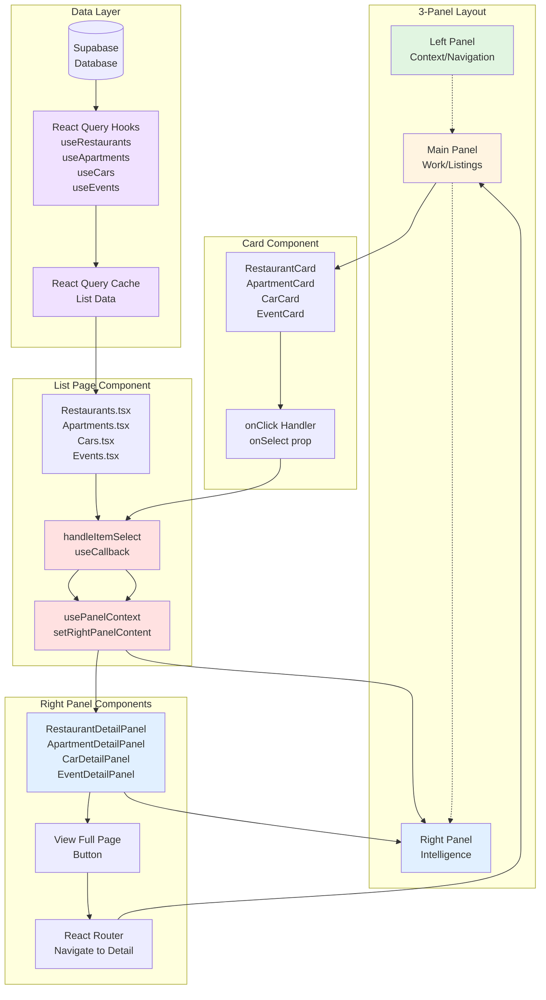
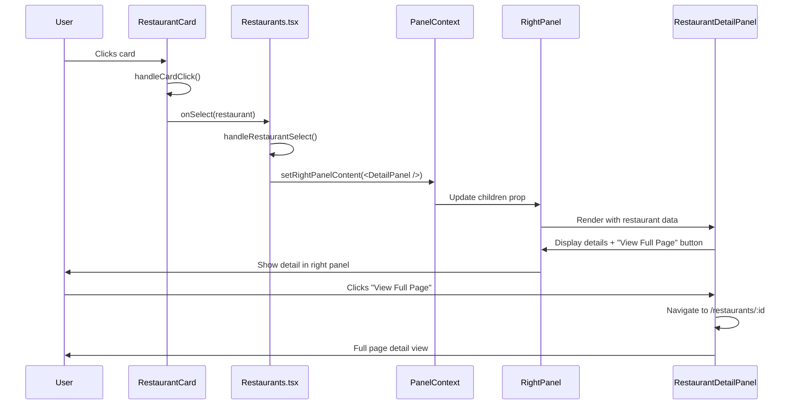
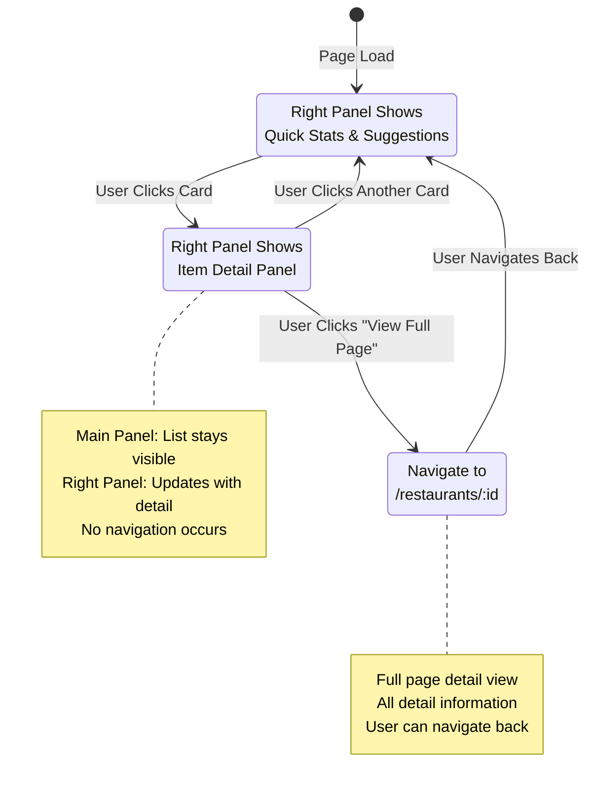

# Fix 3-Panel System: Card Click Updates Right Panel Instead of Navigating

## Problem
Clicking restaurant, apartment, car, or event cards navigates to full-page detail routes, breaking the 3-panel browsing experience.

## Solution
Update card click behavior to update the right panel with detail information instead of navigating.

---

## Changes Required

### 1. Update Card Components
**Files to modify:**
- `src/components/restaurants/RestaurantCard.tsx`
- `src/components/apartments/ApartmentCard.tsx`
- `src/components/cars/CarCard.tsx`
- `src/components/events/EventCard.tsx`
- `src/components/explore/ExploreCard.tsx`

**What to change:**
- When `onSelect` prop is provided, use `div` wrapper with `onClick` handler (already implemented)
- Handler should call `onSelect(item)` to update right panel
- Remove `Link` navigation when `onSelect` is provided
- Keep save/favorite button clicks separate (use `e.stopPropagation()`)

**Current code pattern (already correct):**
```tsx
const CardWrapper = onSelect ? 'div' : Link;
const handleCardClick = (e: React.MouseEvent) => {
  if (onSelect) {
    e.preventDefault();
    onSelect(restaurant);
  }
};
```

### 2. Update List Pages
**Files to modify:**
- `src/pages/Restaurants.tsx`
- `src/pages/Apartments.tsx`
- `src/pages/Cars.tsx`
- `src/pages/Events.tsx`

**What to change:**
- Use `usePanelContext()` hook to get `setRightPanelContent`
- Create handler function that sets right panel content with detail component
- Pass handler as `onSelect` prop to card components
- Default right panel content shows when no item selected

**Example pattern:**
```tsx
const { setRightPanelContent } = usePanelContext();

const handleItemSelect = useCallback((item) => {
  setRightPanelContent(<ItemDetailPanel item={item} />);
}, [setRightPanelContent]);

// In render:
<ItemCard item={item} onSelect={handleItemSelect} />
```

### 3. Update Detail Panel Components
**Files to modify:**
- `src/components/panels/RestaurantDetailPanel.tsx`
- `src/components/panels/ApartmentDetailPanel.tsx`
- `src/components/panels/CarDetailPanel.tsx`
- `src/components/panels/EventDetailPanel.tsx`

**What to add:**
- Add "View Full Page" button at top of component
- Button should navigate to detail route: `/restaurants/${id}`, `/apartments/${id}`, etc.
- Use `Link` component from `react-router-dom`
- Style as primary or secondary button
- Optional: Add button at bottom as well

**Example:**
```tsx
<Button asChild variant="outline" className="w-full">
  <Link to={`/restaurants/${restaurant.id}`}>
    <Expand className="w-4 h-4 mr-2" />
    View Full Page
  </Link>
</Button>
```

---

## Right Panel Layout

### Desktop (Right Panel Content Structure)
```
┌─────────────────────────────┐
│ [View Full Page →] (Button) │
├─────────────────────────────┤
│ Item Name                   │
│ Rating | Price | Location   │
├─────────────────────────────┤
│ [Reserve/Book] (Primary)     │
├─────────────────────────────┤
│ Hours Today                 │
│ Open/Closed Status           │
├─────────────────────────────┤
│ Contact                     │
│ Phone | Website             │
├─────────────────────────────┤
│ [Save] Button               │
├─────────────────────────────┤
│ [View Full Page →] (Footer) │
└─────────────────────────────┘
```

### Default State (No Selection)
- Right panel shows: Quick Stats, Suggestions, Popular Items
- This is already implemented in list pages

### Selected State (Card Clicked)
- Right panel updates with detail panel component
- Main panel remains on list view
- Smooth transition when panel updates

---

## Data Flow

**No additional API calls needed:**
- List pages already fetch data via React Query hooks (`useRestaurants()`, `useApartments()`, etc.)
- Card click passes item object directly to right panel component
- Right panel components receive props: `{ restaurant }`, `{ apartment }`, `{ car }`, `{ event }`
- If additional detail needed, use existing hooks like `useRestaurant(id)`

**State Management:**
- Panel state: `ThreePanelLayout` context manages right panel content
- Data state: React Query caches list data (no refetch needed)
- Card click: Updates right panel (local state only)
- View Full Page: Navigates to route (React Router)

---

## System Architecture Diagram



---

## Component Interaction Flow



---

## State Management Flow



---

## User Flow

**Before:**
1. User clicks card → Navigates to `/restaurants/123` → Full page

**After:**
1. User clicks card → Right panel updates with details → Main panel shows list
2. User clicks "View Full Page" → Navigates to `/restaurants/123` → Full page

---

## Technical Notes

- Use existing `usePanelContext` hook (already available in `ThreePanelLayout`)
- Reuse existing detail panel components (already exist)
- Context is already set up correctly
- Just need to wire up click handlers properly
- Ensure `onSelect` prop is passed from list pages to cards
- Test that save button clicks don't trigger detail view

---

## Testing Checklist

- [ ] Clicking card updates right panel (doesn't navigate)
- [ ] Right panel shows correct detail information
- [ ] "View Full Page" button navigates to detail route
- [ ] Save button on card doesn't trigger detail view
- [ ] Default right panel shows when no selection
- [ ] Works for all listing types (restaurants, apartments, cars, events)
- [ ] Smooth transition when right panel updates
- [ ] Mobile/tablet drawer behavior works correctly

---

## Keep It Simple

- Use existing components and hooks
- Just change click behavior: navigation → panel update
- Add "View Full Page" button to detail panels
- No new API calls or data fetching needed
- Reuse existing React Query cached data
