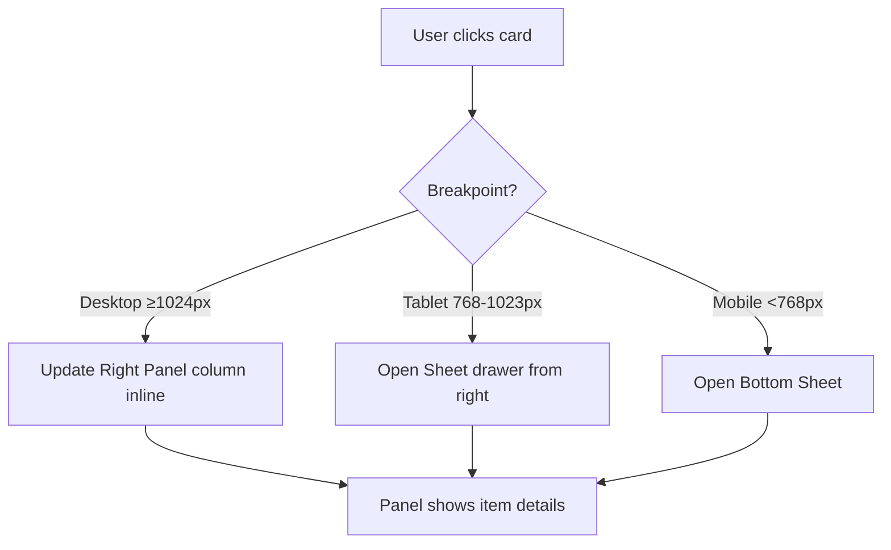
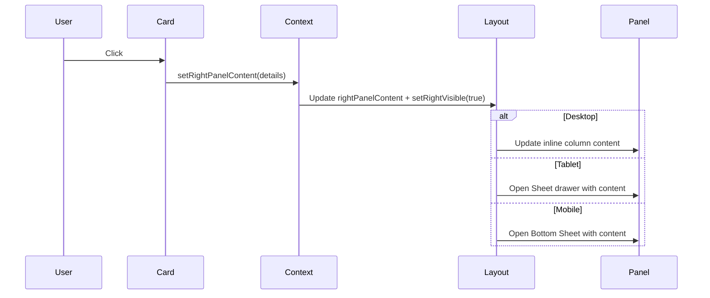

# Right Panel Architecture — Fix & Implementation Guide

## Problem Statement

Duplicate panels appearing on tablet/mobile:
- Desktop right panel column leaking into smaller breakpoints
- Sheet/bottom-sheet also appearing, causing two "Intelligence" panels

## Current Behavior (Broken)

```
┌─────────────────────────────────────────────────────────────┐
│ Desktop (≥1024px)                                           │
│ ┌────────┬────────────────────────────┬──────────────────┐  │
│ │ Left   │ Main (Work)                │ Right (Intel)    │  │
│ │ 240px  │ flex                       │ 320px            │  │
│ └────────┴────────────────────────────┴──────────────────┘  │
└─────────────────────────────────────────────────────────────┘

┌─────────────────────────────────────────────────────────────┐
│ Tablet (768px-1023px) — BROKEN                              │
│ ┌────────┬─────────────────────────────┬─────────────────┐  │
│ │ Left   │ Main (Work)                 │ Right LEAKING   │  │
│ │ 200px  │ flex                        │ (shouldn't show)│  │
│ └────────┴─────────────────────────────┴─────────────────┘  │
│                                   + ALSO Sheet drawer FAB   │
└─────────────────────────────────────────────────────────────┘

┌─────────────────────────────────────────────────────────────┐
│ Mobile (<768px) — BROKEN                                    │
│ ┌───────────────────────────────────────┬────────────────┐  │
│ │ Main (full width)                     │ Right LEAKING  │  │
│ └───────────────────────────────────────┴────────────────┘  │
│          + Bottom nav + ALSO Bottom Sheet FAB               │
└─────────────────────────────────────────────────────────────┘
```

## Target Behavior (Fixed)



### Desktop (≥1024px)
- 3-column grid: Left 240px | Main flex | Right 320px
- Right panel always visible, content updates on card click

### Tablet (768px-1023px)
- 2-column layout: Collapsible Left | Main flex
- **NO** visible right column
- Sheet drawer triggered by FAB or card click
- Sheet opens automatically when setRightPanelContent is called

### Mobile (<768px)
- Single column: Main full-width
- Bottom navigation bar
- **NO** visible right column
- Bottom Sheet triggered by FAB or card click
- Opens automatically when setRightPanelContent is called

## Implementation Fix

```tsx
// ThreePanelLayout.tsx - Correct breakpoint usage

// Desktop: lg:grid (≥1024px) - shows all 3 columns
<div className="hidden lg:grid lg:grid-cols-[240px_1fr_320px]">
  <LeftPanel />
  <main>{children}</main>
  <RightPanel>{content}</RightPanel>  {/* Only on desktop */}
</div>

// Tablet: md:flex lg:hidden (768-1023px) - NO right column
<div className="hidden md:flex lg:hidden">
  <LeftPanel collapsed={...} />
  <main>{children}</main>
  {/* NO RightPanel here - uses Sheet instead */}
  <Sheet>...</Sheet>
</div>

// Mobile: md:hidden (<768px) - NO right column  
<div className="md:hidden">
  <main>{children}</main>
  <MobileNav />
  {/* NO RightPanel here - uses bottom Sheet instead */}
  <Sheet>...</Sheet>
</div>
```

## State Flow



## Acceptance Criteria

- [ ] Desktop shows 3-column grid with right panel always visible
- [ ] Tablet shows 2 columns, right panel is Sheet drawer (slides from right)
- [ ] Mobile shows 1 column, right panel is bottom sheet (slides from bottom)
- [ ] No duplicate panels on any breakpoint
- [ ] Card click auto-opens Sheet/Bottom-sheet on tablet/mobile
- [ ] FAB button opens empty/default intelligence on tablet/mobile
