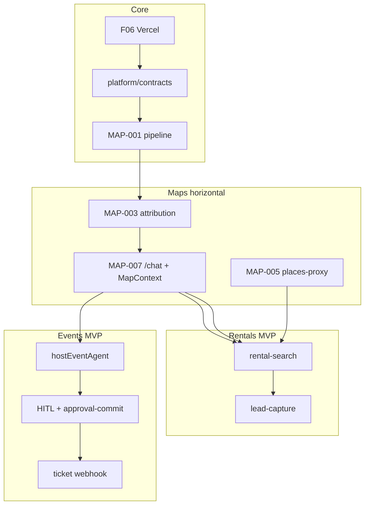

# mdeai.co — Master Roadmap

> **Strategic intent:** One **structured AI concierge** for Medellín — chat + map + HITL — that proves **revenue** (paid ticket + rental lead) and **trust** (grounded places, no hallucinated geo) before automation (OpenClaw, Hermes hot-path, multi-agent sprawl).
>
> **This is a plan, not a contract.** Sequencing adapts when MAP-001 or ticketing slips. Capacity is zero-sum: every “yes” moves something else to Later.

**Read first:** [`plan.md`](./plan.md) § At a glance · [`progress/may30.md`](./progress/may30.md) · [`prd.md`](./prd.md) · [`index-skills.md`](./index-skills.md) (which skill to load)

### Where we are (2026-05-30, plain English)

| | |
|--|--|
| **MVP done?** | **No** — floor green (**313** Vitest), but **G1 + webhooks + event cards + G3 + ledger** and **UX P0** lack prod proof. |
| **Score** | **72/100** forensic MVP readiness ([`progress/may30.md`](./progress/may30.md)) |
| **Works** | Camila: `/` chat, rentals/cafés, pins, **G2** leads. Code @ `8c99ded`, prod **200**. |
| **Now** | Tier 1 commerce (079→083) **‖** Tier 1C UX (093→101) **‖** Tier 1B prod sign-off (084–092) |
| **Skills** | Load ≤5 per task — [`index-skills.md`](./index-skills.md) § Load by work type |

---

## Strategy context

### Business outcomes (Phase 1)

| # | Outcome | Metric | Persona |
|---|---------|--------|---------|
| O1 | **First paid event ticket** on `mdeapp` | `event_orders.status = paid` | Andrés / Miguel |
| O2 | **Roberto publishes one event** via AI + HITL | 1 live `events` row + tiers | Roberto |
| O3 | **Camila sees rentals on a map** from chat | ≥5 rental pins; 1 session → `leads` | Camila |
| O4 | **Unified concierge works** | `/chat` 3-panel; router dispatches; MAP-001 green | Tourist / Camila |
| O5 | **Platform trustworthy** | Grounding attribution on all grounded UI; `npm run floor` green | Patricia / Sofía |

### Customer problems (one platform)

- Nomads cannot evaluate **where** to live without WhatsApp chaos and scam listings.
- Hosts cannot publish events in **under 30 seconds** with bilingual clarity and safe ticketing.
- Tourists need **one chat** for food, events, and neighborhoods — not five tabs.
- Ops cannot approve money/outreach without a **single HITL gate**.

### Constraints (non-negotiable)

| Constraint | Source |
|------------|--------|
| CopilotKit **1.55.2** + Mastra only — no v2 mix, no LangGraph/CrewAI runtime | `CLAUDE.md`, [`plan/01-copilotkit-plan.md`](./plan/01-copilotkit-plan.md) |
| **English UI** Phase 1; Spanish Phase 2 | `CLAUDE.md` (overrides prd §2 “Spanish first” vision) |
| **Supabase** = data truth; **Maps** = spatial display; **Mastra** = orchestration; **CK** = UI | All module PRDs |
| **Gemini** never invents `place_id`, coords, URLs, hours, distances | [`plan/maps/maps-prd.md`](./plan/maps/maps-prd.md) |
| **One router + workflows** — not 20 module agents | [`plan/unified-execution-review.md`](./plan/unified-execution-review.md) |
| Legacy `/home/sk/mde/` **frozen** — P0 security only | `FREEZE.md` |
| **Done** = localhost proof + evidence (anti-fake-done) | task-verifier skill |

### Platform rule

```text
Supabase owns data · Mastra owns orchestration · CopilotKit owns UI
· Google Maps owns spatial display · Gemini explains (tool-backed only)
```

---

## Current state (2026-05-30)

> **Execution authority:** [`plan.md`](./plan.md) · **Audit:** [`progress/may30.md`](./progress/may30.md) · **Queue:** [`todo.md`](./todo.md)

| Area | Status | Evidence |
|------|--------|----------|
| **Foundation + platform** | 🟢 | IMP-001–078; **313** Vitest; `npm run floor` exit 0 @ `8c99ded` |
| **Prod app** | 🟢 | https://www.mdeai.co HTTP 200; CopilotKit runtime 415 (up) |
| **Camila `/` + G2** | 🟢 | Rentals/cafés + lead capture proven on prod |
| **Maps code** | 🟢 | `verify:maps` OK locally; **MAP-002B/008B** prod ⚪ |
| **Mastra + Gemini 3.5** | 🟢 | 7 agents, 3 workflows, tools wired |
| **G1 Andrés paid** | 🟡 | Checkout code; **live paid row** open (IMP-079) |
| **EVP-013 EventCard** | 🔴 | SCREEN-006 Playwright fails (no `event-card` in 120s) |
| **EVP-003 webhooks** | 🔴 | Ticket vs sponsor secret isolation open |
| **G3 Roberto publish** | 🟡 | Wizard exists; prod SQL proof open (IMP-082) |
| **MVP ledger EVP-001** | 🔴 | Blocked on G1+G3+081 |
| **UX prod pack** | 🟡 | UX-001 🟢; 003–009 ⚪ (errors, parser, monitor) |
| **Post-MVP** | ⚪ | DATA, INT, VEN, VEC per `plan.md` tiers 3–10 |

**Status:** **72/100 MVP readiness; exit not signed** — finish Tier 1 + 1C before ADV. Week narrative below is strategic; **IMP order** wins over calendar.

---

## Repo-first PR track

Engineering order for `mdeapp/` (one PR per row when possible). **PR-1 must be green before PR-3.**

| PR | Scope | Success proof |
|----|--------|---------------|
| **PR-1** | `src/platform/contracts/` + `src/platform/maps/` + MAP-001 + `/chat` shell | Vitest schemas; tool → pins; Playwright pin count |
| **PR-2** | `searchGroundedPlaces`, `GroundingAttribution`, `grounding_quota_log` | Grounded query + Google attribution + pins |
| **PR-3** | `/host/event/new`, `hostEventAgent`, `EventDraftState`, HITL, `approval-commit` | Approve → `events` + `event_tickets` |
| **PR-4** | `ticket-checkout`, `ticket-payment-webhook`, `/me/tickets/:id` | Stripe test → `paid` + QR |
| **PR-5** | 25 listings, `rental-search`, `RentalCard`, pins, lead | ≤5 cards; pins; `leads` row |

**Definition of Done:** code in `mdeapp/` + test + localhost proof + evidence + `npm run floor` when applicable — see [`prd.md` § Definition of Done](./prd.md#definition-of-done).

---

## North-star MVP (Phase 1 exit)

**MVP = O1 + O2 + O3 + O4** (ticket + host publish + rental map + unified chat).  
**Not required for MVP exit:** native rental Stripe booking, WhatsApp prod, Hermes live rerank, contests, sponsors, Lingui.

```text
Roberto: voice/text → hostEventAgent → form fill → HITL → events row
Andrés:  browse → Stripe checkout → webhook → paid order + QR
Camila:   /chat → router → rental-search → cards + pins → lead row
Tourist:  /chat → search_restaurants / attractions / grounded places
```

**Realistic calendar:** **12–14 weeks** from today (not 10) unless MAP-001 + F36–F38 + ticket port land in parallel.

---

## Now / Next / Later

| Stage | Initiative | Outcome | Metric | Primary tasks |
|-------|------------|---------|--------|---------------|
| **Now** | Platform contracts + router stub | One Zod surface for map + tools | `platform/contracts` merged; router classifies | F18 partial, new **MAP-000** |
| **Now** | **MAP-001–003** map pipeline | Chat produces pins + attribution | 3 grounded pins on `/chat`; screenshot | MAP-001–003, F16 |
| **Now** | Roberto host wizard + HITL | Host publishes safely | 1 `events` row after approve | F33–F38 |
| **Now** | Stripe ticket port | Money path on new app | 1 paid `event_orders` | F11 + new EVT edges in `mdeapp` |
| **Next** | `/chat` three-panel + MapContext | Unified concierge canvas | CHAT-CENTRAL layout live | MAP-007, F43 |
| **Next** | Places proxy + cache | Cost-safe enrichment | Cache hit SQL; masks logged | MAP-004–006, RE-004–005 |
| **Next** | Rental search + 25 listings | Camila demo | 5 pins; 1 lead | F17, F41, RE-001 |
| **Next** | DB search tools (food/POI/events) | Multi-vertical pins without overwrite | 4 categories on map | F15, F19, MAP merge |
| **Later** | Path A agent port (full) | Parity with legacy mastra | F14–F20 sequence | [`tasks/INDEX.md`](./tasks/INDEX.md) |
| **Later** | Admin + soak + cutover | Production confidence | F32, F40, rolling release | prd §50 W10 |
| **Later** | OpenClaw / Hermes hot / Lingui | Automation + ES | Phase 2+ | prd §IX, RE P4 |

---

## Phased roadmap

### Legend

| Label | Meaning |
|-------|---------|
| **Core** | Shared platform; blocks all verticals |
| **MVP** | Revenue + persona-visible proof |
| **Post-MVP** | Moat + ops depth |
| **Advanced** | Deferred bets |

**Horizontal track:** **Maps (MAP-xxx)** runs across weeks — not a separate product.

---

### Core (weeks 1–3) — “runtime + contracts”

**Theme:** Replace custom AI glue with CK + Zod; prove Mastra bridge; freeze legacy.

| Week | Outcome | Work | Tasks / MAP | Exit proof |
|------|---------|------|-------------|------------|
| W1 | App boots; Gemini echo | CopilotKit + Mastra base | F01–F06 ✅ | `curl` copilotkit 200 |
| W2 | Auth + floor + observability | shadcn, login, `ai_runs` | F07–F10, F13 ✅ | `npm run floor` green |
| W2–3 | **Shared contracts** | `MapPin`, `ToolResponse`, `EventDraft`, approval types | **NEW:** `src/platform/contracts/` | Vitest schema pass |
| W3 | **Router stub** | Classify intent (no heavy tools) | F18 (early), F33 | classify smoke |
| W3 | **MAP-001** pipeline | Tool → action → pins (mock map OK) | MAP-001 | pin count test |
| W3 | P0 gates | Stripe secrets; legacy jwt | F11, F12 ✅ | audit doc |

**Core cuts:** `packages/` monorepo, Lingui, 7 empty agents registered, Maps npm before MAP-001 design done.

**Docs:** [`plan/01-copilotkit-plan.md`](./plan/01-copilotkit-plan.md) · [`plan/prd/03-architecture.md`](./plan/prd/03-architecture.md)

---

### MVP (weeks 4–10) — “revenue + map proof”

**Theme:** Roberto ships; one ticket sells; Camila sees map-backed rentals; `/chat` is the product.

#### MVP track A — Events + ticketing (Roberto / Andrés)

| Week | Outcome | Work | Tasks | Exit proof |
|------|---------|------|-------|------------|
| W4 | Host AI form-fill | `hostEventAgent` + wizard | F34, F36 | form fills from Spanish sentence |
| W4 | HITL publish | Approval panel + edge commit | F37, F38 | `decide_approval()` → live event |
| W5 | Event cards + list | UI shells | F25, F35 | `/host/events` lists row |
| W6–7 | **Ticketing E2E** | checkout + webhook + validate in `mdeapp/supabase/functions/` | **EVT** (new specs) | test card → `paid` |
| W7 | Buyer wallet | `/me/tickets/:id` | F44 | QR visible |

**Canon:** [`plan/events/events-prd.md`](./plan/events/events-prd.md) — **cut** Vendor/Marketing/Activations agents; keep `hostEventAgent` + discovery workflow + edges.

#### MVP track B — Maps + concierge (Camila / Tourist)

| Week | Outcome | Work | MAP / F | Exit proof |
|------|---------|------|---------|------------|
| W4 | Grounding + attribution | Legal + trust UX | MAP-002–003 | “Google Maps” on card |
| W5 | **MAP-007 `/chat`** | 3-panel + MapContext port | MAP-007, F43 | desktop + 390px screenshot |
| W5 | Places client + proxy | Field masks + edge | MAP-004–005, F16 | mask header in logs |
| W6 | Nearby + grounded | “Show nearby”, open POI | MAP-006, MAP-002 | 5 POIs @ 800m |
| W6 | vis.gl + markers + mapId | Production pins | MAP-008, F41 | `data-mapid-present` |
| W7 | Clustering + autocomplete | Scale + Roberto venue | MAP-009–010 | 50-pin cluster; `google_place_id` |
| W6–7 | Restaurant + attraction tools | DB-first search | F19, F26 | pins don’t wipe rentals |

**Canon:** [`plan/maps/maps-prd.md`](./plan/maps/maps-prd.md) · [`docs/CHAT-CENTRAL-PLAN.md`](./docs/CHAT-CENTRAL-PLAN.md)

#### MVP track C — Rentals (Camila)

| Week | Outcome | Work | Tasks / RE | Exit proof |
|------|---------|------|------------|------------|
| W5 | Inventory | 25 verified listings | RE-001 / seed | SQL count ≥25 |
| W6 | Rental workflow | `rental-search` + cards | F17, F24, F41 | ≤5 cards + pins |
| W7 | Lead capture | Unified edge | F12 path + lead-capture | `leads` row from chat |
| W7 | Showing propose | HITL slot (light) | RE showing tasks | `showings` row |

**Canon:** [`plan/real-estate/draft/prd-real-estateV2.md`](./plan/real-estate/draft/prd-real-estateV2.md) · [`plan/real-estate/draft/roadmap.md`](./plan/real-estate/draft/roadmap.md)

#### MVP integration week (W8–9)

| Outcome | Work | Tasks |
|---------|------|-------|
| Floor + e2e | Maps + host + ticket smokes | F09 extend, F39, MAP e2e |
| Path A burst | Port remaining agents if needed | F14–F20 |
| Production smoke | Vercel proof | F32 |

**MVP exit checklist**

- [ ] MAP-001–003 + 007 green on staging  
- [ ] Roberto: 1 published event (HITL)  
- [ ] Andrés: 1 paid ticket  
- [ ] Camila: rental query → pins + 1 lead  
- [ ] `npm run floor` green; English UI  
- [ ] No service-role in `mdeapp/src/**`  

---

### Post-MVP (weeks 11–18) — “moat + ops”

**Theme:** Lifestyle intelligence, landlord loop, observability depth — still **no** WhatsApp prod blast.

| Initiative | Outcome | Maps | RE | Events |
|------------|---------|------|-----|--------|
| Route previews + commute | “10 min from metro” cards | MAP-011 | RE | — |
| Neighborhood profiles | Laureles vs Poblado (offline Gemini) | MAP-012 | RE | — |
| Hermes **batch** rerank | Better ranking w/ labels | — | RE | — |
| Landlord dashboard MVP | Inbox + KPIs | — | RE | — |
| Place photos on cards | Media on open only | MAP photos | RE | EVT |
| ECL mobile sheet | Bottom sheet (flagged) | ECL | — | — |
| Admin Patricia | Moderation + approvals queue | — | RE | EVT |
| Scam filter ingest | `considered_but_rejected` | ToolResponse | RE | — |
| OpenClaw **sandbox** | Draft WA only | — | RE | — |
| Paperclip on forward | Landlord outreach gate | — | RE | — |
| Lingui ES/CO | i18n | — | all | all |
| CopilotKit v2 eval | Only if Mastra v2 bridge exists | — | — | — |

**Freeze until Post-MVP green:** OpenClaw prod outbound, Hermes on hot path, native rental Stripe, contests, sponsor marketplace.

---

### Advanced (weeks 19+)

| Initiative | Outcome | Notes |
|------------|---------|-------|
| Map itinerary (`trips`) | Multi-day pins | Supabase `trip_items` |
| Rental booking Stripe | 12% commission E2E | Full RE money path |
| Sponsor + influencer geo | Events marketing | Cross-module |
| Multi-city scaffold | Export Medellín playbook | — |
| MCP Apps venue picker | iframe tools | Post-MVP exploration |
| Deep research concierge | citations mode | research-canvas pattern only |

**Never:** Maps as orchestrator; second AI runtime; scraping Google Maps; fleet/nav SDKs; 12+ nominal agents per vertical.

---

## Cross-vertical dependency graph



**Critical path:** `platform/contracts` → **MAP-001** → **MAP-003** → **MAP-007** → (Roberto **or** rentals parallel) → ticket webhook.

---

## Shared platform epics (all phases)

Build once in `mdeapp/src/platform/` — module PRDs consume, do not duplicate.

| Epic | Components | PRD refs |
|------|------------|----------|
| **Contracts** | `MapPin`, `ToolResponse`, `EventDraft`, `ApprovalPayload` | CHAT-CENTRAL, maps-prd §4.4 |
| **Maps runtime** | `MapContext`, `normalize-tool-output`, `GroundingAttribution` | maps-prd |
| **Cards** | Rental, Event, Place, Neighborhood, Commute | CK generative-ui |
| **Places** | `field-masks.ts`, `places-proxy` edge, cache tables | maps-prd, RE §5 |
| **Approvals** | `renderAndWaitForResponse` + `decide_approval()` | events, prd §15 |
| **Observability** | `ai_runs`, `places_request_log`, `grounding_quota_log` | F13, maps §9 |

---

## Implementation priority (strict order)

Synthesized from [`plan/unified-execution-review.md` §11](./plan/unified-execution-review.md#11-best-implementation-order) and [`plan/maps/maps-prd.md` §8](./plan/maps/maps-prd.md).

| # | Item | Phase | ROI |
|---|------|-------|-----|
| 1 | `src/platform/contracts/*` | Core | Unblocks all verticals |
| 2 | **MAP-001** runtime pipeline | Core | #1 failure mode today |
| 3 | **MAP-003** attribution | Core | Legal + trust |
| 4 | **F33–F38** Roberto + HITL | MVP | Revenue narrative |
| 5 | Ticket edges in `mdeapp` | MVP | Revenue proof |
| 6 | **MAP-004–006** places + nearby | MVP | Cost + demo |
| 7 | **MAP-007** `/chat` + MapContext | MVP | Product shape |
| 8 | **F17 + F41** rental workflow | MVP | Camila demo |
| 9 | **MAP-008–009** markers + cluster | MVP | Scale UX |
| 10 | F19 restaurant/attraction + F15 events | MVP | Unified concierge |
| 11 | Lead capture + F32 prod smoke | MVP | Ops proof |
| 12 | MAP-010–012, Post-MVP batch | Post-MVP | Moat |

---

## What to cut (capacity returned)

| Cut | Saves | Rationale |
|-----|-------|-----------|
| 12+ **events agents** → 1 host + 2 workflows | ~3–4 weeks equiv. | events-prd inventory |
| 8 **RE agents** → router + workflows | ~2 weeks | real-estate-prd |
| 8 **map agents** → tools | ~1 week | maps-prd §6.6 |
| Lingui in W7 | ~1 week | English Phase 1 |
| ECL before mobile sprint | Loader risk | maps-prd Appendix C |
| CK v2 in Phase 1 | Rewrite risk | prd §12 |
| `packages/` monorepo now | Ceremony | unified review |
| Custom SSE / normalize in new app | ~400 LoC | AG-UI + Zod |
| WhatsApp / OpenClaw prod in MVP | Ops risk | RE P4 |

---

## Risks & mitigations

| Risk | L | I | Mitigation |
|------|---|---|------------|
| MAP-001 never ships → empty map | H | H | Block MVP exit; Sofía owns week 4 |
| Ticket fns only in legacy | M | H | Port 3 edges to `mdeapp` before cutover |
| Dual app maintenance | H | M | Legacy freeze; P0 only |
| Agent sprawl in docs confuses builders | M | M | This roadmap + router-first rule |
| Places bill shock | M | M | MAP-004 masks + MAP-005 cache |
| 10-week narrative vs 14-week reality | M | M | Communicate 12–14w internally |
| prd “Spanish first” vs English Phase 1 | L | M | **English** until Post-MVP |
| CK shared-state bug #3426 | M | H | MapContext write only from renderer |

---

## Scores (planning baseline)

| Dimension | /100 | Notes |
|-----------|-----:|-------|
| Architecture (design) | 82 | Correct lanes; simplified agents |
| Implementation readiness | 48 | Plans >> code |
| Scalability | 74 | Supabase + cache path sound |
| Complexity (lower worse) | 38 | Cut agents to improve |
| Maintainability | 70 | `platform/` folder required |
| AI architecture | 85 | CK+Mastra pattern |
| Maps architecture | 88 | maps-prd ready |
| Operational readiness | 52 | ai_runs only |

---

## Document index (canonical PRDs)

| Topic | Document |
|-------|----------|
| **Master PRD index** | [`prd.md`](./prd.md) |
| **Forensic review** | [`plan/unified-execution-review.md`](./plan/unified-execution-review.md) |
| **Maps V2** | [`plan/maps/maps-prd.md`](./plan/maps/maps-prd.md) (MAP-001–012) |
| **Events** | [`plan/events/events-prd.md`](./plan/events/events-prd.md) |
| **Real estate** | [`plan/real-estate/draft/prd-real-estateV2.md`](./plan/real-estate/draft/prd-real-estateV2.md) |
| **RE sequencing** | [`plan/real-estate/draft/roadmap.md`](./plan/real-estate/draft/roadmap.md) |
| **Chat canvas** | [`docs/CHAT-CENTRAL-PLAN.md`](./docs/CHAT-CENTRAL-PLAN.md) |
| **CopilotKit bootstrap** | [`plan/01-copilotkit-plan.md`](./plan/01-copilotkit-plan.md) |
| **Repo strategy** | [`plan/02-repo-plan.md`](./plan/02-repo-plan.md) |
| **Foundation PRD chunks** | [`plan/prd/`](./plan/prd/) |
| **Execution tasks** | [`tasks/INDEX.md`](./tasks/INDEX.md) (F01–F45) |

---

## Themes by quarter (communication)

| Theme | When | Story for stakeholders |
|-------|------|------------------------|
| **Trust the runtime** | Core | “We replaced 2,400 LoC of custom chat glue with CopilotKit + typed contracts.” |
| **Prove the map** | MVP | “When AI recommends an apartment, the map proves it with cafés, coworking, and Google attribution.” |
| **Prove the money** | MVP | “Roberto publishes; Andrés pays; Camila becomes a lead.” |
| **Prove the city OS** | Post-MVP | “One chat for rentals, events, food, and places — with human approval on every commit.” |
| **Automate carefully** | Advanced | “WhatsApp and Hermes batch enrich — never autonomously spend or publish.” |

---

## Maintenance

- **Reprioritize:** use [`mde-roadmap/update-reprioritize.md`](./.claude/skills/mde-roadmap/update-reprioritize.md) — any new initiative must name what slips.
- **Task specs:** [`mde-task-lifecycle`](./.claude/skills/mde-task-lifecycle/) — flip `Done` only with evidence.
- **Progress:** update this file when MAP-001 or MVP exit checklist items complete; mirror status in [`tasks/INDEX.md`](./tasks/INDEX.md).

---

*Next engineering bet: **MAP-001** + **`src/platform/contracts`** in the same PR — then F33–F38 Roberto track in parallel once pins proof exists.*
