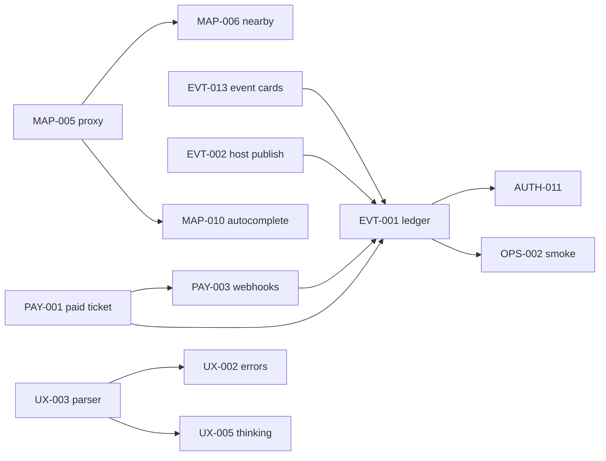

# MVP execution dashboard

**Primary operator surface.** Local markdown = source of truth. Linear = queue index + PR links.

**North star:** production proof @ https://www.mdeai.co — paid ticket, event cards, host publish, chat UX.

**Architecture frozen 2026-05-31** — no more restructuring; ship proofs.

---

## Linear views (labels only — never title text)

| View | Filter |
|------|--------|
| **[MVP EXECUTION](https://linear.app/sanjiovani/view/mvp-b4f1afdff207)** | `project:MDEAPP label:phase:launch` |
| **BLOCKERS** | `project:MDEAPP has:blocked-by state:Todo,"In Progress","In Review"` |
| **MAPS** | `project:MDEAPP label:prefix:MAP` |
| **EVENTS** | `project:MDEAPP label:prefix:EVT` |
| **PAYMENTS** | `project:MDEAPP label:prefix:PAY` |
| **UX** | `project:MDEAPP label:track:ux` |
| **DATA** | `project:MDEAPP label:track:data` |
| **AUTH** | `project:MDEAPP label:prefix:ATH OR label:stack:supabase` |
| **POST-MVP** | `project:MDEAPP label:phase:post-mvp` |

Setup copy-paste: [`linear/10-mvp-module-views.md`](linear/10-mvp-module-views.md)

---

## Naming (frozen)

**Linear title:** `{SPEC-ID} — readable title` · **SAN-###** immutable · **Disk filenames** unchanged (EVP-* files keep old names until renamed separately).

| ✅ Allowed prefixes | ❌ Deprecated |
|---------------------|---------------|
| MAP, EVT, RE, VEN, TRIP, AUTH, DATA, UX, PAY, OPS, TEST, AI | IMP-*, EVP-*, SCREEN-*, F32/F48, G1/G3, RNT/AIA/ATH/UIX catalog |

Sync: `node scripts/linear-sync-mvp-titles.mjs` · Map: [`mvp-canonical-titles.json`](linear/mvp-canonical-titles.json)

---

## Dependency chains

Machine-readable: [`mvp-queue.json`](linear/mvp-queue.json) → `dependency_chains`

---

## Next 10 tasks

| # | Spec | Module | SAN | Depends on | Proof |
|---|------|--------|-----|------------|-------|
| 1 | **PAY-001** | Payments | [178](https://linear.app/sanjiovani/issue/SAN-178) | — | Live Stripe → paid + QR |
| 2 | **PAY-003** | Payments | [116](https://linear.app/sanjiovani/issue/SAN-116) | PAY-001 | Distinct webhook secrets |
| 3 | **EVT-013** | Events | [117](https://linear.app/sanjiovani/issue/SAN-117) | — | event-card e2e **red** |
| 4 | **EVT-002** | Events | [366](https://linear.app/sanjiovani/issue/SAN-366) | — | SQL publish row |
| 5 | **EVT-001** | Events | [115](https://linear.app/sanjiovani/issue/SAN-115) | 1–4 | Ledger sign-off |
| 6 | **UX-003** | UX | [316](https://linear.app/sanjiovani/issue/SAN-316) | ‖ | Price parser on prod |
| 7 | **UX-002 + UX-005** | UX | [320](https://linear.app/sanjiovani/issue/SAN-320)/[319](https://linear.app/sanjiovani/issue/SAN-319) | UX-003 | Same PR |
| 8 | **OPS-002** | Platform | [100](https://linear.app/sanjiovani/issue/SAN-100) | EVT-001 | Prod smoke matrix |
| 9 | **AUTH-011** | Auth | [367](https://linear.app/sanjiovani/issue/SAN-367) | EVT-001 | Prod auth + Vercel env |
| 10 | **MAP-002B + MAP-008B** | Maps | [368](https://linear.app/sanjiovani/issue/SAN-368)/[369](https://linear.app/sanjiovani/issue/SAN-369) | ‖ | ADK + mapId prod |

**Done:** UX-001 [315](https://linear.app/sanjiovani/issue/SAN-315) · G2 lead capture · floor 313/313

---

## Active blockers

| Blocker | Blocks | Module |
|---------|--------|--------|
| event-card e2e timeout 120s | EVT-013 → EVT-001 | Events / TEST |
| Identical Stripe webhook secrets | PAY-003 → EVT-001 | Payments |
| EVT-001 waiting on PAY-001/003 + EVT-013/002 | MVP exit | Events |
| PR #14 open | UX-010 M1 | UX |
| MAP-005 not shipped | MAP-006, MAP-010, DATA-007 | Maps |

---

## Tiers

| Tier | Filter | Pull when |
|------|--------|-----------|
| **P0** | `phase:launch` + 🚨 Launch Critical | Always first |
| **MVP active** | `phase:post-mvp` P1 milestones | P0 green |
| **Post-MVP** | `phase:post-mvp` + 🔮 | After EVT-001 signed |
| **Advanced** | `phase:advanced` / deferred | Phase 2+ |

---

## Doc map

| File | Role |
|------|------|
| **This file** | Primary MVP dashboard |
| [`todo.md`](../todo.md) | Operator checklist |
| [`progres.md`](progres.md) | Forensic health |
| [`linear/NAMING-CLEANUP-REPORT.md`](linear/NAMING-CLEANUP-REPORT.md) | Audit + migration log |
| [`linear/mvp-queue.json`](linear/mvp-queue.json) | Queue + deps |
| [`linear/mvp-canonical-titles.json`](linear/mvp-canonical-titles.json) | SAN → title map |
