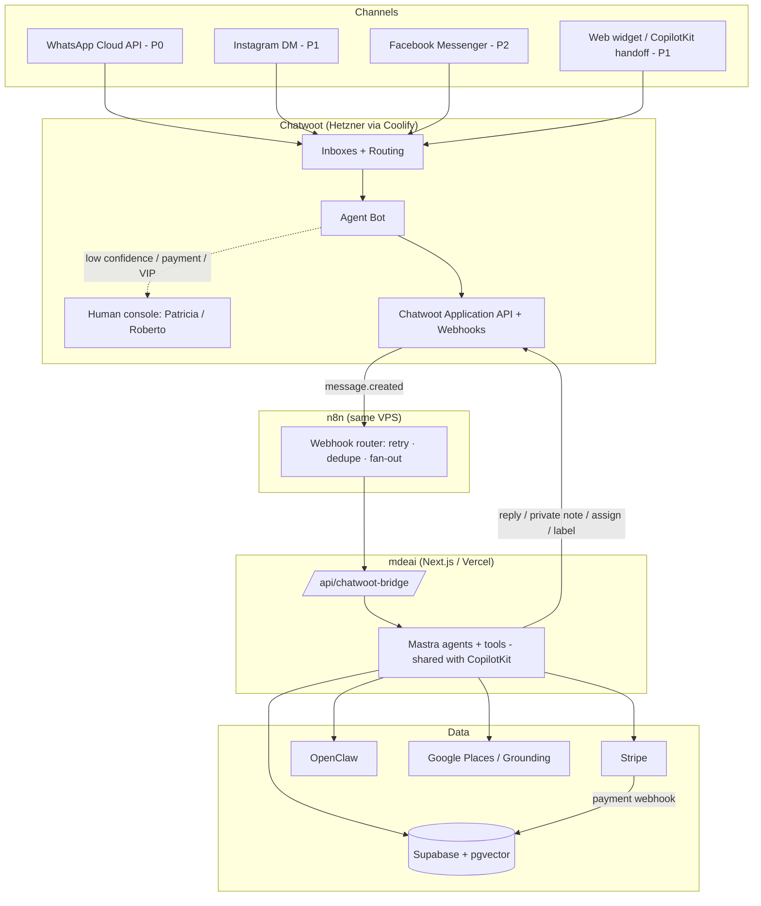

# Chatwoot Omnichannel Concierge for mdeai — PRD

> **One-line thesis:** Chatwoot is the channel + human layer; **Mastra is the brain**; Supabase is the memory; Stripe is the till. Don't rebuild the channel layer — own it via Chatwoot and point it at the agents that already exist.
>
> **MVP scope (build first):** Chatwoot + WhatsApp Cloud API + Agent Bot → Mastra bridge + Supabase lead storage + human handoff. **One vertical: Rentals.** Everything else is sequenced after first revenue.

---

# Executive Summary

## Why Chatwoot

mdeai already has `whatsapp_*` tables but **no live send/receive loop, no human handoff, no agent console, no omnichannel inbox, no CSAT/SLA/routing**. That gap is months of undifferentiated plumbing. Chatwoot ships all of it: inbox, agent apps (web + mobile), routing, labels, macros, CSAT, campaigns, audit logs, and a clean **Agent-Bot + webhook** seam that points straight at Mastra.

Chatwoot becomes the **omnichannel front door + human-handoff + conversation CRM**. It receives WhatsApp / Instagram / Facebook / web messages, runs them through an **Agent Bot** (→ Mastra `conciergeAgent`), and escalates to a **human** (Patricia's ops team, Roberto's host inbox) when AI confidence is low or money/trust is on the line.

## Build vs Buy

**Buy — self-host.** Chatwoot's Community Edition is MIT-licensed and self-hostable on Hetzner via Coolify: no per-seat SaaS fees, full data ownership, full API access.

| Path | Time to working inbox | Ongoing cost | Verdict |
|---|---|---|---|
| Build channel layer in-house | 3–6 months | Eng time forever | ❌ Undifferentiated |
| Chatwoot Cloud (SaaS) | Hours | Per-agent/mo | ⚠️ Recurring + data off-box |
| **Chatwoot self-host (Hetzner/Coolify)** | **Days** | **~€10–40/mo VPS** | ✅ **Recommended** |

> WhatsApp software is free; **Meta conversations are not** — priced per conversation/message by category (service/utility/marketing). Budget by volume; new WABAs start ~250 conv/day (tier 1).

## Strategic fit

mdeai's wedge is **GuideGeek's WhatsApp-first distribution without GuideGeek's shallowness.** GuideGeek informs but cannot transact, has weak grounding, tells users to "open Google Maps yourself," and has no human fallback (it once quoted "$107/night" for a listing that was ~$1,009 on Airbnb — a hallucination that kills trust). mdeai already owns the three things GuideGeek lacks: **grounded local supply** (Places + pgvector), **in-surface booking** (Stripe G1), and a path to **human handoff** (Chatwoot). Chatwoot is the missing distribution + trust layer that turns the existing brain into a WhatsApp concierge.

It also keeps a **clean separation of concerns** and a **shared brain**: the same Mastra agents/tools serve both CopilotKit (web) and the Chatwoot bridge (messaging). No duplicated AI logic. CopilotKit stays the rich web concierge; Chatwoot's web inbox is its **human-handoff destination**, not a replacement.

## MVP recommendation

```text
WhatsApp → Chatwoot inbox → Agent Bot → /api/chatwoot-bridge → Mastra (rentalAgent + grounding)
  → 3 listings → schedule viewing → G2 lead capture → Supabase leads → human broker handoff (Roberto)
  → bill qualified lead
```

**Why this slice:** it reuses the **strongest existing assets** (`rentalAgent`, grounding tools, `leads`, `chat-lead-capture` G2 edge function), generates **real revenue immediately** (qualified-lead fees + broker subscriptions) with **no payment rail beyond a Stripe invoice**, and proves the **bot → human handoff** loop that differentiates mdeai from pure bots. One channel, one vertical = fastest to production. Then clone the pattern to restaurants, nightlife, and events.

**Explicitly out of MVP:** Instagram/Facebook, in-chat card payments, Stripe Connect, trip bundles, relocation packages, custom dashboards, Chatwoot's native "Captain" AI.

---

# PRD

## Goals

1. A **live WhatsApp-first concierge** with human fallback — one identity ("MDE") reachable on WhatsApp.
2. Every conversation becomes a **tracked lead/contact** in Supabase.
3. **Monetize** conversations the bot already handles (lead fees, retainers, featured) — no marketplace rail required.
4. Give hosts/brokers/ops a **console** (Chatwoot web + mobile) to step in.
5. Keep **AI and channel layers decoupled** — Chatwoot owns the conversation, Supabase owns the business object, Mastra owns reasoning.

## Personas

| Persona | Role | What they need from Chatwoot |
|---|---|---|
| **Camila** | Apartment seeker / tourist (customer) | Fast bilingual recommendations + viewing booked, on WhatsApp |
| **Tourist** | Restaurant / attraction seeker (customer) | A table or a "best coffee near me, open now" answer that's grounded |
| **Andrés** | Local — nightlife + events (customer) | VIP table / tickets with QR delivered in chat |
| **Roberto** | Host / broker (supply side) | Qualified leads + reservation requests in an inbox he can answer |
| **Patricia** | Admin / ops | One console, full context, easy handoff, SQL-able conversation analytics |
| **Sofía** | Dev | A thin, typed, testable bridge — not a second AI stack to maintain |

## User stories

- **Camila:** *As an apartment seeker, I want to message MDE on WhatsApp and get 3 real listings that match my budget and neighborhood, so I can book a viewing without downloading an app.*
- **Tourist:** *As a visitor, I want a grounded restaurant recommendation that's actually open now, so I don't get sent to a closed venue (GuideGeek's failure).*
- **Andrés:** *As a local, I want to buy salsa tickets in the same WhatsApp thread and get my QR there, so I never leave the conversation.*
- **Roberto:** *As a broker, I want qualified rental leads (budget + area captured) to land in my inbox with an AI summary, so I only spend time on real prospects.*
- **Patricia:** *As ops, I want low-confidence or payment/complaint conversations escalated to me with a private note of the AI's reasoning, so I can take over mid-thread with full context.*
- **Sofía:** *As a dev, I want the WhatsApp brain to be the same Mastra agents that power web chat, so there's one place to fix a bug.*

## Success metrics / KPIs

| KPI | Target | Why it matters |
|---|---|---|
| Bot containment (no human needed) | > 60% | Proves the AI layer carries load |
| Median first response | < 5s bot · < 5min human (business hrs) | WhatsApp expectation is instant |
| Lead conversion (chat → qualified) | > 25% | Quality of bot qualification |
| Booking conversion (qualified → paid) | > 15% | Revenue proof |
| CSAT | > 4.4 / 5 | Concierge quality from day one |
| Re-engagement campaign CTR | > 10% | Marketing viability (Phase 3) |
| Webhook delivery success | > 99% | Bridge health (silent drops = lost leads) |

## Requirements

**Functional**

- **FR1** — Inbound from WhatsApp lands in Chatwoot and triggers the bot in < 3s.
- **FR2** — Bot calls Mastra with contact attributes + last-N messages; replies in the user's language (Phase 1 = English; Spanish deferred to Phase 2 per CLAUDE.md language scope).
- **FR3** — `needs_human` / low-confidence / sensitive intent escalates with a **private-note** context summary and a team assignment.
- **FR4** — Rental intent with sufficient preferences writes a `leads` row (`source='whatsapp'`) via the existing G2 edge function; lead billing meters it.
- **FR5** — All PII handling is Ley-1581 compliant; documented opt-in + STOP honored via `whatsapp_subscriptions`.

**Non-functional / hardening** (the 20% where Chatwoot+WhatsApp launches fail — see `docs/chatwoot-setup-review.md`)

- **NFR1 — WhatsApp 24h window:** the bridge MUST check window state before any free-form reply; outside the window → approved template or suppress. *(Violating this is a top cause of WABA bans.)*
- **NFR2 — Bridge security:** HMAC-verify `X-Chatwoot-Signature`; self-loop guard (skip `sender.type='agent_bot'`); idempotency on `message.id`; timeout fallback to "a human will help."
- **NFR3 — Single sender:** Chatwoot is the **only** WhatsApp sender. Deprecate the legacy `wa_outbox` cron — running two senders double-sends and risks a ban.
- **NFR4 — Source of truth:** Chatwoot owns the conversation; Supabase owns the business object. Mirror is one-way (Chatwoot → Supabase).
- **NFR5 — Security baseline:** `ENABLE_ACCOUNT_SIGNUP=false`; scoped bot token in secrets (never client); RLS + ≥1 policy on every new mirror table; audit logs on.

## Acceptance criteria (MVP exit)

1. A WhatsApp message to the MDE number gets an AI reply from the same `conciergeAgent` that powers web chat, in < 5s.
2. A rental conversation with budget + neighborhood creates a `leads` row with `source='whatsapp'`, visible in Roberto's inbox with an AI private note.
3. A low-confidence or payment/complaint message is labeled `needs-human`, assigned to a team, and **not** auto-answered.
4. No free-form WhatsApp message is ever sent outside the 24h window (covered by a Vitest test with a mocked window check).
5. STOP unsubscribes the contact and suppresses further proactive messaging.
6. `npm run build` exits 0; Vitest floor stays ≥ 401.

---

# Chatwoot Architecture



**How Chatwoot integrates with each system:**

| System | Integration | Explanation |
|---|---|---|
| **WhatsApp** | Native Cloud API inbox | Meta WABA → Chatwoot inbox. Every inbound becomes a Chatwoot conversation; every outbound reply goes back via the official Cloud API. Chatwoot enforces the 24h window (`can_reply?`) and template sends. **P0.** |
| **Instagram** | Native IG inbox | Requires a Professional IG account linked to a FB Page. Story/post replies → bot → recommend → **funnel to WhatsApp** for booking. Own 24h window. **P1.** |
| **Facebook** | Native Messenger inbox | Same bot pipeline; expat-group reach. Message tags + 24h window discipline. **P2.** |
| **Mastra** | Agent Bot → `/api/chatwoot-bridge` | The bot's `outgoing_url` points (via n8n) at a stateless Next.js route that runs the shared Mastra agents and posts the reply back through the Chatwoot API. **This is the core seam.** |
| **Supabase** | One-way mirror + business objects | Chatwoot webhooks upsert `chatwoot_contacts` / `chatwoot_conversations` (read-optimized mirror, RLS `service_role_only`). Business objects (`leads`, `reservations`) are written by Mastra tools, not the mirror. Identity join: `mde_contact_id` ↔ `chatwoot_contact_id`. |
| **Stripe** | Payment links in-thread; webhook = truth | Mastra generates a Checkout/payment link and posts it **into the Chatwoot thread**. The Stripe webhook (not the chat) flips booking state. (Phase 3 for in-chat; G1 ticket checkout already exists.) |
| **OpenClaw** | Discovery where no API exists | Browser automation to aggregate rentals (Fincaraíz/Metrocuadrado-style) — compliant, rate-limited, attributed. Never for personal-data scraping or cold contact. Prefer official APIs. |
| **n8n** | Resilient webhook router | Sits between Chatwoot and the bridge: retries, dedupe, fan-out to Stripe/Supabase/alerts. Keeps the Next.js endpoint thin and typed. |

> **Source-of-truth rule:** Chatwoot owns the *conversation*; Supabase owns the *business object*. Data flows **one way** (Chatwoot → Supabase). Never write business data to the mirror and sync back.

---

# Core MVP (Build First)

The eleven building blocks of the MVP. Each is the minimum needed for the rental slice to generate revenue.

| Block | Purpose | Use case | Real-world example | Business value |
|---|---|---|---|---|
| **WhatsApp channel** | The one P0 distribution surface | Inbound concierge + bookings + (later) re-engagement | Camila messages the MDE number from an Instagram bio link | 90%+ open rates; the default channel in Colombia = highest-intent funnel |
| **Teams** | Route handoffs by intent | `Concierge`, `Rentals/Brokers`, `Events`, `Sales/Ops` | A qualified rental lead auto-assigns to the Brokers team | Right human gets the right conversation = faster close, less drop |
| **Agents (seats)** | Humans who answer when AI can't | Patricia (ops) + Roberto (broker) seats with scoped inbox access | Roberto opens the mobile app and confirms a Saturday viewing | Human trust layer — the differentiator vs pure bots |
| **Labels** | Drive routing + analytics | `intent:rental`, `stage:lead/qualified/booked`, `vip`, `needs-human` | Bot labels a thread `intent:rental` + `stage:qualified` | Makes conversations queryable and routable; powers KPIs |
| **Custom attributes** | Feed Mastra context + force data quality | Contact: `mde_contact_id`, `lang`, `budget`, `neighborhood`. Conversation: `intent`, `ai_confidence` | Bot writes `budget=1500`, `neighborhood=Laureles` to the contact | Lead quality = lead price; attributes hydrate the agent prompt with no API call |
| **Contacts** | Unified cross-channel CRM profile | One profile per person across WhatsApp/IG/FB | Camila's WhatsApp identity links to her web `mde_user_id` via phone match | One contact across channels = no duplicate leads, accurate LTV |
| **Agent Bot** | Default responder; the AI entry point | Every new conversation lands on the bot first | Bot triages, calls Mastra, replies or escalates | Automation that scales the concierge to thousands of threads |
| **Webhooks** | Event stream to the bridge | `message.created`, `conversation.status_changed` → n8n → bridge | Inbound message fires `message_created` → AI reply | The integration backbone; without it nothing reaches Mastra |
| **Mastra integration (bridge)** | The shared brain seam | `/api/chatwoot-bridge` runs `conciergeAgent` with contact context | WhatsApp message and web chat hit the *same* agent + memory | One brain, one tool set, one place to fix bugs |
| **Supabase lead storage** | Persist the business object | Rental intent → `chat-lead-capture` (G2) → `leads` row | `INSERT leads {source:'whatsapp', ...}` + qualification score | The asset that gets billed; the CRM the broker works |
| **Human handoff** | Escalate trust/complex/high-value | `needs_human \|\| confidence<0.6 \|\| intent∈{payment,complaint,vip}` → assign + private note | Payment dispute → labeled `needs-human`, assigned to Patricia, AI reasoning posted as a private note | Trust + conversion on the conversations that matter most |

---

# MVP Workflows

Exactly four, each shown across the five layers the bridge touches. Legend: **U**ser · **CW** Chatwoot · **AI** Mastra · **DB** Supabase · **H** human.

## Workflow 1 — Rental lead (the MVP hero)

| Layer | What happens |
|---|---|
| **User flow** | Camila: *"2BR in Laureles under $1,500, move-in August"* → picks a listing → *"can I see it Saturday?"* |
| **Chatwoot flow** | Inbox → Agent Bot; create contact; label `intent:rental`; on qualify label `stage:qualified`; automation assigns Brokers team |
| **Mastra flow** | `conciergeAgent` → routes to `rentalAgent`; `search-rentals` + grounding; replies with 3 cards; `hasMinRentalPreferences` gate (needs `neighborhoods` + `max_rent`) before capture |
| **Supabase flow** | `chat-lead-capture` (G2) with `source='whatsapp'` → `leads` row + qualification score; 24h duplicate guard |
| **Human handoff** | Broker (Roberto) gets the lead + AI private note (budget, score); confirms viewing; status `pending` → `resolved` → CSAT. **$$ qualified-lead fee billed.** |

## Workflow 2 — Restaurant booking request

| Layer | What happens |
|---|---|
| **User flow** | Tourist: *"table for 4 tonight 8pm, steak"* |
| **Chatwoot flow** | Bot; label `intent:restaurant`; conversation attr `listing_id`, `payment_status=n/a` |
| **Mastra flow** | `conciergeAgent` → restaurant search (grounded, **open-now** verified — fixes GuideGeek's stale-data failure); proposes 2; `book_request` |
| **Supabase flow** | Reservation-request row; attribution recorded for the fee |
| **Human handoff** | If the venue has no booking API → routed to Sales/Ops to confirm with the venue; confirmation sent via WhatsApp template. **$$ reservation fee / retainer attribution.** |

## Workflow 3 — Nightlife concierge

| Layer | What happens |
|---|---|
| **User flow** | Andrés: *"rooftop bottle service tonight"* → pays deposit |
| **Chatwoot flow** | Bot; label `intent:nightlife`; on spend over threshold label `vip` → senior concierge note |
| **Mastra flow** | Nightlife intent (new `venueAgent` — **gap**) proposes venues + min spend; Booking flow creates a Stripe deposit link posted into the thread |
| **Supabase flow** | `reservations` / booking row; Stripe webhook (not chat) flips to `booked` |
| **Human handoff** | Large groups / VIP → senior concierge (Patricia) for white-glove. **$$ 10–15% table fee.** |

> Nightlife is **Phase 3+**: it needs the `venueAgent` and in-chat Stripe deposit, both gaps. Shown here for completeness; not in the first revenue slice.

## Workflow 4 — Event inquiry

| Layer | What happens |
|---|---|
| **User flow** | Andrés: *"salsa tickets this weekend"* → pays → gets QR in chat |
| **Chatwoot flow** | Bot; label `intent:event`; on purchase label `stage:booked` |
| **Mastra flow** | Event intent; `search-events`; `create_checkout` reuses **G1 ticket checkout** (exists) |
| **Supabase flow** | `ticket-payment-webhook` (exists) finalizes; QR generated |
| **Human handoff** | Group bookings / refunds → Sales/Ops. **$$ 5% + $0.40 commission**; VIP upsell. |

---

# Revenue MVP

Five streams, ranked. The recommendation: **start with the three that monetize conversations the bot already handles, with no payment rail beyond a Stripe invoice.**

| Stream | Ease to implement | Speed to revenue | ROI | How it's wired |
|---|---|---|---|---|
| **Broker lead fees** | 🟢 Easy | 🟢 Fastest | 🟢 Highest | G2 lead → `leads` → **lead-billing meter (gap — build)** → invoice. $30–$200 / qualified lead |
| **Featured listings** | 🟢 Easy | 🟢 Fast | 🟢 High (~90% margin) | Reuse existing **`sponsor.*`** tables; surface featured first in bot results |
| **Restaurant commissions / retainers** | 🟢 Easy | 🟡 Med | 🟢 High | Attribution on `book_request`; monthly retainer ($300–$1,200/mo) — no payment rail needed |
| **Concierge services (premium)** | 🟡 Med | 🟡 Med | 🟡 Med | Subscription ($19–$29/mo consumer); relocation packages ($300–$1,500) — high-touch, later |
| **Nightclub commissions** | 🔴 Harder | 🔴 Slower | 🟢 High (10–15% table) | Needs `venueAgent` + in-chat Stripe deposit (Connect later) — **Phase 3+** |

**Ranked recommendation:**

1. **Broker lead fees** — easiest + fastest + highest ROI. The MVP rental flow produces the billable asset directly. The only missing piece is a **lead-billing meter** (not yet in the codebase).
2. **Featured listings** — trivial (reuse `sponsor.*`), high margin, stackable on the same rental flow.
3. **Restaurant retainers** — fixed monthly income, no payment rail, clone of the rental pattern.
4. *(Later)* Concierge subscriptions / relocation — high-touch, needs human capacity.
5. *(Phase 3+)* Nightclub commissions — highest unit value but needs new agent + in-chat payments.

> **Fastest cash through Chatwoot:** rental lead fees + featured placements + restaurant retainers — all monetize existing conversations, no marketplace rail required.

---

# Roadmap

| Phase | Objectives | Deliverables | Dependencies | Risks |
|---|---|---|---|---|
| **Phase 1 — Foundation** | Stand up Chatwoot + WhatsApp + the bridge | CW-1 deploy (Hetzner/Coolify), CW-2 WhatsApp Cloud API inbox + templates, CW-3 `/api/chatwoot-bridge` (HMAC, window check, self-loop, idempotency), audit logs, signup off | Meta WABA business verification (1–3 days) | WA approval delay; open/looping bridge if hardening skipped |
| **Phase 2 — Core MVP** | Real rental leads + human handoff + quality | CW-4 contact/conversation mirror, CW-5 G2 lead capture (`source='whatsapp'`), confidence handoff model, required `intent` attribute, CSAT, mobile app seats | Phase 1 | Handoff UX rough edges; identity-merge correctness |
| **Phase 3 — Revenue MVP** | Turn conversations into cash | Lead-billing meter (**build**), featured via `sponsor.*`, restaurant retainers, WhatsApp re-engagement campaigns (replace `wa_outbox`), payment links in chat (reuse G1) | Phase 2 + Stripe Billing | Pricing/packaging; double-send if `wa_outbox` not deprecated |
| **Phase 4 — Advanced** | Multi-vertical + intelligence | `venueAgent` (nightlife) + in-chat deposits via Connect, IG/FB inboxes, `agent_memory` (pgvector), trip bundles, relocation, custom ops dashboards | Phase 3 data + Connect | Marketplace complexity; over-automation/spam; memory quality |

*(Expanded phase-by-phase plan with milestones lives in [`roadmap-chatwoot.md`](roadmap-chatwoot.md).)*

---

# Implementation Tasks

Linear-ready. Project **Growth & Operations** (prefix `GRW`). CW-1→CW-5 already exist as task files; revenue/hardening tasks are new.

| ID | Title | Description | Depends on | Acceptance criteria | Effort | Priority |
|---|---|---|---|---|---|---|
| **CW-1** | Deploy Chatwoot | Hetzner CPX31 + Coolify; Postgres 15, Redis 7, S3-compatible storage, Traefik TLS at `chat.mdeai.co`; `ENABLE_ACCOUNT_SIGNUP=false` | MVP-exit | Reachable at `chat.mdeai.co`; admin login; backups on; signup disabled | 3–5 d | P0 |
| **CW-2** | WhatsApp Cloud API inbox | Meta App + WABA, permanent System User token, Phone Number ID; submit 4 templates (`cart_recovery_v1`, `lead_followup_v1`, `reservation_confirmed_v1`, `venue_new_request_v1`); STOP handling | CW-1 | Inbox `Connected`; test message round-trips; templates submitted; env keys set | 3–5 d | P0 |
| **CW-3** | `/api/chatwoot-bridge` | Stateless Next.js route: HMAC verify, contact hydration via `custom_attributes.mde_contact_id`, 24h window check, `conciergeAgent` run, reply/escalate; n8n router (retry/dedupe, self-loop guard, idempotency) | CW-2 | 200 on valid HMAC, 401 on invalid; reply posts to correct conversation; no free-form outside 24h (Vitest); `needs_human` labels + assigns; build 0, floor ≥ 401 | 1–2 wk | P0 |
| **CW-4** | Contact & conversation mirror | `chatwoot_contacts` + `chatwoot_conversations` tables (RLS `service_role_only`); `src/lib/chatwoot/mirror.ts`; one-way upsert on webhook events; phone-match sets `mde_user_id` + writes `mde_contact_id` back | CW-3 | Both tables exist w/ RLS; new conversation upserts; `mde_user_id` populated on phone match; Patricia SQL works; build 0, floor ≥ 401 | 3–5 d | P0 |
| **CW-5** | G2 lead capture hook | Rental intent on WhatsApp calls `chat-lead-capture` with `source='whatsapp'`; `hasMinRentalPreferences` gate; 24h duplicate guard; label `stage:lead` | CW-4 | WhatsApp rental convo creates `leads` row `source='whatsapp'`; billing fires same as web; no dup in 24h; build 0, floor ≥ 401 | 3–5 d | P0 |
| **CW-6** | Lead-billing meter | **New.** Build the `lead_billing` meter the codebase lacks; bill qualified leads channel-agnostically (web + whatsapp) | CW-5 | Qualified lead → metered billing row; web + whatsapp billed equally; reconciles to `leads` | 3–5 d | P1 |
| **CW-7** | Featured listings in bot | Surface `sponsor.*` featured listings first in bot rental/restaurant results | CW-5 | Featured listing ranked first; impression attributed; no schema change | 2–3 d | P1 |
| **CW-8** | Confidence handoff model | Centralize `needs_human \|\| confidence<0.6 \|\| intent∈{payment,complaint,vip,complex}` → label + assign + private note | CW-3 | Sensitive intents never auto-answered; private note carries AI reasoning; Vitest covers thresholds | 2–3 d | P1 |
| **CW-9** | Deprecate `wa_outbox` | Stop the legacy outbound cron; Chatwoot becomes the single WhatsApp sender | CW-2 | `wa_outbox` no longer sends; no double-send; archive/read-only | 1–2 d | P1 |
| **CW-10** | CSAT + business hours | Enable CSAT on resolve; after-hours bot-only message; SLA-lite for human team | CW-3 | CSAT fires on resolve; after-hours message shown; SLA timers visible | 2–3 d | P2 |

---

# GitHub Repository Review

| Repo | What it is | Use it? | Implementation priority |
|---|---|---|---|
| **chatwoot/chatwoot** | The core product (Rails + Vue, MIT Community Edition, ~30k★, actively maintained, v4.x). Inbox, Agent Bot, webhooks, Application API, channels. | ✅ **ADOPT NOW** — this *is* the platform. Self-host the CE via Docker/Coolify. | **P0** (CW-1) |
| **chatwoot/ai-agents** (Captain, Ruby) | Chatwoot's native AI agent framework. | ❌ **AVOID.** Ruby; overlaps Mastra; Enterprise-gated even self-hosted; OpenAI-default (mdeai is **Gemini-only**); can't run our tools. Mastra is the brain. | Skip |
| **chatwoot/chatwoot-sdk-python** | Python client for the Application API. | ❌ **AVOID.** Wrong language (mdeai is TypeScript). | Skip |
| **chatwoot/implementation-examples** | Reference snippets / integration examples. | 🟡 **LATER / read-only.** Crib webhook + Agent Bot patterns; don't depend on it. | Reference only |
| **fazer-ai/chatwoot-skills** | Claude Code skills plugin for Chatwoot ops/CLI. | 🟡 **Optional dev tooling.** Handy for ops/debugging; not a product dependency. | Optional dev-time |
| **fazer-ai/chatwoot** (fork) | Community fork adding a **Baileys** (unofficial WhatsApp) channel — no Meta approval needed. | ⚠️ **Demo/sandbox only.** Unofficial transport = **ban risk**; compliance is part of mdeai's differentiation. Use only to prototype before WABA approval lands. **Not for production.** | Optional dev-time |
| **REST API direct** (no SDK) | Call Chatwoot's Application API directly with a thin `fetch` client (~4 endpoints: send message, label, assign, private note). | ✅ **ADOPT.** No maintained TS SDK exists; a thin typed client (`src/lib/chatwoot/client.ts`, CW-3) is simpler and version-stable. | **P0** (CW-3) |
| **chatwoot-mcp** (hugoblanc, 4 tools) | MCP server for Chatwoot. | 🟡 **KEEP for dev-time** once `CHATWOOT_URL` + token exist. No live tools until Chatwoot is deployed. | Optional dev-time |

> **Net:** adopt **chatwoot/chatwoot** (self-host) + **REST API direct**. Everything else is reference, optional dev tooling, or avoid. Do **not** adopt Captain or any SDK.

---

# Final Recommendations

**Build now (Phase 1–2):**
- Chatwoot self-host (CW-1) + WhatsApp Cloud API inbox (CW-2) + the hardened bridge (CW-3).
- Rental lead MVP with human handoff: mirror (CW-4) + G2 capture (CW-5).
- One channel (WhatsApp), one vertical (rentals), one shared Mastra brain.

**Build later (Phase 3–4):**
- Lead-billing meter (CW-6), featured (`sponsor.*`, CW-7), restaurant retainers, re-engagement campaigns.
- `venueAgent` + in-chat Stripe deposits, IG/FB inboxes, `agent_memory`, trips/relocation, dashboards.

**Avoid:**
- ❌ Rebuilding a channel layer instead of using Chatwoot.
- ❌ Duplicating AI logic between web (CopilotKit) and messaging — **one Mastra brain**.
- ❌ Letting Chatwoot become the business-data source of truth — **Supabase owns business objects**.
- ❌ Running two WhatsApp senders (`wa_outbox` + Chatwoot) — double-send + ban risk.
- ❌ Cold WhatsApp blasts / scraped contacts — instant ban + Ley 1581 liability.
- ❌ Chatwoot Captain / any non-TS SDK — language + Gemini + tool mismatch.
- ❌ Building all channels/verticals at once — ship **WhatsApp + Rentals** first.

**Biggest risks:**
1. **Meta WABA ban** — from 24h-window violation or double-send. *Mitigation: window check in the bridge (NFR1), single sender (NFR3, CW-9), opt-in/STOP ledger.*
2. **Open / looping bridge** — missing HMAC + self-loop guard. *Mitigation: NFR2 (CW-3).*
3. **WhatsApp business-verification delay** — 1–3 days, can block. *Mitigation: start in parallel with CW-1; build/test against the Meta test number.*
4. **Data drift** — two writers to the same conversation. *Mitigation: one-way mirror (NFR4), deprecate `whatsapp_*` writers (CW-9).*

**Quickest path to production:**

```text
Week 1–2: CW-1 deploy + CW-2 WhatsApp inbox (verification in parallel) + CW-3 bridge skeleton
Week 3–4: CW-3 hardening (HMAC, window, idempotency) + wire conciergeAgent/rentalAgent + CW-4 mirror
Week 5–6: CW-5 G2 lead capture + human handoff to Brokers + CSAT → FIRST BILLED LEAD
```

> Ship **WhatsApp + Rentals** first. Everything else clones the proven pattern.
