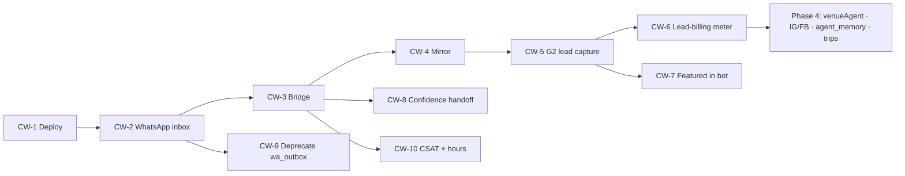

# Chatwoot Concierge — Roadmap

> Execution companion to [`prd-chatwoot.md`](prd-chatwoot.md). Four phases, dependency-ordered, MVP-first. **Ship WhatsApp + Rentals before anything else.** Each phase has a single milestone that proves it worked.
>
> **Guiding constraint:** don't over-engineer. Phase 1–2 reuse the agents, edge functions, and tables that already exist. New code is only built where a verified gap blocks revenue.

## Phase map at a glance

| Phase | Theme | Milestone (proof it worked) | Timeline | Gate to next |
|---|---|---|---|---|
| **1 — Foundation** | Stand up the pipes | First AI reply on WhatsApp from `conciergeAgent` | Week 1–3 | Bridge returns 200 on real inbound; build 0 |
| **2 — Core MVP** | Real leads + human handoff | First WhatsApp rental lead in Roberto's inbox | Week 3–6 | `leads` row `source='whatsapp'` + handoff works |
| **3 — Revenue MVP** | Turn convos into cash | First billed lead + first featured placement | Week 6–10 | A real dollar attributed to a chat |
| **4 — Advanced** | Multi-vertical + intelligence | Nightlife deposit paid in chat; IG inbox live | Post-MVP | — |

---

## Phase 1 — Foundation (Week 1–3)

**Objective:** stand up Chatwoot + WhatsApp + the bridge so an inbound WhatsApp message gets an AI reply from the same `conciergeAgent` that powers the web. No revenue yet — this is the pipe.

**Deliverables**

- **CW-1** — Chatwoot self-hosted on Hetzner (CPX31) via Coolify: Postgres 15, Redis 7, S3-compatible object storage, Traefik TLS at `chat.mdeai.co`, backups, `ENABLE_ACCOUNT_SIGNUP=false`.
- **CW-2** — WhatsApp Cloud API inbox: Meta App + WABA, permanent System User token, Phone Number ID; 4 templates submitted (`cart_recovery_v1`, `lead_followup_v1`, `reservation_confirmed_v1`, `venue_new_request_v1`); STOP handling wired to `whatsapp_subscriptions`.
- **CW-3** — `/api/chatwoot-bridge` (stateless Next.js route) + n8n router. Hardening built in from day one: HMAC verify (`X-Chatwoot-Signature`), self-loop guard (skip `agent_bot`), idempotency on `message.id`, 24h window check, timeout fallback.
- Teams created: `Concierge`, `Rentals/Brokers`, `Events`, `Sales/Ops`. Labels + required `intent` conversation attribute. Audit logs on.

**Dependencies**

- Meta WABA **business verification** (1–3 business days) — **start in parallel with CW-1**, do not let it block bridge code (build/test against the Meta test number, which allows 5 recipients).
- `.env.local` keys: `CHATWOOT_URL`, `CHATWOOT_API_TOKEN`, `CHATWOOT_BRIDGE_SECRET`, `CHATWOOT_WEBHOOK_HMAC_KEY`, `WHATSAPP_PHONE_NUMBER_ID`, `WHATSAPP_WABA_ID`, `WHATSAPP_API_TOKEN`, `CHATWOOT_WEBHOOK_VERIFY_TOKEN`.

**Risks & mitigations**

| Risk | Likelihood | Mitigation |
|---|---|---|
| WA business-verification delay blocks launch | Med | Parallelize with CW-1; develop against Meta test number |
| Open/looping bridge (missing HMAC/self-loop) | High if skipped | Build NFR2 hardening into CW-3 from the first commit, not later |
| 24h-window violation → WABA ban | High if skipped | Window check is a CW-3 acceptance criterion (Vitest with mocked window) |
| Self-host ops burden (Postgres/Redis/Sidekiq) | Low | Coolify manages it; backups + restore tested before go-live |

**Exit milestone:** a message to the MDE test number returns a `conciergeAgent` reply in Chatwoot. Bridge returns 200 on valid HMAC / 401 on invalid. `npm run build` exits 0; Vitest floor ≥ 401.

---

## Phase 2 — Core MVP (Week 3–6)

**Objective:** real rental leads with human handoff. This is the revenue-generating slice — one channel (WhatsApp), one vertical (Rentals).

**Deliverables**

- **CW-4** — Contact & conversation mirror: `chatwoot_contacts` + `chatwoot_conversations` (RLS `service_role_only`), `src/lib/chatwoot/mirror.ts`, one-way upsert on webhook events. Phone-match sets `mde_user_id` and writes `mde_contact_id` back to Chatwoot (cross-channel identity).
- **CW-5** — G2 lead capture: rental intent on WhatsApp calls the existing `chat-lead-capture` edge function with `source='whatsapp'`. `hasMinRentalPreferences` gate (needs `neighborhoods` + `max_rent`), 24h duplicate guard, label `stage:lead`.
- **CW-8** — Confidence handoff model: centralize `needs_human || confidence<0.6 || intent∈{payment,complaint,vip,complex}` → label `needs-human` + assign team + post AI-reasoning private note.
- **CW-10** — CSAT on resolve + business hours (after-hours bot-only message) + SLA-lite.
- Wire `conciergeAgent` + `rentalAgent` (both exist) through the bridge; bilingual reply path stubbed but English-only per Phase 1 language scope.

**Dependencies**

- Phase 1 complete (bridge live).
- Existing assets confirmed present: `rentalAgent`, grounding tools, `leads` table (`source` already permissive — `'whatsapp'` valid), `chat-lead-capture` (G2). **No new agent needed for rentals.**

**Risks & mitigations**

| Risk | Likelihood | Mitigation |
|---|---|---|
| Identity merge wrong (dup contacts across channels) | Med | Phone/email as join key; Chatwoot contact-merge; one Supabase contact |
| Handoff UX rough (human can't pick up context) | Med | AI posts a private note with budget + score before assigning |
| Low-quality leads billed | Med | `hasMinRentalPreferences` floor before capture; required `intent` attr |
| Mirror drift (stale vs Chatwoot) | Low | Mirror is analytics/context only; Chatwoot API is authoritative for live state |

**Exit milestone:** a WhatsApp rental conversation with budget + neighborhood creates a `leads` row `source='whatsapp'`, lands in Roberto's inbox with an AI private note, and a payment/complaint message escalates to `needs-human` instead of being auto-answered.

---

## Phase 3 — Revenue MVP (Week 6–10)

**Objective:** turn the conversations Phase 2 produces into actual income — and stop the legacy sender that would otherwise get the WABA banned.

**Deliverables**

- **CW-6** — Lead-billing meter (**new build** — the codebase has no `lead_billing`/meter). Bill qualified leads channel-agnostically (web + whatsapp at the same rate).
- **CW-7** — Featured listings in bot results: reuse the existing `sponsor.*` tables; surface featured first in rental/restaurant replies; attribute impressions.
- **CW-9** — Deprecate `wa_outbox`: stop the legacy outbound cron so Chatwoot is the **single** WhatsApp sender (prevents double-send + ban).
- Restaurant retainer attribution on `book_request` (clone of the rental pattern).
- WhatsApp re-engagement campaigns via Chatwoot Campaigns (opt-in only via `whatsapp_subscriptions`, honor STOP) — replaces the `wa_outbox` use case.
- Payment links in chat for the first paid vertical (reuse **G1** ticket checkout).

**Dependencies**

- Phase 2 leads flowing.
- Stripe Billing for the lead meter / retainers.
- `sponsor.*` tables (exist) for featured.

**Risks & mitigations**

| Risk | Likelihood | Mitigation |
|---|---|---|
| Double-send if `wa_outbox` not fully retired | High | CW-9 is a hard gate before any campaign send; one-sender rule |
| Pricing/packaging wrong (lead fee too high/low) | Med | Start with a single flat qualified-lead fee; iterate with broker feedback |
| Campaign spam → opt-out spike / ban | Med | Opt-in ledger + STOP + rate-tier awareness (250/day tier 1) |

**Exit milestone:** a qualified WhatsApp lead is **billed**, a **featured** listing appears first in a bot reply, and the legacy `wa_outbox` no longer sends.

---

## Phase 4 — Advanced (Post-MVP)

**Objective:** multi-vertical depth + intelligence — only after the rental loop is proven and earning.

**Deliverables**

- **`venueAgent`** (nightlife — **gap**) + in-chat Stripe **deposit** links; Stripe **Connect** for marketplace take-rate.
- **Instagram** inbox (Professional account + linked FB Page) and **Facebook Messenger** inbox — discovery channels that funnel to WhatsApp.
- **`agent_memory`** (pgvector): persist preferences ("vegetarian", "hates reggaeton", "budget $1,200") across sessions.
- **Trip bundles** + **relocation packages** (high-touch, human-assisted).
- Custom ops/revenue **dashboards** for Patricia; confidence-model tuning from Phase 2–3 data.

**Dependencies**

- Phase 3 revenue proven; human concierge capacity for high-touch flows.
- Stripe Connect onboarding for venues.

**Risks & mitigations**

| Risk | Likelihood | Mitigation |
|---|---|---|
| Marketplace complexity (Connect, payouts, refunds) | High | Defer until rental cash flow funds it; one vertical at a time |
| Over-automation kills the human trust differentiator | Med | Keep handoff for VIP/complex; automate nudges, not relationships |
| Memory quality (bad recall → wrong recs) | Med | Scope `agent_memory` to explicit, user-stated prefs first |
| IG/FB window + policy differences | Med | Reuse the same window discipline; per-channel template sets |

**Exit milestone:** a nightlife deposit is paid inside a WhatsApp thread and an Instagram DM produces a lead that funnels to WhatsApp.

---

## Linear-ready task table

Project **Growth & Operations** · prefix **GRW**. P0 = MVP-blocking.

| ID | Title | Phase | Depends on | Blocks | Effort | Priority |
|---|---|---|---|---|---|---|
| **CW-1** | Deploy Chatwoot (Hetzner/Coolify) | 1 | MVP-exit | CW-2 | 3–5 d | P0 |
| **CW-2** | WhatsApp Cloud API inbox + templates | 1 | CW-1 | CW-3, CW-9 | 3–5 d | P0 |
| **CW-3** | `/api/chatwoot-bridge` (hardened) | 1 | CW-2 | CW-4, CW-8, CW-10 | 1–2 wk | P0 |
| **CW-4** | Contact & conversation mirror | 2 | CW-3 | CW-5 | 3–5 d | P0 |
| **CW-5** | G2 lead capture hook (`source='whatsapp'`) | 2 | CW-4 | CW-6, CW-7 | 3–5 d | P0 |
| **CW-8** | Confidence handoff model | 2 | CW-3 | — | 2–3 d | P1 |
| **CW-10** | CSAT + business hours + SLA-lite | 2 | CW-3 | — | 2–3 d | P2 |
| **CW-6** | Lead-billing meter (**new**) | 3 | CW-5 | — | 3–5 d | P1 |
| **CW-7** | Featured listings in bot (`sponsor.*`) | 3 | CW-5 | — | 2–3 d | P1 |
| **CW-9** | Deprecate `wa_outbox` (single sender) | 3 | CW-2 | campaigns | 1–2 d | P1 |
| **CW-11** | `venueAgent` + in-chat deposit (Connect) | 4 | CW-6 | — | 1–2 wk | P2 |
| **CW-12** | Instagram + Facebook inboxes | 4 | CW-3 | — | 1 wk | P2 |
| **CW-13** | `agent_memory` (pgvector) | 4 | CW-4 | — | 1 wk | P2 |

---

## What NOT to build yet

- **Instagram / Facebook** — Phase 4. WhatsApp first; IG/FB only funnel to it.
- **In-chat card payments / Stripe Connect** — Phase 3+ (rentals bill via invoice, no rail).
- **`venueAgent` / nightlife deposits** — Phase 4 (needs new agent + Connect).
- **Trip bundles / relocation** — Phase 4 (high-touch).
- **Chatwoot Captain / native AI** — never (Mastra is the brain; Captain is Enterprise + OpenAI).
- **Custom dashboards** — Phase 4 (SQL on the mirror tables covers Phase 2–3).

> **Bottom line:** Phases 1–2 are pure reuse + glue; the only net-new code before revenue is the hardened bridge (CW-3) and the mirror (CW-4). The first net-new *business* logic is the lead-billing meter (CW-6) in Phase 3. Ship WhatsApp + Rentals, bill a lead, then clone the pattern.
