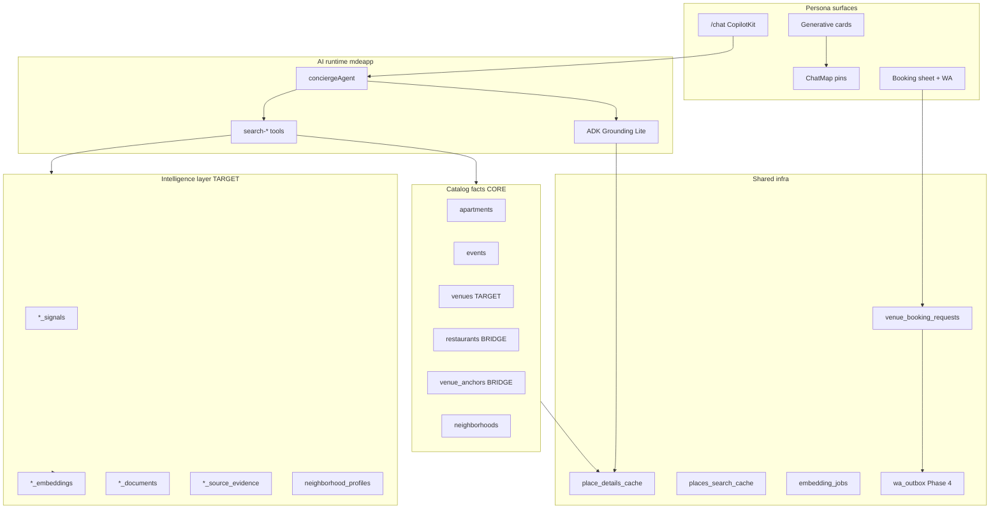
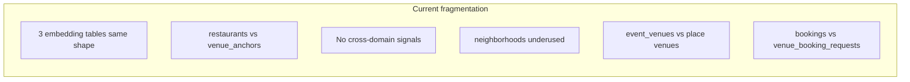
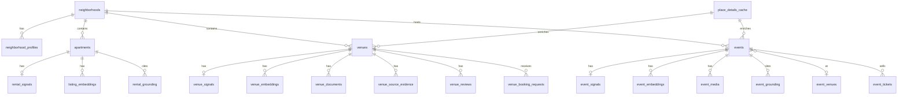
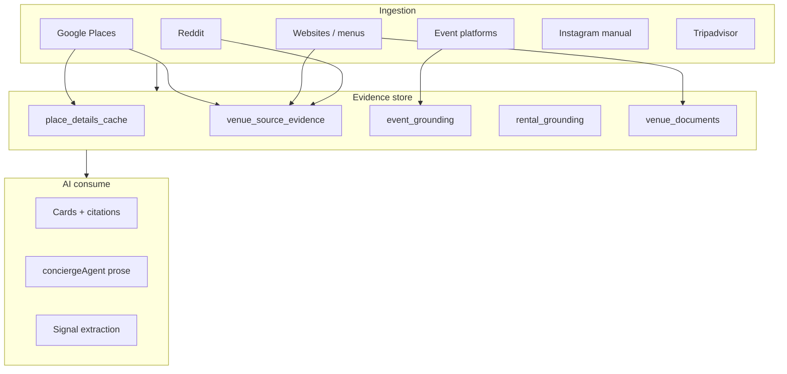
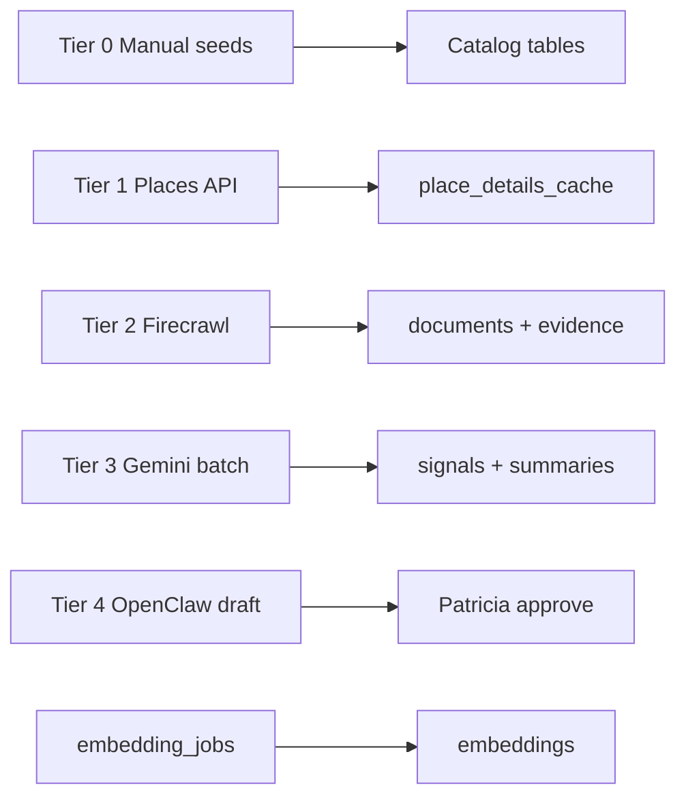
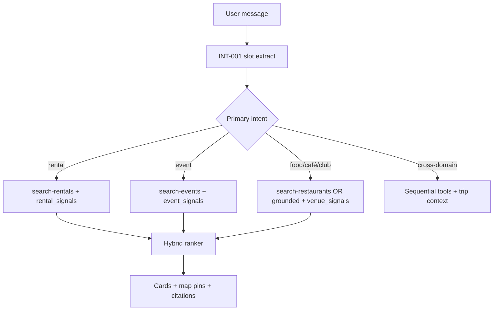
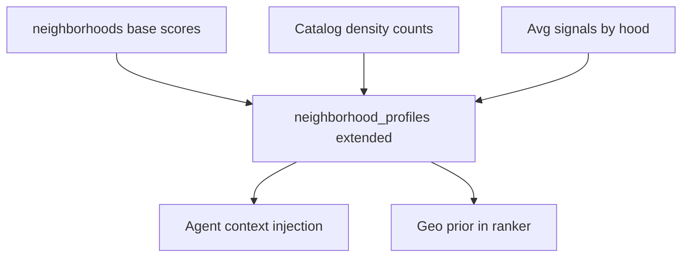
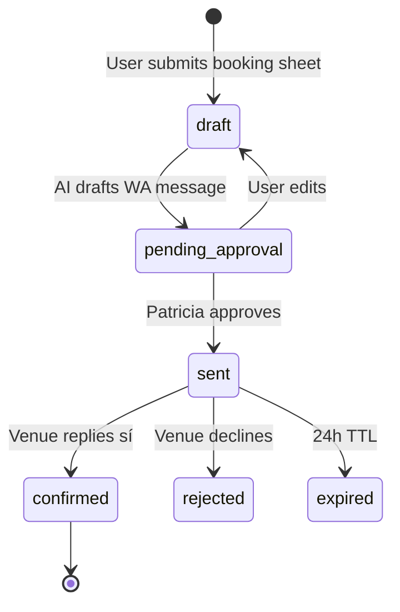
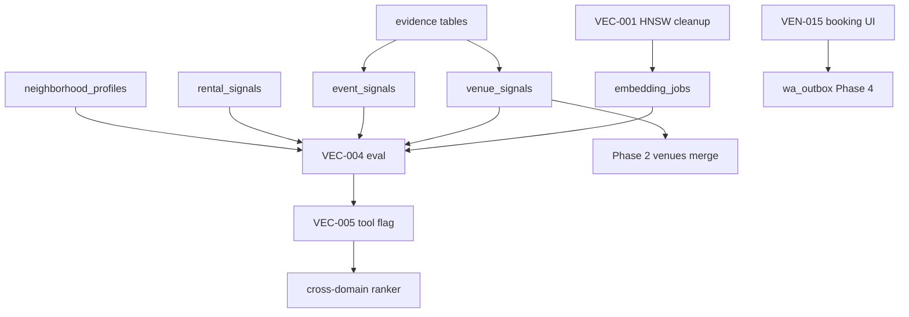

# Unified Medellín AI-native data intelligence plan

> **One discovery brain, four catalog domains, shared intelligence satellites.**
> Google Maps answers *where*. mdeai answers *where you should go tonight — and why*.

**Scope:** events · rentals · venues (cafés, restaurants, rooftops, bars, nightlife, gyms, coworking, attractions, wellness, shopping) · neighborhoods · tourism · local discovery.

**Neighborhoods (priority):** Laureles · El Poblado · Provenza · Envigado · Sabaneta · Manila · Astorga · Centro.

---

## Executive summary

| Question | Answer |
|----------|--------|
| One unified system? | **Yes** — shared **intelligence pattern** (`*_signals`, `*_embeddings`, `*_documents`, `*_source_evidence`) over **domain catalogs** that stay separate where commerce/RLS differ. |
| One mega-table for everything? | **No** — `events` (Stripe tickets), `apartments` (rentals), `venues` (places) have different lifecycles. Unify **search + ranking + grounding**, not checkout. |
| MVP strategy | **Bridge:** keep live catalogs; add intelligence satellites + `embedding_jobs`; patch gaps; defer `venues` merge + `semantic_embeddings` unification to Phase 2. |
| Biggest moat | **`venue_signals` + `event_signals` + `rental_signals` + `neighborhood_profiles`** with evidence-backed scores — not more rows. |

### Live inventory (Supabase 2026-05-31)

| Domain | Catalog table | Rows | Embeddings | Signals | Tool |
|--------|---------------|-----:|------------|---------|------|
| Rentals | `apartments` | 44 | `listing_embeddings` 44 | ❌ | `search-rentals` |
| Events | `events` | 49 pub | `event_embeddings` 43 | ❌ | `search-events` |
| Restaurants | `restaurants` | 43 | `restaurant_embeddings` 43 | ❌ | `search-restaurants` |
| Cafés / nightlife | `venue_anchors` | 30 | ❌ | ❌ | `search-grounded-places` |
| Neighborhoods | `neighborhoods` | 12 | ❌ | partial (`metadata`) | SQL join / agent |
| Grounding cache | `place_details_cache` | 57 | — | — | `/api/places/detail` |
| Venue booking | `venue_booking_requests` | 0 | — | — | VEN-015+ |
| Trips / saves | `trips`, `saved_places` | low | ❌ | — | Phase 2 |

**Neighborhoods live:** Laureles, El Poblado, Provenza, Envigado, Sabaneta, Manila, Centro (+ Belén, La Florida, Los Colores, Laureles-Estadio, Envigado Centro). **Missing:** Astorga — add in DATA seed.

---

## 1. Architecture audit

### 1.1 System layers (current → target)



### 1.2 Maps architecture (mdeapp)

| Pin category | Source | Card component |
|--------------|--------|----------------|
| `grounded` | ADK + `venue_anchors` | `CafeResultCard`, PlaceResultCard |
| `rental` | `apartments` | `RentalCard` |
| `event` | `events` | `EventCard` |
| `restaurant` / nightlife | Planned VEN-009–013 | Restaurant / Nightlife panels |

**Invariant:** One `MapContext`, `mergePinsByCategory`, `RichCardResultsRegistrar` suppresses generic map list. Field masks on every Places call.

### 1.3 Grounding architecture

| Path | When | Source of truth |
|------|------|-----------------|
| **SQL catalog** | Curated inventory (restaurants, anchors, events, apartments) | Postgres RLS |
| **Places cache** | Detail panel enrich | `place_details_cache` |
| **ADK Grounding Lite** | Long-tail / unseeded discovery | Google + citations |
| **Evidence rows** | AI claims in prose/cards | `*_source_evidence` |

**Rule:** LLM never invents hours, phone, price, or availability. Missing fact → clarify or grounding fetch.

### 1.4 Vector setup (live)

| Table | Rows | Issue |
|-------|-----:|-------|
| `listing_embeddings` | 44 | Duplicate HNSW indexes (VEC-001) |
| `event_embeddings` | 43 | Same |
| `restaurant_embeddings` | 43 | Same |
| Anchor embeddings | 0 | Not started |
| Unified `semantic_embeddings` | — | Phase 2 |

RPCs exist: `semantic_search_listings`, `semantic_search_events`, `semantic_search_restaurants`, `hybrid_search_*`.

### 1.5 Booking / contact flows

| Flow | Table / edge | Status |
|------|--------------|--------|
| Venue dinner/café request | `venue_booking_requests` | Schema live; UI VEN-015+ |
| Rental lead | `chat-lead-capture` → `leads` | Edge live |
| Event tickets | Stripe → `event_orders` | MVP path |
| WhatsApp send | `wa_outbox` | Phase 4; draft → Patricia approve |
| Fake instant booking | — | **Never ship** |

---

## 2. Fragmentation & duplicate schemas



| Fragment | Severity | MVP fix | Phase 2 fix |
|----------|----------|---------|-------------|
| `restaurants` + `venue_anchors` | High | Polymorphic `venue_signals` | Merge → `venues` |
| 3× embedding tables | Medium | Keep; add `embedding_jobs` | `semantic_embeddings(entity_type, entity_id)` |
| No `event_signals` / `rental_signals` | Critical | Add satellite tables | Same |
| `neighborhoods` only 3 scores | Medium | Extend → `neighborhood_profiles` | Auto recompute pipeline |
| `event_venues` (7 rows) | Info | Keep — host event location spine | Link optional `venue_id` |
| `bookings` generic vs `venue_booking_requests` | Low | Keep separate until WA confirm | Unified `bookings` view |
| `listing_embeddings` vs target `rental_embeddings` | Naming | Alias in docs; no rename MVP | Rename or unified table |
| No gym/spa/attraction catalog | Medium | `venue_type` in target `venues` | Seed + Places |

**Do NOT create:** `cafes`, `nightclubs`, `gyms` tables. **Do NOT** merge `events` into `venues`.

---

## 3. Canonical data architecture

### 3.1 Design principles

1. **Catalog = facts** (Postgres, RLS, deterministic tools write).
2. **Intelligence = scores + vectors + evidence** (batch/queue, versioned, confidence).
3. **Google Places = geo fact layer** (cache, field masks).
4. **Gemini = enrich + rank + summarize** (never canonical without evidence).
5. **WhatsApp = human-in-loop booking** (Medellín reality).
6. **One search orchestrator** in Mastra; domain tools stay until unified RPC ships.

### 3.2 Entity relationship (target)



### 3.3 VENUES (cafés · restaurants · rooftops · bars · nightlife · gyms · coworking · attractions · wellness · shopping)

**Target catalog:** `public.venues` — see [`../../venues/data/venue-dataplan.md`](../../venues/data/venue-dataplan.md) for full DDL, bridge strategy, and MVP patches.

```text
venue_type ∈ cafe | restaurant | nightclub | bar | rooftop | lounge | speakeasy
           | coworking_cafe | brunch | gym | spa | attraction | shopping | live_music
tags[]     cross-cutting: wifi, date-night, hidden-gem, salsa, rooftop, tourist-friendly
```

**MVP bridge (live now):**

```text
restaurants     → venue_type=restaurant (full rows + FTS + embeddings)
venue_anchors   → venue_type=cafe|nightclub|bar (curated place_id)
place_details_cache → all kinds detail enrich
```

**Intelligence satellites (shared pattern):**

| Table | Purpose |
|-------|---------|
| `venue_signals` | Vibe scores (see §4.1) |
| `venue_embeddings` | Semantic / like-this-place |
| `venue_documents` | Menus, reviews, blurbs for embed |
| `venue_source_evidence` | Citations (Google, web, Reddit, IG) |
| `venue_reviews` | Normalized review snippets (optional MVP) |
| `venue_booking_requests` | WA workflow (**live**) |

### 3.4 EVENTS (ticketed discovery + host commerce)

**Keep existing commerce spine** — do not refactor for MVP exit.

| Table | Role | MVP |
|-------|------|-----|
| `events` | Catalog + publish lifecycle | ✅ Live |
| `event_tickets` | Stripe tiers | ✅ Live |
| `event_orders` / `event_attendees` | Checkout | ✅ Live |
| `event_venues` | Host venue link (7 rows) | ✅ Keep |
| `event_media_assets` | Images | ✅ Live |
| `event_embeddings` | Semantic search | ✅ Live |

**Add (intelligence):**

```sql
-- event_signals (MVP)
CREATE TABLE public.event_signals (
  event_id uuid PRIMARY KEY REFERENCES public.events(id) ON DELETE CASCADE,
  hype_score numeric(4,3),
  local_vs_tourist numeric(4,3),  -- 0=tourist, 1=local
  music_energy numeric(4,3),
  networking_quality numeric(4,3),
  exclusivity numeric(4,3),
  fashion_score numeric(4,3),
  nightlife_score numeric(4,3),
  safety_score numeric(4,3),
  evidence jsonb NOT NULL DEFAULT '{}',
  confidence numeric(4,3) NOT NULL DEFAULT 0.5,
  updated_at timestamptz NOT NULL DEFAULT now()
);

-- event_grounding (citations separate from event row)
CREATE TABLE public.event_grounding (
  id uuid PRIMARY KEY DEFAULT gen_random_uuid(),
  event_id uuid NOT NULL REFERENCES public.events(id) ON DELETE CASCADE,
  source_type text NOT NULL,  -- google | instagram | promoter | website
  source_url text,
  claim text NOT NULL,
  confidence numeric(4,3) DEFAULT 0.5,
  checked_at timestamptz DEFAULT now()
);
```

**Defer Phase 2:** `event_instances` (recurring series) until host calendar ships.

### 3.5 RENTALS (Camila — `apartments` catalog)

**Catalog:** `public.apartments` (44 rows) — treat as **`rentals` in product language**, not a rename for MVP.

| Table | Role |
|-------|------|
| `apartments` | Listing facts, geo, pricing, amenities |
| `listing_embeddings` | Vector search (**→ `rental_embeddings` in Phase 2**) |
| `neighborhoods` | Join on `apartments.neighborhood` |
| `rental_search_sessions` | Analytics |
| `rental_applications` / `showings` | Lead funnel |

**Add:**

```sql
CREATE TABLE public.rental_signals (
  apartment_id uuid PRIMARY KEY REFERENCES public.apartments(id) ON DELETE CASCADE,
  digital_nomad_score numeric(4,3),
  walkability numeric(4,3),
  nightlife_access numeric(4,3),
  quiet_score numeric(4,3),
  luxury_score numeric(4,3),
  workspace_score numeric(4,3),
  safety_score numeric(4,3),
  value_score numeric(4,3),
  tourist_density numeric(4,3),
  local_authenticity numeric(4,3),
  evidence jsonb NOT NULL DEFAULT '{}',
  confidence numeric(4,3) NOT NULL DEFAULT 0.5,
  updated_at timestamptz NOT NULL DEFAULT now()
);

CREATE TABLE public.rental_grounding (
  id uuid PRIMARY KEY DEFAULT gen_random_uuid(),
  apartment_id uuid NOT NULL REFERENCES public.apartments(id) ON DELETE CASCADE,
  source_type text NOT NULL,
  source_url text,
  extracted_text text,
  confidence numeric(4,3) DEFAULT 0.5,
  checked_at timestamptz DEFAULT now()
);
```

**Availability intelligence (MVP):** use `available_from`, `available_to`, `price_daily` on row — no fake Airbnb sync. Phase 2: `rental_availability_snapshots` if scrape approved.

### 3.6 NEIGHBORHOODS

**Live:** `neighborhoods` with `safety_score`, `walkability_score`, `nomad_score`, `metadata` jsonb.

**Extend → `neighborhood_profiles`:**

```sql
CREATE TABLE public.neighborhood_profiles (
  neighborhood_id uuid PRIMARY KEY REFERENCES public.neighborhoods(id) ON DELETE CASCADE,
  nightlife_density numeric(4,3),
  safety_perception numeric(4,3),
  digital_nomad_friendliness numeric(4,3),
  tourist_density numeric(4,3),
  noise_level numeric(4,3),
  luxury_index numeric(4,3),
  local_authenticity numeric(4,3),
  rooftop_density numeric(4,3),
  transit_quality numeric(4,3),
  food_quality numeric(4,3),
  gym_coworking_proximity numeric(4,3),
  summary text,
  evidence jsonb NOT NULL DEFAULT '{}',
  updated_at timestamptz NOT NULL DEFAULT now()
);
```

**Seed priority:** Provenza → El Poblado → Laureles → Envigado → Sabaneta → Manila → **Astorga (new)** → Centro.

---

## 4. AI signal catalog

### 4.1 Venue signals

| Signal | Example query |
|--------|---------------|
| `quiet_score` | quiet café to work from in Laureles |
| `rooftop_score` | quiet rooftop dinner in Provenza |
| `nightlife_score` | hidden salsa bar locals go to |
| `digital_nomad_score` | best coworking cafe in Laureles |
| `wifi_score` | strong wifi café |
| `hidden_gem_score` | hidden local brunch spot |
| `cocktail_score` | live music venue with cocktails |
| `brunch_score` | best brunch before coworking |
| `local_authenticity_score` | local not touristy |
| `touristy_score` | inverse hidden gem |
| `date_night_score` | romantic dinner skyline view |

### 4.2 Event signals

| Signal | Example query |
|--------|---------------|
| `hype_score` | fashion events tonight in Poblado |
| `local_vs_tourist` | local scene vs expat party |
| `music_energy` | live music tonight |
| `networking_quality` | professional mixer |
| `exclusivity` | invite-only vibe |
| `fashion_score` | fashion week adjacent |
| `nightlife_score` | after-party energy |
| `safety_score` | safe venue for solo tourist |

### 4.3 Rental signals

| Signal | Example query |
|--------|---------------|
| `digital_nomad_score` | digital nomad rental near gyms and cafes |
| `walkability` | walkable to restaurants |
| `nightlife_access` | luxury rental with walkable nightlife |
| `quiet_score` | quiet street not club strip |
| `luxury_score` | premium building |
| `workspace_score` | desk + fast wifi |
| `safety_score` | safe for solo female traveler |
| `value_score` | under $80/night Laureles |
| `tourist_density` | expat-heavy vs local |
| `local_authenticity` | local neighborhood feel |

---

## 5. MVP vs advanced intelligence

### MVP (Phase 1 — ship before MVP exit)

| Ship | Defer |
|------|-------|
| `venue_signals` (polymorphic bridge) | Full `venues` migration |
| `event_signals` top 49 events | `event_instances` |
| `rental_signals` top 44 listings | Airbnb/Booking scrape |
| `neighborhood_profiles` 8 priority hoods | Auto OSM walkability |
| `venue_source_evidence` + `event_grounding` + `rental_grounding` | TikTok auto-crawl |
| `embedding_jobs` queue | Unified `semantic_embeddings` |
| Patch `restaurants` (neighborhood, nullable price) | PostGIS geography |
| VEC-001 duplicate HNSW cleanup | Vision AI on photos |
| DATA-006 golden queries extended | User taste vectors |
| `venue_booking_requests` + WA draft flow | Instant booking |
| Fast-path + agent search (live) | Single `search-medellin` mega-tool |

### Advanced (Phase 2–3)

| Capability | Depends on |
|------------|------------|
| Unified `venues` catalog | MVP signals populated |
| `semantic_embeddings(entity_type, entity_id)` | VEC-004 eval |
| Cross-domain rank: “dinner then club then event” | INT-001 slots + orchestrator |
| Like-this-place across venues/events | Unified vectors |
| Hidden gem detector | Reddit + evidence pipeline |
| Vision: rooftop/crowd/lighting | Gemini batch |
| Tourism `attractions` seed 100+ | Places + Firecrawl |
| Trip planner merges saves + bookings | DATA-028 trip_items |
| Taste memory per user | Auth + INT-010 |

---

## 6. Embeddings & vector strategy

### 6.1 MVP (keep 3 tables + queue)

```text
listing_embeddings   ← apartments
event_embeddings     ← events
restaurant_embeddings ← restaurants
(+ venue_embeddings polymorphic for anchors Phase 1B)
```

**Rules:**

- **No sync trigger on row update** → `embedding_jobs(status, entity_type, entity_id, content_hash)`
- **One HNSW per table** (VEC-001 drop duplicates)
- **Dimension lock** — verify 768 vs 1536 before new indexes (VEC-002)
- **Model registry** — `gemini` skill; store `model` column on embed rows

### 6.2 Hybrid search pattern

```text
score = w_vec * cosine_sim
      + w_fts * ts_rank
      + w_sig * signal_match(query_slots)
      + w_geo * neighborhood_fit
      + w_time * open_now / event_start proximity
      - w_tourist * touristy_penalty
```

Weights: MVP static heuristics → Phase B learned from DATA-006 eval labels.

### 6.3 Phase 2 unified table

```sql
CREATE TABLE public.semantic_embeddings (
  id uuid PRIMARY KEY DEFAULT gen_random_uuid(),
  entity_type text NOT NULL CHECK (entity_type IN (
    'venue', 'event', 'rental', 'neighborhood', 'document'
  )),
  entity_id uuid NOT NULL,
  content_type text NOT NULL,
  content text NOT NULL,
  embedding vector(768) NOT NULL,
  model text NOT NULL,
  content_hash text NOT NULL,
  metadata jsonb DEFAULT '{}',
  created_at timestamptz DEFAULT now(),
  UNIQUE (entity_type, entity_id, content_type, model)
);
CREATE INDEX semantic_embeddings_hnsw ON semantic_embeddings
  USING hnsw (embedding vector_cosine_ops);
```

Migrate via backfill job; keep old tables as views until cutover.

---

## 7. Grounding & evidence system



| Claim type | Required evidence |
|------------|-------------------|
| Hours, phone, address | Places cache or `google_place_id` row |
| “Best rooftop in Provenza” | `venue_signals.rooftop_score` + ≥1 citation |
| “Event tonight 9pm” | `events.event_start_time` + optional `event_grounding` |
| “Quiet street” | `rental_signals.quiet_score` + review snippet |
| Price | Row field or Places — never LLM-only |

**Web grounding events:** `search-web-grounded-events` only when SQL returns &lt;3 rows or user asks verify online (live concierge rule).

---

## 8. Ingestion architecture



| Source | Tier | MVP use | Domain |
|--------|------|---------|--------|
| Google Places | 1 | Seed verify, cache cron, field masks | All venues |
| Manual CSV/JSON | 0 | `tasks/venues/seeds/*` | Cafés, clubs, restaurants |
| Websites / menus | 2 | Firecrawl → `venue_documents` | Restaurants, cafés |
| Event platforms | 2 | Manual + promoter URLs → `event_grounding` | Events |
| Tripadvisor | 2 | Manual evidence rows | Venues |
| Reddit | 2 | Firecrawl search → hidden gems | Venues |
| Instagram | 2 | Manual URL + screenshot evidence | Vibe/popularity |
| TikTok/Reels | 3 | Trend tags only | Phase 2 |
| Airbnb / Booking | 3 | **No scrape MVP** — conflicts with rental inventory | — |
| WhatsApp | 0 | Booking outbound only | venue_booking_requests |

**Cost controls:** Places field masks · cache TTL · `embedding_jobs` rate limit · batch Gemini off-peak.

---

## 9. AI enrichment pipeline

```text
1. INGEST    Seed / Places / crawl → catalog row + cache
2. EVIDENCE  Write *_source_evidence / *_grounding
3. DOCUMENT  Chunk menus, reviews → *_documents
4. SUMMARIZE Gemini → intelligence_summary on catalog row
5. SIGNALIZE Structured JSON → *_signals (confidence + evidence refs)
6. EMBED     embedding_jobs → *_embeddings
7. EVALUATE  DATA-006 golden queries + human labels
8. SHIP      Feature flag vector rerank in tools
```

| Enrichment | MVP | Advanced |
|------------|-----|----------|
| Review summarization | Top 20 venues/restaurants | All catalog |
| Vibe extraction | Rule + LLM from tags/reviews | Vision on photos |
| Hidden gem detection | Low review count + high local_authenticity | Reddit pipeline |
| Rooftop detection | Places types + tags + manual | Vision |
| Nightlife detection | `venue_anchors.kind` + tags | Event cross-link |
| Neighborhood summary | One paragraph per hood | Auto refresh monthly |

---

## 10. Ranking & recommendation engine

### 10.1 Query routing (conversational)



### 10.2 Example query → system path

| Query | Slots | Primary path | Signals used |
|-------|-------|--------------|--------------|
| quiet rooftop dinner in Provenza | hood, rooftop, date, quiet | `search-restaurants` + filter Provenza | `rooftop_score`, `date_night_score`, `quiet_score` |
| best coworking cafe in Laureles | hood, nomad, cafe | `search-grounded-places` + anchors | `digital_nomad_score`, `wifi_score` |
| fashion events tonight in Poblado | hood, tonight, fashion | `search-events` dateWindow + FTS | `fashion_score`, `hype_score` |
| digital nomad rental near gyms and cafes | nomad, proximity | `search-rentals` Laureles/Poblado | `digital_nomad_score`, `workspace_score`, `walkability` |
| hidden salsa bar locals go to | local, nightlife, music | `venue_anchors` nightclub + grounding | `local_authenticity`, `nightlife_score`, `hidden_gem_score` |
| luxury rental with walkable nightlife | luxury, nightlife | `search-rentals` Poblado/Provenza | `luxury_score`, `nightlife_access` |
| best brunch before coworking | brunch, nomad | café anchors morning + nomad scores | `brunch_score`, `digital_nomad_score` |
| live music venue with cocktails | music, cocktails | restaurant/club search or anchors | `cocktail_score`, `music_energy` (event if tonight) |

### 10.3 “Like this place” retrieval

```text
1. User selects venue/event/rental card
2. Fetch anchor embedding (entity_type + entity_id)
3. ANN search same entity_type (then cross-type Phase 2)
4. Re-rank with signal similarity + neighborhood distance
5. Return 3–5 cards with “Similar vibe” label
```

---

## 11. Neighborhood intelligence engine



**MVP computation (batch job, not realtime OSM):**

```text
nightlife_density  = count(venue_anchors nightclub) / km² proxy
food_quality       = avg(restaurants.rating) in hood
gym_coworking_proximity = count(venues gym+coworking) / catalog
digital_nomad_friendliness = avg(rental_signals.digital_nomad, venue_signals.digital_nomad)
```

**Agent use:** inject `neighborhood_profiles.summary` into working memory when user names a hood.

---

## 12. WhatsApp / contact / booking workflows



| Domain | Contact path | Table |
|--------|--------------|-------|
| Venue reservation | WA handoff | `venue_booking_requests` |
| Rental viewing | Lead form | `leads` via `chat-lead-capture` |
| Event tickets | Stripe | `event_orders` |
| General concierge | In-chat only | — |

**Statuses (`venue_booking_requests`):** `draft` · `pending_approval` · `sent` · `confirmed` · `rejected` · `expired`

Tasks: VEN-015–023 · Phase 4 `wa_outbox` dispatch.

---

## 13. Search architecture

| Mode | Implementation | MVP |
|------|----------------|-----|
| Keyword / FTS | `fts_content`, `tsvector` on catalogs | ✅ |
| Structured filters | Tool params (hood, price, dateWindow) | ✅ |
| Semantic | pgvector cosine + RPC | ✅ flag-gated |
| Hybrid | RPC `hybrid_search_*` | Phase 1B |
| Conversational | Mastra slots → tool params | INT-001 |
| Cross-domain | Multi-tool orchestration | Phase 2 |
| Grounding fallback | ADK when SQL sparse | ✅ |

**Anti-patterns:** LLM-only ranking · unbounded Places calls · sync embed on hot path.

---

## 14. Medellín-specific intelligence layer

| Local factor | Data expression |
|--------------|-----------------|
| Provenza vs Poblado nightlife | `neighborhood_profiles.nightlife_density` |
| Digital nomad hubs (Laureles, Manila) | `nomad_score`, café `wifi_score` |
| Salsa / reggaeton | Tags on anchors + `event_signals.music_energy` |
| WhatsApp-first booking | No OpenTable fiction |
| Weekend event density | Bogotá TZ date windows on `search-events` |
| Expat vs local | `local_authenticity` − `touristy` on venues/rentals/events |
| Safety perception | `neighborhood_profiles.safety_perception` + rental `safety_score` |
| Combo nights | Rank restaurant `cocktail_score` + nearby `nightlife_score` + events `nightlife_score` |

**Language:** Phase 1 English UI; Colombian place names in data as stored (Provenza, Laureles, Envigado).

---

## 15. MVP roadmap (ordered)

| # | Work | Task IDs | Verify |
|---|------|----------|--------|
| 1 | VEC-001 drop duplicate HNSW | VEC-001 | `pg_indexes` 1 HNSW/table |
| 2 | Patch `restaurants` neighborhood/nullable | **DATA-039** | SQL check |
| 3 | `embedding_jobs` queue | **DATA-040** | job completes <30s |
| 4 | `venue_signals` polymorphic + seed 30 | **DATA-041** | golden café/restaurant query |
| 5 | `event_signals` seed published events | **DATA-042** | fashion/hype query |
| 6 | `rental_signals` seed 44 | **DATA-043** | nomad rental query |
| 7 | `neighborhood_profiles` + Astorga seed | **DATA-044** | 8 hood rows |
| 8 | Evidence tables + 1 citation/entity MVP | **DATA-045** | card shows source |
| 9 | VEN booking persist + WA draft | VEN-015–022 | Playwright sheet |
| 10 | VEC-004 eval 20 queries | VEC-004 | labeled CSV |
| 11 | Hybrid flag in one tool | SEARCH-001 + VEC-005 | A/B latency |
| 12 | Extend DATA-006 golden set | **DATA-046** | 10/10 signal SQL pass |

> **ID note:** MIS v1.1 remapped IDs vs v1.0 draft — canonical table in [`intelligence-plan.md`](../intelligence/intelligence-plan.md#canonical-data-ids-mis-v11--overrides-data-intelligence-planmd-15).

---

## 16. Advanced roadmap

| Quarter | Deliverable |
|---------|-------------|
| Phase 2 Q1 | `venues` migration · `semantic_embeddings` · unified hybrid RPC |
| Phase 2 Q2 | Cross-domain orchestrator · like-this-place · trip_items venue links |
| Phase 2 Q3 | Reddit/TikTok enrichment · hidden gem batch · vision scores |
| Phase 3 | Tourism attractions 200+ · gym/spa/coworking seeds · user taste vectors |

---

## 17. Dependency graph



**Blocks MVP exit:** None of the intelligence tables block PAY/EVT gates — run **parallel** after EVT-013 green.

---

## 18. Migration recommendations

### Phase 1 migrations (safe)

| Migration | Content |
|-----------|---------|
| `YYYYMMDD_embedding_jobs.sql` | Queue table + RLS |
| `YYYYMMDD_venue_signals_mvp.sql` | Polymorphic FK bridge |
| `YYYYMMDD_event_signals.sql` | 1:1 events |
| `YYYYMMDD_rental_signals.sql` | 1:1 apartments |
| `YYYYMMDD_neighborhood_profiles.sql` | 1:1 neighborhoods |
| `YYYYMMDD_evidence_*.sql` | venue + event + rental grounding |
| `YYYYMMDD_restaurants_patch.sql` | neighborhood, nullable price/hours |
| `YYYYMMDD_vec001_drop_dup_hnsw.sql` | CONCURRENTLY drop dup indexes |

### Phase 2 migrations

| Migration | Content |
|-----------|---------|
| `venues_unified.sql` | CREATE + backfill from restaurants + anchors |
| `semantic_embeddings.sql` | Unified vector table + backfill |
| `catalog_views.sql` | `restaurants_v1`, `venue_anchors_v1` as views |

**Never:** drop `events` ticket tables · expose service-role to client · anon write on catalogs.

---

## 19. Production risks

| Risk | Mitigation |
|------|------------|
| Big-bang `venues` breaks tools | Phase 2 only; views during transition |
| AI hallucinated facts | Evidence required; Places cache |
| Embed cost spike | Job queue + content_hash dedup |
| Places API bill | Field masks + cache TTL |
| Stale event dates | Bogotá TZ + seed refresh cron |
| Low inventory (44/43/49) | Seeds parallel to intelligence |
| Duplicate embedding indexes | VEC-001 immediately |
| WhatsApp without approval | Patricia gate + `pending_approval` |
| Cross-domain query latency | Fast-path SQL before LLM (LESSONS) |

---

## 20. Scalability

| Scale | Strategy |
|-------|----------|
| &lt;1k entities/domain | Postgres + pgvector HNSW per domain |
| 1k–10k | Partition embeddings by `entity_type`; read replica for search |
| 10k+ | Consider dedicated vector service — **not Phase 1** |
| Ingestion | `embedding_jobs` worker horizontal scale via edge/cron |

---

## 21. Naming consistency audit

| Current | Target | Action |
|---------|--------|--------|
| `apartments` | rentals (product) | Document alias; no rename MVP |
| `listing_embeddings` | `rental_embeddings` | Phase 2 rename or unified table |
| `restaurants` + `venue_anchors` | `venues` | Phase 2 merge |
| `restaurant_embeddings` | `venue_embeddings` | Phase 2 |
| `restaurant_signals` (in docs) | `venue_signals` | Use venue_* in all new DDL |
| `CAFE-001` | `VEN-015` | Archived |
| `event_venues` | host venue spine | **Keep name** — not tourist catalog |
| `bookings` | generic ledger | Keep separate from `venue_booking_requests` |
| `ai_generated` source | `ai_enriched` | Enum cleanup |
| DATA task IDs | DATA-040+ for intelligence | New rows in INDEX-data |

---

## 22. Related documents

| Doc | Role |
|-----|------|
| [`../../venues/data/venue-dataplan.md`](../../venues/data/venue-dataplan.md) | Venue catalog + signals depth |
| [`supabase-plan.md`](supabase-plan.md) | M1–M3 migrations (live) |
| [`../audit-supabase.md`](../audit-supabase.md) | Live audit snapshot |
| [`data-plan.md`](data-plan.md) | Diagrams + workflow sequences |
| [`../tasks-data/data-002-three-kind-contract.md`](../tasks-data/data-002-three-kind-contract.md) | Café / restaurant / nightclub routing |
| [`../../venues/seeds/golden-queries-venues.json`](../../venues/seeds/golden-queries-venues.json) | Eval queries |
| [`../../vector/VEC-001-pgvector-inventory-and-duplicate-index-plan.md`](../../vector/VEC-001-pgvector-inventory-and-duplicate-index-plan.md) | Index cleanup |

---

## Summary

**Build ONE Medellín discovery intelligence system** by sharing the **signals · evidence · documents · embeddings · jobs** pattern across **events**, **rentals (`apartments`)**, and **venues (restaurants + cafés + nightclubs + future types)** — while keeping **commerce catalogs separate** where Stripe and RLS require it.

**MVP:** intelligence satellites + embedding queue + neighborhood profiles + evidence — on top of live 44/43/49/30 row catalogs.

**Phase 2:** unified `venues` + `semantic_embeddings` + cross-domain ranker.

**Moat:** evidence-backed scores that answer *why Provenza tonight* — not another Places wrapper.
