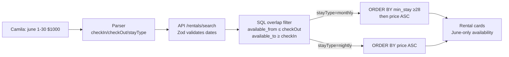

# INT-006 — Rental availability date filters

## Problem

`apartments.available_from` / `available_to` exist; `search-rentals` ignores June stay intent.

## User story

As **Camila**, June 1–30 should filter listings whose availability overlaps my window.

## Example prompt

`list rentals in june 1 to 30 $1000 medellin` → SQL excludes non-overlapping rows when dates set.

## Workflow



## Implementation steps

1. Extend API Zod + `RentalQuery`: `checkIn`, `checkOut`, `stayType`
2. SQL overlap filter in `search-rentals.ts` + `/api/rentals/search`
3. Parser/memory emit ISO dates from INT-002
4. Invalid dates → 400

## Files likely touched

- `mdeapp/src/mastra/tools/search-rentals.ts`
- `mdeapp/src/app/api/rentals/search/route.ts`
- `mdeapp/src/lib/types.ts`
- `mdeapp/src/mastra/agents/concierge.ts`

## Data requirements

`apartments.available_from`, `available_to`, `minimum_stay_days`

## RLS / security

Existing apartments RLS unchanged; API uses user-scoped client.

## Tests

- Unit/integration with fixture apartments
- Hero query returns only overlapping availability (spot-check)

## Acceptance criteria

- [ ] Implements [RE-019](../../real-estate/tasks/RE-019-rental-availability-search.md)
- [ ] Monthly stay boosts `minimum_stay_days >= 28` when `stayType === monthly`

## SQL overlap formula

```sql
-- Standard date-range overlap: listing is available if its window overlaps the stay window
WHERE available_from <= :checkOut
  AND available_to   >= :checkIn
  -- Monthly boost: surface long-stay listings first when stayType = monthly
  ORDER BY
    CASE WHEN :stayType = 'monthly' AND minimum_stay_days >= 28 THEN 0 ELSE 1 END,
    nightly_price ASC
```

Edge case: if `stayType = monthly` and no `checkOut`, calculate `checkOut = checkIn + 30 days`.

## Failure points

- Missing indexes (data-009) → slow queries. Add: `CREATE INDEX ON apartments(available_from, available_to);`

## Dependencies

INT-002, INT-005

## Verify

```bash
cd mdeapp && npx vitest run src/mastra/tools/__tests__/search-rentals.test.ts && npx tsc --noEmit
```
