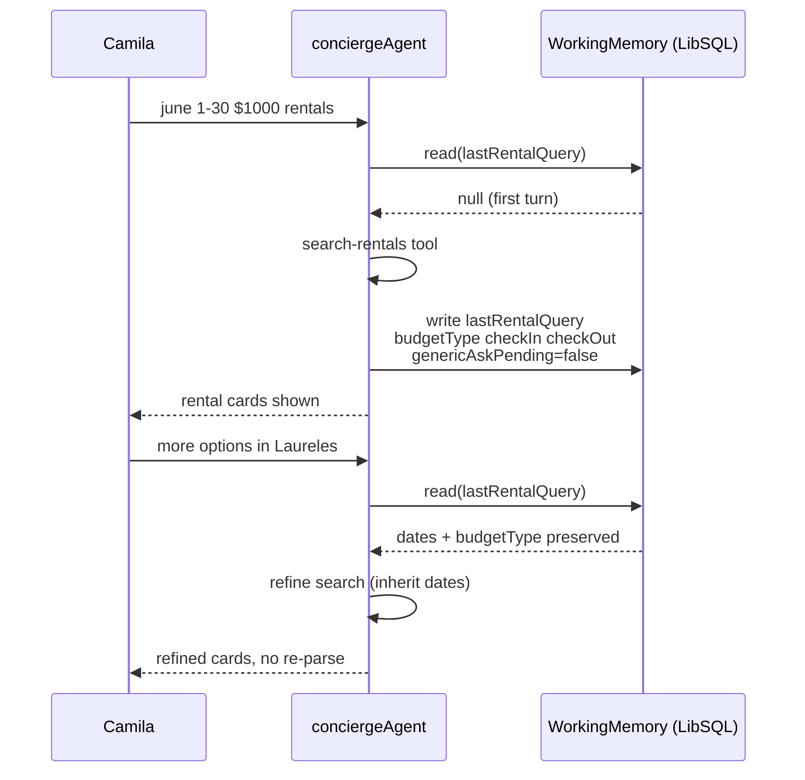

# INT-010 — Working memory schema update

## Problem

`conciergeWorkingMemorySchema` lacks `checkIn`, `checkOut`, `stayType`, and a shared slot snapshot.

> ✅ **Correction (verified on disk 2026-05-28).** `budgetType` is **already present** on `lastRentalQuery` (`concierge.ts:25`) — do not re-add it. The real **Zod↔TS drift** is `genericAskPending`: it exists on the TS type (`src/lib/types.ts:17` `ConciergeWorkingMemory.lastRentalQuery.genericAskPending`) **and** on the Zod `lastEventQuery` (`concierge.ts:54`), but is **missing from the Zod `lastRentalQuery`** (`concierge.ts:20-26`). Because Mastra validates/persists working memory through this Zod schema and Zod strips unknown keys, the rental clarify-once flag the parser reads at `rental-query-parser.ts:174,177,192,211,262` (`memory.lastRentalQuery.genericAskPending`) may **never persist across turns** — so the "ask once, then search on the next turn" rental flow can silently misbehave. Add `genericAskPending: z.boolean().optional()` to the Zod `lastRentalQuery` to close the drift.

## User story

As **Camila**, turn 2 should inherit June + $1000/month from turn 1 without re-parsing from scratch only.

## Example prompt

Turn 1: hero rental → Turn 2: `Laureles furnished` uses `lastRentalQuery` with dates/budgetType.

## Workflow



## Implementation steps

1. Extend Zod in `concierge.ts` + `src/lib/types.ts` (three-place sync rule). **Include the missing `genericAskPending` on the Zod `lastRentalQuery`** (parity with `lastEventQuery`); add `checkIn`/`checkOut`/`stayType`. Do **not** re-add `budgetType` (already present).
2. Fast-path hooks write partial slots to `setState`
3. Consider `scope: resource` spike doc (Phase 2 — not required here)
4. Tests in `concierge.test.ts`

## Files likely touched

- `mdeapp/src/mastra/agents/concierge.ts`
- `mdeapp/src/lib/types.ts`
- `mdeapp/src/hooks/use-rental-search-fast-path.ts`
- `mdeapp/src/hooks/use-event-search-fast-path.ts`
- `mdeapp/src/mastra/lib/agent-memory.ts`

## Data requirements

Aligned with INT-001 slot fields.

## RLS / security

Thread memory via F13 storage — no service role in client.

## Tests

- Schema accepts new fields
- Follow-up turn preserves `lastRentalQuery`

## Acceptance criteria

- [ ] Hero + follow-up E2E in working memory tests
- [ ] No drift between Zod and TS types

## Failure points

- Forgetting third sync location (packages/types in W4)

## Dependencies

INT-001

## Verify

```bash
cd mdeapp && npm run test -- src/mastra/agents/__tests__/concierge.test.ts
```
