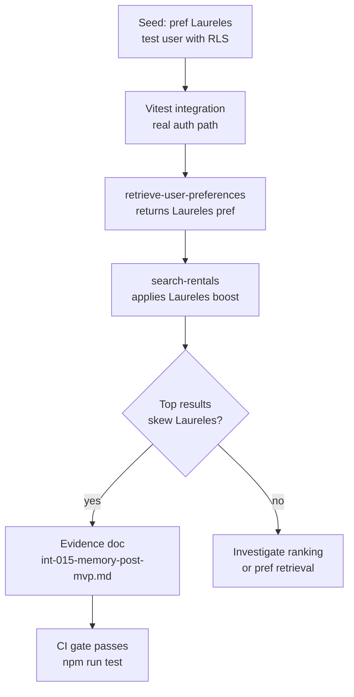

# INT-015 — Memory evidence tests

## Problem

No anti-fake-done evidence for memory program.

## User story

As **Lucía**, I need proof prefs affect search before ADVANCED pgvector ships.

## Example E2E

1. Seed pref Laureles
2. Search city-wide
3. Top results skew Laureles
4. Evidence markdown + screenshots

## Workflow



## Implementation steps

1. Vitest integration with test user + RLS
2. Playwright signed-in flow (if auth test harness exists)
3. `tasks/testing/evidence/YYYY-MM-DD/int-015-memory-post-mvp.md`
4. task-verifier checklist

## Files likely touched

- `mdeapp/src/**/*.test.ts`
- `tasks/testing/evidence/`

## Data requirements

Test fixtures or seed script.

## RLS / security

Tests must use real RLS paths, not service role in src.

## Tests

This task produces evidence artifacts.

## Acceptance criteria

- [ ] Evidence file committed
- [ ] RLS denial test included
- [ ] localhost dev boot in evidence

## Failure points

- Skipping auth in tests (false green)

## Dependencies

INT-013, INT-014

## Verify

```bash
cd mdeapp && npm run test
```
