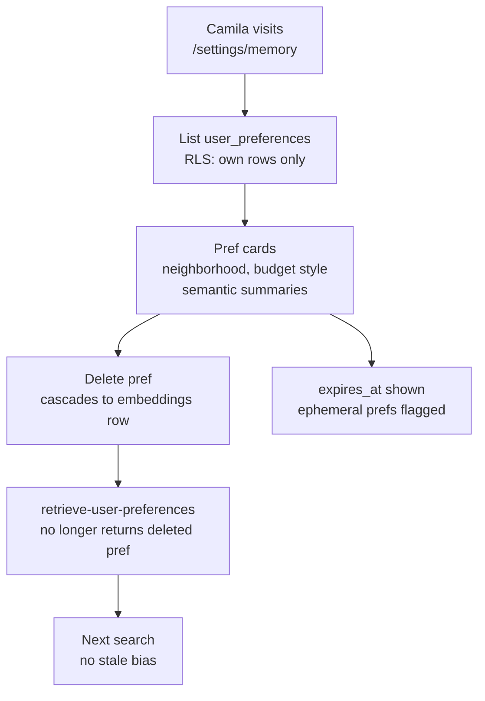

# INT-019 — Memory settings UI

## Problem

Users cannot view/edit/delete stored prefs or embeddings (GDPR-style control).

## User story

As **Camila**, I can remove “party hostel” ephemeral pref that expired wrong.

## Example

Settings page lists: neighborhood, budget style, semantic memories (summarized text).

## Workflow



## Implementation steps

1. Route `/settings/memory` or Patricia admin slice
2. List `user_preferences` + delete
3. Delete cascades embeddings rows
4. Export optional (POST-MVP+)

## Files likely touched

- `mdeapp/src/app/settings/memory/page.tsx`
- `mdeapp/src/lib/supabase/preferences-client.ts`

## Data requirements

INT-011, INT-016 tables.

## RLS / security

User sees only own rows; admin separate RLS if Patricia scope.

## Tests

- Delete pref removes from retrieve tool
- Playwright: edit flow

## Acceptance criteria

- [ ] View + delete works authenticated
- [ ] Evidence in testing folder

## Failure points

- Exposing other users’ prefs (RLS bug)

## Dependencies

INT-011, INT-016

## Verify

```bash
cd mdeapp && npm run dev
# Browser /settings/memory
```
